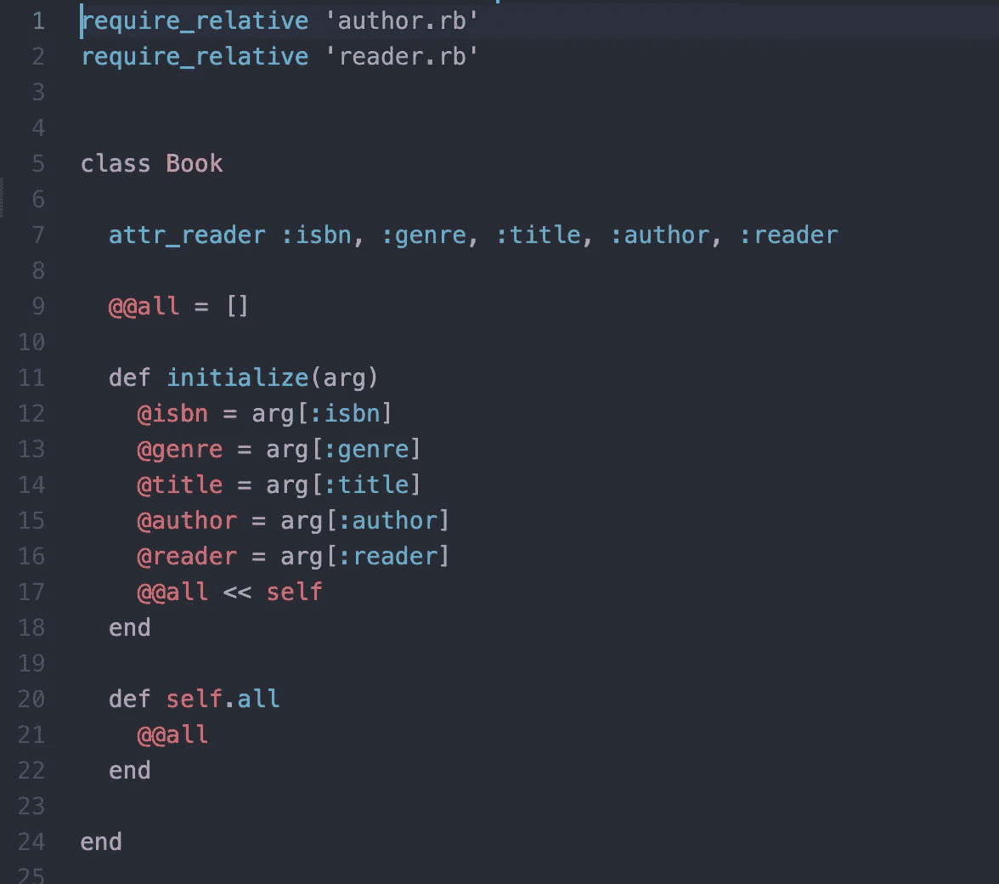
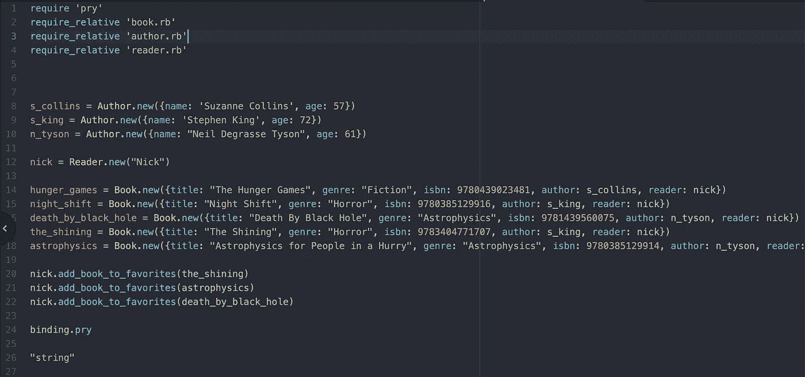
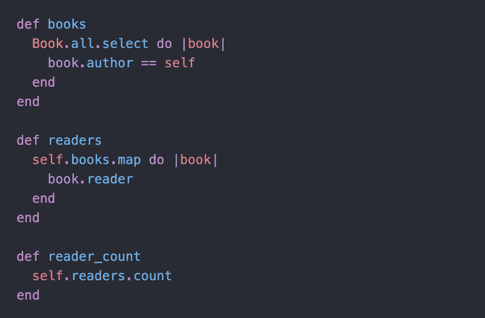
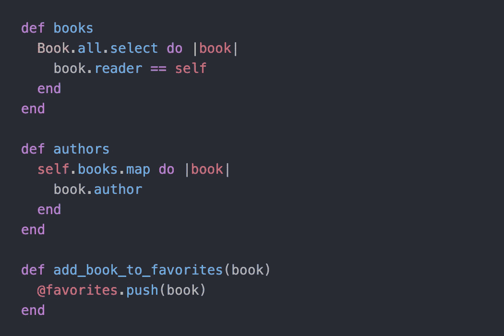
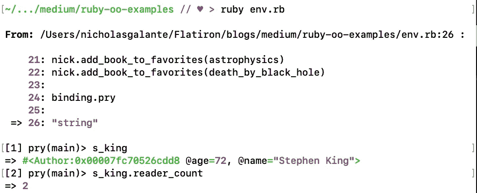
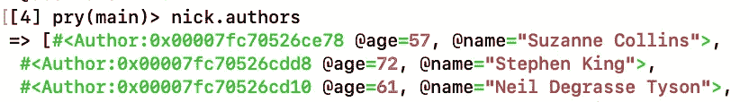

# 在面向对象的 Ruby 中建立关联；让常识有意义

> 原文：<https://blog.devgenius.io/building-associations-in-object-oriented-ruby-letting-common-sense-make-sense-e7ab3d357886?source=collection_archive---------10----------------------->

马库斯·斯皮斯克在 [Unsplash](https://unsplash.com?utm_source=medium&utm_medium=referral) 上的照片

当我第一次开始学习编码时(真的不是很久以前)，我认为我真正喜欢上整个论述的一点是它的根源在于逻辑。有多少次你坐在教室里，像兔子洞一样跟着一个问题，最终以一个教授或助手说，“嗯，因为这就是它的作用。这是我们目前所知道的。”这就是编码的最大魅力所在——它的核心是有意义的。如果你正在阅读这篇文章，并且刚刚开始学习面向对象编程的所有有趣和令人兴奋的复杂性，那么你最有可能开始学习面向对象编程的语言是 Ruby。

Ruby 中的面向对象编程是给编程新手的礼物，因为它仍然忠实于 OOP 的核心原则，即它的对象和关系应该反映现实世界中的关系。也就是说有一个独特的物体叫做椅子，有独特的东西叫做人。一个是木头做的，一个现在正坐在这里看这个。但是，通过称为食物的不同对象，一个人与一把椅子相关联，这是他们吃饭时坐的座位。餐点连接着椅子和人。能够认识到日常生活中存在的关联，并能够在 Ruby 中表现出来，对于崭露头角的开发人员来说是一个强大的工具，我们将探讨其中的原因。

假设你是一个狂热的读者。作为一个狂热的读者，(我自己就是一个)你不能像你希望的那样经常去健身房，你也厌倦了旅行时背着装满书的背包。所以你坐下来，决定开发一个应用程序来数字化你的收藏。但是很快你会更进一步。让我们完全去掉中间人，允许作者实例将图书直接发布到应用程序，读者获得这些图书对象。一开始你保持简单。这个应用程序只知道三件事:一个读者，一个作者，和一本书。

你决定一个读者，不欠任何人任何信息。它们只是用来读取的，因此，您只需用用户名初始化一个 Reader 实例。

然后处理一个 author 类，在这个 author 类中，您决定每个 Author 实例绝对需要的是一个名称，您可以通过这个名称来识别它们，以及它们有多老。

最后，创建一个 Book 类。这个 Book 类实际上应该充当作者用户和读者用户之间的连接模型，所以我们应该初始化一本书的所有属性(比如流派、isbn 和标题)，以及指定的作者和读者。

在这里，您可以看到一本书的每一个实例(让我们把它想象成每本书的每一个副本)现在都能够与一个读者和一个作者相关联。我们该如何联想？

这里我们创建了一些作者的实例，一个读者的实例(就是我！)，以及我们图书馆的几本书。您应该马上注意到，我们没有将 Author 和 Reader 的属性与其名称的字符串值相关联，而是将它们直接链接到它们所在的特定类的实例。这将允许我们做一些非常有用的数据检索。

这里，我们在 Author 类和 Reader 类中创建了一些方法。现在，我们的作者与我们的书直接相关，我们已经包含了允许我们的作者知道哪些书属于他们的代码，我们可以从作者那里访问关于书的信息，并通过作者的书访问作者的读者，反之亦然。

现在，当我们进入环境测试代码时:

哇，现在我们的朋友斯蒂芬·金知道有两个人读了新的闪亮重启，不错。我可以知道我图书馆里所有的作者。通过 Ruby 中面向对象允许我们进行的所有关联。