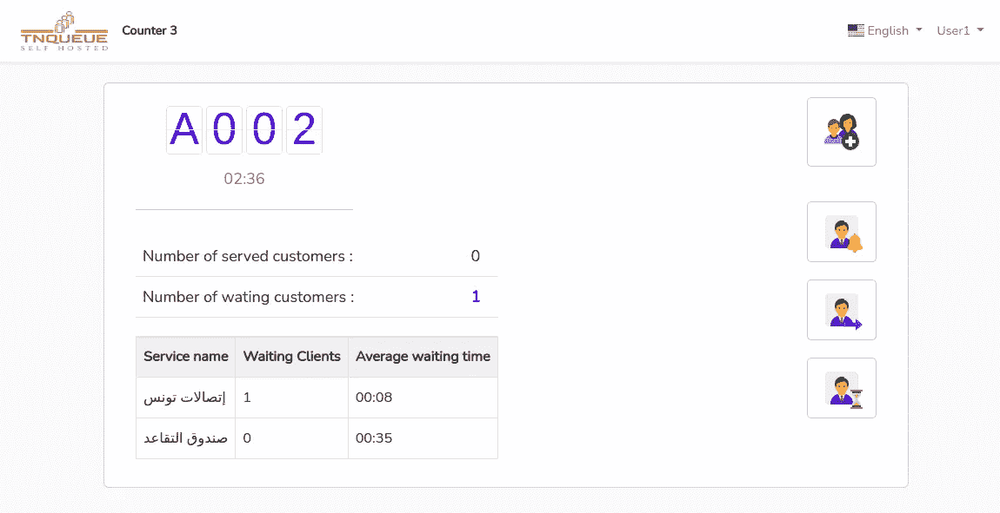
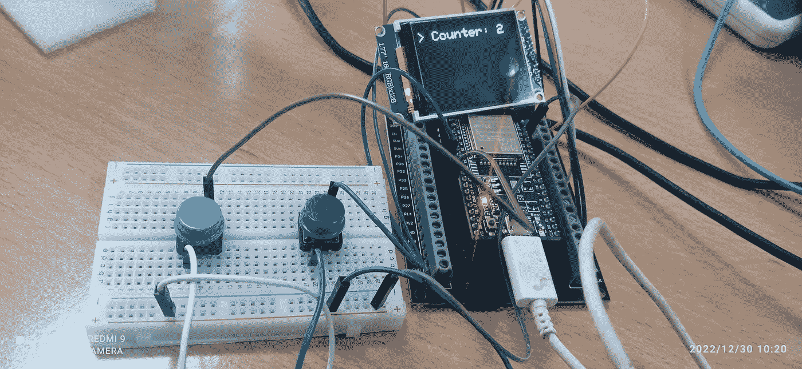
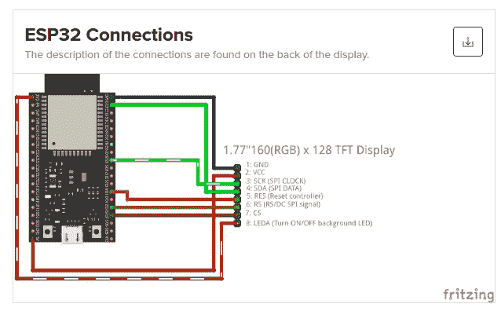

# 使用 LARAVEL 和 ESP32 Arduino 板构建 WIFI 排队系统控制台。

> 原文：<https://blog.devgenius.io/building-awifi-queuing-system-console-using-laravel-and-esp32-android-board-968831794a79?source=collection_archive---------9----------------------->

在一个项目中，我必须为一个客户建立排队系统控制台。事实上，客户有点固执，不同意在 pc 机上安装网络控制台，他要求为排队系统安装一个单独的设备。所以我必须找到一个解决方案，用另一个设备取代下面的网络控制台。



于是，我经过一番研究，找到了这个漂亮的小板子 [ESP32](https://randomnerdtutorials.com/esp32-microsd-card-arduino/) 。其同时兼容 arduino 编程并具有嵌入式 WIFI 卡。我还需要一个 1.77 英寸的小有机发光二极管屏幕和两个按钮来选择柜台号码，呼叫或召回排队的顾客。在控制台的完整组件下面。



将有机发光二极管屏幕连接到 ESP32 卡很容易，只需遵循下图。对于按钮，将一个按钮引脚连接到 ESP32 板的 **GND** 引脚，将另一个引脚连接到支持 ESP32 板中数据输入的任何引脚就足够了。



蓝色按钮将用于选择计数器号码(从属按钮)，绿色按钮(主按钮)将用于呼叫下一位顾客。

当代理按下绿色按钮时，ESP32 板应该调用一个 LARAVEL REST API url 来调用下一个客户。因此，让我们创建新的 Laravel 控制器 Esp32Controller，并在其上添加三个动作:**刷新()**、**调用()**和**召回()**。 **refresh()** 动作将用于定期刷新有机发光二极管屏幕中等待自定义的数量。

```
php artisan make:controller Esp32Controller
```

```
class Esp32Controller extends Controller
{

public function refresh(Request $request){  
 /** return waiting customers number **/  
}

public function call(Request $request){    
/** return next customer ticket number **/ 
}

public function recall(Request $request){ 
/** recall current customer ticket number **/    
}

}
```

那些已经编写过 android 板的人都知道，任何 arduino 程序都由两部分组成:

```
void setup() {

}

void loop() {

}
```

第一个函数 setup()将被调用一次，用于初始化所用的硬件。然而，只要 ESP32 板通电，就会无限期调用如其名称所示的 loop()函数。

在 arduino 代码中，我们将使用几个库:

EasyButton.h:将用于处理按钮按下事件。

WiFi.h:将用于处理 WiFi 连接和重新连接。

HTTPClient.h:将用于发送 http 请求并从 Esp32Contoller 获取 json 响应。

TFT_eSPI.h:用于在有机发光二极管屏幕上显示文本。

```
#include <TFT_eSPI.h>
#include <SPI.h>
#include <EasyButton.h>
#include <WiFi.h>
#include <HTTPClient.h>
#include <ArduinoJson.h>

#define VERSION "1.0.0"

#define DELAY 1000

#define master_BTN_PIN 33
#define slave_BTN_PIN 14

const char* wifi_ssid = "*****";
const char* wifi_password = "****";
int wifi_channel             = 6;
int wifi_ssid_hidden         = 0;

EasyButton masterButton(master_BTN_PIN);
EasyButton slaveButton(slave_BTN_PIN);

TFT_eSPI tft = TFT_eSPI();  // Invoke library

/** *** *******************************/
/*    Init TFT display                 */
/**************************************/
void tft_init(){  
   tft.init(); 
   tft.setRotation(3);
   tft.fillScreen(TFT_BLACK);
   tft.drawCentreString("WIFI CONSOLE v"+ String(VERSION), 80,20, 2);
   delay(DELAY);
}

/** *** *******************************/
/*  WIFI Connected Event              */
/**************************************/

void WiFiStationConnected(WiFiEvent_t event, WiFiEventInfo_t info){
  Serial.println("Connected to AP successfully!");
}

/** *** *******************************/
/*  WIFI GET IP Event              */
/**************************************/
void WiFiGotIP(WiFiEvent_t event, WiFiEventInfo_t info){  

  Serial.println("WiFi connected");
  Serial.println("IP address: ");  
  Serial.println(WiFi.localIP());

}

/** *** *******************************/
/*  WIFI Disconnected  Event          */
/**************************************/
void WiFiStationDisconnected(WiFiEvent_t event, WiFiEventInfo_t info){  
    WiFi.begin(wifi_ssid, wifi_password,wifi_channel);  
}

** *** *******************************/
/*  Master  button click event        */
/**************************************/
void onMasterButtonPressed() {
  Serial.println("master button has been pressed!");  
  //call(); 
}

/** *** *******************************/
/*  Slave button click event        */
/**************************************/
void onSlaveButtonPressed() {
  Serial.println("slave button has been pressed!"); 
 //recall();
}

void setup() {

   Serial.begin(115200);

   /** tft init **/
   tft_init(); 

   /** buttons init **/
   masterButton.begin();
   slaveButton.begin();

   masterButton.onPressed(onMasterButtonPressed);
   slaveButton.onPressed(onSlaveButtonPressed);

   /** init wifi **/
   deloldconfig();
   WiFi.onEvent(WiFiStationConnected, WiFiEvent_t::ARDUINO_EVENT_WIFI_STA_CONNECTED);
   WiFi.onEvent(WiFiGotIP,  WiFiEvent_t::ARDUINO_EVENT_WIFI_STA_GOT_IP);
   WiFi.onEvent(WiFiStationDisconnected, WiFiEvent_t::ARDUINO_EVENT_WIFI_STA_DISCONNECTED);

   Serial.println();
   Serial.println();
   Serial.println("Wait for WiFi... ");

   WiFi.begin(wifi_ssid, wifi_password,wifi_channel);

}

void loop() {

  masterButton.read();
  slaveButton.read(); 

   unsigned long currentMillis = millis();
   if(currentMillis - refresh_previousMillis > refresh_timerDelay) {
      refresh_previousMillis = currentMillis;       
      if((wifi_is_connected==1)){  
      // refresh();
      }     
  }

}
```

这就是全部，如果你有意见或问题，欢迎你。