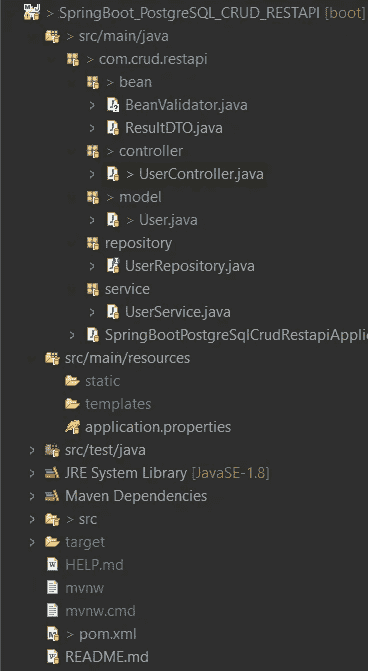

# 使用带有基本验证的 Spring Boot、PostgreSQL 和 JPA 库构建 CRUD REST APIs

> 原文：<https://blog.devgenius.io/building-crud-rest-api-with-basic-validations-using-spring-boot-postgresql-jpa-repository-d8dc4478bf7b?source=collection_archive---------0----------------------->

在本文中，我将创建一些 REST APIs，它们将使用 Spring Boot、PostgreSQL 数据库和 JPA 存储库执行 CRUD 操作。在这篇文章的结尾，你会知道:

*   如何配置 Spring Data，JPA 以使用 PostgreSQL 数据库
*   如何定义数据模型和存储库接口
*   如何创建 Spring Rest 控制器来处理 HTTP 请求
*   使用 Spring Data JPA 与 PostgreSQL 数据库交互的方法。
*   如何在插入数据时实现基本验证？

# 初步的

*   在开始之前，如果你想了解 Spring Boot &如何创建一个 Spring Boot 应用程序，请访问我以前的文章 。
*   如果你想用 Spring Boot、JPA 库& MySQL、 [**执行 REST APIs CRUD 操作，请访问本文**](https://medium.com/@pritam73/building-crud-rest-api-with-basic-validations-using-spring-boot-mysql-jpa-repository-3df8c0e431a0) 。
*   如果你想用 Spring Boot & Couchbase 服务器(NoSQL 数据库服务器)， [**执行 REST APIs CRUD 操作，请访问本文**](https://medium.com/@pritam73/building-crud-rest-apis-using-spring-boot-couchbase-server-nosql-with-basic-validations-a0a14c049cad) 。

# 使用的工具和技术

*   Java 1.8
*   Spring Boot
*   PostgreSQL 和 JPA:数据库和交互
*   Eclipse IDE:编写代码
*   Maven:提供构建环境
*   邮递员:API 测试

# 项目结构

让我简单解释一下上述项目结构的各个部分。

*   BeanValidator 类用于处理 API 的基本验证。
*   **result to**类用于处理每个 API 的响应格式。
*   **UserController** 类是一个 Rest 控制器，它有 Restful 请求的请求映射方法，例如: **createUser，allUsers，getUserById，updateUser，deleteUserById** 。
*   用户类是包括用户特定数据的实体。
*   **userrepository**是一个为所有 CRUD 方法扩展 JpaRepository 的接口。它将在 UserService 类中自动连接。
*   **UserService** 类用于在对用户数据执行 CRUD 操作时管理业务逻辑。
*   Spring boot postgresqlcrudrestapiapplication 类是由 Spring 创建的，它包含了运行我们的应用程序的 main 方法。
*   **application.properties** 文件包含 Spring 数据源、JPA、Hibernate、端口号、上下文路径等配置。
*   **pom.xml** 包含 Spring Boot、PostgreSQL、JPA 等的依赖关系。

# 为 API 创建和设置项目

创建 Spring Boot 项目后，打开 **pom.xml** 并添加这些依赖项:

**pom.xml**

# 配置端口、上下文路径和 Spring 数据源

**应用程序.属性**

*   `server.port`属性用于改变默认端口号。
*   `server.servlet.context-path` properties 用于为你的应用程序定义根路径。我已经将**/用户**定义为我根路径。
*   `spring.datasource.url` 属性用于定义与数据库连接的数据库 url。
*   `spring.datasource.username` & `spring.datasource.password`属性与你的数据库安装相同。
*   Spring Boot 使用 Hibernate 实现 JPA，我们为 PostgreSQL 配置了`PostgreSQLDialect`。
*   `spring.jpa.hibernate.ddl-auto`用于数据库初始化。我们将该值设置为`update`值，以便在数据库中自动创建一个与定义的数据模型对应的表。对模型的任何更改也会触发表的更新。对于生产来说，这个属性应该是`validate`。
*   `spring.jpa.show-sql =false`用于从控制台隐藏 sql 查询。

# 定义数据模型

*   我们的数据模型是**User.java**，有五个字段:id、姓名、电子邮件、mobNo、密码。
*   在 **com.crud.restapi.model** 包下，我们定义用户类。

**model/User.java**

**User.java**

*   `@Entity`注释表明该类是一个持久的 Java 类。
*   `@Table`注释提供了映射该实体的表格。
*   `@Id`注释是针对主键的。
*   `@GeneratedValue`注释用于定义主键的生成策略。
*   `GenerationType.AUTO`表示自动增量字段。
*   `@` NotEmpty 注释用于处理特定字段的空值。

# 定义服务来处理业务逻辑

*   在**服务**包中创建一个用户服务类。
*   我们的服务类是 UserService.java，它包含了所有使用存储库处理 CRUD 操作的方法，并将响应返回给 UserController.java

**service/userservice . Java**

**UserService.java**

*   `@Service`注释用于将类标记为提供某些业务功能的服务提供者。
*   `@Autowired`用于将 **UserRepository** bean 注入局部变量。

# 定义存储库接口

创建一个存储库，以便与数据库中的用户进行交互。
在**仓库**包中，创建扩展`JpaRepository`的`UserRepository`接口

**存储库/用户存储库**

**UserRepository.java**

*   上面我们已经在我们的用户存储库中扩展了 JpaRepository，所以我们可以使用 JpaRepository 的方法:`save()`、`findOne()`、`findById()`、`findAll()`、`count()`、`delete()`、`deleteById()` 等等，而不需要实现这些方法。
*   我们还可以在 UserRepository 中定义我们的自定义方法。我已经定义了`findByEmailAndMobNo`，它根据电子邮件&手机号码返回用户的数据。

# 定义响应包

在包含任何 api 响应包的 **bean** 包中创建一个**result to**类。

**ResultDTO.java**

*   `@JsonInclude(JsonInclude.Include.NON_NULL)`表示如果属性的值不为空，则该属性被序列化。
*   `@JsonIgnoreProperties(ignoreUnknown =true)`表示 JSON 字符串中的任何未知属性，即我们没有相应字段的任何属性都将被忽略。

# 定义验证器

在 **bean** 包中创建一个 **BeanValidator** 类，它包含一些 CRUD 操作的基本验证。

**bean/BeanValidator**

**BeanValidator.java**

*   `@Component`注释允许 Spring 自动检测我们的定制 beans。换句话说，无需编写任何显式代码。

# 定义 REST API 控制器

在包含 CRUD 操作的所有 API 的控制器包中创建一个 UserController 类。

**UserController.java**

*   `@RestController`注释用于定义控制器，并指示方法的返回值应绑定到 web 响应体。
*   `@RequestMapping("/api/v1")`声明控制器中的所有 APIs url 将以`/api/v1`开头。
*   我们已经自动连接了 UserService & BeanValidator，将 bean 作为局部变量注入。
*   表示 Spring 应该将请求体反序列化为一个对象。该对象作为处理程序方法参数传递。如果你想得到表单类型的数据，你应该使用`@ModelAttribute`而不是`@RequestBody`。
*   为了响应每个 api，我使用了 ResultDTO 类的构造函数，它包含了响应包。

# 运行应用程序

*   要通过 IDE 运行 Spring Boot 应用，**右键单击项目- >运行- > Spring Boot 应用**，或者您可以通过 CLI 运行您的项目。要使用 CLI **运行，请打开您的终端- >转到您的项目的根文件夹- >键入“mvn spring-boot:run”。**
*   一旦应用程序成功运行，就会在模式中自动生成用户表，因为我们已经在 application.properties 文件中将值设置为 **update** 。
*   当您检查数据库时，它看起来像:

## 我们在本文中创建的 REST APIs:

*   /api/v1/createUser (POST):创建一个新用户。
*   /api/v1/allUsers (GET):从数据库中检索所有用户。
*   /api/v1/getUserById (GET):从数据库中检索用户。
*   /api/v1/updateUser (PUT):更新用户的记录。
*   /api/v1/deleteUserById (DELETE):删除用户。

## 通过调用 createUser api 创建一些用户

## 通过调用 allUsers api 获取所有用户

## 通过调用 getUserById api 获取用户记录

## 通过调用 updateUser api 更新用户

## 通过调用删除 api 删除用户

> [**点击此处下载源代码**](https://github.com/pritam73/SpringBoot_PostgreSQL_CRUD_RESTAPI)

# #结论

在本文中，我使用 Spring Boot、Spring Data JPA、Maven 构建了 REST CRUD APIs 来与 PostgreSQL 交互。在下一篇文章中，我将解释任何 NoSQL 数据库的相同之处。

我希望这是有用的。一声‘拍手’一定会鼓励我多写文章，多分享我的知识。

你可以 [**在 LinkedIn**](https://www.linkedin.com/in/pritam-kumar-85b64316b) 上联系我，讨论更多。所以请随意连接。