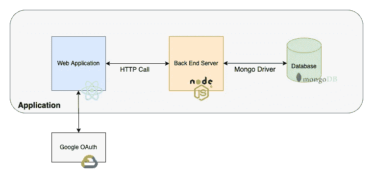
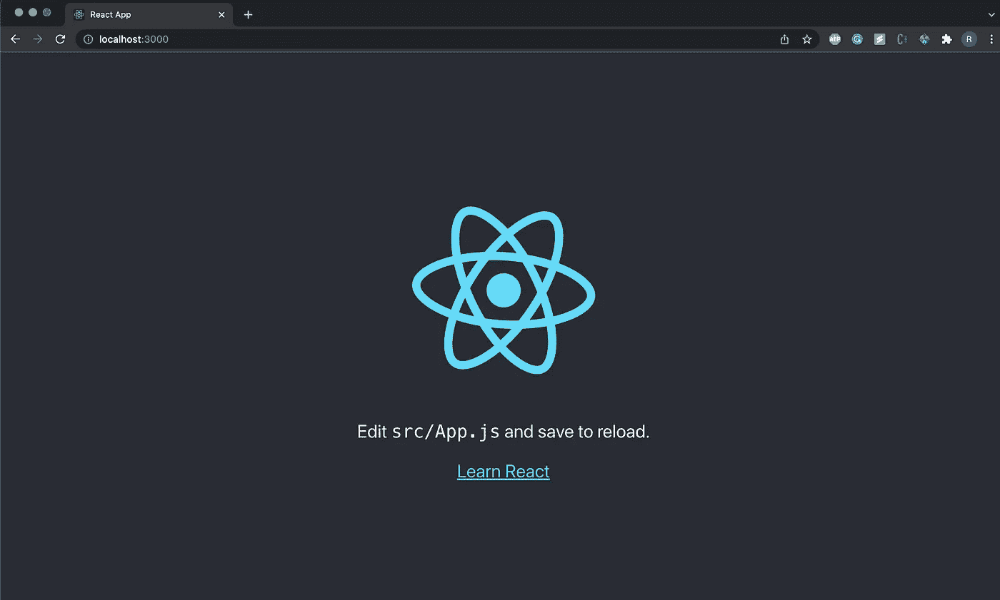
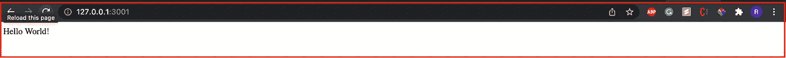
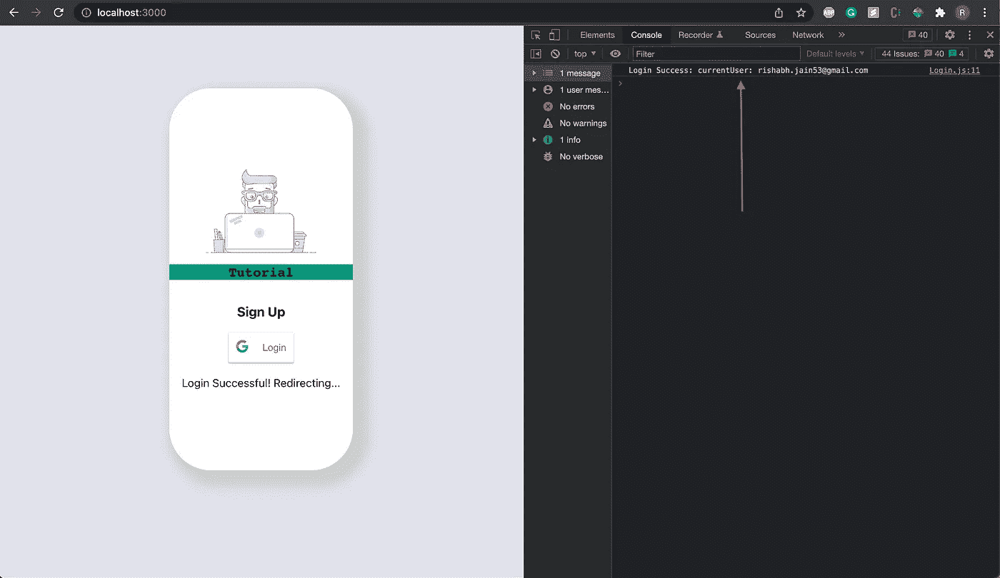
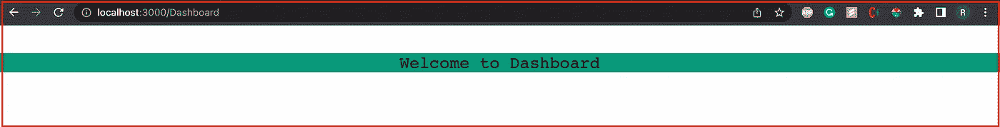
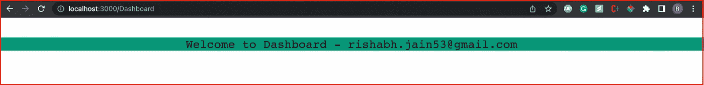
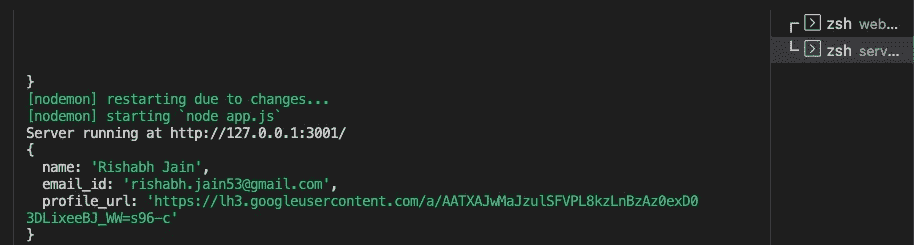
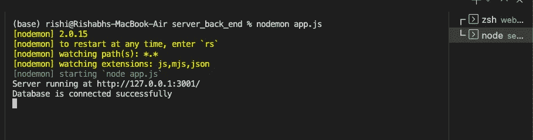
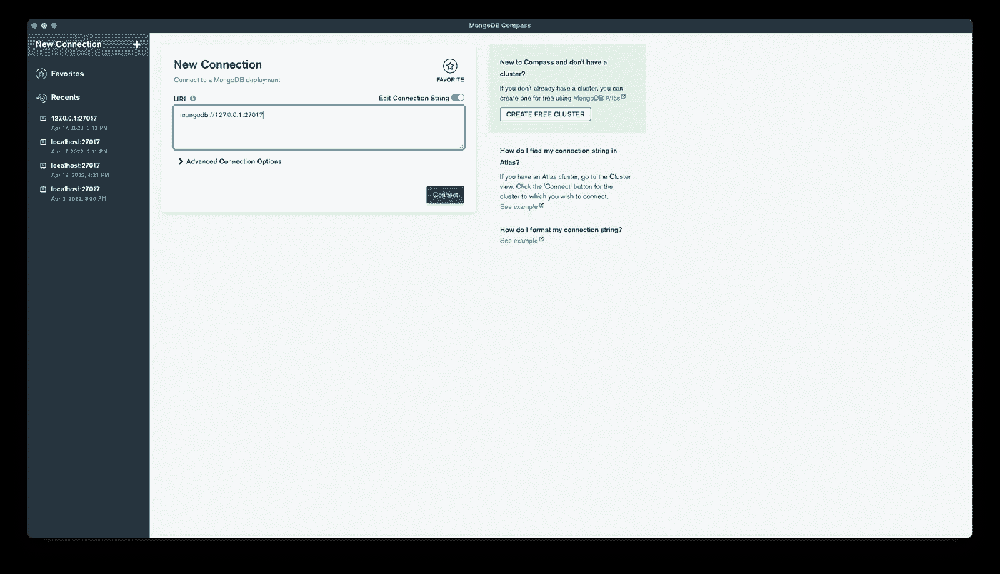
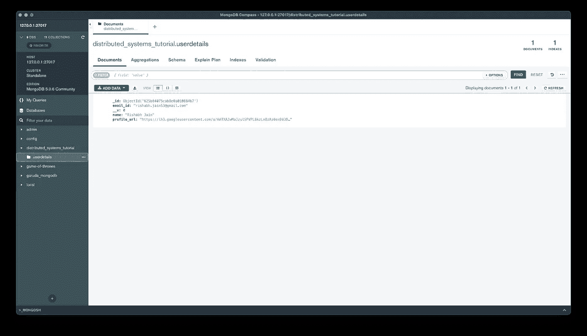

# 构建分布式系统应用程序— ReactJS、NodeJS 和 MongoDB(第 1 部分)

> 原文：<https://blog.devgenius.io/building-distributed-systems-application-reactjs-nodejs-and-mongodb-part1-9d836c40e4aa?source=collection_archive---------5----------------------->

正如我们所知，在应用程序部署方面，世界正迅速从整体架构转向微服务架构。但是[微服务架构是如何开发和部署的。**如何**的部分是我将在这里讨论的。](https://smartbear.com/solutions/microservices/)

最近，我接触了微服务架构和概念。阅读关于优势和为什么部分让我很好奇。因此，我决定写这篇文章来更彻底地学习和理解细节，并与他人分享。本帖所建项目的 GitHub 库呈现在[这里](https://github.com/rishi1596/mern_user_details_distributed_systems)。

在本文中，我们将首先开发微服务，然后让它们使用 HTTP 调用相互通信，并将所需的数据存储在持久存储中。下面是应用程序的架构图。



图架构图

用于构建应用程序的技术
1。Web 应用- ReactJS
2。后端服务器- NodeJS
3。数据库- MongoDB

实施时的工具版本
1。npm- 8.1.2
2。 [NodeJS](https://nodejs.org/en/) - 16.13.2
3。ExpressJS- 4.17.3
4。 [MongoDB](https://www.mongodb.com/try/download/community) - 5.0.6
5。反应堆

在 M1- macOS Monterey 12.2.1 上运行应用程序。

不要深入工具的细节，让我们从实现开始。首先，让我们设置 ReactJS 和 NodeJS 项目。在 react 项目中，我们将使用一个功能组件，而不是一个类组件([功能组件与类组件](https://www.geeksforgeeks.org/differences-between-functional-components-and-class-components-in-react/))。

## ReactJS 项目的初始设置

以下命令将为我们的应用程序创建框架

```
npx create-react-app web_app_front_end
```

要运行启动代码，请执行以下操作

```
cd web_app_front_end/src
npm start
```



图 ReactJS 应用程序运行

## NodeJS 项目的初始设置(ExpressJS)

让我们使用 **ExpressJS** (构建在 **NodeJS** 之上的框架)通过创建一个具有为我们服务的端点的服务器来创建后端的框架 **Hello World！**

1.  在我们的根目录下创建一个名为 **server_back_end** 的文件夹
2.  用这个[链接](https://expressjs.com/en/starter/hello-world.html)
    上提到的代码在上面的文件夹中创建一个 **apps.js** 文件。在本文中，我们将在端口 3001 上运行 NodeJS 服务器，因为 ReatJS 项目在端口 3000 上运行

—首先，在我们运行 NodeJS 服务器之前进行正确的设置

```
cd server_back_end
npm init            //To initialise npm
npm install express --save
```

—运行 NodeJS 服务器

```
node app.js
```

我推荐使用 [**nodemon**](https://www.npmjs.com/package/nodemon) 包来运行节点服务器，因为每当任何项目文件发生变化时，它都会重新启动服务器。使用 nodemon 安装和运行应用程序

```
npm install -g nodemon         //To install globally
npm install nodemon --save     //To install only for this project
nodemon app.js
```

通过在网络浏览器上浏览 [http://localhost:3001/](http://127.0.0.1:3001/) 来测试服务器



图 NodeJS 服务器运行

# 安装 OAuth 2.0 客户端

为了集成 Google OAuth，我们需要在 [Google 开发者控制台](https://console.developers.google.com)上生成一个 **OAuth 客户端 ID** 。**我们将需要任务 1 实施中的 OAuth 客户端 ID。**
1。在谷歌控制台上创建一个新项目
为你选择的项目命名
2。从标题栏
3 的下拉列表中选择您创建的项目。从左侧标签
4 的*API&服务*部分转到**凭证**页面。在 Create Credentials 按钮下选择并创建一个新的 **OAuth 客户端 ID** (在创建新 ID 之前，可能会要求您配置同意屏幕，完成第 8 步后从第 5 步继续操作)
5。从应用类型下拉列表
6 中选择 *'* ***Web 应用*** *'* 。在授权的 JavaScript origins 中添加以下 URI(如果我们不添加此选项，Google OAuth 将无法在我们的 web 应用程序中工作)
-[*http://localhost*](http://localhost) *-*[*http://localhost:3000*](http://localhost:3000)注意:当应用程序部署在任何其他服务器上时，您可能需要添加更多的 URIs
7。单击 create，它会生成一个*客户端 ID* 和*客户端机密*(复制*客户端 ID* 我们将在 react 应用程序中使用它)
8。在 OAuth 同意屏幕上，选择 ***【外部】*** 用户类型，并在下一部分填写所需的详细信息(可选)

# 履行

我们将把教程分成如下多个任务-

**任务 1** -在前端(客户端)添加 Google OAuth 按钮(添加按钮之前我们需要在 Google 开发者控制台上设置 OAuth 客户端)
任务 2 -
1 .认证成功后，通过 API 调用
2 将用户详细信息发送到服务器。使用用户数据从主组件导航到仪表板组件
**任务 3** -通过创建 API 端点在服务器上接收数据
**任务 4** -在 MongoDB 中存储数据并将回调响应发送到 web 应用
**任务 5** -解析客户端的回调响应并将用户重定向到仪表板

## 任务 1

为了在我们的应用程序中包含 Google OAuth，我们将使用 [react-google-login](https://www.npmjs.com/package/react-google-login) 包。

使用以下命令安装软件包

```
npm i react-google-login --save
```

- save 选项很有用，因为它只会为此项目添加包

让我们使用框架代码并为用户创建一个登录页面。我们将使用功能组件，而不是一开始提到的类组件。
1。我们将创建一个名为`Login.js`的新组件，并将其导出用于`App.js`中的消费

一、在 **Login.js** 中，我们将添加以下内容

*   **GoogleLogin** 标签内的*返回*方法为签到按钮
    *创建一个 ***。将 env*** 文件放在应用程序的根文件夹中，并将您的客户端 ID 放在名为 *REACT_APP_CLIENT_ID* 的变量中

```
<GoogleLogin
clientId={process.env.REACT_APP_CLIENT_ID} //Client ID generated from google cloud developer console. Retrieving from .env file
buttonText=”Login”
onSuccess={onSuccess} //Success callback function
onFailure={onFailure} //Failure callback function
cookiePolicy={‘single_host_origin’}
isSignedIn={true} //To keep user logged in
/>
```

*   回调方法 ***onSuccess*** 和 ***onFailure*** 检查 Google OAuth 响应
    1 的结果。当认证成功时 ***onSuccess*** 方法被调用，在这种情况下，我们将不得不执行 3 个子任务(实现在本文后面的**任务 2** 中完成)
    a .对服务器进行 API 调用以将用户详细信息保存到数据库
    b .更新网页上的 API 响应以使用 ***反应状态挂钩***
    c .导航到仪表板组件当认证失败时，调用 ***onFailure*** 方法，在这种情况下，我们只需要做一件事
    a .使用***react state hook***通知用户 Google OAuth 已经失败

二。在 **App.js** 中，我们将添加以下内容

> a.从'导入登录。/components/log in '；
> b. *放置* ***<登录/>****返回*方法就像一个 HTML 标签**

*注意: ***return*** 方法是组件的入口点，里面的东西都呈现在网页上*

*在我们继续之前，我们可以使用 **console.log()** 和相应的消息来测试 Google OAuth 是否工作。
所有用户 Google 账户的详细信息都出现在响应 JSON 的 **profileObj** 中。*

**

*图 1.1 Google OAuth 成功*

## *任务 2*

*该任务分为 2 个子任务
步骤 1。将用户详细信息发送到后端服务器(进行 API 调用)
步骤 2。导航到带有用户数据的仪表板组件*

***该流将对服务器进行 API 调用，在服务器成功响应后，我们将导航到仪表板组件。**
不过，导航部分连同数据传递有很多细节。因此，**我们将首先完成步骤 2，然后将步骤 1 与它集成。***

*为了在组件之间导航，我们需要在代码中做额外的配置。首先，我们将每个组件映射到一个特定的 URL 路径。
比如我们在浏览器中打开[*http://localhost:3000*/](http://localhost:3000/)或者[*http://localhost:3000/log in*](http://localhost:3000/Login)*，应该会渲染出 **login** 页面组件。我们可以将任何路径映射到任何组件。
为了映射每个组件，我们使用 [react-router-dom](https://reactrouter.com/docs/en/v6/getting-started/overview) 的 **Routes** 标签，这有助于我们映射组件的路径。**

**之前，使用以下命令进一步安装 react-router-dom**

```
**npm install react-router-dom --save**
```

*   **我们必须对代码做一些添加和修改。**

1.  **创建一个保存路由详细信息的新文件。将文件命名为`routes.js`
    注意:它不是一个组件，它更像是一个配置文件，包含路径和组件的映射。
    定义映射的语法是将 **Routes** 标签作为父标签，将 **Route** 作为子标签，带有强制属性
    `<Routes>`
    `<Route path=”/” element={<App />} />`
    `<Route path=”/Login” element={<App />} />
    </Routes>`
    **Routes**的定义——一个嵌套元素树的容器，用于呈现与当前位置最匹配的分支。
    **Route**——声明一个应该在某个 URL 路径呈现的元素。
    属性:
    路径- URL 路径
    元素-加载上述 URL 时要加载的组件**

****Routes** 的定义——一个嵌套元素树的容器，用于呈现与当前位置最匹配的分支。
**Route**——声明一个应该在某个 URL 路径呈现的元素。
属性:
路径- URL 路径
元素-加载上述 URL 时要加载的组件**

1.  **需要修改 *index.js* 文件
    -导入新创建的文件 *routes.js* 文件作为 RouterDetails
    -用
    `<BrowserRouter>`
    `<RouterDetails/>`
    `</BrowserRouter>` 替换< App/ >标签这里`BrowserRouter`有助于保持你的 UI 与 URL 同步。每当 URL 改变时，它负责从 *routes.js* 中提到的预定义路径中找到并加载与 URL 匹配的组件**

*   **现在，当用户使用 Google OAuth 成功登录时，我们就可以导航到新组件了。
    为了导航，我们需要
    1。创建一个新的组件(文件)，我们称之为`Dashboard.js`，以及一个*‘欢迎使用仪表板’*文本或任何其他用于测试目的的文本。
    2。在 *routes.js* 文件
    `<Route path=”/Dashboard” element={<Dashboard />} />`
    3 中添加路径和组件映射。为了从`Login`组件中加载`Dashboard`组件，我们必须将任务分配给某人来加载并呈现在网页上。
    这是使用
    react-router-dom 包提供的[**use navigate**](https://reactrouter.com/docs/en/v6/api#usenavigate)**()**钩子来处理的，让我们以编程方式导航。
    对 **Login.js** 文件的修改:
    —创建一个局部变量，并将函数的引用存储在变量
    `const navigateObj = useNavigate();` —onSuccess 回调
    `navigateObj(‘/Dashboard’) //***Dashboard*** *—*Name of the component.`
    内部，名称应该与 *routes.js* 文件
    4 中提到的名称相同。让我们先测试一下，然后再继续。运行`npm start`命令并登录谷歌，一旦成功，我们将能够看到以下网页(参见图 2.2.1)。(我已经应用了一些 CSS，但您将能够看到“欢迎使用仪表板”文本)
    5。接下来，让我们在导航部分添加一个真实世界的场景。
    我们需要将认证用户的电子邮件 id 从登录页面传递到仪表板页面，并显示在网页上。
    显示的文本将是“欢迎使用仪表板-电子邮件 ID”
    ——我们将添加 NagivateFunction 提供的某些内置属性，我们将它添加到 **Login.js** 文件中的 onSuccess 回调函数内。
    `navigateObj(‘/Dashboard’,{ state: { userEmail: res.profileObj.email}, replace: true })` 新属性的详细解释。
    **状态** -一个 JSON 对象，用于传递带有所需值的用户定义键
    **替换** - true(默认- false)，将使用新组件替换现有组件，这意味着如果单击浏览器的后退按钮，它不会重定向到上一页。在我们的例子中，登录组件将被仪表板组件取代，我们将无法通过单击浏览器的后退按钮进入登录页面。
    **user email**——可以命名为用户自定义的任何东西。它的值是用户电子邮件 id，它存在于 profileObj 下 onSuccess 方法的 response 对象中，即`res.profileObj.email`
    6。既然我们已经传递了来自`Login`组件的值，让我们看看如何在`Dashboard`组件中接收值并在网页上显示它。
    -由于我们使用了 **NavigateFunction** 钩子进行导航，我们将从同一个包中使用 **Location** 钩子来检索用户电子邮件值。
    -为此，在**dashboard . js**
    a .`import { useLocation } from “react-router-dom”;` b .创建两个局部变量，一个用于获取 **state** 键，另一个用于检索 **userEmail** 键(在上面的步骤 5 中的`navigateObj`中传递)
    `const {state} = useLocation(); //**state** keyword can’t be changed this should be as mentioned`
    `const {userEmail} = state //userEmail is the key name we mentioned above. It has to be the same`
    c .将`{userEmail}`放在 return 方法中的欢迎文本旁边
    `Welcome to Dashboard — {userEmail}` **{**VARIABLE _ NAME**}**显示变量
    中的值当我们再次运行 react 应用程序时，您将能够看到用户电子邮件。(参见图 2.2.2)**

****

**图 2.2.1 无数据导航**

****

**图 2.2.2 数据导航**

****第一步:****

**正如所承诺的，我们现在将深入到网络部分，在这里我们将把用户的详细信息发送到后端应用程序。
为此，我们将使用 [**fetch()**](https://developer.mozilla.org/en-US/docs/Web/API/Fetch_API) 方法，该方法功能强大且易于实现。考虑到未来的发展，我们将为当前的应用程序添加更多的功能，也就是说，可能会进行更多的 API 调用。为此，想做一个可复用的方法专门做网络调用。该方法将提供 3 个参数——端点、方法类型(GET/POST)和 POST 请求的请求体。**

**该方法将处理参数并创建最终的 URL，然后使用提供的主体调用正确的方法。fetch()方法文档可以在[这里](https://developer.mozilla.org/en-US/docs/Web/API/Fetch_API)找到。**

**对于 POST 请求，我们需要向 fetch 方法添加标题和正文(如果不是空的话)。可重用代码放在。/src/Utils 目录。该方法名为 ApiCall，我们将其标记为一个 [***异步*** 函数](https://developer.mozilla.org/en-US/docs/Web/JavaScript/Reference/Statements/async_function)，即它不会在主线程上运行，而是在后台线程中运行，但是我们将使用[**then()**](https://developer.mozilla.org/en-US/docs/Web/JavaScript/Reference/Global_Objects/Promise/then)**方法等到从服务器收到响应，因为响应将用于决定下一步。****

****有点困惑，对吧？让我们看看代码中的流程。从我们的 *onSuccess()* 方法内的 **Login.js** 中，我们将调用带有所需参数的 *ApiCall()* 方法。然后它将进行处理并从服务器检索响应，然后它将响应返回给调用函数，我们将能够解析或访问 *then()* 方法中的数据。如果响应看起来正常，我们将导航到控制面板，否则将显示错误。onSuccess 方法如下所示，我们还需要导入 ApiCall 方法。****

```
****const onSuccess = (res) => {var oUserDetails = {"name":res.profileObj.name, "email_id":res.profileObj.email, "profile_url":res.profileObj.imageUrl}**ApiCall(process.env.REACT_APP_API_POST_NEW_USER_DETAILS, process.env.REACT_APP_API_METHOD_TYPE_POST,
JSON.stringify(oUserDetails)).then(
        (response) => {
               console.log(response)
        }
    )**
};****
```

****在这篇文章中，只是提供一个异步函数的要点。更多细节请查看[这个](https://developer.mozilla.org/en-US/docs/Web/JavaScript/Reference/Statements/async_function)。****

## ****任务 3****

****祝贺您，您已到达任务 3，我们几乎已经完成了 web 应用程序部分。现在，我们将根据从 web 应用程序收到的请求来研究后端模块的工作。
仅供参考，我们将 [Express JS](https://expressjs.com/) 用于后端模块，并将使用位于 **server_back_end** 目录中的文件。****

****让我们开始吧。在本教程开始时，我们已经完成并运行了初始设置。到目前为止，从 web 应用程序，对后端进行了 1 次 API 调用，即在成功登录 Google OAuth 之后。
我们将使用后端模块在 MongoDB 中存储用户详细信息。****

****首先为它创建一个端点。将以下内容添加到*app . js。*我们将存储用户名、电子邮件 id 和个人资料图片 URL。****

```
****app.post(‘/newUserDetails’, (req, res) => {
    console.log(req.body) //To check the request body
    let pName = req.body.name
    let pEmailId = req.body.email_id
    let pProfileUrl = req.body.profile_url
}****
```

****web 应用程序将发送一个包含上述所有值的 JSON 对象。在进入存储部分之前，我们需要从 JSON 对象中检索值。可以从请求对象中检索 JSON，即使用 **req.body.KEY_NAME。
KEY _ NAME**-**-**如 web app 上提到的 API 调用****

******注意:**答:请求的 JSON 只能通过在我们的 *app.js* 文件
的顶部添加`app.use(express.json());`从 **req.body** 中检索，让我们深入研究一下，看看它到底做了什么。****

****1.`app.use()`函数为应用程序添加了一个新的中间件。本质上，每当一个请求到达后端，Express 将按顺序执行我们传递给`app.use()`的函数。
2。`express.json()`是 Express 内置的中间件函数，解析传入的 JSON 请求，并将解析后的数据放入 **req.body** 中。如果我们使用 NodeJS，那么这个解析应该由开发人员来处理。****

****B.如果我们在这个阶段运行我们的应用程序，当从前端对后端进行 API 调用时，我们会在控制台中看到一个 [CORS 错误](https://developer.mozilla.org/en-US/docs/Web/HTTP/CORS/Errors)。为了解决这个问题，我们需要允许来自所有来源的访问，或者我们甚至可以通过在 **app.js** 文件中添加以下代码来允许对特定域的访问，或者你可以尝试使用 [cors](https://expressjs.com/en/resources/middleware/cors.html) 包(还没有尝试过)。****

```
****app.use(function (req, res, next) {
    res.setHeader(“Access-Control-Allow-Origin”, “*”);
    res.setHeader(“Access-Control-Allow-Headers”, “*”);
    next();
});****
```

****setHeader() -将允许访问所有传入的请求
-是一个内置的方法，让开发人员决定是否将控制权传递给下一个函数。****

****当我们运行 web 应用程序和后端并使用 Google Sign 登录时，我们将能够在运行后端服务的终端中看到 JSON 对象(参见图 3.1)。****

********

****图 3.1 后端收到的用户详细信息****

## ******任务四******

****任务是将数据存储在 MongoDB 中，并发送回调响应。
现在我们需要通过 NodeJS 在 MongoDB 中存储用户详细信息，我们将使用一个名为[mongose](https://www.npmjs.com/package/mongoose)(mongo 驱动程序的包装器)的包，并需要在我们的后端应用程序中编写多种代码。****

****首先，使用以下命令安装 mongoose 包****

```
****cd server_back_end/
npm install mongoose --save****
```

****以下是该任务
1 的待办事项。与数据库
2 建立连接。创建集合的模式和模型(关系数据库中的表，即 MySQL)
3。创建一个控制器文件，该文件将对用户详细信息集合执行所有数据库操作，并将响应回调发送到 web 应用程序。****

1.  ****首先，无论何时启动节点应用程序，我们都需要连接到数据库。
    使用函数 **connectDB()** 创建一个名为`database.js`的新文件，该文件包含连接代码。****

```
****mongoose.connect("mongodb://127.0.0.1:27017/distributed_systems_tutorial");
const conn = mongoose.connection;
conn.on("connected", function () {
    console.log("database is connected successfully");
});****
```

****上面的代码将尝试连接到位于同一台机器上的名为**的分布式系统教程**的数据库。连接的状态保存在**mongose . connection**中。如果它没有连接，那么确保您的 MongoDB 守护进程正在机器上运行。为排除故障，检查[这个](https://www.mongodb.com/docs/manual/tutorial/manage-mongodb-processes/)出来。如果数据库不存在，它也会创建一个。****

****需要在 **app.js** 文件中添加。导入 DB 方法，并在应用程序启动时调用它。****

```
****const oDatabse = require("./database"); //Import /**
* Listen method as the name sound listens to the connection requests made to above endpoints
*/
app.listen(port, hostname, () => {
    console.log(`Server running at [http://${hostname}:${port}/`);](http://${hostname}:${port}/`);)
 **oDatabse.connectDB()**
});****
```

****因此，当我们启动后端服务时，我们将在终端中看到数据库连接的状态。****

********

****图 4.1 数据库连接****

****2.创建[模式](https://mongoosejs.com/docs/guide.html)和[模型](https://mongoosejs.com/docs/models.html)以在数据库中存储用户详细信息。Schema，顾名思义，它是文档的结构，字段可能出现在集合的文档中。然而，模型用于查询集合的文档。
为了更好地理解这两者，请查看[和](https://stackoverflow.com/a/22950402/6446147)。****

****在 *models* 文件夹中创建一个名为`userDetailsModel.js`的新文件，它将包含我们的模式和模型配置。该文件将类似于****

```
****const mongoose = require("mongoose"); //Import//Define the structure of the document
const userDetailsSchema = new mongoose.Schema({
    name: String,
    email_id: String,
    profile_url: String
});//Name of the collection (table) in our database
const userDetailsCollectionName = "userdetails"//Mongoose compiles a model of the given schema
const userDetailsModel = mongoose.model(userDetailsCollectionName, userDetailsSchema)//Export it so that it can be consumed from another file of the project
module.exports = {
    userDetailsModel
}****
```

****3.最后，我们将研究数据库操作，即插入或更新用户详细信息。在*控制器*文件夹中创建一个新文件并命名为`userDetailsController.js`。该文件的主要逻辑是插入用户详细信息或更新已经存在的详细信息。为了实现这一点，mongoose 提供了一个名为 **findOneAndUpdate()** 的方法。
该方法的参数有 filter、update、options 和一个回调函数。
**filter** —我们将用户电子邮件 id 视为每个文档中的唯一键，并使用它来查询集合
**update** —将是要插入或更新的对象
**options** —特定于 MongoDB，以决定在某些情况下使用 findOneAndUpdate 方法
**callback** 时要做什么—决定在 DB 操作完成后要做什么。这里我们向 web 应用程序发送响应回调。****

****所有的逻辑都写在 *userDetailsController* 文件的**dbInsertOrUpdateDetails()**函数中。****

```
****//*userDetailsController.js*
const UserDetailsModel = require("../models/userDetailsModel"); //Import user details modelasync function dbInsertOrUpdateDetails(req, res){const filter = {email_id: req.body.email_id}const options = {upsert: true, new: true} // When upsert is set to true it will insert the details if the document doesn't exists and if new is set to true itt will return the updated document in the query else the old documentUserDetailsModel.userDetailsModel.findOneAndUpdate(
    filter, //Finds the document in the collection matching the values of filter
    req.body, //Maps to the model we created in the userDetailsModel file
    options,
    (error, doc) => {
        if(!error){
        console.log(doc)
        //Send response back to the user i.e to the web app
        res.send({"status":"success", "msg":"Data inserted successfully"})
        } else {
        console.log(error)
        //Send response back to the user i.e to the web app
        res.send({"status":"error", "msg":"Something went wrong!"})
        }
    }
  );
}module.exports = {
    dbInsertOrUpdateDetails
}****
```

****我们导出上述方法，并在 *app.js* 文件中提到的 **newUserDetails** 端点中使用。****

```
*****//app.js file* const UserDetailsController = require ("./controllers/userDetailsController") // Import the file/**
* Endpoint to receive new user details
*/
app.post('/newUserDetails', (req, res) => {
    console.log(req.body)
    **UserDetailsController.dbInsertOrUpdateDetails(req,res)**
})****
```

****当我们测试整个应用程序时，数据应该出现在 MongoDB 中。GUI 工具 [MongoDB Compass](https://www.mongodb.com/products/compass) 可以用来轻松查看数据库中的数据。使用我们后端代码中提到的 URL 连接到数据库。****

```
****mongodb://127.0.0.1:27017****
```

********

****图 4.2 MongoDB 罗盘****

****连接后，选择数据库并检查集合。****

********

****图 4.3 集合中的数据****

## ******任务 5******

****解析 web 应用程序上的回调响应，并将用户重定向到仪表板。这个任务是所有任务中最小的。在 **web_app_front_end/src/** 文件夹中 **Login.js** 文件的 onSuccess 方法中，我们需要解析 JSON 对象并检查' *status'* 键。我们需要一个简单的 if-else 来完成这个任务。成功的方法如下。****

```
****const onSuccess = (res) => {var oUserDetails = {"name":res.profileObj.name, "email_id":res.profileObj.email, "profile_url":res.profileObj.imageUrl}ApiCall(process.env.REACT_APP_API_POST_NEW_USER_DETAILS, process.env.REACT_APP_API_METHOD_TYPE_POST,
JSON.stringify(oUserDetails)).then(
    (response) => {
        console.log(response)
        **if(response["status"] === "success") {**
           setApiCallResponse("Login Successful! Redirecting...")
           setTimeout(() => {
           navigateObj('/Dashboard',{ state :{ userEmail: res.profileObj.email}, replace: true })
           }, 200);
        **} else {
           setApiCallResponse(response["msg"])
        }**
     }
   )
};****
```

****现在，您可以像本文开头提到的那样端到端地运行整个应用程序。干杯！****

## ****结论****

****在微服务方法中，每个服务可以部署在单独的机器上。然而，我在同一台机器上本地运行所有的东西。这篇文章有点长，因为打基础需要时间。然而，下一个将是相对较小的，更注重概念。这里的[是项目 GitHub 库。请继续关注第二部分。有什么建议或改进吗？请随意评论。
*感谢阅读！*](https://github.com/rishi1596/mern_user_details_distributed_systems)****