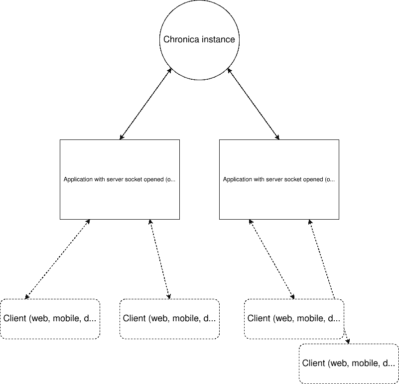
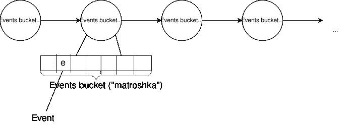

# 在野外建立事件分发系统

> 原文：<https://blog.devgenius.io/building-events-distribution-system-in-the-wild-8bb494081465?source=collection_archive---------10----------------------->

本文介绍了用 Golang 编写的微小事件发布系统。这可以用于例如基于 p2p 的应用中的数据复制；

## 整体架构



我把这个系统命名为“编年史”。如上图所示，Chronica 可以作为各种基于服务器的应用程序之间的中间层来同步一些更新。《出埃及记》节点 A 更新其数据库中的一些记录，然后它向 Chronica hub 发送关于它的确认事件。然后节点 B，C，…接收到确认。然后他们自己决定应该如何处理它(例如简单地同步数据库中记录，或者根据一些规则忽略它。).Chronica 也可以嵌入到相应的服务器应用程序中:只需在接收节点中实现负责接受事件的节点契约，并将事件交给事件分发器；

## 现在什么不是编年史？

1.  复制事件。如果应用程序运行时，不知何故崩溃，事件丢失；
2.  完整事件持续性。如果某个实例收集了大量未处理的事件，并且有新的事件到达，那么最老的事件将从事件队列中被丢弃；

## 那么，背后的核心算法是什么？

当服务器应用程序确认其更新时，为了向其他方发送通知，会发生以下事情:

1.  事件被发送到 Chronica 分发服务器；
2.  则该事件被存储在对应于某个接收节点的每个通道中；
3.  然后，Chronica 尝试将存储的事件刷新到每个通道中的接收节点。如果事件发送成功，那么它将从给定的通道中被丢弃(在我的解决方案中，我称之为“纤程”)，下一个事件将按 FIFO 顺序处理到该节点。否则，该事件将被保存，并且在另一次发送事件时，Chronica 将运行相同的刷新循环。事件可能来自服务器应用程序，也可能是内部事件(当新的事件接收器注册为 ex。—建议新连接的节点接收初始状态)，或者是简单的确认事件；

下图显示了此流程背后的核心数据结构:



(是的，事件也是分批打包的，以减少接收事件的节点调用量，因此这是减少网络负载和增加事件交付稳定性的简单方法)

## 解决上述问题的单纤 Golang 码

```
package lib

import (
	"fmt"
)

const externalSigCapacity = 256

type Fiber struct {
	node            Node
	events          *MatroshkaList
	internalEvents  *MatroshkaList
	externalSigChan chan interface{}
	pendingWorkChan chan struct{}
}

// Creates fiber
// - node: abstract node
// - eventsCapacity: maximum number of event buckets
// - packetCapacity: number of events in bucket
func MakeFiber(node Node, eventsCapacity uint32, packetCapacity uint32) Fiber {
	peerEventsList := MakeMatroshkaList(eventsCapacity, packetCapacity)
	internalEventsList := MakeMatroshkaList(256, 4)
	res := Fiber{
		node:            node,
		events:          &peerEventsList,
		internalEvents:  &internalEventsList,
		externalSigChan: make(chan interface{}, externalSigCapacity),
		pendingWorkChan: make(chan struct{}, 4),
	}

	return res
}

func (self *Fiber) sendEventsImpl(evtsPacket *Matroshka, evtsQueue *MatroshkaList) {
	err := self.node.Send(evtsPacket)
	if err == nil {
		evtsQueue.Pop()
		self.pendingWorkChan <- struct{}{}
	} else {
		fmt.Printf("[CHRONICA] Err => %s\n", err.Error())
	}
}

// Starts fiber
func (self *Fiber) Run() {
	go func() {
		for {
			var externalSig interface{} = nil

			select {
			case externalSig = <-self.externalSigChan:
			case <-self.pendingWorkChan:
			}

			for len(self.pendingWorkChan) > 0 {
				<-self.pendingWorkChan
			}

			if v, ok := externalSig.(Event); ok {
				if self.events.IsFull() {
					self.events.Pop()
				}

				self.events.Push(v)
			}

			if v, ok := externalSig.(InternalEvent); ok {
				if self.internalEvents.IsFull() {
					self.internalEvents.Pop()
				}

				self.internalEvents.Push(v)
			}

			internalPacket := self.internalEvents.Peek()
			if internalPacket != nil {
				self.sendEventsImpl(internalPacket, self.internalEvents)
				continue
			}

			packet := self.events.Peek()
			if packet != nil {
				self.sendEventsImpl(packet, self.events)
			}
		}
	}()
}

// Acknowledges for node's readiness.
// to flush fiber events into node
func (self *Fiber) AckNodeConnected() {
	self.externalSigChan <- struct{}{}
}

// Keeps event in internal queue.
// Events are then flushed into node in FIFO order
// - evt: event object
func (self *Fiber) SendEvent(evt Event) {
	self.externalSigChan <- evt
}

// Keeps root event (from Chronica system itself) in internal queue.
// Events are then flushed into node in FIFO order
// - evt: event object
func (self *Fiber) SendRootEvent(evt InternalEvent) {
	self.externalSigChan <- evt
}
```

节点的接口很简单。如前所述，它负责向某个实例发送事件:

```
package lib

// Abstract interface for thing that commits events from internal queue
type Node interface {
	Send(events *Matroshka) error
}
```

## 好，如何绑定这些节点，以便我们可以广播(或单播)事件？

我创建了另一个名为“光纤管理器”的实体。它是一个入口点，跟踪注册的纤程并将发送的事件传播给它们。下面是它的代码:

```
package lib

// - Uid: unique descriptive identifier of node
// - Node: node
type FiberParams struct {
	Uid  string
	Node Node
}

type FiberWithId struct {
	id    uint32
	fiber Fiber
}

// An object to distribute events to fibers
type FiberDirector struct {
	externalSigChan chan Signal
	fibers          map[string]*FiberWithId
	fiberIdCounter  uint32
	eventsCapaciry  uint32
	packetCapacity  uint32
	trustToken      string
}

// Creates fiber orchester
// - fiberParams: nodes parameters
// - eventsCapacity: maximum number of event buckets
// - packetCapacity: number of events in bucket
func MakeFiberDirector(
	fibersParams []FiberParams,
	eventsCapacity uint32,
	packetCapacity uint32,
	trustToken string,
) FiberDirector {
	fibers := make(map[string]*FiberWithId, 0)
	var idCounter uint32 = 0

	for _, param := range fibersParams {
		idCounter++
		fib := MakeFiber(param.Node, eventsCapacity, packetCapacity)
		fibers[param.Uid] = &FiberWithId{
			id:    idCounter,
			fiber: fib,
		}
	}

	res := FiberDirector{
		externalSigChan: make(chan Signal, 1024),
		fibers:          fibers,
		fiberIdCounter:  idCounter,
		eventsCapaciry:  eventsCapacity,
		packetCapacity:  packetCapacity,
		trustToken:      trustToken,
	}

	return res
}

// Starts fiber orchester
func (self *FiberDirector) Run() {
	for _, fib := range self.fibers {
		fib.fiber.Run()
	}

	go func() {
		for {
			signal := <-self.externalSigChan

			if v, ok := signal.(SignalNodeConnected); ok {
				fiber := self.fibers[v.Uid]
				fiber.fiber.AckNodeConnected()
				continue
			}

			if v, ok := signal.(SignalNewEvent); ok {
				senderFiber := self.fibers[v.FromUid]
				for _, recvFib := range self.fibers {
					if recvFib.id != senderFiber.id {
						recvFib.fiber.SendEvent(v.Event)
					}
				}
				continue
			}

			if v, ok := signal.(SignalNewRootEvent); ok {
				for _, recvFib := range self.fibers {
					recvFib.fiber.SendRootEvent(v.Event)
				}
				continue
			}

			if v, ok := signal.(SignalNewUnicastEvent); ok {
				senderFiber := self.fibers[v.FromUid]
				receiverFiber := self.fibers[v.ToUid]

				if senderFiber.id != receiverFiber.id {
					receiverFiber.fiber.SendEvent(v.Event)
				}

				continue
			}

			if v, ok := signal.(SignalNewUnicastRootEvent); ok {
				receiverFiber := self.fibers[v.ToUid]
				receiverFiber.fiber.SendRootEvent(v.Event)

				continue
			}
		}
	}()
}

// Dispatches signal to fiber orchester
// - sig: signal object
func (self *FiberDirector) SendSignal(sig Signal) {
	self.externalSigChan <- sig
}

func (self *FiberDirector) RegisterNode(fiberParams FiberParams) {
	fiber := MakeFiber(
		fiberParams.Node,
		self.eventsCapaciry,
		self.packetCapacity,
	)

	self.fiberIdCounter++
	self.fibers[fiberParams.Uid] = &FiberWithId{
		id:    self.fiberIdCounter,
		fiber: fiber,
	}
	fiber.Run()

	go func() {
		uids := make([]string, 0)
		for uid := range self.fibers {
			uids = append(uids, uid)
		}

		event := InternalEvent{
			Action:     InternalEventPullCurrentState,
			TrustToken: self.trustToken,
			Payload:    uids,
		}
		self.externalSigChan <- SignalNewUnicastRootEvent{
			ToUid: fiberParams.Uid,
			Event: event,
		}
	}()
}
```

(我们需要 uid 来唯一地标识一个节点——它可以在您的自定义协议中指定为 url、id 等。)

## 所有库功能都位于此存储库中:

[https://gitlab.com/jbyte777/chronica-distributor](https://gitlab.com/john-byte/chronica-distributor/-/tree/master/lib)

## 使用 Chronica 的基本示例如下:

https://gitlab.com/jbyte777/chronica-server-example

【https://gitlab.com/jbyte777/chronica-client-example 

*就这些。随意留下任何评论；)*