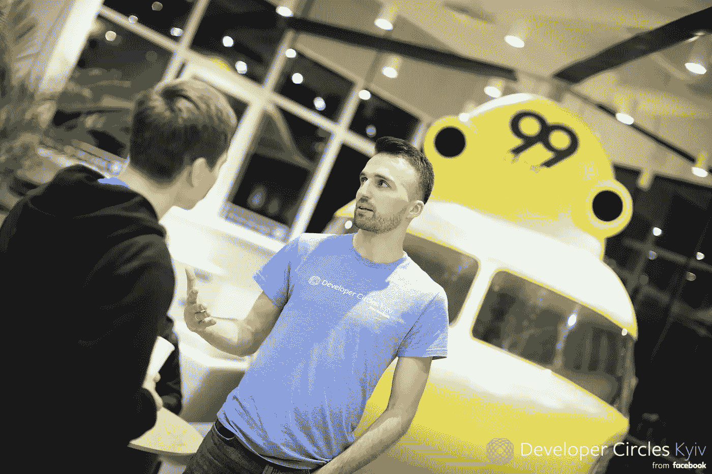
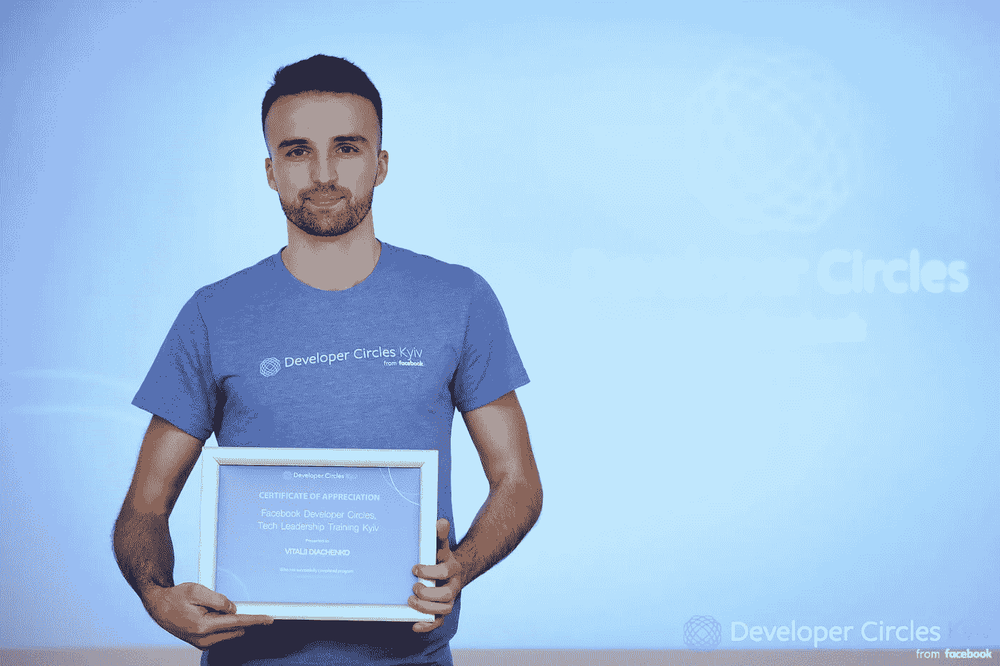
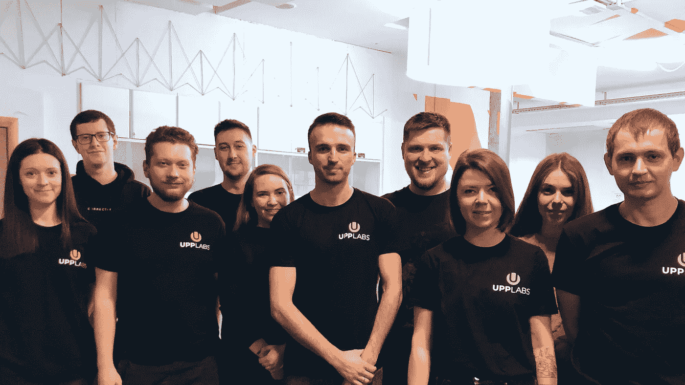

# 乌克兰建筑公寓公司。如何成为一名 IT 企业主

> 原文：<https://blog.devgenius.io/building-flat-company-in-ukraine-how-to-be-an-it-business-owner-85367f069e9?source=collection_archive---------26----------------------->

如果你想自己创业，你需要耐心和决心。

*Vitaliy Dyachenko 的故事，*[***UPP labs***](https://upplabs.com/)*【创始人兼首席技术官，全球首席技术官论坛成员，Maya Startup Hub 的导师，金融科技和 PropTech 爱好者，曾在乌克兰五大外包公司中的三家工作过。*

最初这篇文章被添加到 [UppLabs](https://upplabs.com/blog/building-flat-company-in-ukraine-how-to-be-an-it-business-owner/) 博客。

# 我是如何开始编程的

我花了一段时间才开始编程。我读书的那所小学校只有 200 个孩子。我的数学技能很好，我的老师决定给我一本关于 Pascal 的书，这样我就可以阅读它并学习编程。但在家里，我没有电脑，在学校，我猜，只有他们三个(而且相当老)。

这就是为什么我的第一堂编程课是从笔记本开始的。我只是不停地手写程序代码。我每周去上一次计算机科学课，在那里我试着在电脑上打字并编译笔记本上的代码。

当然，大部分代码都没用。在编程中，一切都相当复杂，所以如果你从逻辑的角度错过或写错了什么——代码就是不工作。我花了很长时间运行一些东西，最终，一些部分开始工作。我就是从那时开始了解调试过程的。

到了暑期儿童 IT 营，已经练了快一年了。我记得第一节课老师是怎么走近我，看到我的笔记本的。她打开它，看到它都被程序代码抹去了。她强调我有很大的耐心，并补充说，她不认为她可以做同样的事情。

在那一刻，我第一次意识到，是我的耐心将我带到我想去的地方，并允许我继续前进，因为我绝对不会以这种方式停止发展。

在我被第一所大学录取的时候，学生可以申请几个专业。因此，我抓住机会通过了两个部门的考试:信息技术和金融，并在国家资助的基础上被这两个部门录取。

至于计算机科学，我受到结果和过程的启发。通常，我做的比必要的多，因为这对我很“有趣”。我帮助我的同学做功课。我真的很喜欢编程，此外，我还对金融感兴趣。所有这些帮助我很快提高了技能。为了总是比这个项目领先一点，在第三年，我已经开始了第五年课程的项目部分。

# 第一个项目和 UPPLABS 的启动

在第四年，我和我的同学们决定创建我们自己的小产品，可以将我们城市的所有公司组织成一个在线社区。这是我们三个人开始着手的第一个想法。虽然我们没有完成这个产品，因为我们没有足够的技术知识、技能和努力，但这次尝试给了我们一些经验。

第五年，我们进行了第二次尝试。这似乎是成功的。之前一个产品的熟人打电话给我，说他朋友的一个朋友为了给他的公司做申请，找过他。

我们和我的一个朋友一起为这个项目开发了一个应用程序，花了我们大约六个月的时间，然后我们开始了其他小项目的工作。六个月后，我决定创建自己的在线产品，来组织这一领域其他公司的工作。

那时我已经有了可靠的团队，并决定开始我的第一个 [**UppLabs**](https://upplabs.com/) 项目。

作为一名企业主，我经历了几个阶段，每一次我都有一些当时看来很重要的想法和知识。我始终相信的是，你肯定需要有一个合适的团队，可以帮助你发展，并展示出最好的结果。至于我，我是**那个必须管理** **所有风险**的人。这很关键。

# 积累经验

我已经在 2012 年创建了最初的 UppLabs 原型，当时它还是一家小型产品公司。同年，在没有停止开发自己产品的情况下，我接受了一家大型外包 IT 公司的工作。

我需要经验。

在那之后，我设法获得了这一经验，在乌克兰外包 IT 公司前 5 名中的 3 家工作。

作为一名大型外包公司的员工，我学到了很多关于流程组织、服务水平以及如何改进和实现这种服务的知识。作为三家创业公司的创始人，一个从商学院毕业的人，一个帮助其他创业公司开发产品的人，以及看着他们犯错误的人，我获得了产品和商业解决方案方面的经验。所以我要说，以上这些都影响了我。

> 我对工作流程有了很好的理解，并将最佳工作实践作为公司的基础。

此外，外包公司的参与让我明白了跟踪技术趋势的必要性。毕竟，一个成功的公司不能使用不再让它在市场上具有竞争力的技术。这就是为什么，几年前，我们开始使用 [**React.js**](https://upplabs.com/skills/react-js/) 。

我工作的最后一家公司是一家以色列产品公司，我从那里借鉴了一些技巧，使工作流程更加开放。例如，我们现在在 UppLabs 使用的“全体员工”或“快乐时光”实践就是一个产品公司方法的例子，它更关心员工而不是财务部分。

2019 年，我作为导师参加了 [**脸书开发者圈基辅**](https://www.facebook.com/groups/devCKyiv/) 。这次活动对我来说是一个很好的机会，可以结识许多有才华的开发人员和爱好者，成为社区的一部分，并认识到我有足够的经验与那些计划开始自己的职业生涯甚至自己的 IT 业务的人分享。这件事给了我更多的自信。

# 扁平公司

教育、事件、经验、自我提升是一个企业主最重要的组成部分。在对公司结构进行了几次试验后，UppLabs 现在正在向扁平化公司迈进。

> *扁平化公司是这样一种公司，在这里，每个人都可以接近任何人，分享他们的想法、建议、对公司和流程改进的主张以及任何其他问题。*

我有两条重要的规则。第一条规则是管理风险，制定 b 计划。你应该总是有一个后备计划。风险管理可以归因于公司生活的所有方面，包括与人合作、公司发展、规划过程。

第二条规则是不断改进。我和我的团队必须不断改进。因为一旦我们停下来，我们就开始输给竞争对手。

我不想再建立一个外包公司。相反，我希望 UppLabs 在一个特定的方向上占据领导者的位置。我们现在正在努力。为了实现这一目标，我们需要率先采取行动。

一个好的团队对我们来说是头等大事，而寻找一个好的团队是一个复杂而耗时的过程。最初，我独自负责团队中所有关键人物的所有面试阶段。但是现在我开始让其他专家来帮我承担这个责任。目前，UppLabs 发展如此迅速和多样化，以至于我的技术经验不足以采访某一类专家。这就是为什么我们邀请专家或朋友来帮助我们做决定。

UppLabs 团队

我的意图是让 UppLabs 成为一家独立自主的公司，不依赖任何人，包括我。

# 成功的关键

对我来说，最大的挑战是留住和激励员工，让他们长期发展。重要的是，一名优秀的专家会对留在我的团队感兴趣。

> 成功的关键是渴望提升自己。一个公司成功的关键是找到一个志同道合的团队，他们希望发展公司，并与公司一起成长。扁平公司的方法可能是答案。

[**认识我的团队！**](https://upplabs.com/our-team/)

感谢您的阅读！