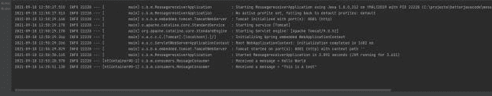

# 使用事件驱动架构构建微服务

> 原文：<https://blog.devgenius.io/building-microservices-with-event-driven-architecture-f9243d812442?source=collection_archive---------2----------------------->

在本帖中，我们将讨论如何使用事件驱动架构构建微服务。作为帖子的一部分，我还将展示一个事件驱动的微服务的例子。如果你不知道什么是微服务，可以从[我这里的入门](https://betterjavacode.com/core-java/spring-boot-and-microservices)开始。

# 微服务—事件驱动架构

传统上，我们会使用基于 REST 的微服务。在这个微服务中，客户端会请求数据，然后服务器会用数据做出响应。但是也有缺点，客户端必须等待服务器响应。服务器可能关闭或服务于其他请求，正在延迟对当前客户端请求的响应。

简而言之，当系统因为同步连接而变得缓慢时，我们可以使用事件驱动架构来使系统异步。

事件驱动的微服务使用最终一致的方法。每当有更新或事务时，每个服务都会发布事件数据。其他服务订阅此服务发布事件。当这些订阅的服务接收到事件时，它们更新它们的数据。

这种方法的一个简单例子是:当客户兑换礼品卡时，会创建一个单独的兑换事件，并由不同的服务消费。

1.  可以在数据库中写入兑换记录的奖励服务
2.  顾客收到通过礼品卡购买的商品
3.  合作伙伴服务验证礼品卡，并允许兑现和相应地处理顾客购买的商品。

[事件驱动架构](https://www.educative.io/path/scalability-system-design?aff=VRQq)要么通过队列，要么通过发布-订阅模型。在发布/订阅模型中，服务发布事件，订阅的服务消费该事件。和队列、主题做的事情区别不大。

# 事件驱动架构的优势

*   **松耦合** —服务不需要依赖其他服务。考虑到架构是反应式的，服务可以相互独立。
*   **异步** —发布服务将发布事件。订阅服务可以随时使用事件。异步架构的主要优点是服务不会阻塞资源。
*   **扩展** —由于服务是独立的，大多数服务执行单一任务。这也使得寻找瓶颈变得更加容易。

# 事件驱动架构的缺点

每一个设计都是一种取舍。在分布式系统中，我们没有完美的设计。使用事件驱动的架构，人们可以通过分离关注点轻松地过度设计解决方案。

事件驱动架构需要前期投资。由于数据不一定立即可用，这可能会引起一些事务方面的问题。如果数据有问题，最终的一致性可能很难调查。可能存在重复事件，从而导致重复数据。事件驱动模型不支持 ACID 事务。

# 建筑框架

尽管有这些缺点，事件驱动架构速度很快，并能成功地交付结果。所以下一个问题是选择什么框架来构建这个架构。目前，有两种选择

# 信息处理

在消息处理中，服务创建消息并将其发送到目的地。订阅服务从该目的地获取消息。在 AWS 中，我们使用 SNS(简单通知服务)和 SQS(简单队列服务)。服务向主题发送消息，订阅该主题的队列获取该消息并进一步处理它。

SNS 和 SQS 并不是唯一的框架。消息队列使用代理的存储和转发系统，事件在代理之间传递。ActiveMQ 和 RabbitMQ 是消息队列的另外两个例子

# 流处理

在流处理中，服务发送一个事件，订阅的服务拾取该事件。然而，事件并不针对特定的目标。

通常，事件的生产者发出事件，并可以将它们存储在存储器中。事件的消费者可以消费来自数据存储的那些事件。最流行的流处理框架是 Kafka 。基本上，它遵循发布-订阅模型。

最重要的是，流处理器(如 Kafka)提供了数据的持久性。数据不会丢失，如果系统离线，它可以再现事件的历史。

# 基于事件驱动架构的微服务演示

作为演示的一部分，我们将实现一个 Spring Boot 应用程序和 ActiveMQ 消息代理服务。

# ActiveMQ 消息服务

ActiveMQ 是一个开源的消息代理。目前，它支持用 Java、Python、.Net、C++等等。

点击从[下载 ActiveMQ。一旦你在你的机器上解压了下载的文件夹，你可以转到`bin`目录，用一个命令`activemq.bat start`启动 ActiveMQ 服务器。这将在](https://activemq.apache.org/)`[http://localhost:8161](http://localhost:8161.)` [启动 ActiveMQ 服务器。](http://localhost:8161.)

# Spring Boot 的发送者应用程序

现在，让我们使用 Spring Boot 创建一个消息发送者应用程序。我们将需要以下依赖关系

```
dependencies { 
implementation 'org.springframework.boot:spring-boot-starter-activemq' 
implementation 'org.springframework.boot:spring-boot-starter-web' testImplementation 'org.springframework.boot:spring-boot-starter-test' 
}
```

我们将添加 JMS 配置来创建 ActiveMQ 队列。

```
@Configuration
public class JmsConfig
{
    @Bean
    public Queue queue()
    {
        return new ActiveMQQueue("demo-queue");
    }
}
```

这为我们的队列`demo-queue`创建了一个 bean。为了通过我们的 sender 应用程序向该队列发送消息，我们将创建一个 REST API，如下所示:

```
@RestController
@RequestMapping("/v1/betterjavacode/api")
public class MessageController
{
    @Autowired
    private Queue queue;

    @Autowired
    private JmsTemplate jmsTemplate;

    @GetMapping("/message/")
    public ResponseEntity sendMessage(@RequestBody String message)
    {
        jmsTemplate.convertAndSend(queue, message);
        return new ResponseEntity(message, HttpStatus.OK);
    }

}
```

随后，我们在 RestController 中注入了`queue`和`jmsTemplate`bean，这样就可以发送消息了。

另一方面，我们还将有一个接收方应用程序，它将是一个目的地服务或消费者服务，使用来自发送方应用程序的消息。

在我们的 receiver 应用程序中创建一个消息消费者类

```
@Component
@EnableJms
public class MessageConsumer
{
    private final Logger logger = LoggerFactory.getLogger(MessageConsumer.class);

    @JmsListener(destination = "demo-queue")
    public void receiveMessage(String message)
    {
        // TO-DO
        logger.info("Received a message = {}", message);
    }
}
```

带有 destination 的注释`@JmsListener`让应用程序监听那个队列。`@EnableJms`启用注释`@JmsListener`。

我们仍然需要添加 ActiveMQ 属性，以便两个应用程序都知道 ActiveMQ 服务器在哪里运行。因此，将以下属性添加到`application.properties`

```
spring.activemq.broker-url=tcp://localhost:61616 spring.activemq.user=admin spring.activemq.password=admin
```

现在启动两个 Spring Boot 应用程序。发送方应用程序运行在 8080 上，接收方应用程序运行在 8081 上。


现在，如果我们检查 receiver 应用程序的日志，我们将看到它已经使用了来自 ActiveMQ 队列`demo-queue`的消息。



我们还可以看到 ActiveMQ 服务器中队列的状态。


在这里，您可以看到队列从发送方接收到两条消息，并将其传递给消费者。这个演示的代码可以在我的 [github 库](https://github.com/yogsma/betterjavacode)中找到。

# 结论

在这篇文章中，我讨论了微服务的事件驱动架构。我们还讨论了这种架构的优点和缺点。最后，我们展示了如何使用 ActiveMQ 为异步通信建立一个基于事件驱动架构的微服务。

另外，如果你还没有买我的《春季安全》一书，你可以在这里买[或者在这里](https://yogsma.gumroad.com/l/VgSdH)阅读更多信息。

# 参考

使用 ActiveMQ 的事件驱动微服务— [ActiveMQ](https://itnext.io/event-driven-microservices-with-spring-boot-and-activemq-5ef709928482)

*原载于 2021 年 9 月 18 日*[*https://betterjavacode.com*](https://betterjavacode.com/programming/microservices-event-driven-architecture)T22。