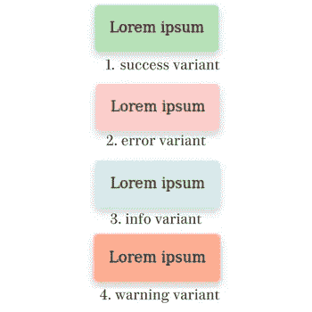

# 构建我的第一个 Javascript 库——Toast 库

> 原文：<https://blog.devgenius.io/building-my-first-javascript-library-a-toast-library-25b13faeda5?source=collection_archive---------16----------------------->

不久前，我承担了一个小项目，为 web 应用程序构建一个基本的 toast 库，该库旨在易于插入到任何项目中，并特别关注视觉对比方面的可访问性。

照片由[卢卡·布拉沃](https://unsplash.com/@lucabravo?utm_source=medium&utm_medium=referral)在 [Unsplash](https://unsplash.com?utm_source=medium&utm_medium=referral) 上拍摄

这篇文章将试图记录它背后的原因，它是如何建立的，它是如何随着时间的推移而演变的，以及我能够从中学习到什么。

## 项目灵感

已经有无数的 toast 通知库经过了测试。因此，这绝不是试图取代这些已建立的和编写得更好的库。

然而，我觉得为了方便使用，还是谨慎地构建一个。一些我熟悉的东西，简单易用，同样容易定制，如果需要。当然，学习经验总是承担项目的一个有价值的理由。

## 图书馆的内部运作

这个图书馆极其简陋。它基于两个文件，一个样式表文件和 javascript 文件及其缩小版本。初始化时，库创建一个容器来保存所有的 toast 通知。

创建容器后，开发人员可以利用库中的 toast 实用程序，它接受两个参数，`the toast notification message`和`the toast variant`。toast 实用程序创建一个元素，并将其附加到初始化库时创建的容器中。就这么简单。

## 库的初始迭代

最初的迭代本质上是功能性的。它旨在将库包含在任何 web 应用程序中后立即进行设置。

从上面可以看出，一旦文件被包含，一个名为`simpleToast`的变量就可以被用户使用，并拥有该库的所有功能。本质上，`simpleToast`是库。

在父`SimpleToast`函数中有很多函数我们没有涉及到。

`checkForContainer`函数检查 toast 容器元素是否已经创建，并以布尔值的形式返回状态。

`getToastClass`函数又负责提供对应于用户提供的 toast 变量的 toast css 类。只有四种 toast 变体可供使用，`success, info, warning and error`变体，默认为`info`变体。

我相信`randomIdGenerator`是非常不言自明的，它提供了一个随机字符串，该字符串连接到当前时间戳，为新的 toast 创建一个唯一的 id。唯一 id 的目的是能够在设置的持续时间内删除可见的正确 toast。

大部分样式是从 bootstrap 的样式中提取的，在这里和那里做了一些小的调整，主要是为了改善文本颜色和背景颜色的对比情况。

展示祝酒词外观的图片

查看库的初始迭代的两个源文件，可以看到一些缺点:

1.  对于 toast 容器位置，只有一个提供的选项，即右上角。
2.  在创建 toast 通知的过程中没有动画，因此不太美观。
3.  toast 通知被设置为在设定的 6 秒持续时间内可见，并且不能由用户定制。

以上的缺点把我们带到了这篇文章的下一部分。

## 项目如何随时间演变

库的第二次迭代被重组为一个类。用户还可以定制设置，包括祝酒词的持续时间和父祝酒词通知容器的位置。

`initialize()`函数也被移到了构造函数中，而不是像在第一次迭代中那样放在函数之外。

正如所看到的，在缺少两个初始化参数的情况下，类默认为 6 秒和右上角位置。

正如在`toast-final.css`文件的第 12 行所看到的，为 toast 通知的基本动画添加了一个简单的线性过渡，创建时不透明度为 0，然后慢慢淡入视图。

除了`top-right`位置，还增加了另外三个位置:`top-left`、`bottom-right`、`bottom-left`。

简单地说，图书馆就是这样建成的。

## 项目的收获

在研究和从事这个项目的过程中，我学到了很多东西。这些课程从祝酒词的可用性到任何项目中的一般经验法则。以下是我从长期的工作中学到的一些东西:

1.  尽可能避免重新发明轮子。
2.  始终注意项目范围。新特性的想法似乎总是会出现，如果我致力于所有这些，我最终会得到一个类似于许多已经出版的 toast 库。
3.  尝试迎合边缘情况，并在用户定义的配置超出提供的情况时，在适当的位置设置后备或默认情况。例如，如果用户犯了一个错误，用小于零的持续时间初始化了库。
4.  在反馈可以本地化的情况下，祝酒作为反馈机制不是很有效。例如，在表单和表单提交中，在用户体验方面，将反馈放在表单中比放在 toast 通知中更好。
5.  祝酒通知消息需要简洁、直截了当，如果你喜欢的话，简短而甜蜜。
6.  改变屏幕布局的 CSS 转场在性能上可能非常昂贵，这取决于所使用的设备。由于昂贵的性能方面的原因，这种转换可能是细长的，并且提供差的用户体验。不改变屏幕布局的属性(如不透明度)的过渡要快得多，并且通常表现得更好。
7.  从 ES2022 开始，Javascript 为方法和字段提供了访问修饰符。`#`用于声明私有字段和/或方法，而`_`用于声明受保护的字段和/或方法。例如，`toast-final.js`文件的第 12 行。

## 结论

总而言之，在这个短期项目中工作是一个很好的学习经历，我希望在未来更多地参与到需要在公共场所进行建筑的项目中。

一如既往，所有的源代码都可以在[这里](https://github.com/kiptoo-korir/simple-toast)找到。

**PS:写这篇文章的时候，我实际上已经知道了最后的外卖。有趣的是，定制选项*(定制持续时间和定制定位)*在认为项目“完成”五个月后才被添加到项目中。**