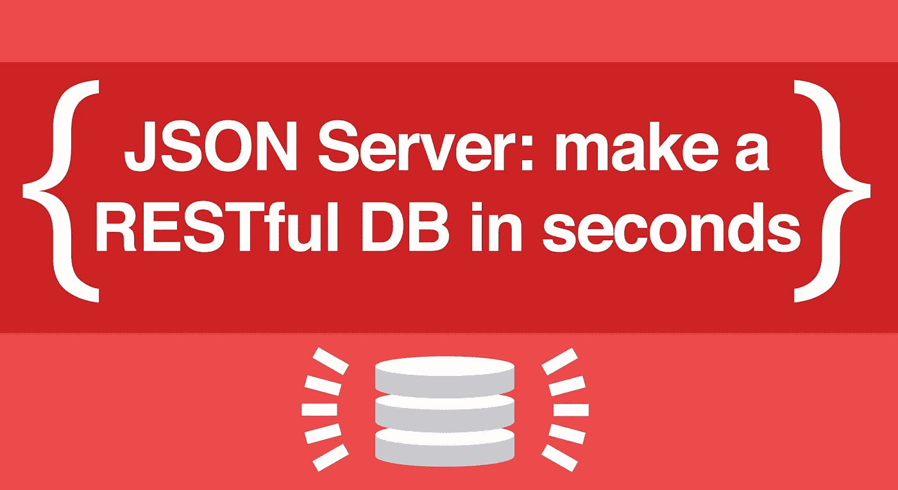

# 用 JSON 为前端新手和专家构建原型 REST API

> 原文：<https://blog.devgenius.io/building-prototype-rest-api-with-json-for-frontend-newbies-and-experts-86db44d97bda?source=collection_archive---------12----------------------->



迈克·克罗宁

考虑到我更倾向于后端开发，很多前端爱好者和新手已经联系我，向他们开放我现有的任何 REST API 供他们使用，也许是出于实践的目的。

本文解释了如何使用 JSON 创建一个 test REST API，让它完全可以使用，并使用 API 测试工具(Postman Client)进行使用。

进入链接【https://nodejs.org/en/download/ ，下载并 nodejs。

通过运行以下命令安装 JSON 服务器:

创建一个文件，该文件将成为您假定的数据数据库，我们将该文件命名为 db.json 并添加您的数据。请参见下面的示例:

```
{
  "users": [
       { "id": 1, "name": "Nuhu Ibrahim" }
  ],
  "posts": [
       { "id": 1, "user_id": "1", "content": "Hello World" }
  ]
}
```

通过执行以下命令启动 json-server:

```
json-server --watch db.json
```

下面是服务器上基于 db.json 文件的可用资源:

```
Resources
  http://localhost:3000/users
  http://localhost:3000/posts

Home
  http://localhost:3000
```

下面是基于 db.json 文件(数据库)内容打开的路由:

```
GET    /users
GET    /users/1
POST   /users
PUT    /users/1
PATCH  /users/1
DELETE /users/1

GET    /posts
GET    /posts/1
POST   /posts
PUT    /posts/1
PATCH  /posts/1
DELETE /posts/1
```

去 https://www.postman.com/downloads/[下载一个 API 测试客户端，最值得推荐的一个叫 Postman 的，按照他们的教程学习如何使用它来消费 REST APIs。](https://www.postman.com/downloads/)

享受构建前端项目的乐趣，不要浪费时间构建合适的后端或等待后端工程师来协助✌.

# 注意

```
Changes will be automatically and safely saved to db.json using lowdb whenever you make POST, PUT, PATCH or DELETE requests.

Your request body JSON should always be object enclosed.

A POST, PUT or PATCH request should include a Content-Type: application/json header to use the JSON in the request body.

You can perform filtering, sorting, full-text search, relationship fetchs; you can also access the json-server remotely, add custom routes, middlewares, authentication and do even a lot more.
```

# 点击阅读更多关于 json-server [的信息。](https://nuhuibrahim.com/blog/To%20learn%20this,%20read%20the%20full%20documentation%20here)

*最初发表于*[*https://nuhuibrahim.com*](https://nuhuibrahim.com/blog/how-to-build-simpe-rest-api-with-json-for-frontend-newbies-and-experts)*。*