# 为用户构建购物车

> 原文：<https://blog.devgenius.io/building-shopping-cart-for-the-user-9f58e13aa3e3?source=collection_archive---------4----------------------->

## 如何使用普通 JavaScript 为用户动态创建购物车功能


布鲁诺·凯尔泽在 [Unsplash](https://unsplash.com/s/photos/shopping?utm_source=unsplash&utm_medium=referral&utm_content=creditCopyText) 上的照片

# 每个购物者都需要一辆手推车

对于 Mod 3 项目，我们的任务是使用 JavaScript 作为前端，Ruby Rails API 作为后端服务器，构建一个单页面应用程序(SPA) 。我和我的合伙人想出了建立一个销售 PPE 产品的[电子商务网站](https://github.com/iannakim/Mod-3-Project)的主意(我们现在比以往任何时候都更需要口罩，不是吗？😷).首先，我们绘制了领域模型，并提出了以下逻辑图，其中包含 *has_many、属于*和 *has_many_through* 关系:

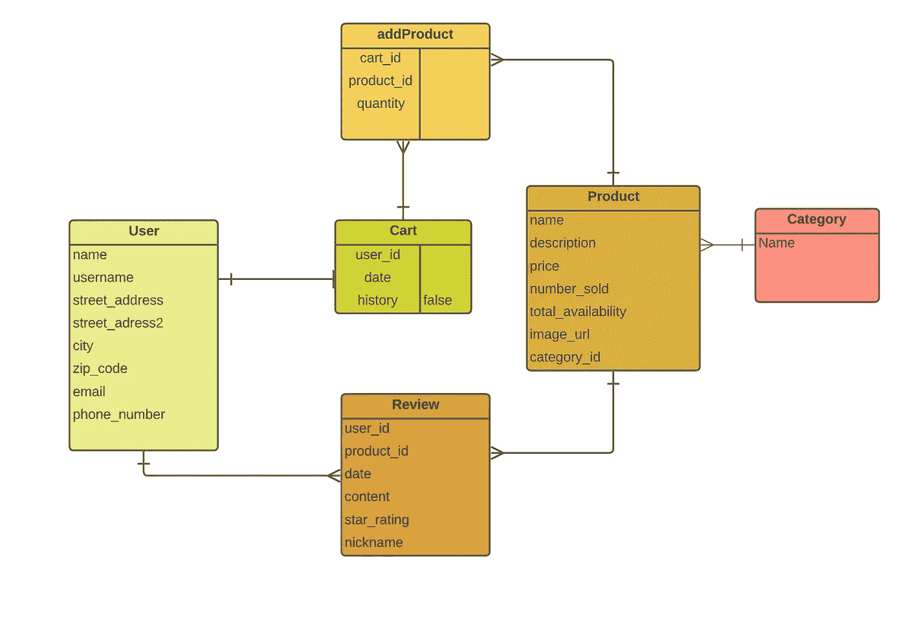

显示我的应用程序的 6 个模型的实体关系图

正如你所看到的，该应用程序旨在让用户实例化一个新的****购物车，这意味着它是一个一对一的关系**。这意味着当一个新用户创建一个账户时，我们的*后端*将会创建一个新的购物车，并且这个**购物车将会通过他们的 user_id** 连接到那个特定的用户。很酷，不是吗？现在，当用户在任何其他时间重新登录时，我们不再需要为该用户创建新的购物车；我们可以简单地找到🔍我们后端上预先存在的购物车，并获取购物车对象。我们省去了制造成百上千个一次性手推车的麻烦。******

# ****让我们来分解一下:****

****我将展示如何从注册页面和登录页面检查和/或创建购物车的两种途径。这两个过程使用完全相同的函数。****

## ******从注册页面→******

****在注册表单上，我附加了一个事件监听器，它会触发 *handleSignUpForm* 函数以及所有的用户输入。****

****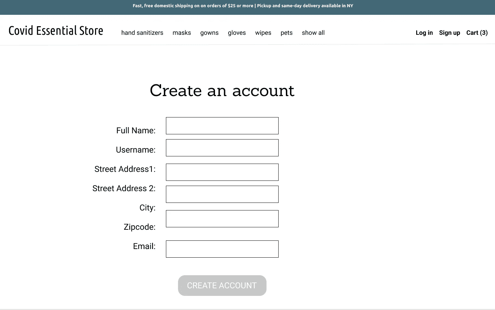****

****使用事件侦听器注册表单****

```
**signUpForm.**addEventListener**('submit', **handleSignUpForm**)**
```

******handleSignUpForm** 根据用户的输入发出 POST 请求，如果请求成功，我们将返回一个新创建用户的普通旧 Javascript 对象(POJO)—*new user。*****

```
**let **handleSignUpForm** = (event) => {
  event.preventDefault() let newName = event.target["fullname"].value
   let newUsername = event.target["username"].value
   let newStreet1 = event.target["street-1"].value
   let newStreet2 = event.target["street-2"].value
   let newCity = event.target["city"].value
   let newZip = parseInt(event.target["zipcode"].value)
   let newEmail = event.target["email"].valuefetch(`http://localhost:3000/users`, {
    method: "POST",
    headers: {'Content-Type': 'application/json'},
    body: JSON.stringify({ name: newName,
         username: newUsername,
         street_address: newStreet1,
         street_address_2: newStreet2,
         city: newCity,
         zip_code: newZip,
         email: newEmail })
})
   .then(res => res.json())
   .then((newUser) =>{ **checkIfCartExists(newUser)
**       **currentUser = newUser** //set newUser as global var currentUser renderLogoPage() 
      })
    event.target.reset()
}**
```

****一旦我得到了这个响应，我就可以调用 **checkIfCartExists()** 来查看在我们的后端是否已经存在该用户的购物车。****

****(旁注:currentUser 是一个全局变量，我用来存储当前用户注册或登录应用程序后的信息。这是我在这个单页面应用程序上解决 Rails“会话”问题的方法)****

******checkIfCartExists()** 接受一个参数(用户)并在我们的 POST 请求主体中传递该用户 id，以查看在我们的后端是否已经存在具有该*用户 id* 的购物车。**我们只需要 user_id** ，因为每个购物车都是基于一个唯一的用户分配 id 创建的。****

```
**let **checkIfCartExists** = (user) => {
   let userLoggingIn = user fetch("http://localhost:3000/findcart", {
    method: "POST",
    headers: {"content-type": "application/json"},
    body: JSON.stringify({
         **user_id: userLoggingIn.id** })
})
   .then(res => res.json())
   .then(cart => {
       **if(cart.id)**{
         console.log(cart, "cart already exists!")
         **currentCart = cart; /**/set cart as global var currentCart
       } 
       **else** {
         **createCartForUser**(userLoggingIn)}
    })
}**
```

## ****🚊在我们的 Rails 后端检查购物车:****

```
****//carts.controller.rb**def findUserCart
  @found_cart = Cart.find_by(user_id: params[:user_id])
  if @found_cart
    render json: **@found_cart**
  else
    render json: {error: "The user has no cart"}
  end
end**
```

****✅如果 cart 存在，由于有了全局变量，现在可以访问 currentUser 和 currentCart 对象。我还添加了一个控制台日志来帮助您在开发工具中检查 cart 对象。****

****⛔️如果购物车不存在，我们将调用 checkIfCartExists()中的 **createCartForUser()** 为用户创建一个空购物车！****

```
**let **createCartForUser** = (user) => {
   let userLoggingIn = userfetch(`http://localhost:3000/cart`, {
   method: "POST",
   headers: {"content-type": "application/json"},
   body: JSON.stringify({
          **user_id: userLoggingIn.id
**   })
})
   .then(res => res.json())
   .then((cart) => {
      console.log(cart, "cart created!")
      **currentCart = cart;
**  })
}**
```

****新用户显然还没有购物车，必须通过 **createCartForUser()** 来实例化他们的购物车。但是这两个链接的函数几乎是即时的，在新用户提交表单后，你最终会在 dev tools 中看到消息“cart created”。****

****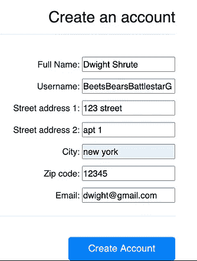********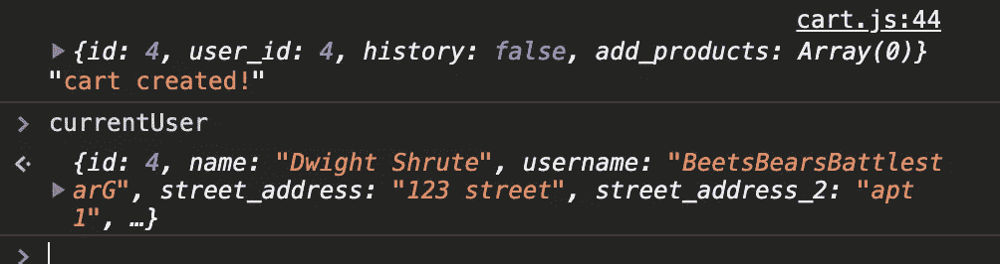****

****新用户注册屏幕/内部开发工具****

## ****从登录页面→****

****对于再次使用的用户来说，这个过程几乎完全相同。当用户填写登录表单时，我们传递用户名来验证该用户是否存在于我们的后端(我们没有在这个项目中实现密码认证)****

```
**logInForm.addEventListener("submit", **handleLoginForm**)**
```

****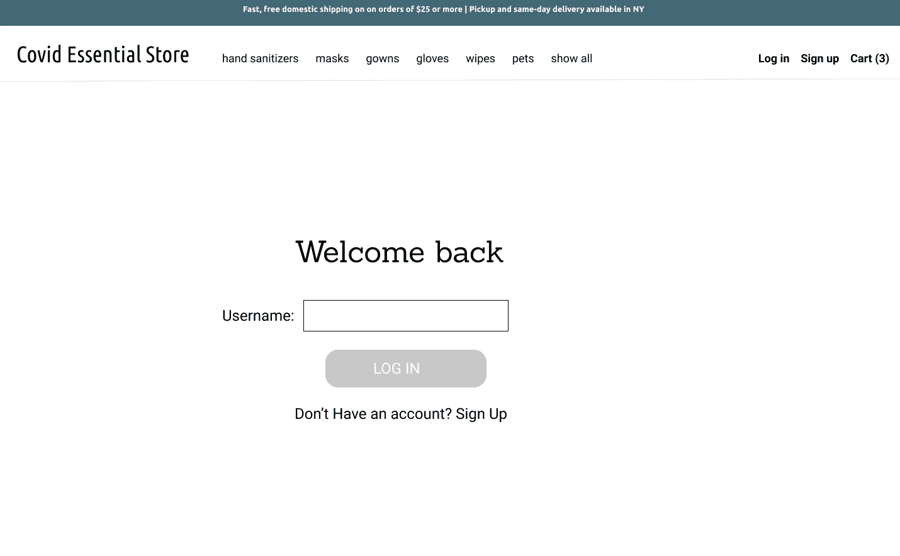****

****具有事件监听器的登录页面****

```
**let **handleLoginForm** = (evt) => {
   evt.preventDefault()
   let userLoggingIn = evt.target["username"].valuefetch("http://localhost:3000/login", {
    method: "POST",
    headers: {"content-type": "application/json"},
    body: JSON.stringify({ **username: userLoggingIn
**    })
})
   .then(res => res.json())
   .then(user => {
       **if(user.id)**{
       console.log(user)
       **currentUser = user;**
 **checkIfCartExists(currentUser)** renderLogoPage()
      }
     ** else** {alert("Username Not Found. Please try again.")}})
   evt.target.reset()
}**
```

****如果我们得到一个成功的响应( *user.id* 存在)，那么我们将这个用户对象传递给 **checkIfCartExists()** 并重复上面相同的过程。只有这一次，在你的开发工具将显示，你会看到控制台日志消息“购物车已经存在！”****

****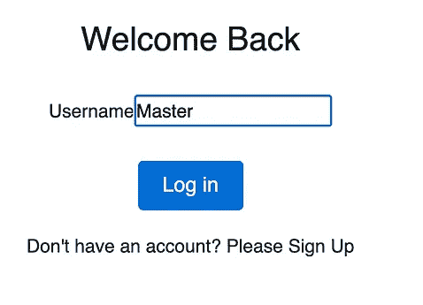********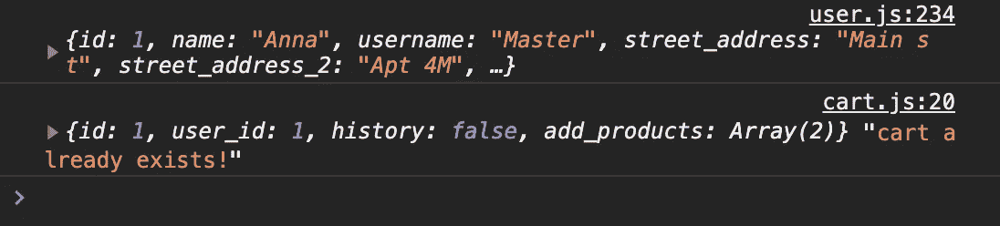****

****返回用户/内部开发工具的登录屏幕****

****通过这些简单的购物车功能，每个用户都可以拥有自己的购物车，现在我们可以使用他们唯一的 cart_id 来跟踪所有用户的购买情况！太棒了！😍****

****我们现在可以购物了！！资料来源:Giphy****

****各位编码快乐！🛍****

## ****在我的 [Github 页面](https://github.com/iannakim/Mod-3-Project)上随意查看剩余的代码！****

# ****号外的🍬****

****规划过程中的线框。(我用 [Figma](http://Figma.com) 来设计这些线框)****

************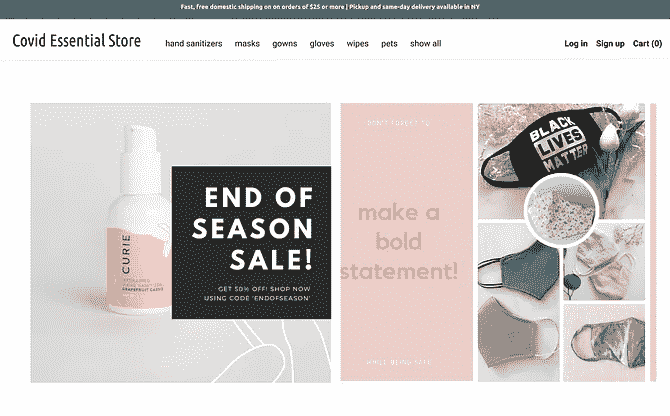********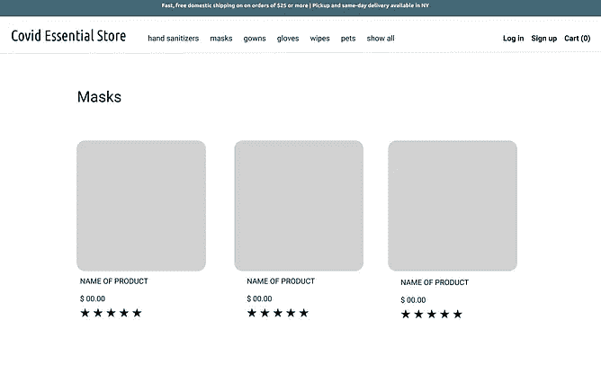********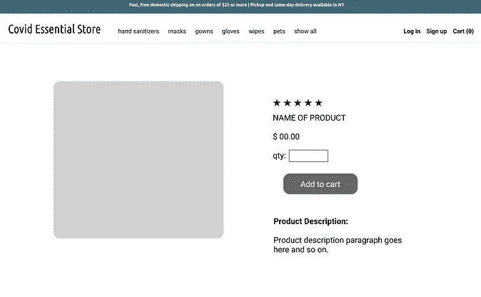********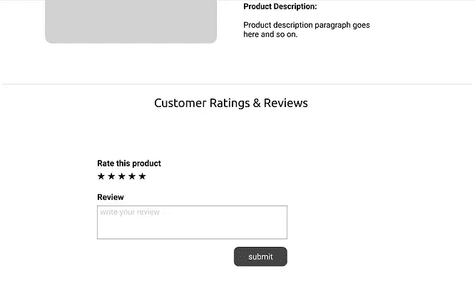********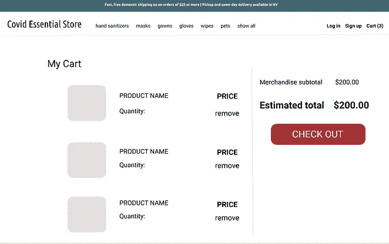****

# ****资源:****

*   ******线框化** → [图玛](http://figma.com)****
*   ******主页面** **图片和海报模板** → [canva](https://www.canva.com/)****
*   ******领域模型 ERD** → [lucidchart](http://lucidchart.com)****

*****安娜目前在熨斗学校参加纽约的软件工程沉浸式训练营。如果有任何问题，请随时通过*[*LinkedIn*](https://www.linkedin.com/in/problemsolveranna/)*或 msg 联系我们，或者我们也可以聊聊食物和我们最喜欢的电视节目。⭐️*****