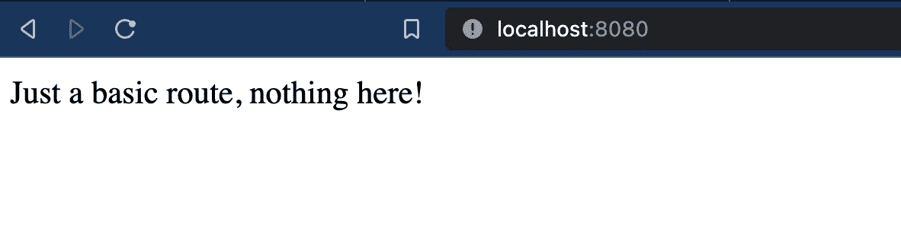

# 构建更小的 docker 图像——正确的方法

> 原文：<https://blog.devgenius.io/building-smaller-docker-images-the-right-way-1b6c12c112e1?source=collection_archive---------1----------------------->

Docker 图像很棒，它们很容易处理——但是如果你不注意正确构建它们，它们会被放大到很大的尺寸。

除了大小之外，这还会给生产 Kubernetes 集群带来严重的安全漏洞，因为您有一个从未使用过的包。

如果你有一个大的 python 应用程序 docker 镜像，需要优化和缩小，那么第 3 部分是必读书。


[图片来源](https://images.pexels.com/photos/225769/pexels-photo-225769.jpeg?auto=compress&cs=tinysrgb&dpr=2&h=750&w=1260) : *马库斯·斯皮斯克*

这篇文章将帮助你编写更小的 docker 映像，这将导致更有效和更安全的 docker 容器。

**扣好安全带！—我们将把 docker 图像的大小从 536MB 减少到 263MB，最终减少到 65.8 MB。**

我们在这里编写的应用程序是一个简单的 flask 应用程序，它运行在 python 上，具有这些[需求](https://github.com/sanjayBala/flask-docker-example/blob/master/requirements.txt)。

# 0.做好准备

假设您的计算机上安装了最新版本的 docker，请执行以下操作

您还可以构建并运行 docker 容器来测试应用程序

构建并运行样品瓶应用程序

当容器运行时，您应该会看到如下所示的简单页面。



# 1.码头工人——错误的方式

我们将使用一种简单的方法——Debian 映像。

甚至这个 dockerfile 也有好的一面， ***只有一个 RUN 命令*** ，通过链接所有你想运行的 shell 命令只需一层。

基于 Debian 的 Dockerfile 文件

这个 docker 文件没有任何问题，我们的应用程序运行良好，并且易于理解。虽然这个图像的大小是 500MB+，但当我们安装更多的 pip 包时，它肯定会呈指数级增长。

为了解决这个问题，我们可以选择一个替代的 docker 映像来构建，可能是一个基于 alpine 的映像，它具有最少的预安装包，因此使映像更小。

这让我们进入下一部分…

# 2.使用正确的图像

选择 python:3-alpine 映像(python 3 已经预装在这里，所以工作量更小)，让我们对 does 文件做一些小的修改，比如添加构建工具 g++等，因为 alpine 映像没有附带这些工具，然后进行实际的 pip 安装。

基于阿尔卑斯山的码头文件

这将图像大小减少到 263 MB，这很好，但是 alpine 图像一开始只有 45 MB。所以我们添加了大约 200MB 的包。

# 3.利用多阶段构建

更进一步，考虑一下我们的情况——我们需要的只是 pip 包，而不是 gcc/g++构建依赖。

幸运的是，有一种方法可以只使用我们需要的文件，并将它们放入另一个映像中——进入多阶段构建。

多阶段构建是一种在容器中构建应用程序包的好方法，然后只将文件/工件/二进制文件复制到最终的容器中，而不需要依赖关系——这有助于我们使我们的映像大小小很多！

基于阿尔卑斯山的多级码头文件

这个 docker 文件实质上制造了两个“容器”，

**第一个容器(别名 builder)** 第一个安装构建依赖项，但是这次我们将所有的 pip 需求安装到一个 python 虚拟环境目录`/opt/venv`。

**第二个也是最后一个容器** 第二个容器来自 alpine 映像，它只复制了`/opt/venv`目录，该目录包含我们的应用程序需要的所有 pip 包，没有任何其他构建时依赖项。

```
# this copies the virt-env folder from the first container into the second
COPY --from=builder /opt/venv /opt/venv ENV # this directs the final container to use the /opt/venv packages
PATH="/opt/venv/bin:${PATH}"
```

> 第二个容器是制作最终映像的容器，它被运送到 Docker 映像注册中心，没有二进制文件或构建工具——只有运行应用程序所需的最少内容。

***这种方法将图像大小缩减到惊人的 65MB，当我们从 500+ MB 开始时，这看起来像是一个巨大的飞跃。***

所有三个 docker 图像

# 总结

甚至在从源代码构建时也可以使用多阶段构建，并且不仅限于 python 虚拟环境。

只需遵循一些简单的做法:

*   选择正确的图像
*   只安装应用程序绝对需要的包
*   如果可能，使用多阶段构建
*   总是使用一个. dockerignore(这可以确保不需要的文件不会被复制到 docker 镜像中，就像 zips 例子一样)
*   总是尝试在 docker 文件中使用最少数量的 RUN 指令

# 资源

代码可以在这里查看: [Github 代码链接](https://github.com/sanjayBala/flask-docker-example)