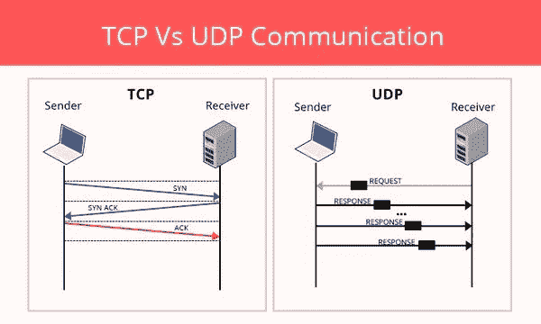
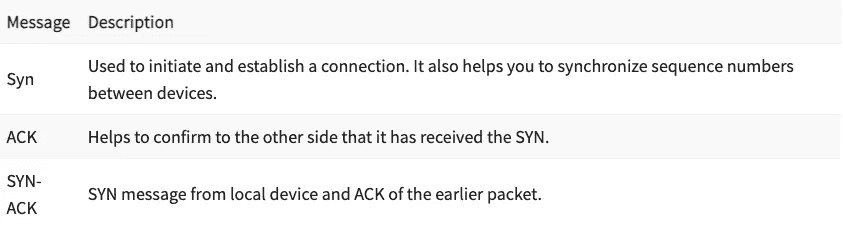
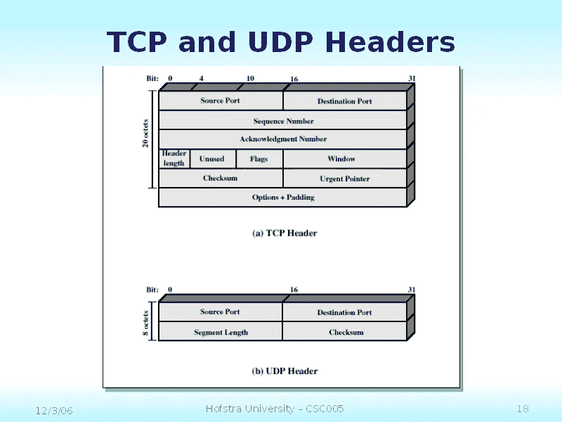

# 构建 TCP 和 UDP 客户端-服务器交互

> 原文：<https://blog.devgenius.io/building-tcp-and-udp-client-server-interactions-eb8228644da2?source=collection_archive---------9----------------------->

照片由[乔丹·哈里森](https://unsplash.com/@jordanharrison?utm_source=medium&utm_medium=referral)在 [Unsplash](https://unsplash.com?utm_source=medium&utm_medium=referral) 上拍摄

TCP 和 UDP 是通过 web 发送信息的两种最流行的事务协议。许多其他协议都建立在这些协议的基础上，如电子邮件的 SMTP 和文件的 FTP(两者都使用 TCP)，直到 [HTTP/3](https://www.stackscale.com/blog/http3/) ，HTTP 也是基于 TCP 的(现在它已经过渡到 UDP，增加了一层来帮助处理丢包)。

那么这两者有什么区别呢？主要的两个区别是 TCP 是面向连接的(而 UDP 是无连接的),并且 UDP 报头比 TCP 报头小。TCP 通常用于可靠性和数据完整性非常重要的情况(电子邮件、文件传输、视频点播、网页浏览)，而 UDP 则用于速度至上的情况，您可以忍受到处都有数据包丢失的情况(视频会议、直播、游戏)。

**无连接与面向连接**

这张照片很好地展示了服务器和客户端之间发生的事情。在面向连接的系统中，服务器和客户端发送这些 SYN、SYN-ACK 和 ACK 消息，以确保数据包被成功接收，如果这种模式被破坏(即其中一个没有被发送)，则数据包可以被重新发送。下面是每次需要发送数据包时发送的 TCP 消息类型。

另一方面，UDP 不做任何这种检查数据包是否被接收，它只是通过网络发送它们，如果一个数据包在途中丢失，那就太糟糕了。这意味着 UDP 比 TCP 快得多，但可能会导致数据包丢失(这是堡垒之夜延迟的主要原因)。

**割台尺寸**

由于 TCP 是面向连接的，它需要更多的信息来告诉客户端这个包在包序列中的位置，以及一些其他字段来帮助内容在客户端正确地形成。实际上，数据包有效负载本身使报头大小相形见绌，因此对速度没有明显的影响。有效负载最大可达 64KB，而 UDP 的报头为 8 字节，TCP 的报头为 20 字节。

# 编码

现在我们已经了解了 TCP 和 UDP 之间的结构和权衡，我们将为每种协议创建一些客户端-服务器交互的玩具示例。

## 用户数据报协议(User Datagram Protocol)

UDP 代码非常简单，很容易编写。

**服务器**

对于服务器，我们创建一个端口为 5000 的套接字(默认情况下，套接字在本地主机上，所以我们不需要在任何地方设置它)。

我们创建一个缓冲包，我们将使用它来读取传入的包。

我们持续运行服务器，接收、解析和打印发送到服务器的每条消息。

**客户端**

UDP 客户端非常简单，我们创建一个数据报套接字，并实例化一个地址，供以后发送包时使用。

接下来，我们创建消息并将其放入 DatagramPacket 中。我们将消息转换成 byte[]并将数据包的目的地设置为 localhost:5000。

最后，我们发送数据包并关闭客户端。

## 传输控制协议（Transmission Control Protocol）

TCP 设置的主要区别是我们使用流，而不仅仅是手动发送数据包，因为客户端和服务器之间有一个长期运行的连接。

**服务器**

我们在 localhost:5000 上创建一个服务器

我们启动服务器并接受任何想要连接的客户机套接字。

我们通过检查套接字 inputstream 来获取客户端套接字发送给我们的任何消息。

最后，我们将使用 socket outputstream 向我们连接的客户端写入一条消息。

**客户端**

这里我们创建一个客户端套接字，它连接到本地主机 5000 上的 TCP 服务器。

然后，我们向客户端输出流写入一条消息。

然后，我们可以使用客户机套接字的 inputstream 从服务器读取任何消息。

我们的玩具示例到此结束，我希望这已经让您对这两个协议是什么以及它们如何用于支持我们日常使用的技术有了一些了解！