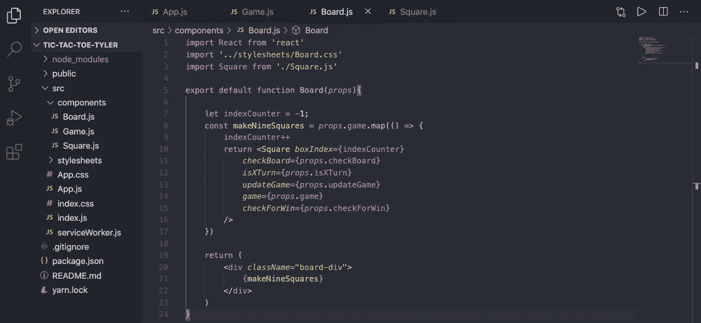
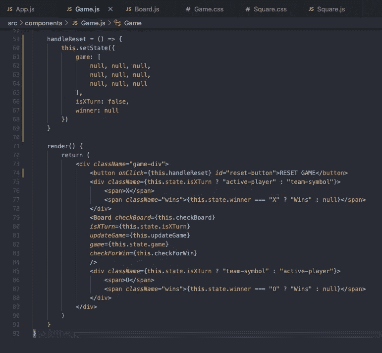

# 用 React、CSS 网格和 Flexbox 构建井字游戏

> 原文：<https://blog.devgenius.io/building-tic-tac-toe-with-react-css-grid-and-flexbox-c2bb259b7ad5?source=collection_archive---------2----------------------->


自从我在熨斗学校开始构建 web 应用程序以来，我一直对创建游戏和需要逻辑的谜题感兴趣。作为一名开发初学者，我需要创建超级简单的游戏，然后开始考虑设计稍微复杂一点的游戏以及幕后的逻辑。井字游戏是有史以来最简单、最经典的双人游戏之一，几乎可以在任何地方玩。

所以这就是我写这篇文章的原因，希望另一个初学者软件开发人员可以用 React 构建井字游戏，并将其作为未来理解更复杂的游戏/代码概念的垫脚石。

在这个演示中，我将使用 React 和 CSS grid 构建一个完整的井字游戏版本；我还将使用 flexbox 在页面上排列其他元素。

# 开始吧

首先，我在我的终端中创建了一个名为“井字游戏”的 React 应用程序，命令如下:

```
npx create-react-app tic-tac-toe-tyler
```

在我的文本编辑器中打开它后，我清除了一些不必要的样板代码，这些代码是我们初始设置时附带的，这是我们在应用程序文件中留下的内容:


现在真正的乐趣开始了！在我的“src”目录中，我创建了两个新目录，一个用于组件，一个用于样式表，并相应地命名。因为我知道井字游戏需要一个由 9 个方块组成的游戏板，所以我将创建一个名为 game、board 和 Square 的组件，并将它们添加到我的新组件目录中。我还为游戏、棋盘和方块组件创建了相应的 CSS 文件，并将它们都放在新的样式表目录中。

下面是我们的文件树和应用程序组件在导入游戏组件后的样子:


现在，我们已经建立了一些游戏逻辑，并向组件中添加了一些元素，让我们从 Square 组件开始，然后返回到我们刚刚导入到 App 组件中的游戏组件。

# 方形部件

这个组件不需要保持任何状态，它只需要能够处理点击，这将使用 X 或 o 填充正方形。它还将通过调用通过 props 传递的函数来改变我们的游戏状态(这将在父组件中)以反映该玩家的回合，但我们将在稍后进行讨论。

这是功能性方形组件的初始设置:


由于每个方块在被点击时都需要做一些事情，我们将向我们的

添加一个 onClick prop，当它被点击时，我们希望调用一个我们将定义为 handleClick 的函数。

在 handleClick 中，我们将从稍后定义的 props 中调用一个函数，该函数根据轮到谁来改变方块内的文本，并改变游戏状态，以便我们可以检查赢家。它还检查以确保单击的方块尚未被选中:


我们来分解一下我们做的这个 handleClick 函数。

如果您从未见过 async/await 语法，我在这里做的是使它成为一个异步函数。也就是说，当我们使用 await 关键字时，该函数不会继续执行，直到“await”之后的操作完成。在这种情况下，我们需要更新游戏状态，然后才能检查玩家是否赢了，因此我把它设为异步。

现在，回到逻辑上来。第一个 if 语句将使用特定的索引检查一个名为 checkBoard 的道具，以查看该方块是否已被使用(如果空格返回 null，则该空格尚未被使用)。

如果 checkBoard 返回 false，我们将对一个名为 isXTurn 的属性进行检查，该属性将成为记录轮到谁的状态，X 或 o。

根据 isXTurn prop 返回的内容，我们将从 props 中调用一个名为 updateGame 的函数，并向它传递两个参数，即被单击的盒子的索引和正方形将被填充的字母。

updateGame 函数将会更新游戏，这最终会改变我们的

中的文本。在我们使用下一个函数调用 checkForWin 之前，我们需要“等待”游戏状态被更新，check for win 将检查玩家是否有获胜的组合。

# 电路板组件

董事会将举行我们所有的广场，最终将使用 CSS 网格安排成 3 行 3 列。此外，这将是一个功能组件，我们将把所有的状态放在游戏组件，并将其传递给董事会。



打破我们的常数 makeNineSquares，(再一次，大惊喜来了)它将使 9 个广场；当我们到达游戏组件时，我将把每个项目放入游戏状态。

indexCounter 变量给每个方块一个唯一的索引。我从-1 开始，因为我需要在返回每个方块之前递增它，并且我希望第一个方块的 boxIndex 为 0。

传递到每个方块的其他 4 个道具来自游戏容器，我们将在其中保存状态。通过回顾我在正方形组件中使用的所有道具，我知道我需要传递什么样的道具。

# 游戏组件

这个组件将是我们的有状态组件，我将保存我们所有的游戏信息；例如，玩家在他们的回合中选择了哪些盒子，轮到谁了，以及是否有人赢了。

首先，我们知道需要导入 Board 组件，并向它传递我们在 Board 组件中要求的 4 个必要道具:


isXTurn 和游戏道具将需要来自 state，checkBoard 和 updateGame 道具将是检查和修改游戏状态的辅助函数。所以让我们开始努力吧。我还将添加一个名为“胜利者”的状态，一旦有人获胜，我们可以用一个函数来改变它(我将把它添加到 props 中):


现在我们已经设置好了状态，并添加了 checkForWin 属性，这样我们就有 3 个函数要写了； **checkBoard** ， **updateGame** ， **checkForWin** 。checkForWin 将在每一轮之后查看是否创建了任何获胜模式，并更新获胜者状态(我们还将祝贺获胜者，并添加一个重置按钮)。


**棋盘**功能

checkBoard 函数将正方形的索引作为参数。在 if 语句中，索引用于检查游戏状态中特定方块的状态。如果状态没有返回 X 或 O，那么 checkBoard 将返回一个布尔值 false，这意味着方块可以玩了。但是，如果它返回 null，checkBoard 将返回 true，这告诉 handleClick 函数不允许在游戏状态中更改该方块。


**更新游戏**功能

updateGame 函数接受一个数字(正方形的索引)和一个字符串(“X”或“O”)作为参数。在制作了游戏状态的副本，并更改了新的游戏状态以反映新的移动之后，我们更新了游戏状态，并且还将 isXTurn 状态翻转到相反的布尔值，以表示改变到其他玩家回合。


**检查**功能

这个 checkForWin 函数就是井字游戏的神奇之处。可变中奖组合是每一种可能的中奖组合。下面的图表有助于形象化:


接下来是 for 循环，它遍历每一个获胜的组合。然后，我们还遍历组合中的每个数字，并创建一个数组(checkCombo ),包含在该组合的方块中找到的所有值。

一旦 checkCombo 包含所有 3 个值，if 语句就会检查 checkCombo 中的每个“条目”是 X 还是都是 O。如果是这样，有人赢了，内部的 If 语句决定了赢的玩家是 X 还是 O。

这样，我们的游戏逻辑就完成了！

现在，不运行应用程序并进行测试/调试就完成所有这些是不现实的。所以一定要在你编码的时候运行你的应用程序，这样你就能看到什么有效，什么无效。我只是想把它放在这里，因为到目前为止我只展示了文本编辑器和图表。我使用 React 组件工具，并观察我的道具，以确保它们在我需要时也发生变化。

# 是时候设计风格和添加功能了

为了让我们离开地面，我在 Square 组件中添加了一些 CSS。我更改了颜色、大小和边框，然后将文本框中的文本居中，并放大了字体大小。我还为 App 组件的主体添加了灰色背景。这是我目前得到的信息:


也就是说:


还不太像井字游戏

显而易见的下一步是将这些方块放入网格中。我们可以用 flexbox 来做，但是我个人认为用 CSS ***grid*** 来做一个网格是最有意义的。为了创建网格，我们需要处理位于 Board 组件中的容器元素:


对于那些以前没有使用过网格的人来说，通过将 display 设置为 grid，然后指定你想要的每一列和每一行的宽度，我们有效地在网格的每个区域放置了 9 个正方形。在这种情况下，我把它们做得比正方形本身稍大一点，以便把它们分开:


这还差不多，差不多了

接下来，让我们通过在游戏组件内弯曲其父容器，将棋盘置于页面中央:


在顶部添加了 20px 的边距后，我们有了一个居中的、有效的井字游戏板:


这看起来不错，但是除了通过观察，目前没有办法知道轮到谁了，或者谁赢了，我们还需要一种方法来将游戏重置回初始状态。让我们添加一些最终功能，玩一些经典的井字游戏。

首先，我们应该添加一种方法来判断该轮到谁了。我将在左侧添加一个 O，在右侧添加一个 X，根据 isXTurn 状态，我将用边框突出显示这两个中的一个。

我的游戏组件中的渲染方法现在看起来像这样:


我在棋盘的上方和下方添加了一个

,并根据三元条件为每个棋盘指定了类名，以便根据轮到 X 还是 O 来来回回地切换样式。

这就是我的意思(边框从 X 到 O 来回):


下面是我添加到游戏元素中的 CSS，使它看起来像这样:


接下来，让我们来提醒玩家，当有人做出一个胜利的组合。我们已经有了获胜者状态，所以当 X 或 O 获胜时，我们将在相应的一方下面放置一条消息。


在这里，我在棋盘两边的每个

上添加了 2 个元素。一个保存 X 或 O，另一个要么什么都不保存，要么保存一个表示“Wins”的字符串。我再次使用了三元条件，除了不是为了类名/样式的目的而使用它，而是用它来确定某些文本是否可见。

这就是我想要的结果:


这是我为游戏组件更改/添加的 CSS，以获得上述结果:


最后，我希望有一个按钮，重置游戏。我将把它添加到游戏组件中，并把它放在左上角:



你可以看到我在封装的

顶部添加了一个按钮，单击它会调用上面的一个函数，名为 handleReset。handleReset 所做的只是将每个状态恢复到初始设置，有效地重启游戏。

这是(目前已经完成的)带有新安装的“重置游戏”按钮的应用程序:


然后我应用的最后一个 CSS:


我不喜欢单击按钮后出现的紫色框，所以我将焦点的轮廓改为 none，其余的属性我认为是不言自明的。

这就结束了用 React 和 CSS 构建井字游戏的演示——结合了 grid 和 flexbox。

这是实际游戏的 GIF 图:

很有可能是 O 的第三招，我知道

如果你不知何故做到了这一步，我希望我的写作风格足够容易让你跟上，我真诚地希望它能帮助你了解更多关于 React、CSS grid 或 flexbox，或者构建简单游戏的知识。如果你感兴趣，我已经在这里链接了 Github 回购[。感谢您的阅读，继续努力吧！](https://github.com/tfunk2/tic-tac-toe-tyler)