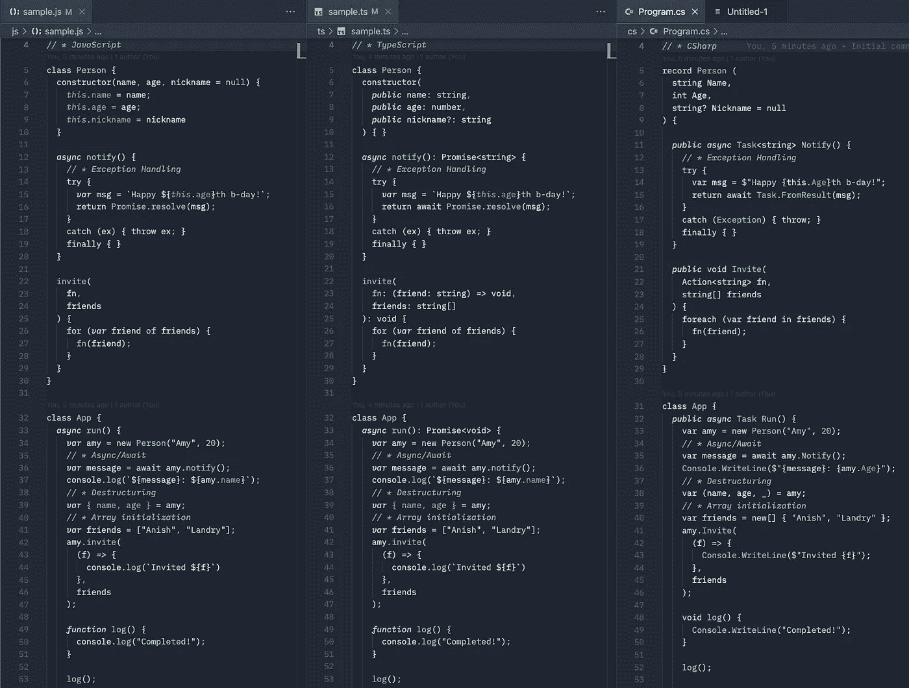
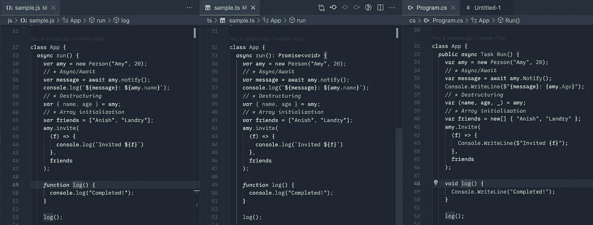
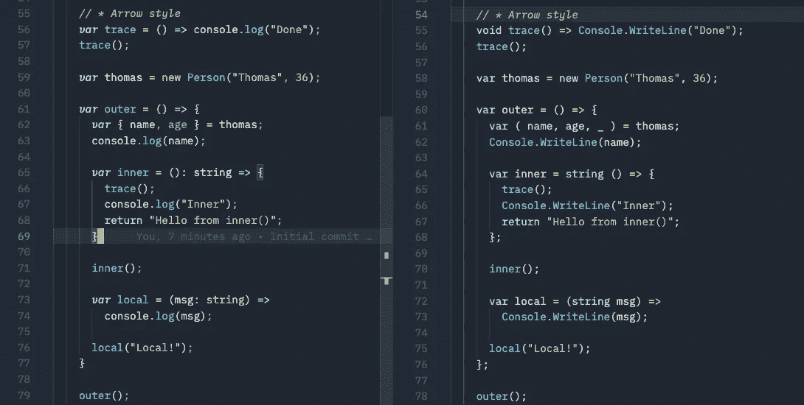
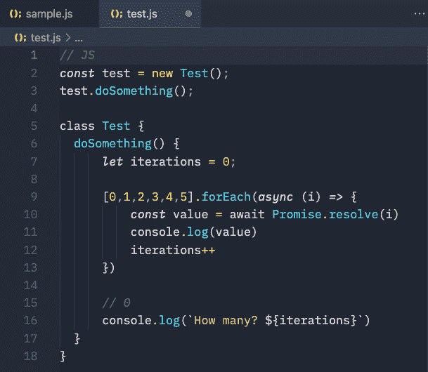
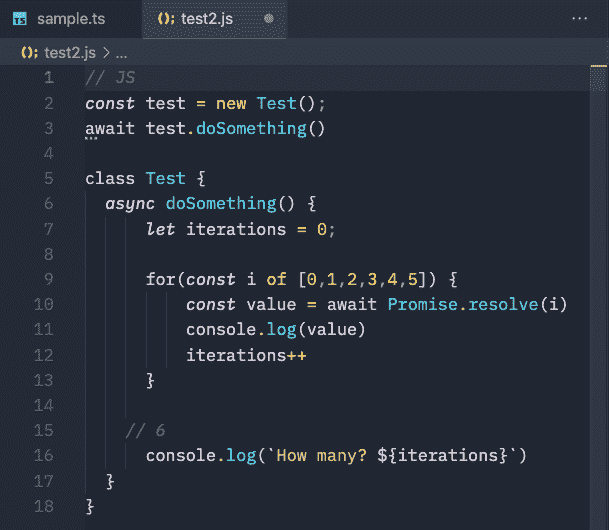
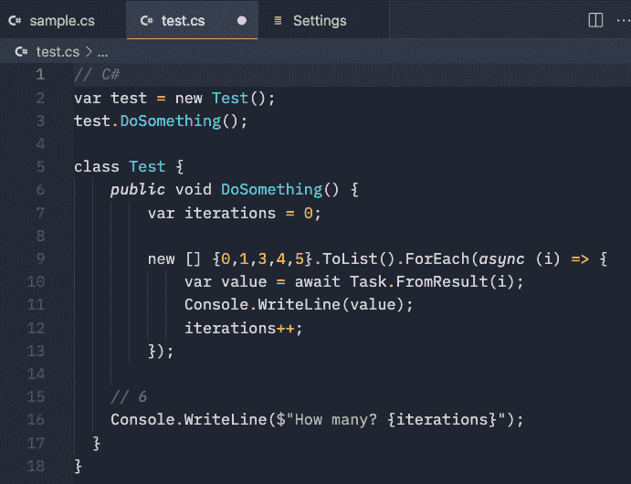

# 从 JavaScript 到 TypeScript 再到 C# 10。网络 6

> 原文：<https://blog.devgenius.io/building-up-from-javascript-to-typescript-to-c-10-and-net-6-669a70cd0a66?source=collection_archive---------4----------------------->


在过去的一年里，我一直在节点后端使用 JavaScript 和 TypeScript，在这个项目中，总有一个时候我会想“用 C#和。净 6”。当被提议加入不同的团队时，我得到的回应是*有趣的*。

# 有一个……*误会*

最大的挑战是许多新进的工程师——坦率地说，甚至是那些可能研究过 C#和。甚至在 5、6 年前，我对 C#和。NET 是今天。(坦白地说，微软历史上并没有在身份方面做得很好。净用”。NET 框架“，”。NET 标准“，”。网芯”，而现在只是”。网”。)

当然，还有 [**几个关于 C#和的“神话”。网名不再是真的**](/6-net-myths-dispelled-celebrating-21-years-of-net-652795c2ea27) 而是真的*。NET 框架*已经让位于*。网芯*现在简称*。网 6* 。然而，许多平台误解仍然存在，没有接触过 C#的工程师和团队根本没有意识到 TypeScript 和 C#之间的提升是多么微不足道。

当与另一位开发人员讨论在一个项目中考虑使用 C#而不是 TypeScript 的可能性时，他说他一直认为 C#更像 C/C++，当仔细观察 C#时，他惊讶地发现它与 TypeScript 如此相似。

其他人表示担心从 JavaScript 到 C#的提升太高，对于团队中现有的开发人员来说不可行，但在遭受了在服务器上大规模使用 JavaScript 的挑战后，他们完全同意使用 TypeScript。有种感觉，学习和采用 TypeScript 是可行的，但是学习 C#却不知何故*不可行*。事实是，事实上，对于 JavaScript 和 TypeScript 开发人员来说，C#可能是 Go、Rust 和 Java 中最容易采用的。

我个人认为，对于大多数 JavaScript 开发人员来说，从 JavaScript 到 TypeScript 的提升要比从 TypeScript 到 C#的提升重要得多，以至于选择用 TypeScript 开始一个全新后端项目的团队也应该评估 C#。

# 当你只有一把锤子…

俗话说，当你只有一把锤子时，每个问题看起来都像钉子。

在过去的十年里，随着对软件开发人员需求的增长，用单一的编程语言来培训开发人员并把他们任命为“全栈”工程师变得更加经济和有效。这种语言就是 JavaScript。但现实是，使用现代 JavaScript，尤其是在服务器上，有许多缺点和挑战(如果我激起了你的兴趣， [**我已经就这个主题写了更多的文章**](https://chrlschn.medium.com/the-case-for-c-and-net-72ee933da304) )。然而，许多年轻的开发人员没有准备好真正考虑其他选择，因为 Node 已经成为开发人员熟悉的第一个并且通常是唯一的运行时环境。

[**即使是 Node 的创始人 Ryan Dahl 也在 2012 年写了关于 Node**](https://news.ycombinator.com/item?id=4310723) 的文章(推而广之，JavaScript):

> **我希望给电脑编程就像用蜡笔上色，玩 duplo 积木。如果我的工作是维护 Twitter，我当然会使用像 JVM 这样健壮的技术。**
> 
> Node 的问题是它的一些用户想用它做任何事情？那又怎样？我对教育人们成为全面务实的服务器工程师不感兴趣，那是 Tim O'Reilly 的工作(或者可能是你的工作？).

事实上，达尔后来解释了他对 Node 的许多遗憾:

瑞安·达尔谈到他对 Node 的遗憾

并继续创建 [**Deno**](https://deno.land/) 来解决这些差距。值得注意的是，Deno 是基于 TypeScript 而不是 JavaScript 构建的。它还关注安全性和改进的依赖性管理；我们都知道使用`node_modules`和担心(或更可能忽略)最新一批构建漏洞警告的痛苦。我最喜欢的是来自 [***二郎电影 II:续集***](https://youtu.be/rRbY3TMUcgQ?t=236) :

杰作。

> 我喜欢 Node.js，因为正如我的英雄 Ryan Dahl 所说，这就像用蜡笔着色和玩 Duplo 积木，但事实证明，这不像是玩 Duplo 积木，更像是玩 Slinkies。缠在一起不可能分开的细线。

🤣

# Duplo，Lego 和 Technic

我 ***喜欢*** 达尔把 Node 和 JavaScript 比作 Duplo，因为它在很多层面上都有效。对于不熟悉的人来说，Duplo 是一个由乐高制作的矮胖积木玩具，旨在为缺乏灵巧性和精细运动技能的年轻建造者提供易于操作的玩具；它们更容易扣在一起，也更容易拆开。Duplo 通常是年轻建造者对乐高的第一次介绍:


乐高得宝建筑套装

使用 Node 和 NPM *是*通常就像将块放入适当的位置，而使用 **JavaScript** 和 Node，这些块被设计为易于处理，而不是能够构建复杂的结构。这并不是说一个人*不能*用 JavaScript 和 Node 构建完整而复杂的应用程序，而是说这样做需要妥协，因为该工具有根本性的限制和挑战。

当然，总有一天，每一个年轻的建造者都准备转向普通的乐高积木。


乐高积木套装

作品更小，更多样，更细致，需要更灵巧的操作；随着件数的增加，器械包本身也变得更加复杂。有更多的机制将这些部分连接起来。但是用乐高比用得宝更容易建造更复杂的结构。同样，在每个团队中都会有这样的时候，为了支持正在构建的结构的复杂性或者团队的规模，类型脚本**成为了一种必需。**

用乐高建造和设计难以置信的复杂结构是可能的，但乐高生产另一层积木，称为乐高技术和乐高建筑，进一步扩展了创造性的可能性和可以建造的结构的复杂性。


乐高技术建筑套装。

甚至有更多不同的部件，更专业的部件，机动化单元，等等，允许建造精细和复杂的结构。虽然有可能用 Duplo 或 Lego 建造同样的货运场景，但不可否认的是，技术版本中存在丰富性；创意渠道有更高的上限。正是因为这个原因，寻求构建高性能系统的团队应该评估。NET 和 C#。

虽然技术为可以建造的东西提供了更高的上限，但人们可以认为这是以复杂性为代价的。然而，它显然仍然是不可否认的像乐高一样，很容易看到从 Duplo 到 Lego 再到 Technic 的发展，而 Plus-Plus 积木显然采用了不同的范式(有趣的事实:Lego、Plus-Plus、TypeScript 和 C#都是由丹麦人🇩🇰创造的！)。


Plus-Plus 积木，这是我几年前在去丹麦哥本哈根的旅途中第一次遇到的。(也许更类似于 Scheme？)

同样，从 JavaScript 到 TypeScript 再到 C#也有一个清晰的发展过程。对于准备升级到 TypeScript 的开发人员来说，C#和。NET 真的没有那么远，因为这些语言——JavaScript、TypeScript 和 c#——共享一个共同的血统，并且敏锐的开发人员会注意到它们已经*收敛*了。NET 2.0。

# 事情变得越多…

我使用 JavaScript 已经将近 24 年了，使用 C#也有 19 年了，让我感兴趣的是它们是如何随着时间的推移而融合的。我第一次真正注意到它是在 C# 3.0 和`var`的引入。该版本还以类似于 JavaScript 的风格引入了对象和集合初始化器。

自从 C# 3.0 在 2007 年发布以来，这种语言总体上趋向于更多的类型推断和更少的显式类型。虽然明显不同于 JavaScript 的完全动态类型系统，但有一个*语法一致性*。

(我已经发布了一个小样本库，突出了其中的一些一致性:)

[](https://github.com/CharlieDigital/js-ts-csharp) [## GitHub-Charlie digital/js-ts-cs harp:一个展示 C# 10 函数技术的资源库…

### 这是一个展示 C# 10 的函数式技术以及 JavaScript、TypeScript 和…

github.com](https://github.com/CharlieDigital/js-ts-csharp) 

这个列表展示了 JavaScript、TypeScript 和 C#在语法上有多么相似，以及每种语言中的基本构件有多么相似。他们之间有非常明确的血统；点击放大，自己判断。注意，我使用了 C#记录类型，但是也可以使用类声明。

C#甚至支持使用`dynamic`类型(又名`ExpandoObject`)的 [**动态**](https://docs.microsoft.com/en-us/dotnet/csharp/programming-guide/types/using-type-dynamic) 类型(相当于`var x = {}`),因此可以使用一些动态技术。[**我最近用它**](https://github.com/CharlieDigital/dotnet6-jint-rules-engine/blob/main/api/Controllers/ScriptController.cs#L41) 和 Jint 库一起构建了一个简单的 JavaScript 驱动的规则引擎。网。它甚至可以用来实现 [**双分派风格的访问者模式**](https://charliedigital.com/2009/05/28/visitor-pattern-in-c-4-0/) 。

很少有人知道 [**C# 3.0 在 2007 年**](https://en.wikipedia.org/wiki/C_Sharp_3.0) 引入了箭头函数和 LINQ 表达式——比 [**早 8 年的 JavaScript 将在 2015 年** **用 ES6**](https://en.wikipedia.org/wiki/ECMAScript#6th_Edition_%E2%80%93_ECMAScript_2015) 引入箭头函数和 lambda 表达式。

像 JavaScript 一样，函数是 C#中通过`Func`和`Action`类型*(见图片右侧第 22 行)*的第一类对象。因此，您可以传递、返回和调用函数引用，就像在 JavaScript 或 TypeScript 中一样*(见右边第 42 行)*。

你还可以注意到，C#的`async/await`(2012 年随 C# 5.0 发布)与 JavaScript 的( [**随 ES2017**](https://en.wikipedia.org/wiki/ECMAScript#ES2017) 发布)基本相同，除了`Task`与`Promise`。

C#的`try-catch-finally`异常处理几乎与 JavaScript 相同，但它更复杂一些，因为您可以使用多个`catch()`块来捕捉和处理特定类型的异常，而 JavaScript 只能使用一个`catch()`块，然后检查错误的类型。

C#的 [**解构**](https://docs.microsoft.com/en-us/dotnet/csharp/fundamentals/functional/deconstruct) *(见上图右侧第 38 行)*[**抛弃**](https://docs.microsoft.com/en-us/dotnet/csharp/fundamentals/functional/discards) 与 JavaScript 的非常相似。

C#甚至有 [**局部函数**](https://docs.microsoft.com/en-us/dotnet/csharp/programming-guide/classes-and-structs/local-functions) (在很大程度上全等风格；*参见*下方右侧的第 48–56 行:



C#中的局部函数就像 JavaScript 中的函数闭包一样工作，可以使用函数样式或箭头样式。

下面的清单实际上是 C#(右)和左边的等价类型:



C#本地函数(从 7.0 版本开始)与 JavaScript 箭头函数完全相同——闭包和所有的东西。然而，C#没有 JavaScript 在引用这个方面的问题，我认为这使得 C#更容易使用，甚至使用函数技术。许多 C#纯粹主义者可能会觉得这种风格令人不快，但它只是为组织逻辑提供了更多的选择。

应该注意的是，C# lambda 闭包的行为不同于 JavaScript 闭包。

这个:



请注意，这会打印出意外的输出。

不是这样的:



Google TypeScript 风格指南推荐迭代模式(见下文)

其表现如下:



注意在 C#中，lambda 闭包看起来像使用 Array.prototype.forEach 的第一个版本，但行为像使用 for-of 的第二个版本。

( [**Google 的 TypeScript 样式指南**](https://google.github.io/styleguide/tsguide.html#iterating-containers) 实际上是不鼓励使用`Array.prototype.forEach`而鼓励使用`for-of`进行迭代)

C#闭包没有 JavaScript 的`this`问题，在我看来这使得使用 C#更加容易，因为你永远不必担心`this`的使用和正确绑定`this`的复杂管理。

这三种语言如此相似，以至于当团队考虑在后端使用 TypeScript(***尤其是 Nest.js*** )时，我建议至少看一看。NET 6 Web APIs，因为对于大多数 JavaScript 开发人员来说，使用 Nest.js 这样的高级概念几乎相当于使用 C#和。NET 没有所有的性能、运行时和语言优势。队伍切换到。NET 可以省去很多令人头疼的问题，比如软件包变动、不断的安全补丁和痛苦的管理。

最终，我看到 JavaScript、TypeScript 和 C#正在发生的事情是，这三种语言正在融合。JavaScript 正处于 [**实现装饰器**](https://github.com/tc39/proposal-decorators) 的后期阶段，就像 C#属性一样(尽管与通过反射消费的 C#属性有一些细微的差别)。C#最近收到了模式匹配 ，我想我们将来会在 JavaScript 中看到。当然，TypeScript 在 JavaScript 的`class`结构(如 C#)之上添加了强大的编译时检查、泛型和高级结构代码模式(接口、抽象类、静态、私有成员)。 [**C#在不久的将来很可能会得到类似于 TypeScript 的类型联合的有区别的联合类型**](https://github.com/dotnet/csharplang/blob/main/proposals/discriminated-unions.md) ，特别是因为 C#的姐妹语言 [**F#已经有了它**](https://docs.microsoft.com/en-us/dotnet/fsharp/language-reference/discriminated-unions) 。C#的语言集成查询(LINQ)库使得使用比 JavaScript 数组更丰富的集合成为可能。 [**JavaScript 的**](https://developer.mozilla.org/en-US/docs/Web/JavaScript/Reference/Operators/yield) `[**yield**](https://developer.mozilla.org/en-US/docs/Web/JavaScript/Reference/Operators/yield)`和 C#的[](https://docs.microsoft.com/en-us/dotnet/csharp/language-reference/keywords/yield)**`[**yield**](https://docs.microsoft.com/en-us/dotnet/csharp/language-reference/keywords/yield)`的作用是一样的。**

**当然，在 JavaScript 中加入选择输入的强大推动力[。](https://devblogs.microsoft.com/typescript/a-proposal-for-type-syntax-in-javascript/)**

**我的朋友阿拉什·鲁哈尼说:**

> **公平地说。NET 和 C#之所以现在很好，是因为他们在自己已经拥有的好东西的基础上，从其他语言中借鉴了好的概念**

**的确，近年来，C#和。与 Java 甚至 JavaScript 相比，NET 团队发展语言的速度非常快。 [**见鬼，节点*正好*得了原生**](https://news.ycombinator.com/item?id=30161626) `[**fetch**](https://news.ycombinator.com/item?id=30161626)`。**

**。NET 的 CLI 工具现在也非常类似于节点生态系统，并且基本一致:**

```
dotnet new webapi
dotnet add package serilog  # Equiv of npm install winston
dotnet build                # Equiv of npm run build <-- build script
dotnet run                  # Equiv of npm run start <-- run script
dotnet watch                # Equiv of running with watch
dotnet test                 # Equiv of npm run test <-- test script
```

**已经有许多来自于 20 世纪 90 年代的“老古董”的老人对着云大喊大叫。NET 社区关于 C#和. NET 的不断进化 [**我自己也为之愧疚**](https://charliedigital.com/2018/08/16/stop-using-var-c/) 。但是 C#的每一次迭代都加深了我对这种语言和平台的喜爱，尤其是当我发现自己在与 Node、NPM 和 JS/TS 的局限性作斗争的时候。**

# **做电梯**

**正如 Dahl 所暗示的，对于工程师和技术领导者来说，为手头的任务选择正确的工具是非常重要的。Node 上的 JavaScript 和 TypeScript 是用于快速构建应用程序的极好的工具。像 Duplo 一样，这些模块很容易操作，特别是对于没有经验的构建者，对于新开发人员来说，能够用一种语言编写完整的堆栈当然是一个优势。**

**对于规模性能、平台安全性和稳定性、操作可管理性以及整体可扩展性，C#和。NET 与 JavaScript 和 TypeScript 的紧密联系为构建更复杂的系统提供了一条清晰的道路。C#与 TypeScript 的一致性意味着从 TypeScript 到 C#的提升并不像有些人想的那么麻烦；从 C# — [**开始很容易，尤其是使用最少的 API**](https://docs.microsoft.com/en-us/aspnet/core/fundamentals/minimal-apis?view=aspnetcore-6.0)**——为你的团队*提供更高的上限*。您不必使用 C#和的所有高级功能来构建。但是你可以根据需要灵活地增加更多的性能(例如 [**任务并行库**](https://docs.microsoft.com/en-us/dotnet/standard/parallel-programming/task-parallel-library-tpl) )和复杂性。****

****在以后的文章中，我想强调 C#和。NET，这使得团队有必要考虑这个平台；不仅仅是原始的性能和安全性，还有开发人员的工作效率。****

****从*开始，这是一个漫长的 20 年的旅程。NET 框架*到 C# 10 和*。NET 6* 以及始于。NET Core 现在已经完全实现了。对于那些在 Node 上感受到 JavaScript 和 TypeScript 成长之痛的团队来说，现在是评估 C#和。网！****

*****如果你想得到我即将发表的文章的通知，点击 Follow，这篇文章强调了 C#和。后端净。*****