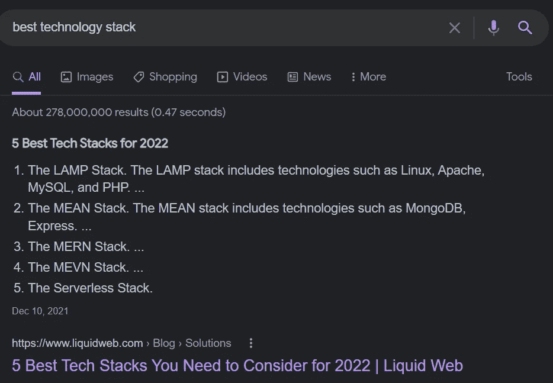

# 使用 NodeJS 构建 Web 服务—第 0 部分(简介)

> 原文：<https://blog.devgenius.io/building-web-service-with-nodejs-part-0-introduction-1859ee0c745b?source=collection_archive---------10----------------------->

NodeJS

我想分享一个关于如何用 NodeJS 构建 web 服务的教程。这是教程的最开始，一个介绍。如果你想直接进入编码部分，你可以跳到 [**第一部分**](https://bitsizelearning.medium.com/building-web-service-with-nodejs-part-1-setup-55a522efaead) 。

## 现在，什么是网络服务？

在各种书籍和不同组织中有大量关于 web 服务的定义。我们来看看 IBM 的一个定义。

> web 服务是一种软件系统，它支持网络上可互操作的机器对机器的交互。它有一个以机器可处理的格式描述的接口(特别是 web 服务定义语言，或 WSDL)。

听起来很复杂。我们来分解一下。基本上，web 服务是一个软件，它:

*   具有互操作性—不依赖于特定的平台或操作系统
*   是为机器到其他机器(或应用程序到其他应用程序)而设计的
*   通过计算机网络(即:*互联网*或*内联网*)提供信息或进行交流

## 这个教程是关于什么的？

我们将使用 NodeJS 构建一个简单而有用的 web 服务。对于技术栈，我们将使用 MERN 栈，它代表 **MongoDB** 、 **Express** 、 **React** 和 **NodeJS** 。目前，本教程特别关注 web 服务(后端)。我可能会在未来制作前端 web 应用程序(React)的教程，但现在它只是后端。对于编程语言，我们将使用 **javascript** 。

我们将使用 RESTful APIs 创建一个 web 服务。它基本上是一个实现 CRUD(创建、读取、更新、删除)操作的简单应用程序。我们可以用 CRUD 概念 alone⁴.建造几乎任何东西

> 想象一下 **Instagram** 。我们和 Instagram 的大部分互动基本都是 CRUD 操作。我们**创造**岗位；**阅读**(查看)我们时间线中的帖子；**更新**帖子的描述或标签；**删除**尴尬的帖子。

在这个案例研究中，我们将创建一个冰淇淋店 web 服务。您可以通过 API 添加和显示菜单。您还可以创建冰淇淋订单。可以把它想象成一个简单的 POS(销售点)应用程序。

## 为什么是 NodeJS？

当我写这个故事时，现在是 2022 年 2 月 28 日。如果你继续搜索 2022 年的“最佳技术栈”,你可能会得到以下结果。

第一个结果当然不是 NodeJS，它实际上是 LAMP (Linux、Apache、MySQL、PHP)堆栈，早在 21 世纪就被许多 web 应用程序使用，其中许多应用程序至今仍在维护，所以难怪它仍然是第一名。有趣的是，排名第二、第三和第四的书库分别是 MEAN、MERN 和 MEVN。他们三个非常相似，因为他们都有 **MongoDB** 、 **Express** 和 **NodeJS** 。您可以交叉查看其他网站或博客，他们可能也会给出类似的结果。

MERN 和 MEVN 非常受欢迎，因为我们可以用一种语言(javascript)来编写后端(Express)和前端(AngularJS、ReactJS 或 VueJS)应用程序。Javascript 本身是一种相当简单的语言。我们真的不需要写很多代码来开发一个功能齐全的 web 应用程序。

> 编写更少的代码意味着开发应用程序的时间更少。更少的开发时间意味着构建应用程序的成本更低。

从技术角度来看，NodeJS 比其他编程语言或技术堆栈所能提供的性能更好。它是**轻质**和**快速**。NodeJS 采用 Google 开发的 V8 javascript 引擎，即**非阻塞**和**单线程**。它也易于维护，并提供了很好的可扩展性。

## 本教程的目标受众是谁？

本教程是专门为不知道从哪里开始构建 web 应用程序的新手编写的。如果你在大学里学习计算机科学，或者你只是想学习软件开发，你是一个很好的人选。

我会尽我所能在 NodeJS 上分享我的知识、经验和最佳实践。然而，问题是，我希望您对基本编程有所了解。即使您没有基本的编程，您仍然可以遵循本教程，但我不会深入介绍基本的编程技能或 javascript 语法。

我们直接进入**第 1 部分**。 [**点击此处**](https://bitsizelearning.medium.com/building-web-service-with-nodejs-part-1-setup-55a522efaead) ！

谢谢你，希望你喜欢阅读它。是否有任何我没有正确解释的错误或部分？有什么我应该改进的吗？

如果你愿意的话，给作者留个便条，拍几下，帮助频道发展。:)

## 参考

[1]:IBM(2019 年 6 月)。什么是 web 服务？。[https://www.ibm.com/docs/en/cics-ts/5.1?topic = services-what-is-web-service](https://www.ibm.com/docs/en/cics-ts/5.1?topic=services-what-is-web-service)
【2】:蒙盖(2020 年 8 月)。为什么 Node.js 在开发者中广受欢迎？。[https://fireart . studio/blog/why-node-js-is-still-a-good-choice-for-your-startup-in-2020/](https://fireart.studio/blog/why-node-js-is-still-a-good-choice-for-your-startup-in-2020/)
【3】:红帽(2020 年 5 月)。什么是 REST API？。https://www.redhat.com/en/topics/api/what-is-a-rest-api
【4】:斯特普诺夫(2022 年 2 月)。什么是 CRUD？CRUD 操作说明。[https://flatlogic.com/blog/crud-app](https://flatlogic.com/blog/crud-app/)