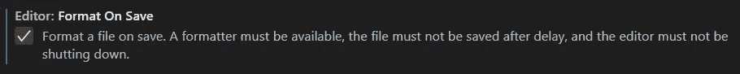
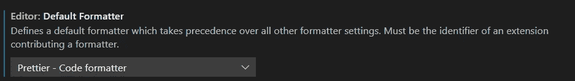
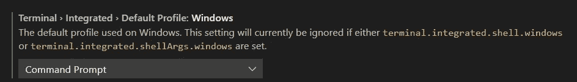
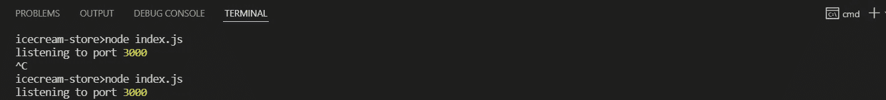
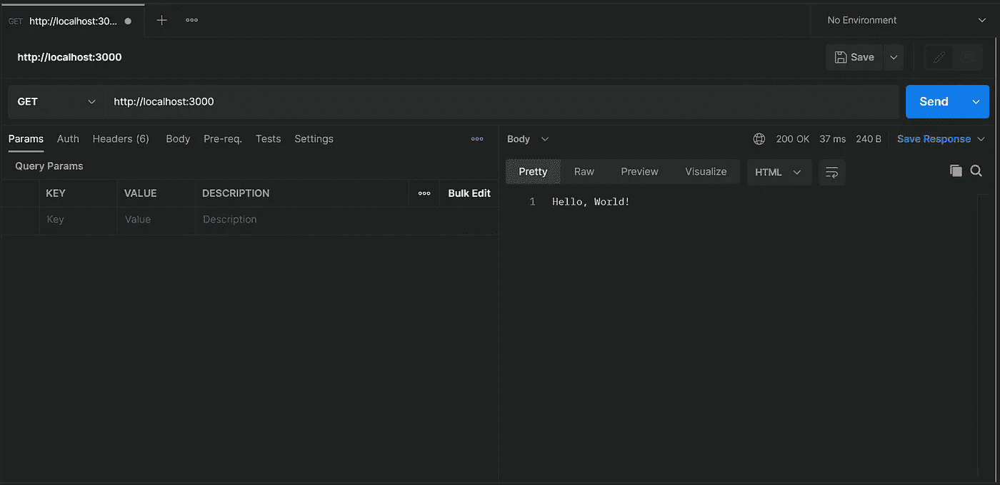
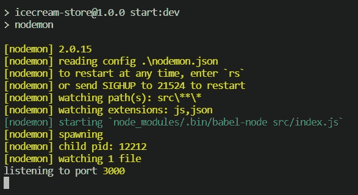

# 使用 NodeJS 构建 Web 服务—第 1 部分(设置)

> 原文：<https://blog.devgenius.io/building-web-service-with-nodejs-part-1-setup-55a522efaead?source=collection_archive---------5----------------------->


NodeJS

在本教程中，我们将编写并运行我们的第一个简单的 web 服务。这将是一个简单的 CRUD 应用程序来创建菜单，并在商店订购冰淇淋。本教程更详细的解释可以在[上一部分](https://bitsizelearning.medium.com/building-web-service-with-nodejs-part-0-introduction-1859ee0c745b)中找到。

这部分的完整代码可以在[这里](https://github.com/bitsizelearning/icecream-store/tree/part1)找到。

# 我们开始吧！

您需要事先下载并安装一些工具。在为本教程编写代码时，我也将使用这些工具。

## NodeJS

要安装 NodeJS，请进入 [NodeJS 官方页面](https://nodejs.org/en/)，在下载部分下载 NodeJS 的稳定版本。如果你正在使用，我将使用 NodeJS 版本 16.13.2，我建议你下载并安装完全相同的版本，这样你自己的设备就不会有不兼容的问题。要检查安装是否完成，请在终端或命令提示符下运行以下命令。

```
node -v
```

## Visual Studio 代码

要安装 VS 代码，去[https://code.visualstudio.com](https://code.visualstudio.com/)为你的设备下载软件。这没什么稀奇的，其他任何代码编辑器也可以用。然而，如果你使用的是 visual studio 代码，我建议你也安装[漂亮的](https://marketplace.visualstudio.com/items?itemName=esbenp.prettier-vscode)扩展，并在保存时打开格式化，并确保在设置中选择漂亮作为默认格式化程序。



Visual Studio 代码中保存时的格式设置



Visual Studio 代码中默认格式化程序的设置

此外，如果您像我一样使用 Windows，并且计划使用 VSCode 集成终端，请将设置中的默认终端更改为**命令提示符**而不是 powershell，以避免将来出现问题或不兼容。



Visual Studio 代码中默认集成终端配置文件的设置

## MongoDB + MongoDB 指南针

我们将在本教程的后面部分使用 MongoDB，但现在安装它也无妨。要安装 MongoDB，我们可以安装 MongoDB Compass(一个方便管理 MongoDB 的 GUI 应用程序)。你可以在这里下载稳定版[。通过安装 MongoDB Compass，MongoDB 本身也会安装在您的设备中。](https://www.mongodb.com/try/download/compass)

## 邮递员

我将使用 Postman 来测试我们的 API。您也可以使用 *curl* 来测试 API，但是我真的推荐 Postman，因为我们可以更容易地管理和保存我们的 API 请求和响应。你可以在这里找到安装程序。

## **Git(可选)**

我将使用 git 来保持我的教程代码的版本。你不必使用它，但拥有它是很好的。我也不会深入讨论 git 是如何工作的。就把它当成一个拯救的工具吧。你可以在这里找到安装程序。

# 让我们直接进入代码吧！

首先为这个教程创建一个文件夹，放在你电脑中你喜欢的地方。我将把我的文件夹命名为*冰淇淋商店*，但是你也可以随意命名这个文件夹。我们把这个文件夹称为“ **app 文件夹**”。现在，打开 Visual Studio 代码，打开 app 文件夹(文件>打开文件夹……)。要初始化 NodeJS 应用程序，默认情况下可以在终端或命令提示符下使用以下命令。

```
npm init
```

用默认值填充必填字段，然后我们可以继续。现在，在您的 app 文件夹中创建一个新文件，并将其命名为 *index.js.* 在该文件中，键入我们的第一个代码，如下所示。

## 索引. js

```
console.log('Hello, World!');
```

保存 index.js 文件。嗯，不言而喻，但作为对未来的提醒，每次我们对文件进行更改时，只需保存它！垃圾邮件那些 CTRL+S 按钮。现在让我们在您的终端中使用下面的命令来运行我们的第一个代码。

```
node index.js
```

并且它应该记录**你好，世界！**到控制台。恭喜你！您拥有代码并运行了您的第一个无用的 NodeJS 应用程序！(开个玩笑，这不是没用的，hello world 程序是任何编程教程中最基础的部分)。

现在，让我们创建我们的第一个 web 服务器，为此我们需要首先安装 Express。使用 NPM(节点包管理器)，只需在您的终端中运行以下命令。

```
npm install --save express
```

NPM 将从 NPM 网站库下载 express 并安装在你的应用程序文件夹中的*节点模块*文件夹下。标记“- save”会将 express 保存为 package.json 中的一个应用程序依赖项。现在，让我们修改 index.js 文件中的代码以服务于 web 服务器。

## 索引. js

```
const express = require('express');const app = express();
const port = 3000;app.get('/', (req, res, next) => {
    res.send('Hello, World!');
});app.listen(port, () => {
    console.log('listening to port', port);
});
```

**解释**。在第一行中，我们通过使用 *require* 关键字来导入 express 库。在第二行和第三行，我们定义了应用程序和端口变量。在第 4 行，我们用路径" **/** "和 **GET** 方法定义了我们的第一个 API 端点，该方法发送“Hello，World！”文本作为响应。在最后一行，我们启动应用程序，让它监听我们定义的端口变量。

现在，再次重新启动应用程序。**快速提示**:要停止之前运行的 NodeJS 应用程序，进入终端，按下 **CTRL+C** 按钮。然后用 **node index.js** 命令再次启动 app。



在终端中重新启动 NodeJS 应用程序

打开邮递员应用程序。使用 **GET** 方法创建一个新请求，并输入 url **http://localhost:3000。**然后点击**发送**按钮得到响应。如果一切顺利，你应该得到“你好，世界！”作为回应的文本。



邮递员用法举例:你好，世界！

再次恭喜！您刚刚创建了您的第一个 hello world API。我想这是 NodeJS 教程的第 1 部分。然而，我想修改一下我们的项目设置，这样我们就可以轻松地进一步开发应用程序。

首先，我们需要修改我们的 package.json. Package.json 是一个文件，它描述了我们的 NodeJS 应用程序，定义了 NPM 要运行的脚本并列出依赖项。现在，只需复制我下面的 package.json 并覆盖 app 文件夹中的 package.json 内容。

## package.json

```
{
    "name": "icecream-store",
    "version": "1.0.0",
    "description": "A RESTful web service app for ice cream store ordering",
    "main": "src/index.js",
    "scripts": {
            "build": "rimraf dist/ && babel ./ --out-dir dist/ --ignore ./node_modules,./.babelrc,./package.json,./npm-debug.log --copy-files",
            "start": "npm run build && node dist/index.js",
            "start:dev": "nodemon"
    },
    "keywords": [
        "NodeJS"
    ],
    "author": "yourname",
    "license": "ISC",
    "devDependencies": {
        "@babel/cli": "^7.16.8",
        "@babel/core": "^7.16.10",
        "@babel/node": "^7.16.8",
        "@babel/preset-env": "^7.16.11",
        "nodemon": "^2.0.15",
        "rimraf": "^3.0.2"
    },
    "dependencies": {
        "express": "^4.17.3"
    }
}
```

**解释**。我们添加了一些新的脚本来运行这个应用程序。我们还添加了一些新的开发依赖项。以前，当我们更改 index.js 文件时，我们必须使用 CTRL+C 按钮手动重启 NodeJS 应用程序以终止。这太不方便了。相反，我们将使用 **nodemon** 在每次 app 文件夹中的文件有任何变化时重启 app。为了使 nodemon 正常工作，我们需要在应用程序文件夹中添加一个 nodemon.json 文件。因此，创建一个名为 nodemon.json 的文件，并复制以下内容。

## nodemon.json

```
{
  "restartable": "rs",
  "verbose": true,
  "execMap": {
    "js": "node_modules/.bin/babel-node"
  },
  "watch": ["src/"],
  "env": {
    "NODE_ENV": "development"
  },
  "ext": "js,json"
}
```

**解释**。文件 nodemon.json 基本上是一个关于 nodemon 应该如何工作的配置。在这个文件中，我们告诉 nodemon 监视 app 文件夹(我们还没有创建)中的 **src/** 文件夹，并执行 **babel-node** 来运行我们的 NodeJS 应用程序。巴别塔节点是我们接下来的讨论。

[**Babel**](https://babeljs.io/)**是一个 javascript 编译器。为什么要用巴别塔？我们之前不是只用 node **index.js** 命令运行 javascript 吗？NodeJS 自带内置的 commonjs 编译器(这是老式的 javascript)。另一方面，Babel 支持最新版本的 javascript 语法。**

> **为什么使用最新的 javascript 语法？
> 因为为什么不呢？为什么我们需要把自己限制在旧的语法上？如今信息技术发展如此之快，我们现有的技术很快就会过时。不妨跟上更新的技术。**

**为了使巴别塔功能，我们还需要定义一个类似的配置文件。该配置在中定义。babelrc 文件。所以现在我们需要创建一个名为**的文件。babelrc** (注意圆点**)。**字符在前面)在 app 文件夹里面，复制下面的代码。**

## **。巴伯尔克**

```
{
  "presets": ["[@babel/preset-env](http://twitter.com/babel/preset-env)"]
}
```

**预置@babel/preset-env 将允许我们使用当前可用的最新 javascript 语法。**

**现在要把所有东西串在一起，我们需要实际安装 nodemon 和 babel。我们之前在 package.json 文件中将 nodemon 和 babel 定义为依赖项。现在我们只需要 NPM 安装这些依赖项。要**安装已定义的依赖关系**，请在终端中使用以下命令。**

```
npm install
```

**最后，作为最佳实践，我们需要将源代码移动到 **src** 文件夹中。在我们的应用程序文件夹中创建一个名为 src 的新文件夹，并将我们的 index.js 文件移到 src 文件夹中。你的应用程序文件夹结构应该看起来像下面的代码块。**

```
+---src
|   \---index.js
+---.babelrc
+---nodemon.json
+---package-lock.json
+---package.json
```

**为了演示一点所谓的“最新 javascript 语法”，让我们更改 index.js 文件中的 *require* express 代码。在 ES6 javascript 语法中，我们使用 *import* 关键字而不是 *require* 来导入库。将第一行改为下面的代码。**

## **src/index.js**

```
import express from 'express';
```

**让我们再次尝试运行它，这次使用 nodemon。要运行我们为开发定义的脚本，请使用以下命令。**

```
npm run start:dev
```

**这个命令将运行我们在 package.json 中定义的脚本 **start:dev** ,它运行 nodemon。如果一切正常，您应该在终端控制台中看到类似下面的屏幕截图。**

****

**终端中运行的 nodemon**

**让我们确认一切正常。尝试发送同样的请求，让你的邮递员再次收到 http://localhost:3000 ，并确保收到 Hello，World！作为回应。**

**就这样，结束了！在下一部分中，我们将继续用实际有用的 API 开发我们的应用程序。 [**点击这里！**](https://bitsizelearning.medium.com/building-web-service-with-nodejs-part-2-routing-a20d43b715e1)**

**您可以在我的公共 github 资源库中看到完整的第 1 部分代码。
[**点击这里！**](https://github.com/bitsizelearning/icecream-store/tree/part1)**

**谢谢你，希望你喜欢阅读它。有没有什么错误或者是我没有解释清楚的地方？有什么我应该改进的吗？**

**如果你愿意的话，给作者留个便条和一些掌声来帮助频道发展。:)**