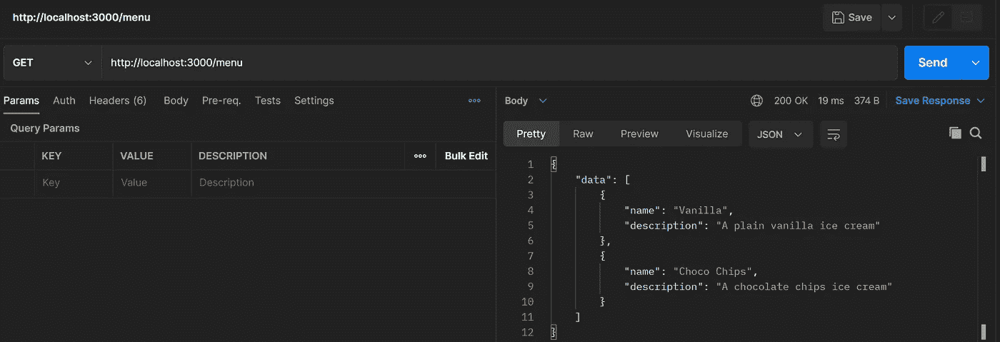
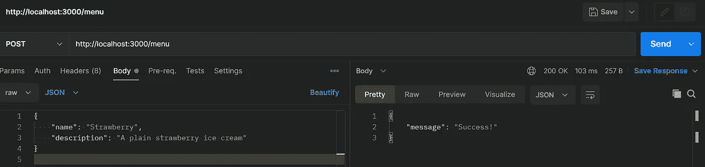
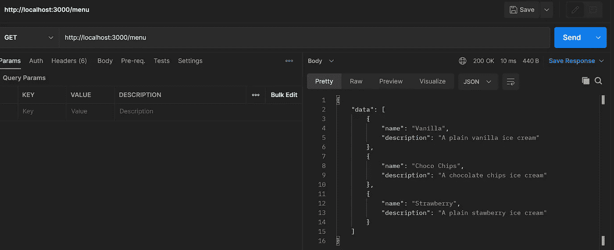

# 用 NodeJS 构建 Web 服务—第 2 部分(路由)

> 原文：<https://blog.devgenius.io/building-web-service-with-nodejs-part-2-routing-a20d43b715e1?source=collection_archive---------10----------------------->


NodeJS

欢迎回到这个 NodeJS 教程。让我们继续第二部分。在这一部分中，我们将更多地介绍使用 Express 的 API 路由。我还将介绍一点 REST API。到目前为止，我们已经在第一部分中用 Express 创建了第一个(无用的)Hello World API。因此，让我们在这一部分继续创建一些实际有用的 API。

> **作者备注** :
> 顺便说一下，我会尽量在一周内写完一部分。可能在周末。我需要一些时间来准备写作材料。

# REST API

我们在[简介部分](https://bitsizelearning.medium.com/building-web-service-with-nodejs-part-0-introduction-1859ee0c745b)中讨论了 web 服务。我可能也提到了术语 **REST API** 。那么，什么是 REST API 呢？我们可以把它分解成两个术语: **REST** 和 **API** 。

**API** 基本上是一个**接口**或一套**规则**或**协议**如何使用我们的应用程序。

**REST** 是具象状态转移的缩写。它是一种**架构风格**，用于 web 服务利用 **HTTP** 在客户机和服务器之间进行通信。在 REST 架构中，客户端-服务器通信被认为是无状态的，这意味着服务器不存储客户端的信息。

REST API 由 URI、头部、主体和方法组成。它还接收请求并以特定的格式发送响应。流行的格式有 **JSON** 和 **XML** 。

> [**红帽定义**](https://www.redhat.com/en/topics/api/what-is-a-rest-api)
> API 是构建和集成应用软件的一组定义和协议。
> REST API(也称为 RESTful API)是一种应用编程接口(API 或 web API ),它符合 REST 架构风格的约束，并允许与 RESTful web 服务进行交互

另一个我会经常用到的术语是**端点**(或者 **API 端点**)。虽然 REST API 术语更多地指的是一组规则或接口，但 API 端点通常指的是它的 URI。例如，在前面的部分中，我们定义了一个 REST API hello world。它有一个 GET 方法，API 端点是路径“/”，或者完整路径是 http://localhost:3000/。

# 我们来编码吧！

让我们回顾一下之前的 Hello World API 代码。

## src/index.js

```
...
app.get('/', (req, res, next) => {
  res.send('Hello, World!');
});
...
```

在这段代码中，我们:

1.  创建了路径为" **/** "的路由，方法为 GET，
2.  定义了一个处理函数。

这就是为 REST API 创建路由所需要的全部内容:一个方法、一个路径和一个处理函数。Express 中的一个处理函数需要一个**请求** (req)、一个**响应** **编写器** (res)和一个**回调函数** (next)作为参数。

举个例子，让我们定义另一条路线。让我们在 hello world 路由下面编写下面的代码。

**src/index.js**

```
...app.get('/goodbye', (req, res, next) => {
  res.send('Goodbye, World!');
});...
```

我们刚刚用 path "/goodbye "和 GET 方法定义了另一个路由。启动节点应用程序，并与您的邮递员一起尝试。使用 GET as 方法为端点[创建一个请求 http://localhost:3000/goodbye](http://localhost:3000/goodbye)并发送该请求。你应该得到一句“再见，世界！”作为回应的文本。

> **快速提醒提示** 如果您遵循前面的[部分](https://bitsizelearning.medium.com/building-web-service-with-nodejs-part-1-setup-55a522efaead)，我们有一个 npm 脚本，它利用 nodemon 在每次代码中保存更改时运行并重启应用程序。npm run start:dev
> 因此，如果您运行该脚本，要重启应用程序，只需简单地保存您代码(CTRL+S)。

现在，您应该对如何向我们的应用程序添加更多路线有了大致的了解。现在，让我们为我们的实际应用程序创建两个新的路径(最终不再有无用的 API)。第一个是获取菜单列表。让我们在冰淇淋菜单的端口常量声明代码之后定义一个数组。

```
...const menus = [
  { name: 'Vanilla', description: 'A plain vanilla ice cream' },
  { name: 'Choco Chips', description: 'A chocolate chips ice cream' },
];...
```

然后，我们添加一个新的路径来获取菜单列表。路径是“/menu”，方法是 GET。在再见世界路线后添加以下代码。

```
...app.get('/menu', (req, res, next) => {
  res.json({
    data: menus,
  });
});...
```

注意，在这个处理函数中，我们没有使用 res.send，而是使用 res.json 来发送响应。在 Express 中，res.send 以文本/html 格式发送响应。相比之下，res.json 用 JSON (application/json)发送响应。因此，res.json 期望响应值是有效的 javascript 对象。

重启应用程序，并通过 Postman 尝试端点 GET[http://localhost:3000/menu](http://localhost:3000/menu)。您应该得到一个 JSON 响应，它的字段是“data ”,值是菜单数组。注意，Express 自动将我们在 API 响应中发送的 javascript 对象转换成 JSON。



我们接下来要编写的第二个代码是一个插入新菜单的 API。端点路径将与“/menu”相同，但方法为“POST”。让我们将它添加到前面的 get menus 路径的下面。

```
...app.post('/menu', (req, res, next) => {
  menus.push(req.body);
  res.json({
    message: 'Success!',
  });
});...
```

注意，我们没有使用 app.get，而是使用 **app.post** 来创建 POST API。在 handler 函数中，我们期望一些东西和 API 请求一起发送，也就是主体。我们还希望请求体是一个有效的菜单，插入到我们的菜单数组中。然后，我们发送带有成功消息的响应。

默认情况下，Express 无法读取请求正文。我们需要一个中间件来解析请求体。我将在本教程的下一部分介绍中间件。现在，我们只需要添加一些代码。幸运的是，现在的 Express(Express 4.16+)提供了我们需要的中间件。就在 menus 数组声明之前，让我们添加以下代码。

```
...app.use(express.json());...
```

中间件 **express.json()** 会将 API 请求体中的任何内容作为 json 读取。结果将被传递给我们创建的任何路线。我们可以在 routes 的处理函数中使用 **req.body** 来访问这个主体。

保存并重新启动应用程序。现在，让我们试试邮递员。让我们用 POST as 方法创建一个对[http://localhost:3000/menu](http://localhost:3000/menu)的请求。我们需要在 JSON 中创建一个包含新菜单对象的请求体。

> 在 Postman 中:Body > raw > JSON

例如，我将添加一个草莓冰淇淋作为新菜单。

```
{
    "name": "Strawberry",
    "description": "A plain strawberry ice cream"
}
```

你的邮递员应该看起来像这样。



现在，在不重启应用程序的情况下，让我们尝试使用 GET[http://localhost:3000/menu](http://localhost:3000/menu)端点再次获取菜单列表。



我们应该看到草莓冰淇淋现在被插入到菜单列表中。当然，请记住，我们只将新插入的菜单存储到菜单数组中，这只是代码中的一个变量。如果我们重新启动应用程序，菜单数组将重置，新插入的草莓冰淇淋将消失。在本教程的后面部分，当我们向应用程序介绍 MongoDB 时，我们将持久化我们的数据。保持调谐！

检查站。让我们检查一下您的 index.js 文件。现在应该是这个样子。

## src/index.js

```
import express from 'express';const app = express();
const port = 3000;app.use(express.json());const menus = [
  { name: 'Vanilla', description: 'A plain vanilla ice cream' },
  { name: 'Choco Chips', description: 'A chocolate chips ice cream' },
];app.get('/', (req, res, next) => {
  res.send('Hello, World!');
});app.get('/goodbye', (req, res, next) => {
  res.send('Goodbye, World!');
});app.get('/menu', (req, res, next) => {
  res.json({
    data: menus,
  });
});app.post('/menu', (req, res, next) => {
  menus.push(req.body);
  res.json({
    message: 'Success!',
  });
});app.listen(port, () => {
  console.log('listening to port', port);
});
```

不管怎样，恭喜你！
在本教程中，您已经创建了第一个有用的 API。

**合适的路由？**

你现在应该很擅长增加新的路线。我要向你提出一个新问题。比方说，如果我们要构建一个成熟的 web 应用程序，我们可能需要几十或几百个 API 端点。如果我们要为 routes 和 handler 函数编写所有的代码，我们最终会在一个 index.js 文件中有数百或数千行代码。这段代码很难维护。为了解决这个问题，我们将使用快速路由器。

请点击这里的[查看我的 github 资源库中完整的第 2 部分代码。](https://github.com/bitsizelearning/icecream-store/tree/part2)

这部分到此为止。在下一部分中，我们将重构我们的代码，我将介绍一些关于中间件的内容。 [**点击这里！**](https://bitsizelearning.medium.com/building-web-service-with-nodejs-part-3-router-logging-error-handler-d62a054df27)

您可以在我的公共 github 资源库中看到完整的第 2 部分代码。 [**点击这里！**](https://github.com/bitsizelearning/icecream-store/tree/part2)

谢谢你，希望你喜欢阅读它。有没有什么错误或者是我没有解释清楚的地方？有什么我应该改进的吗？

如果你愿意的话，给作者留个便条和一些掌声来帮助频道发展。:)