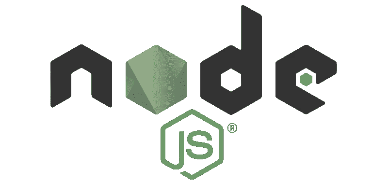
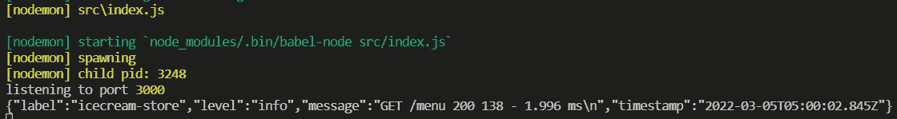
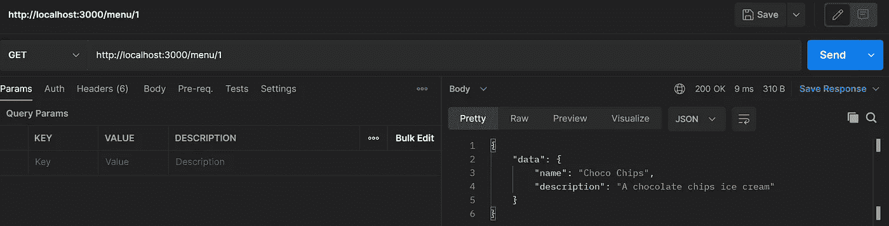
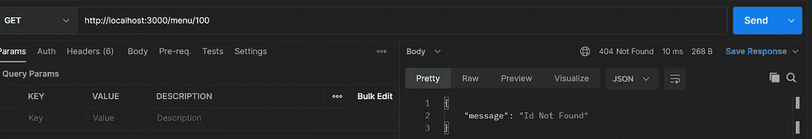
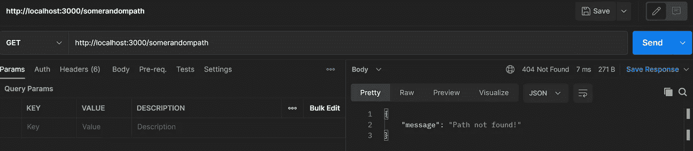

# 使用 NodeJS 构建 Web 服务—第 3 部分(路由器、日志、错误处理程序)

> 原文：<https://blog.devgenius.io/building-web-service-with-nodejs-part-3-router-logging-error-handler-d62a054df27?source=collection_archive---------5----------------------->



NodeJS

欢迎回到 NodeJS web 服务教程的第 3 部分。在这一部分我们来谈谈**路由器**、**日志**和**错误处理**。如果你跳过了前面的部分，你可以在这里阅读[。或者，如果你想从上一部分的代码库继续，可以在这里](https://bitsizelearning.medium.com/building-web-service-with-nodejs-part-2-routing-a20d43b715e1)抓取代码[。](https://github.com/bitsizelearning/icecream-store/tree/part2)

# 路由器

在前一部分中，我们学习了如何向我们的 web 服务添加新的路由。我还提到了如果我们不断向 index.js 文件添加新的路径，我们的代码会变得多么混乱。这是我们将路由器引入应用程序的地方。

路由器基本上是保存所有路由的东西。我们可以将所有路线分解成多个文件和文件夹，而不是放在一个文件中。每个文件都有自己的路由器，我们将自下而上对这些路由器进行分组。

要创建路由器，我们将使用 Express 提供的路由器功能。首先，让我们在 src 文件夹中创建一个新文件夹，并将其命名为 **routes** 。在 routes 文件夹中，创建一个新的 **index.js** 文件，并编写我们的主路由器。

## src/routes/index.js

```
import { Router } from 'express';
import menuRoutes from './menu';const router = Router();router.use('/menu', menuRoutes);export default router;
```

在这段代码中，我们使用 Express 提供的路由器功能创建了一个路由器。然后，我们使用 **router 将路径“/menu”映射到 menuRoutes(我们还没有创建它)。然后，我们导出路由器。很简单，不是吗？**

现在，让我们创建路由器菜单。另一个 REST API 概念:我们通常在应用程序中通过资源来命名路径。我们当前可用的资源是菜单，我们已经在 src/routes/index.js 中映射了它的路径。我们还将创建文件夹，并根据每个路径的资源名称来命名它们。现在，在 routes 文件夹中创建一个新文件夹，并将其命名为 **menu** 。然后，在菜单文件夹中创建一个 **index.js** 文件。

现在，我们需要将我们在 src/index.js 中创建的 Get 和 Post 菜单 routes 和*菜单*变量移回 src/routes/menu/index.js 中，并做一些修改。

## src/routes/menu/index.js

```
import { Router } from 'express';const router = Router();const menus = [
  { name: 'Vanilla', description: 'A plain vanilla ice cream' },
  { name: 'Choco Chips', description: 'A chocolate chips ice cream' },
];router.get('/', (req, res, next) => {
  res.json({
    data: menus,
  });
});router.post('/', (req, res, next) => {
  menus.push(req.body);
  res.json({
    message: 'Success!',
  });
});export default router;
```

在这个文件中，我们创建了另一个路由器，并且实际上用我们在上一部分中创建的 GET 和 POST 菜单路由映射了该路由器。一些需要注意的事情。首先，我们没有使用 app.get 和 app.post，而是在 router.get 和 router.post 中使用 router 变量。第二件事是，我们在这里不再使用“/menu”作为路径，因为我们已经在 src/routes/index.js 中映射了所有的菜单路径。这有意义吗？

> 在主路由器中，我们将路径**/菜单**映射到**菜单路由器**
> 在**菜单路由器**中，我们定义了两条路由: **GET /** 和 **POST /**

我们已经成功地将我们的应用程序分解成一个主路由器和一个菜单路由器。现在，让我们回到 src/index.js，把它们串起来。为此，我们需要使用下面的代码将根路径" **/** "映射到我们的主路由器。

```
...import routes from './routes';...app.use('/', routes);...
```

现在让我们看一下完整的 src/index.js 文件。我删除了你好和再见路线，因为我们以后不会再使用它们了。

## src/index.js

```
import express from 'express';
import routes from './routes';const app = express();
const port = 3000;app.use(express.json());app.use('/', routes);app.listen(port, () => {
  console.log('listening to port', port);
});
```

检查站。你的文件夹结构应该看起来像这样。

```
+---src
|   +---routes
|   |   +---menu
|   |   |   \---index.js
|   |   \---index.js
|   \---index.js
+---.babelrc
+---.gitignore
+---nodemon.json
+---package-lock.json
+---package.json
```

让我们启动应用程序，并通过 Postman 尝试 GET /menu 和 POST/menu API。确保一切都还像以前一样正常工作。

总之，当我们需要添加更多的资源/ API 端点时，在 src/routes 中创建一个以资源名命名的文件夹，并在该文件夹中创建一个路由器，即:**src/routes/my resource/index . js**。然后，在我们的 src/routes/index.js 中映射资源路由器

> 如果您需要在资源中创建子资源，只需在资源文件夹中创建另一个路由器。然后，将子资源路由器映射到其父资源路由器中。
> 即:**src/routes/my resource/mysubresource/index . js**

# 记录

到目前为止，我们已经运行了 NodeJS 应用程序，并用 Postman 进行了测试。但是，从服务器端，我们看不到任何活动。我们只是不知道请求是否被发送到我们的应用程序。我们的终端控制台没有给出任何信息。我们想要一个自动化的过程，当请求被发送到我们的应用程序时记录一些东西。

我们将使用两个库: [**摩根**](https://www.npmjs.com/package/morgan) 和 [**温斯顿**](https://www.npmjs.com/package/winston) 。Morgan 是一个 http 请求记录器，而 winston 是一个通用日志库。在您的终端中运行以下命令来安装它们。

```
npm install --save morgan winston
```

为了正确地使用 winston 库，让我们在 src 文件夹中创建一个新文件夹 **lib** ，并在其中创建一个新文件 **logger.js** ，现在复制下面的代码。

## src/lib/logger.js

```
import path from 'path';
import winston from 'winston';const { timestamp, label, combine, json } = winston.format;const logDir = `${path.resolve('./')}/logs`;const logger = winston.createLogger({
  format: combine(label({ label: 'icecream-store' }), timestamp(), json()),
  transports: [
    new winston.transports.Console({ handleExceptions: true }),
    new winston.transports.File({ filename: `${logDir}/combined.log` }),
  ],
});logger.stream = {
  write: (message, encoding) => {
    logger.info(message);
  },
};export default logger;
```

在这个 logger.js 文件中，我们用 winston 定义了一个**自定义记录器**。我们为这个日志记录器创建了两种传输方式，即控制台和文件。这意味着每次我们使用这个日志记录程序来记录信息时，它都会记录到我们的终端控制台和我们定义的文件路径(logs/combined.log)中。我们还将日志格式化为包含一个标签、一个时间戳，并格式化为 JSON。还为我们的 http 请求记录器定义了一个写流。说到这里，我们继续说摩根的用法。

让我们回到我们的 src/index.js，使用下面的代码创建我们的定制 http 请求记录器中间件。

```
...import morgan from 'morgan';
import logger from './lib/logger';...const httpReqLogFormat =
  ':method :url :status :res[content-length] - :response-time ms';
const httpReqLogger = morgan(httpReqLogFormat, { stream: logger.stream });...app.use(httpReqLogger);...
```

在这段代码中，我们在 *httpReqLogFormat* 变量中定义了一种格式。然后，我们使用 morgan 创建我们的自定义 *httpReqLogger* ，并用我们的 winston logger 流设置该流。然后，我们使用 **app.use** 在我们的应用中实际使用中间件。src/index.js 的完整代码如下。

## src/index.js

```
import express from 'express';
import morgan from 'morgan';
import logger from './lib/logger';
import routes from './routes';const app = express();
const port = 3000;
const httpReqLogFormat =
  ':method :url :status :res[content-length] - :response-time ms';
const httpReqLogger = morgan(httpReqLogFormat, { stream: logger.stream });// middlewares
app.use(express.json());
app.use(httpReqLogger);// routes
app.use('/', routes);app.listen(port, () => {
  console.log('listening to port', port);
});
```

让我们重新启动应用程序，并尝试通过 Postman 点击 GET /menu。您应该看到 API 请求信息现在已经记录到我们的终端控制台和 logs/combined.log 文件中。



# 错误处理

在这一部分中，我们将只关注处理 Not Found (HTTP 代码 400)和一般错误。我们需要为这些错误创建中间件。

先做一般错误。在 lib 文件夹中创建一个新文件 error.handler.js。

## src/lib/error.handler.js

```
import logger from './logger';export default (error, req, res, next) => {
  logger.error(error.message || error); res.status(error.status || 500).json({
    message: error.message|| 'Unexpected Server Error',
  });
};
```

如果任何路径中的任何处理函数调用了带有错误参数的 **next** 回调函数，那么它应该调用我们刚刚编写的函数。首先，我们记录错误消息，然后我们发回一个响应，其中包含相应的错误状态和消息(如果有的话)。它应该默认为错误状态 500 意外服务器错误。让我们在 index.js 中导入并使用它作为中间件。

```
...import errorHandler from './lib/error.handler';...app.use(errorHandler);...
```

注意:您需要将代码 app.use(errorHandler) **放在我们的主路径**下面。为了测试这个错误处理程序，让我们在我们的菜单路由中创建一个新的路由，以获得一个菜单。在我们的 src/routes/menu/index.js 文件中，添加以下路由。

```
router.get('/:id', (req, res, next) => {
  try {
    const id = req.params.id;
    if (id < 0 || id >= menus.length) {
      const err = new Error('Id Not Found');
      err.status = 404;
      throw err;
    }
    res.json({
      data: menus[id],
    });
  } catch (err) {
    next(err);
  }
});
```

该路径的路径完整路径将是 **/menu/:id** ，id 作为**请求参数**，它是我们想要获取的菜单的索引。在处理函数中，我们检查 id 是否在菜单数组中。如果超出界限，我们将抛出一个错误，消息 Id 为 Not Found，状态为 404。然后，在 catch 语句中，我们第一次用错误作为参数调用下一个回调。保存文件并重新启动应用程序。

让我们测试一下我们的邮递员。首先，让我们尝试获取 http://localhost:3000/menu/1。我们应该得到菜单[1]作为响应数据。



它工作正常。接下来，让我们尝试点击 GET http://localhost:3000/menu/100。我们知道一个事实，即指数 100 将会出界。我们应该得到一个 404 响应，消息 Id 未找到。还要注意，在我们的终端控制台中，我们会得到一个错误日志。



一般错误到此为止。现在，对于 Not Found 错误处理程序，这是相当容易的。我们只需要将下面的中间件放在 src/index.js 文件中一般错误中间件的下面。

```
...app.use((req, res, next) => {
  res.status(404).json({ message: 'Path not found!' });
});...
```

重启应用程序。我们在 Postman 里面试试，发送一个请求获取 http://localhost:3000/somerandompath。我们知道一个事实，我们从未在任何路线中绘制/somerandompath。所以我们希望它不会被发现。



搞定了。我们讨论了路由器、日志和错误处理。那是许多工作。希望你现在能理解这些概念。

> **中间件**
> 我多次提到“中间件”，但还没有解释它是什么。
> 简单来说，Express 中的中间件就是我们在每个 API 请求中调用的某个函数。它可以访问请求、响应编写器和下一个回调。从技术上讲，我们在 routes 中创建的所有处理函数都是中间件。
> 更多信息[此处](https://expressjs.com/en/guide/using-middleware.html)。

唷！那是很难接受的。我们将在下一部分讨论数据库连接！ [**点击这里！**](https://bitsizelearning.medium.com/building-web-service-with-nodejs-part-4-connecting-to-database-3daca3ff49ae)

您可以在我的公共 github 资源库中看到完整的第 3 部分代码。
[**点击这里！**](https://github.com/bitsizelearning/icecream-store/tree/part3)

谢谢你，希望你喜欢阅读它。有没有什么错误或者是我没有解释清楚的地方？有什么我应该改进的吗？

如果你愿意的话，给作者留个便条和一些掌声来帮助频道发展。:)