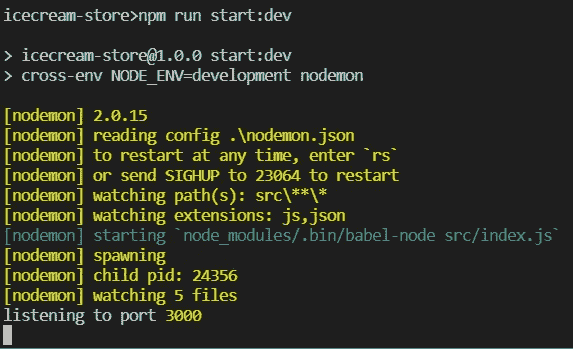
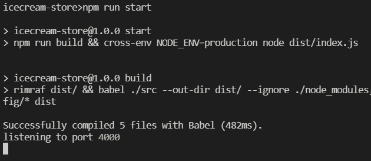
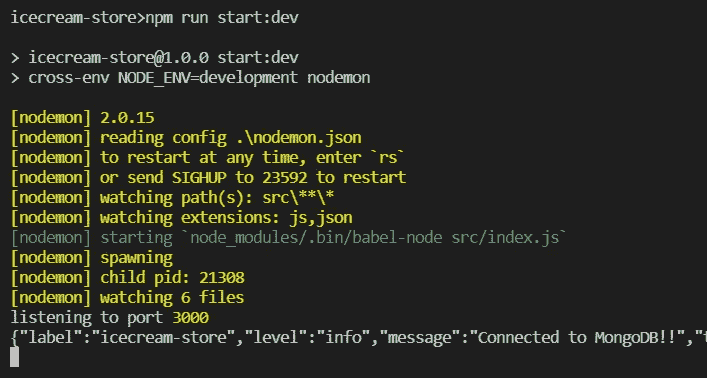
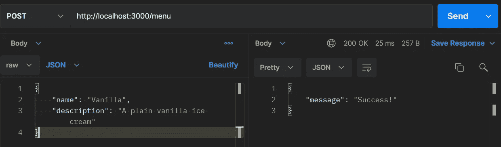
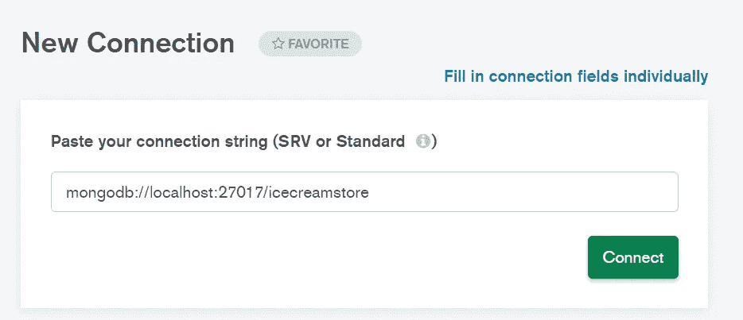
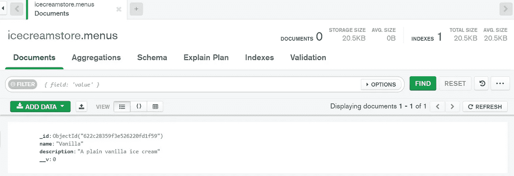
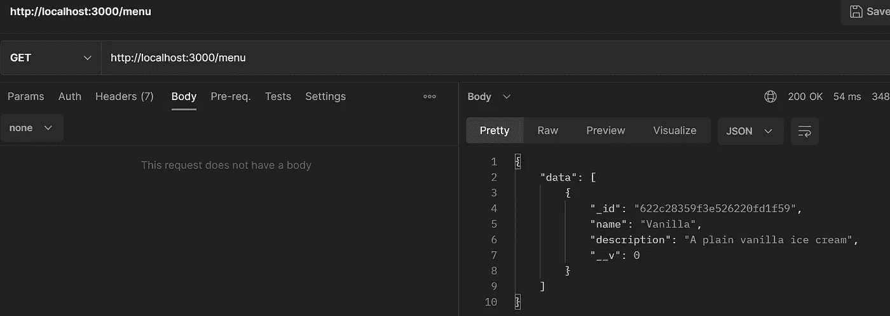
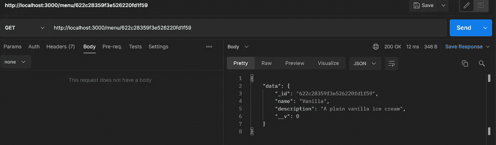

# 使用 NodeJS 构建 Web 服务—第 4 部分(连接到数据库)

> 原文：<https://blog.devgenius.io/building-web-service-with-nodejs-part-4-connecting-to-database-3daca3ff49ae?source=collection_archive---------5----------------------->


NodeJS

读者们好，感谢你们阅读我的教程故事，欢迎来到本教程的第 4 部分。在这一部分中，我们来讨论一下**将我们的数据保存在数据库**中。正如我在本教程前面提到的，我们将使用 **MongoDB** 作为我们的应用程序。如果你错过了之前的第三部分，你可以在这里阅读[。如果想从上一部分的代码库继续，可以在这里](https://bitsizelearning.medium.com/building-web-service-with-nodejs-part-3-router-logging-error-handler-d62a054df27)抓取代码[。](https://github.com/bitsizelearning/icecream-store/tree/part3)

这一部分相当长，所以请耐心等待，如果您遇到任何问题，您可以随时在这里查看完整的代码[](https://github.com/bitsizelearning/icecream-store/tree/part4)**。尽情享受吧！**

# **MongoDB**

**在前一部分中，我们为菜单资源创建了几个 API 端点。我们现在可以获取现有菜单并插入新菜单。然而，正如我前面提到的，数据仍然存储在内存中。如果我们重启应用程序，数据将会丢失。为了保持数据的完整性(使其持久化)，我们需要将数据存储在外部，web 服务服务器之外的某个地方。我们将把数据存储在数据库中。我们选择的数据库是 MongoDB。**

**对于那些还不熟悉 web 开发或任何类型的软件开发的人来说，**数据库**基本上是存储数据的服务器。早期占主导地位的数据库是**关系数据库**，它只存储结构化数据。相比之下，我们有 MongoDB，它是一个 NoSQL 数据库。NoSQL 数据库存储非结构化或半结构化数据。随着 web 应用程序的不断增长，NoSQL 数据库越来越受欢迎。现在，我们不打算在理论上深入讨论数据库或 MongoDB。相反，让我们跳到应用程序中的实际用法。然而，如果你想了解更多关于数据库的知识，你可以点击[这里](https://www.oracle.com/database/what-is-database/)。**

**如果你没有安装我在**第 1 部分**中提到的 MongoDB Compass，这是一个简单的提示。现在，是做这件事的最佳时机。只需前往[下载页面](https://www.mongodb.com/try/download/compass)，下载与您的操作系统兼容的安装程序并安装。MongoDB 应该和它的 GUI (MongoDB Compass)一起安装。默认情况下，MongoDB 将在 localhost:27017 上运行。**

## **应用程序配置**

**在我们的应用程序中进入数据库连接之前，我们将讨论一下应用程序配置，以及它如何对数据库连接有用。以前，在我们的 src/index.js 中，我们让我们的 express 应用程序监听端口 3000(这样我们就可以通过 [http://localhost:3000 访问 API)。](http://localhost:3000).)现在端口号 **3000** 在我们的应用中是*硬编码的*。比方说，如果我们想将应用程序更改为在另一个端口号上运行，我们需要更改 src/index.js 文件。在我们本地的计算机开发中，更改代码可能是小菜一碟。然而，当我们的应用程序部署到服务器上时，我们不能轻易更改代码。**

**那么，我们如何解决这个问题呢？我们不需要在 src/index.js 中硬编码端口号 3000，而是需要将这个端口号放在一个配置文件中。这个配置文件也需要在我们的源代码(src 文件夹)之外。尤其是在 NodeJS 中，一种方法是使用名为 [**config**](https://www.npmjs.com/package/config) 的 npm 包。让我们用 npm 安装它。**

```
npm install --save config
```

**现在，让我们在根文件夹上创建一个名为**配置**的文件夹。然后，在其中创建一个 **development.json** 文件，并将我们的端口变量放入其中。**

## **config/development.json**

```
{
  "port": 3000
}
```

**让我们回到 src/index.js 并导入配置库。然后，代替硬编码端口= 3000，我们可以使用 config.get(“端口”)来获得存储在 development.json 中的端口值**

## **src/index.js**

```
import config from 'config';...
...const port = config.get('port');...
...
```

**导入时，配置库将在我们的项目目录中寻找一个 **config** 文件夹。然后，它将寻找文件名与我们的 **NODE_ENV** 变量匹配的 JSON 或 js 文件。目前为止我们还没有遇到 NODE_ENV。NODE_ENV 是我们操作系统中的一个环境变量。通常这些值要么是**开发**、**试运行**、**生产**，要么是**测试**。到目前为止，我们只在开发环境中工作，因此我们创建了一个名为 **development** .json 的配置文件。现在，我们需要将 NODE_ENV 值实际设置为 **development** 。**

**让我们安装 [**跨环境**](https://www.npmjs.com/package/cross-env) 和 [**拷贝文件**](https://www.npmjs.com/package/copyfiles) 包来帮助我们实现这一点。由于它们不是我们的应用程序的依赖项(只需要运行或构建应用程序)，我们将其保存到 dev dependencies 中。**

```
npm install --save-dev cross-env copyfiles
```

**我们还需要更新 package.json 中的 npm 运行和构建脚本。**

## **package.json**

```
{
  ... ... "scripts": {
    "build": "rimraf dist/ && babel ./src --out-dir dist/ --ignore ./node_modules,./.babelrc,./nodemon.json,./package.json,./npm-debug.log --copy-files && copyfiles -a config/* dist",
    "start": "npm run build && cross-env NODE_ENV=production node dist/index.js",
    "start:dev": "cross-env NODE_ENV=development nodemon"
  }, ... ...
}
```

> ****cross-env** 允许我们设置环境变量，而 **copyfiles** 允许我们在任何终端上复制文件，而不考虑操作系统。**

**让我们运行 npm start:dev 脚本来确保 development.json 中的配置被读取，并且应用程序正在端口 3000 上运行。**

****

**实际上，我刚想起来我们从来没有测试过我们的剧本。生产和开发脚本的区别在于，我们实际上是将源代码“编译”(或**构建**)到 **dist** 文件夹中，然后在 dist 文件夹中运行应用程序。这正是在 package.json 中的 npm 运行启动脚本中发生的情况。在运行脚本之前，让我们创建 production.json 配置，这次让我们配置生产应用程序以在另一个端口上运行。**

## **配置/生产. json**

```
{
  "port": 4000
}
```

**然后，运行生产脚本。**

```
npm run start
```

**如果一切顺利，您应该看到应用程序现在运行在端口 4000 而不是 3000。**

****

**好了，应用配置讨论到此结束。那么，为什么我们在连接到数据库之前需要它呢？正如我前面所说的，数据库是一个存储数据的服务器。这意味着它应该运行在与我们的应用程序分开的某个地方，并且有一个特定的**主机** url、**端口**，也许还有**授权**信息。同样，在我们的本地计算机开发中，数据库可能运行在本地主机上，但是当我们将应用程序部署到服务器上时，我们可能需要一个运行在互联网上的数据库服务器。这就是为什么我们需要使数据库连接选项**可配置**。**

# **正在连接到 MongoDB**

**为了将我们的 NodeJS 应用程序连接到 MongoDB，我们需要一些**驱动程序**库来管理连接。它不仅适用于 MongoDB，我们还需要特定的驱动程序来连接到其他数据库。我们将使用[**mongose**](https://mongoosejs.com/)**来管理连接和**对象建模**。****

```
**npm i --save mongoose**
```

****在 **src** 文件夹中创建一个名为 **db.js** 的文件。****

## ****src/db.js****

```
**import config from 'config';
import mongoose from 'mongoose';
import logger from './lib/logger';const connectionString = config.get('mongodb');export const initializeDB = () => {
  mongoose.connect(connectionString, () => {
    logger.info('Connected to MongoDB!!');
  });
};**
```

****这个文件包含一个简单的函数，它将应用程序连接到 MongoDB。为了连接，需要一根**连接管柱** **URI** 。一个简单的 MongoDB 连接字符串定义如下。****

```
**mongodb://<username:password@><host>:<port>/<databasename>**
```

****如果您按照我的建议安装 MongoDB Compass，MongoDB 将在默认情况下运行 localhost:27017，无需任何授权。让我们将连接字符串添加到配置文件中。****

> ******快速提醒注意**
> 当我说“配置文件”的时候，通常指的是**config/development . JSON**文件，除非我们在说部署的时候，大概指的是 **config/production.json******

## ****配置/开发. json****

```
**{
  "port": 3000,
  "mongodb": "mongodb://localhost:27017/icecreamstore"
}**
```

****我将我的数据库命名为 **icecreamstore** ，但是你可以使用任何你想要的名字。由于默认情况下没有授权，我们可以跳过用户名:密码部分。下一步是在使用中间件之前调用 src/index.js 中的 initializeDb。****

## ****src/index.js****

```
**import { initializeDB } from './db';...initializeDB();...**
```

****再次启动 app，如果连接成功，应该会得到
“连接到 MongoDB”日志。****

********

# ****更新菜单处理函数****

****我们的下一个任务是实际利用 MongoDB 来读取和存储我们的菜单。首先，在 **src** 中创建一个文件夹，命名为 **models** 。在里面，创建一个名为 **menu.js** 的文件。****

## ****src/models/menu.js****

```
**import { Schema, model } from 'mongoose';const menuSchema = new Schema({
  name: String,
  description: String,
});export const Menu = model('menus', menuSchema);**
```

****我们定义了一个**菜单**模型，它对应于 MongoDB 中的**菜单**集合。模型基本上只是我们代码中的一个对象。MongoDB 集合是一组文档。同时，文档是类似 JSON 的(**BSON**:JSON 的二进制表示)数据记录，存储在 MongoDB 中。注意，在**mongose**中，集合的命名约定是复数形式的名词——因此是菜单。在这个菜单模型中，我们定义了两个字段，它们是名称和描述，都是字符串类型。****

****现在，让我们更新我们的 POST 菜单 API 处理函数。要将文档插入 MongoDB，我们可以使用我们刚刚用 **Menu.create** 函数创建的菜单模型。注意**创建**函数是一个异步函数。在使用 Menu.create 时，我们需要将 **async** 关键字添加到处理函数中，并将 **await** 关键字添加到处理函数中。让我们添加 try catch 包装器。****

## ****src/routes/menu/index.js****

```
**import { Menu } from '../../models/menu';......router.post('/', async (req, res, next) => {
  try {
    menus.push(req.body);
    await Menu.create({
      name: req.body.name,
      description: req.body.description,
    });
    res.json({
      message: 'Success!',
    });
  } catch (error) {
    next(error);
  }
});**
```

****让我们运行应用程序，并尝试通过 Postman 将我们的华尼拉·艾斯奶油菜单插入数据库。如果一切顺利，菜单将被创建。****

********

****打开 MongoDB Compass 检查是否创建了菜单。您将被要求输入一个连接字符串。用我们在配置文件中使用的完全相同的字符串填充它，然后单击 Connect。****

********

****在用户界面的左侧，查找您的数据库名称。点击它，你应该看到菜单集合。然后，单击菜单查看存储在里面的文档。****

********

****在用户界面的右侧，您应该会看到我们刚刚作为文档插入的普通菜单。注意，MongoDB 会自动为我们生成 **_id** 和 **__v** 字段，分别是唯一标识符和版本号。****

********

****如果一切顺利，那么我们将继续修改 GET 和 GET by id 处理函数以及 Menu.find 和 Menu.findOne 函数。findOne 函数将使用 **_id** 作为查询来获取一个具有特定 id 的文档。以下是全尺寸的更新菜单路线文件。****

## ****src/routes/menu/index.js****

```
**import { Router } from 'express';
import { Menu } from '../../models/menu';const router = Router();router.get('/', async (req, res, next) => {
  try {
    const menus = await Menu.find();
    res.json({
      data: menus,
    });
  } catch (error) {
    next(error);
  }
});router.get('/:id', async (req, res, next) => {
  try {
    const id = req.params.id;
    const menu = await Menu.findOne({ _id: id });
    if (!menu) {
      const err = new Error('Id Not Found');
      err.status = 404;
      throw err;
    }
    res.json({
      data: menu,
    });
  } catch (err) {
    next(err);
  }
});router.post('/', async (req, res, next) => {
  try {
    await Menu.create({
      name: req.body.name,
      description: req.body.description,
    });
    res.json({
      message: 'Success!',
    });
  } catch (error) {
    next(error);
  }
});export default router;**
```

****首先，让我们试试通过 Postman 获取菜单 API。我们希望看到数据库中的香草冰淇淋作为响应数据。****

********

****在数据响应中，我们应该看到带有字符串值的文档 id **_id** 。要尝试通过 id API 获取菜单，请复制 _id 字符串值，然后将其用作 API URL 中的 id 参数，您应该会得到一个菜单文档作为响应。****

********

****恭喜您，您的应用程序现在正在利用数据库！****

****第 4 部分写得很长。让我们在这一点上休息一下。在下一部分中，我们将再次重构代码，并向现有 API 添加更多选项。 [**点击这里！**](https://bitsizelearning.medium.com/building-web-service-with-nodejs-part-5-pagination-data-transfer-object-c5fbf7bd21f1)****

****您可以在我的公共 github 资源库中看到完整的第 4 部分代码。
[**点击这里！**](https://github.com/bitsizelearning/icecream-store/tree/part4)****

****谢谢你，希望你喜欢阅读它。有没有什么错误或者是我没有解释清楚的地方？有什么我应该改进的吗？****

****如果你愿意的话，给作者留个便条和一些掌声来帮助频道发展。:)****