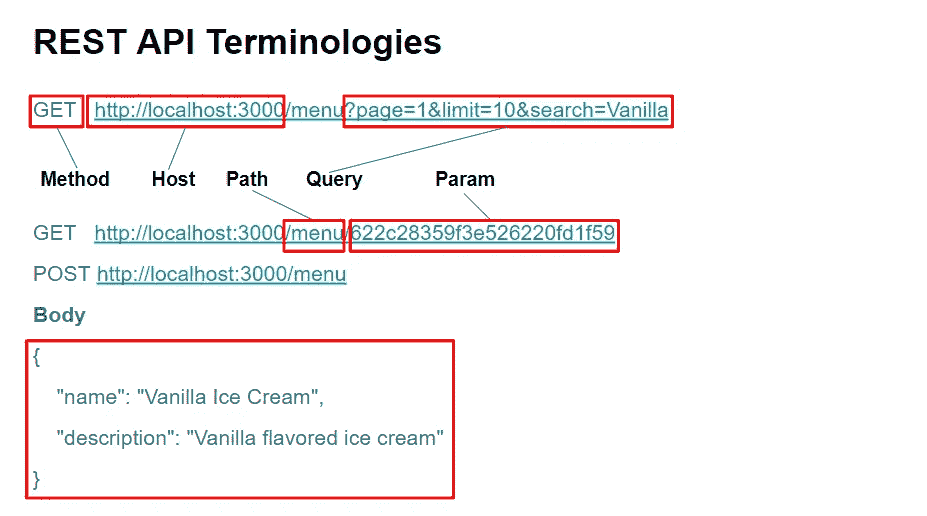
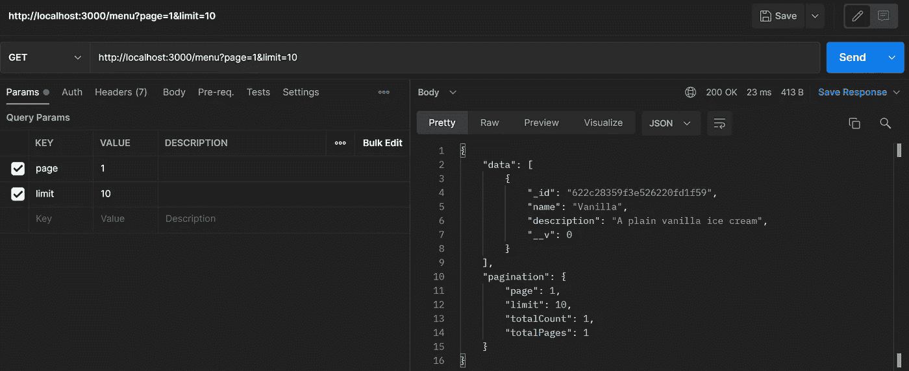
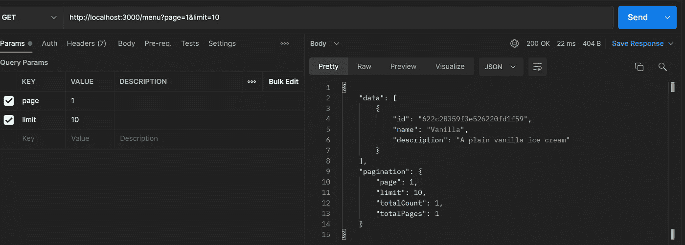
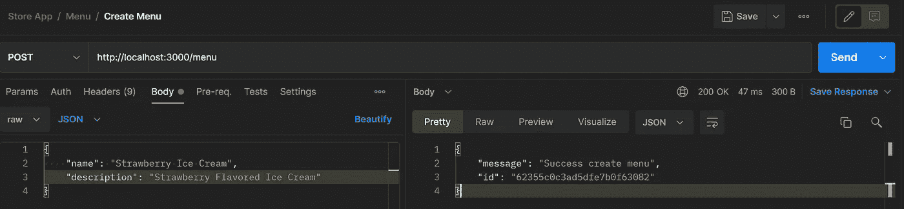
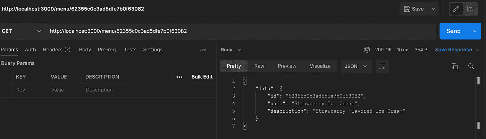

# 使用 NodeJS 构建 Web 服务—第 5 部分(分页、数据传输对象)

> 原文：<https://blog.devgenius.io/building-web-service-with-nodejs-part-5-pagination-data-transfer-object-c5fbf7bd21f1?source=collection_archive---------0----------------------->


NodeJS

> 嗨，读者们，你们好吗？希望你一切都好。

欢迎回到 NodeJS 教程的第 5 部分。在我们的[前一部分中，](https://bitsizelearning.medium.com/building-web-service-with-nodejs-part-4-connecting-to-database-3daca3ff49ae)我们将应用程序连接到 MongoDB，并利用它来创建和读取数据。在这一部分，我们将主要尝试再次重构我们的代码，使它们更具可读性和可维护性。在这个过程中，我将介绍**数据传输对象**。

如果您需要上一篇第 4 部分的代码，请在这里查看**。** 第 5 部分的完整代码可以在[这里](https://github.com/bitsizelearning/icecream-store/tree/part5)找到。

# 术语

在这部分之前，我们已经使用了类似于**方法**或请求**主体**的术语。我将简单地列出一些 REST API 端点的术语，这样我们就不会有误解。看看下面这些我们会经常用到的术语。



REST API 端点术语

# **从我们停止的地方继续**

到目前为止，我们已经创建了用于创建(POST)和读取(find all & one) (GET)操作的 API。让我们看一看其中的每一个，看看我们可以改进什么。

## 获取所有菜单(获取/菜单)

在我们的 get all menus API 处理程序中，我们使用 Menu.find 方法来检索数据库中的所有菜单并在响应中发送它们。有什么不好？到目前为止，似乎没有什么问题，因为我们在数据库中只有一个菜单记录(香草冰淇淋)。然而，在现实世界中，我们的数据库中可能有更多的记录。现实世界中的一个例子可能是存储(数百万甚至数十亿)交易记录的银行服务。如果我们一次性检索所有记录，服务器将会内存不足而崩溃。

那我们该怎么办？通常，我们会为这样的 get all APIs 做**分页**。在 API 请求中，我们需要发送哪个**页面**以及一个页面中我们想要检索多少项(**限制**)。这些信息作为一个**查询**放入请求 URL 中。网址看起来像这样**获取/菜单？page=1 & limit=10** 。页面和限制可以在 **req.query** 我们的处理函数中找到。然后，我们使用**跳过**和**限制**在我们的 Menu.find 调用之后。我们最终会像遵循代码一样。

```
router.get('/', async (req, res, next) => {
  try {
    const { page, limit } = req.query;
    const menus = await Menu.find()
      .skip((page - 1) * limit)
      .limit(limit); res.json({
      data: menus,
    });
  } catch (error) {
    next(error);
  }
});
```

如果我们在响应中包含我们的分页信息，以便 API 消费者知道他们在哪个**页面**，**有多少记录** **&** **页面**，这通常也是一个好主意。为此，我们还需要用 **Menu.count** 从数据库中获取计数。为了构建我们的分页信息，让我们在 lib 文件夹中创建一个 **util.js** 文件，并在那里创建一个函数。

## src/lib/util.js

```
export const getPaginationInfo = (page, limit, count) => {
  return {
    page: +page,
    limit: +limit,
    totalCount: count,
    totalPages: Math.ceil(count / limit),
  };
};
```

回到 get all 处理函数中，我们将使用这个函数添加分页信息。我们还要定义 page 和 limit 的默认值，这样，如果请求在查询中没有 page 和 limit，我们仍然可以设置 page 和 limit 值。

```
import { getPaginationInfo } from '../../lib/util';...router.get('/', async (req, res, next) => {
  try {
    const { page = 1, limit = 10 } = req.query;
    const [menus, count] = await Promise.all([
      Menu.find()
        .skip((page - 1) * limit)
        .limit(limit),
      Menu.count(),
    ]); res.json({
      data: menus,
      pagination: getPaginationInfo(page, limit, count),
    });
  } catch (error) {
    next(error);
  }
});
```

> 注意，我们使用 **Promise.all** 来使查找和计数函数调用**异步**。

我们现在应该在每次点击 API 时获得分页信息。



我们还能改进什么？如果我们仔细观察从 API 获得的响应数据，我们会看到 **_id** 和 **__v** 键。这些键值对是由 MongoDB 生成的。虽然我们需要菜单 id 来引用它们，但我们不需要辅助的 __v 键值。更具体地说，在我们的数据库记录中可能有我们不希望在 API 响应中发送的信息，无论这些信息是否由我们定义。我们没有排除这些信息，而是定义了哪些信息需要作为 API 响应发送。这就是我们需要**数据传输对象** ( **DTO** ) **的地方。**

## 数据传输对象(DTO)

> 声明，事实上我不知道我对 DTO 的定义是否正确。你可以在谷歌上找到更多关于 DTO 的信息，或者在这里看一下定义。

数据传输对象是连接领域、业务和应用层的对象。dto 基本上是持有键值对的“哑”对象。

> 简单点说，**域**是数据库，**业务**是我们在处理函数中的逻辑，**应用**是我们的 web 服务 API。

在我们的用例中，我们将为一个菜单创建一个 DTO，它只保存我们需要发送给 API 响应的值。由于我们使用的是 Javascript，这是一种松散类型的语言，为我们的 DTO 创建类(面向对象的方法)是如此的麻烦。相反，让我们创建将 mongoose 文档映射到我们想要的 DTO 的函数。

在 src 文件夹中新建一个名为 **dto** 的文件夹和一个名为 **menu.dto.js** 的文件。我们将在这里定义获取 DTO 函数。目前，我们需要我们的菜单模型的 id，名称和描述。

## src/dto/menu.dto.js

```
export const getMenuDTO = (menu) => ({
  id: menu._id,
  name: menu.name,
  description: menu.description,
});
```

在这个过程中，让我们在同一个文件中为整个响应定义 get DTO 函数。这个函数将接收菜单和分页信息。我们还将使用我们刚刚创建的 **getMenuDTO** 函数来映射菜单中的每个菜单。我们也可以在这个函数中移动它们，而不是在我们的处理函数中构造分页。文件应该是这样结束的。

```
import { getPaginationInfo } from '../lib/util';export const getMenuDTO = (menu) => ({
  name: menu.name,
  description: menu.description,
});export const getMenuResponseDTO = (menus, page, limit, count) => ({
  data: menus.map(getMenuDTO),
  pagination: getPaginationInfo(page, limit, count),
});
```

然后，回到我们的 get all 处理函数，我们只需要调用这个 getMenuResponseDTO 并发送值作为响应。

```
import { getMenuResponseDTO } from '../../dto/menu.dto';...router.get('/', async (req, res, next) => {
  try {
    const { page = 1, limit = 10 } = req.query;
    const [menus, count] = await Promise.all([
      Menu.find()
        .skip((page - 1) * limit)
        .limit(limit),
      Menu.count(),
    ]); res.json(getMenuResponseDTO(menus, page, limit, count));
  } catch (error) {
    next(error);
  }
});
```

我们现在应该获得 id、名称和描述作为响应值。



## 按 id 获取菜单(GET /menu/:id)

对于这个 API，我们还可以为响应创建 DTO。让我们将函数添加回 src/dto/menu.dto.js 中。

```
export const getMenuByIdResponseDTO = (menu) => ({
  data: getMenuDTO(menu),
});
```

如果找不到 id，我们还有抛出错误的代码。代码有点麻烦，我们需要创建一个错误对象，并向该对象添加状态 404。那么为什么不把未找到的错误定义为一个对象，那么我们只需要在每次出现 404 错误时抛出未找到的错误对象。在 lib 文件夹中创建一个名为 **errors.js** 的新文件。我们将扩展 javascript Error 类并分配 404 状态。

## src/lib/errors.js

```
export class NotFoundError extends Error {
  constructor(message) {
    super(message);
    this.status = 404;
  }
}
```

回到处理函数中…

```
...
import { getMenuByIdResponseDTO } from '../../dto/menu.dto';
import { NotFoundError } from '../../lib/errors';...router.get('/:id', async (req, res, next) => {
  try {
    const id = req.params.id;
    const menu = await Menu.findOne({ _id: id });
    if (!menu) {
      throw new NotFoundError('Id Not Found');
    }
    res.json(getMenuByIdResponseDTO(menu));
  } catch (err) {
    next(err);
  }
});
```

## 创建菜单 API(发布/菜单)

目前，我们的创建菜单 API 只返回一个成功消息。然而，如果 API 也返回新创建的菜单 id 就更好了。让我们在 menu.dto.js 中为这个 API 创建一个 get DTO 响应函数

```
export const getCreateMenuResponseDTO = (menu) => ({
  message: 'Success create menu',
  id: menu._id,
});
```

现在，在处理函数中，让我们创建一个菜单变量来存储 Menu.create 函数返回值。然后我们可以将这个菜单传递给我们的创建 DTO 函数。

```
import {
  ...
  getMenuResponseDTO,
} from '../../dto/menu.dto';...router.post('/', async (req, res, next) => {
  try {
    const menu = await Menu.create({
      name: req.body.name,
      description: req.body.description,
    });
    res.json(getCreateMenuResponseDTO(menu));
  } catch (error) {
    next(error);
  }
});
```

让我们尝试创建一个新的冰淇淋菜单。



现在，随着成功消息的出现，我们也得到了一个 id 响应。让我们复制这个 id，并尝试将它与 get by id API 一起使用。



现在，我们应该得到新菜单的 id、名称和描述。

至此，我们已经通过创建分页和创建 dto 来重构我们的 API，从而将我们的数据库文档模型连接到我们的 API 响应。让我们把为每个 API 响应创建 d to 作为标准。我知道这有点麻烦，但在真正的生产就绪应用程序中，这是我们通常做的。

让我们在这里休息一下。让我们在下一部分完成 CRUD 操作。

您可以在我的公共 github 资源库中看到完整的第 5 部分代码。
[**点击这里！**](https://github.com/bitsizelearning/icecream-store/tree/part5)

谢谢你，希望你喜欢阅读它。有没有什么错误或者是我没有解释清楚的地方？有什么我应该改进的吗？

如果你愿意的话，给作者留个便条和一些掌声来帮助频道发展。:)