# 用 NodeJS 构建 Web 服务—第 6 部分(更新和删除)

> 原文：<https://blog.devgenius.io/building-web-service-with-nodejs-part-6-update-delete-a763fdc00674?source=collection_archive---------4----------------------->


NodeJS

大家好，感谢阅读到这一部分。欢迎来到本教程系列的第 6 部分。在[的前一部分](https://bitsizelearning.medium.com/building-web-service-with-nodejs-part-5-pagination-data-transfer-object-c5fbf7bd21f1)中，我们重构了一些代码，并在 API 响应中使用了 DTO。让我们继续用**更新**和**删除**操作来实现 CRUD 操作。

如果您需要上一篇第 5 部分的代码，请在这里查看。第 6 部分的完整代码可以在[这里](https://github.com/bitsizelearning/icecream-store/tree/part6)找到。

# 时间戳&已删除

在转到更新和删除操作之前，让我们向菜单模型添加一些额外的信息。我们将添加**时间戳**和**被删除的**字段。时间戳字段是**创建时间**和**更新时间**。每次我们插入新菜单和更新菜单时，都应该插入和更新这些值。同时，isDeleted 是我们将要实现的删除操作的帮助器字段。让我们将菜单模式更新如下。

## src/models/menu.js

```
import { Schema, model } from 'mongoose';const menuSchema = new Schema(
  {
    name: String,
    description: String,
    isDeleted: {
      type: Boolean,
      default: false,
    },
  },
  { timestamps: true }
);export const Menu = model('menus', menuSchema);
```

在模式中，我们添加了一个 isDeleted 字段和一个设置为 false 的默认选项。这意味着每当我们插入一个新菜单时，isDeleted 值将自动设置为 false。为了添加时间戳字段，我们利用了 mongoose 的模式选项 **{ timestamps: true }** 。该选项将自动为我们处理 createdTime 和 updatedTime 值。这些字段通常不会显示在 API 响应中(我们用 dto 处理了这一点)。

请注意，在菜单模式中添加新字段后，数据库中现有的菜单数据不会自动更新。现在让我们删除数据库中所有的菜单数据。我们可以稍后用新字段重新插入这些菜单。

如果你按照我的建议使用 MongoDB Compass，你可以连接到数据库，然后寻找我们的**菜单**集合(在屏幕的左侧)。将指针悬停在每个菜单记录(文档)上，单击垃圾箱图标以标记删除，然后单击删除以实际删除数据。

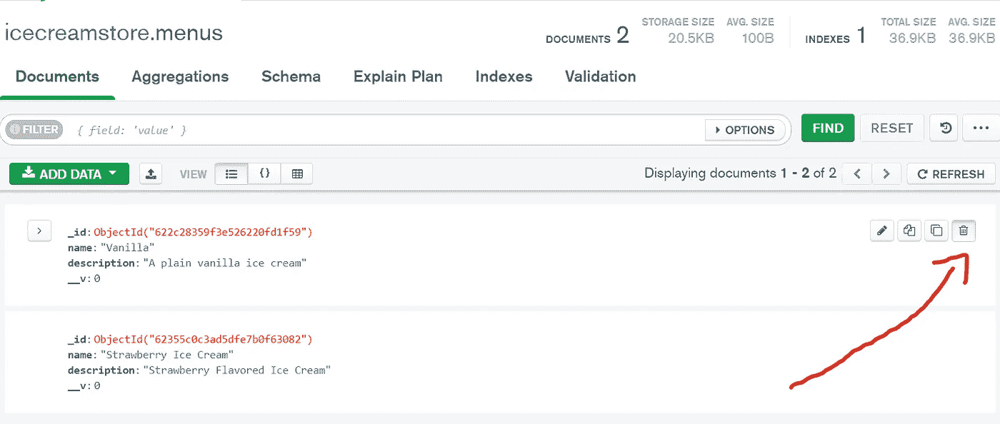

删除标志

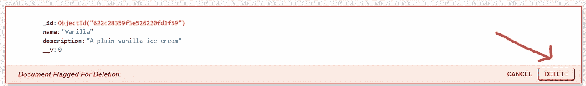

删除文档

现在，启动应用程序，用 POST /menu API 创建一个新菜单。

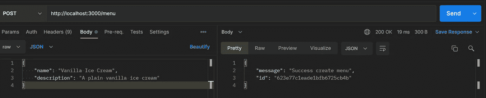

在 MongoDB Compass 上单击 refresh，我们应该看到我们的菜单和新字段一起被插入。

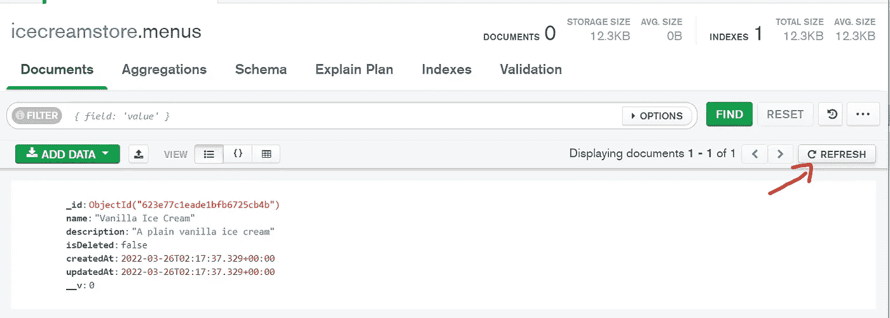

# 删除菜单 DELETE /menu/:id

我们将首先从删除操作开始。让我们回到路由器菜单，添加删除路由。要删除一个菜单文档，我们实际上可以使用 **Menu.delete** 。但是，请注意，该功能将真正永久删除我们的数据。在生产就绪应用程序场景中，我们可能不会使用真正的删除操作，相反，我们将使用**更新**，并将我们的 isDeleted 字段设置为 **false** 。要更新菜单文档，我们可以使用 **Menu.findOneAndUpdate** 。这个函数更新我们的文档，然后返回值。

## src/routes/menu/index.js

```
...router.delete('/:id', async (req, res, next) => {
  try {
    const deleted = await Menu.findOneAndUpdate(
      { _id: req.params.id, isDeleted: false },
      { isDeleted: true }
    );
    if (!deleted) {
      throw new NotFoundError('No menu deleted');
    }
    res.json(getDeleteMenuResponseDTO(deleted));
  } catch (error) {
    next(error);
  }
});...
```

## src/dto/menu.dto.js

```
...export const getDeleteMenuResponseDTO = (menu) => ({
  message: 'Success delete menu',
  id: menu._id,
});
```

让我们尝试插入另一个菜单，然后删除它。比方说，如果我们有一个失败的冰淇淋菜单，因为没有人想点它们，所以我们想删除它。

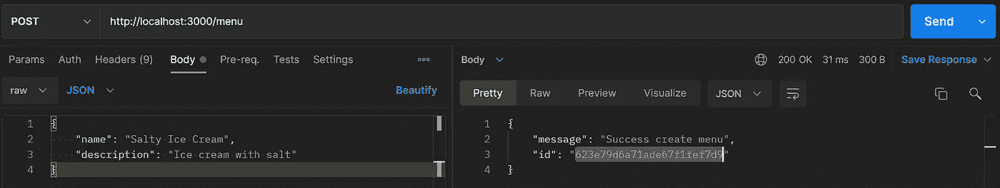

从响应中获取 id，并在我们新的删除 API 中使用它。

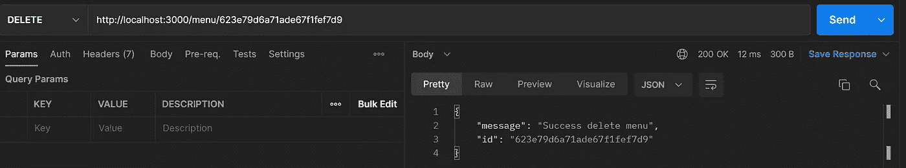

在我们的数据库中，我们可以看到咸冰淇淋的 isDeleted 值设置为 true，updatedTime 设置为当前时间戳。

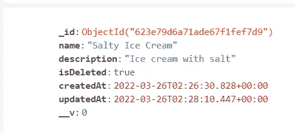

不，它还没有完成。因为我们使用的是 isDeleted 方法而不是真正的 delete，所以我们需要修改 GET 和 GET by id API，以便只检索带有 **isDeleted: false** 的文档。

src/routes/menu/index.js

```
...router.get('/', async (req, res, next) => {
  try {
    const { page = 1, limit = 10 } = req.query;
    const [menus, count] = await Promise.all([
      Menu.find({ isDeleted: false })
        .skip((page - 1) * limit)
        .limit(limit),
      Menu.count({ isDeleted: false }),
    ]); res.json(getMenuResponseDTO(menus, page, limit, count));
  } catch (error) {
    next(error);
  }
});router.get('/:id', async (req, res, next) => {
  try {
    const id = req.params.id;
    const menu = await Menu.findOne({ _id: id, isDeleted: false });
    if (!menu) {
      throw new NotFoundError('Id Not Found');
    }
    res.json(getMenuByIdResponseDTO(menu));
  } catch (err) {
    next(err);
  }
});...
```

我们的 GET API 现在应该只返回一条记录。

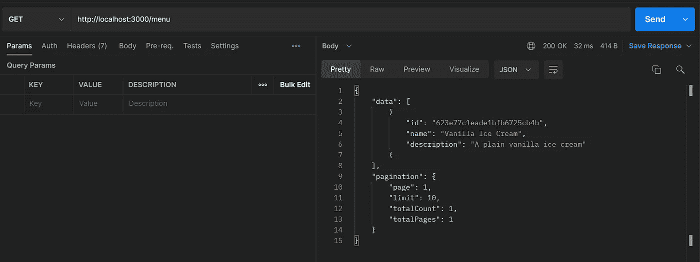

让我们也试着通过删除咸冰淇淋 id。它应该返回未找到响应。

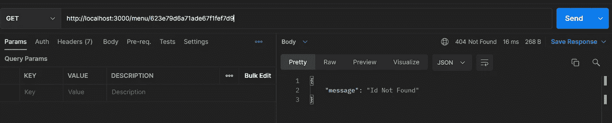

# 更新菜单补丁/菜单/:id

为了更新资源，我们通常使用 PUT 或 PATCH 方法。如果我们想更新整个文档，我们可以使用 PUT 方法。如果我们只想更新文档的一些值，我们使用 PATCH。我们将使用相同的 **Menu.findOneAndUpdate** 来更新我们的数据，但是我们需要检查请求主体中要更新的字段。让我们也传递 **new: true** 选项来返回新的更新值，而不是旧的值。我们现在可以更新菜单的名称或描述。

## src/routes/menu/index.js

```
...router.patch('/:id', async (req, res, next) => {
  try {
    const toUpdate = {};
    const { name, description } = req.body;
    if (name) toUpdate.name = name;
    if (description) toUpdate.description = description; const updated = await Menu.findOneAndUpdate(
      { _id: req.params.id, isDeleted: false },
      toUpdate,
      { new: true }
    );
    if (!updated) {
      throw new NotFoundError('No menu updated');
    }
    res.json(getUpdateMenuResponseDTO(updated));
  } catch (error) {
    next(error);
  }
});
```

## src/dto/menu.dto.js

```
export const getUpdateMenuResponseDTO = (menu) => ({
  message: 'Success update menu',
  id: menu._id,
  name: menu.name,
  description: menu.description,
});
```

让我们尝试更新华尼拉·艾斯霜的描述。

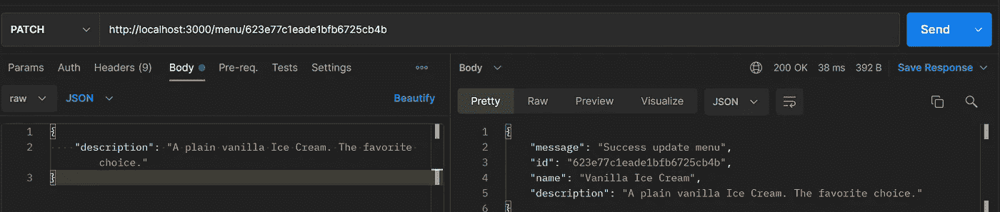

**搞定！**我们完成了菜单的 CRUD(创建、读取、更新、删除)操作实现。现在，您应该对如何开发一个最简单的 RESTful web 服务有了大致的了解。这仍然是一个相当短的部分，让我们在结束这一部分之前补充一些有用的东西。

我们可以观察到我们的 GET、PATCH 和 DELETE APIs 在请求参数中使用了 **id** 。这个 id 应该是一个有效的 MongoDB id，称为 **ObjectId** 。现在，如果我们将无效的 id 传递给请求参数，我们会得到令人讨厌的内部服务器错误响应，因为 mongoose 不能将 id 转换为 ObjectId。

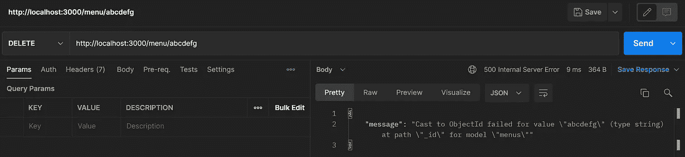

让我们来处理这个错误。对于每个使用 id 作为请求参数的 API，我们需要在到达处理函数之前验证 id。这就是中间件派上用场的地方。创建一个名为**middleware**的新文件夹，并在其中创建一个名为 **validation.js** 的文件。我们将使用来自 mongoose 的 **ObjectId.isValid** 函数。如果 id 无效，我们将抛出一个错误请求(HTTP 400)错误响应。如果 id 是一个有效的 ObjectId，我们将调用**下一个**回调函数来获得我们实际的处理函数。

## src/middleware/validation . js

```
import mongoose from 'mongoose';
import { BadRequestError } from '../lib/errors';export const validateObjectId = (req, res, next) => {
  if (!mongoose.Types.ObjectId.isValid(req.params.id)) {
    throw new BadRequestError('Invalid ObjectId in request params');
  }
  next();
};
```

## src/lib/errors.js

```
...export class BadRequestError extends Error {
  constructor(message) {
    super(message);
    this.status = 400;
  }
}
```

然后，让我们在 GET、DELETE 和 PATCH by id 路由中添加中间件 validateObjectId。将函数作为参数传递到我们的处理函数之前。

## src/routes/menu/index.js

```
import { validateObjectId } from '../../middlewares/validations';...router.get('/:id', validateObjectId, async (req, res, next) => {...router.delete('/:id', validateObjectId, async (req, res, next) => {...router.patch('/:id', validateObjectId, async (req, res, next) => {...
```

让我们尝试在 API 请求中再次使用无效的 ObjectId 作为参数。

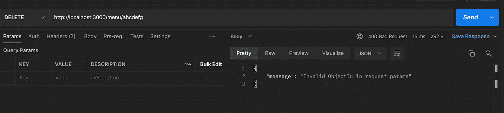

现在，我们应该得到一个错误的请求响应，其中有一条消息告诉我们 id 无效。

在下一部分中，让我们讨论我们的应用程序的数据或整体系统设计。

您可以在我的公共 github 资源库中看到完整的第 6 部分代码。
[**点击这里！**](https://github.com/bitsizelearning/icecream-store/tree/part6)

谢谢你，希望你喜欢阅读它。有没有什么错误或者是我没有解释清楚的地方？有什么我应该改进的吗？

如果你愿意的话，给作者留个便条和一些掌声来帮助频道发展。:)