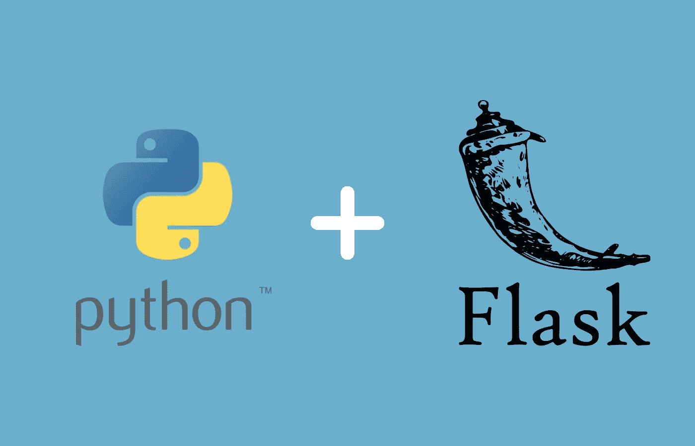
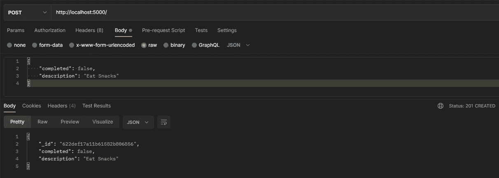
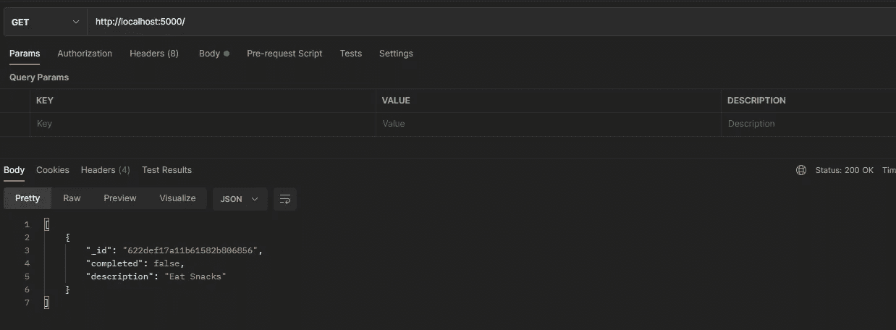
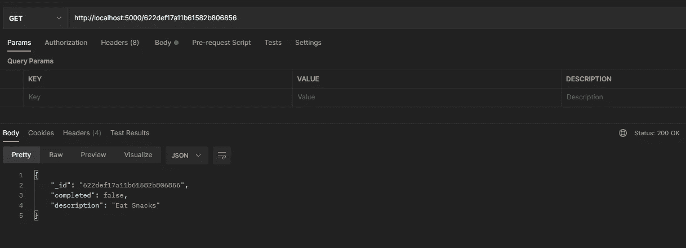
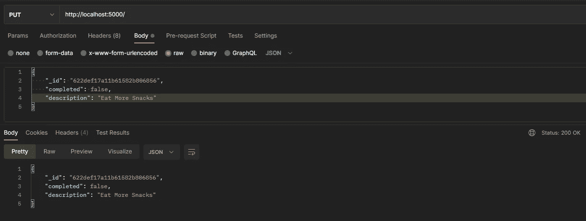
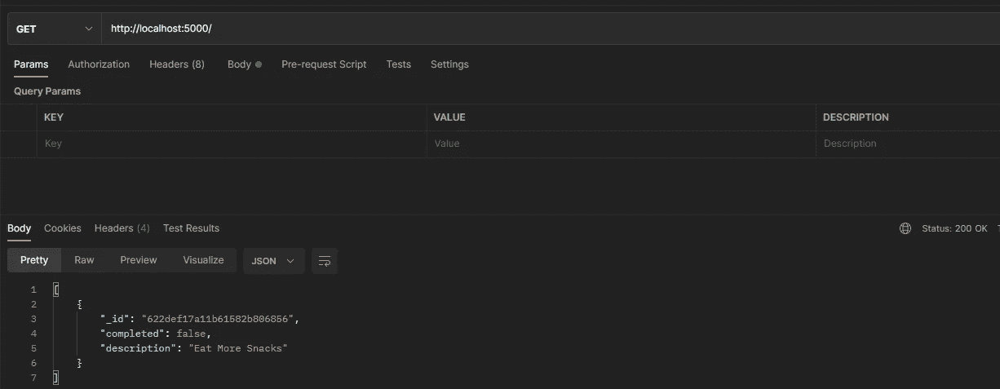
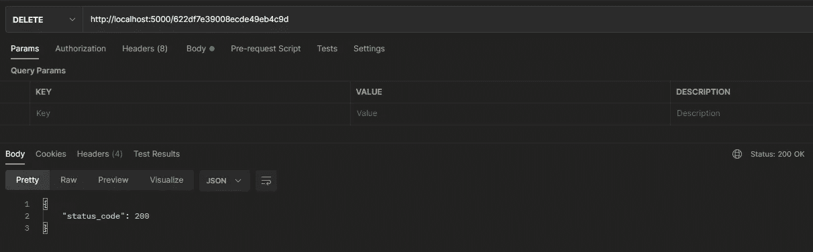

# 构建您的第一个 REST API: Python 和 Flask

> 原文：<https://blog.devgenius.io/building-your-first-rest-api-python-and-flask-6eef76524be7?source=collection_archive---------1----------------------->

使用 Python 和 Flask 在 MongoDB 数据库上执行 CRUD 操作构建第一个 RESTful web 服务的初学者友好指南。

Python 和 Flask

# 介绍

Web 开发不再仅仅是使用 HTML 和一些 CSS 创建一个单页网站，它已经发展了多年，您会发现自己经常需要将前端站点连接到某种形式的后端服务，无论是为了数据库访问还是为了处理数据。

让您的前端与后端服务通信的最简单的方法之一是创建一个 RESTful web 服务。如果你对 REST 不熟悉，甚至想知道我在说什么，你可以阅读我以前的文章，这篇文章概括了 REST 和 API 的基础知识。

在本指南中，我将使用 Python 和 Flask 创建一个 REST API。Flask 是一个使用 Python 创建 web 应用程序的“微型”框架[1]，简单来说，这意味着它不包括您的系统可能需要的所有额外模块，如数据库客户端，但它确实工作得很好，非常好；让您的 web 应用程序快速启动并运行。它可以用来创建提供动态 HTML 页面的成熟的 web 应用程序，也可以用来创建 RESTful web 服务，这就是我们在本指南中使用它的目的。

如果 Python 不是你的菜，而 Java 更适合你，我之前发表了一篇使用 [Java 和 Spring Boot](https://medium.com/codex/building-your-first-rest-api-java-and-spring-boot-5f3573f59f55) 创建 RESTful web 服务的初学者指南，去看看吧。

# 入门指南

我将在本指南中制作的系统是一个 RESTful 服务，可以用作你自己的待办事项网站或应用程序的后端，可以在你的数据库上执行创建、读取、更新和删除(CRUD)操作。对于数据库，我将把服务连接到一个本地 MongoDB 实例，要连接到一个托管的 Mongo 实例，只需添加您的连接 URL。虽然我把它命名为初学者指南，但我仍然假设您至少对 Python 和编程概念有一定的了解。

我已经将完成的项目上传到下面的 [GitHub 仓库](https://github.com/n-murray/medium-demos)，如果你愿意跟随一个完成的项目。我个人发现，我通过自己输入代码学习得更快，但可以随意克隆回购和使用包含的项目，没有来自我的判断。

我将使用 PyCharm 来创建这个项目，我发现它是完整 Python 项目的最佳 IDE 之一，当然，你也可以使用任何你熟悉的 IDE。

在撰写本文时，该项目正在使用所有组件的最新版本 [Python 3.9](https://www.python.org/downloads/release/python-390/) 、 [Flask 2.0.3](https://pypi.org/project/Flask/) 和 [Pymongo 4.0.2](https://pypi.org/project/pymongo/) 。

# 让我们写一些代码

我们要创建的第一件事是 repository 类，它将负责在 Mongo 数据库中执行 CRUD 操作。repository 类将为 Mongo 客户端连接的每个 CRUD 操作和类变量提供专用的方法。

一旦我们创建了存储库，我们将能够创建它的实例以在我们的 REST API 的方法中使用，这就是为什么将首先创建它。

toDoRepository.py 完整类

上面我已经包括了整个类，所以你可以一起看，并且更容易复制和粘贴。我现在将把它分成小块，并尽我所能解释每一个。

toDoRepository.py 第 1 部分

在知识库的第一部分，从第一行开始，我们正在导入我们将在类中使用的模块。这些模块是用于连接数据库的 MongoClient，以及一些 BSON 和 JSON 工具，用于在将待办事项文档保存到数据库之前以及从数据库中再次检索之前对其进行格式化。这种格式会让你读下去更有意义。

在第六行，我们声明我们正在创建一个名为**to store repository**的类。在第八到十一行，我们创建了 __ **init__** 方法，这个方法用于初始化我们类的一个实例。在 init 方法中，我们创建了三个对象，第一个是名为“ **client** 的对象，这个客户端是使用我们的 MongoDB 实例的主机名和端口创建的。在我的例子中，因为我使用的是 MongoDB 的本地运行实例，所以我们的主机名是' **localhost** '，端口号是 **27017** 。

如果您的机器上安装了 Docker，您可以使用下面的命令快速启动并运行 MongoDB 的本地实例。它将创建并运行一个 mongo Docker 容器，并在您的本地主机上公开端口，以便您可以连接到它。

创建 mongo Docker 容器

> 如果你想连接到一个托管的 Mongo 实例，你可以用你的 MongoDB URI 来替换本地主机和端口号..**MongoClient(' MongoDB://externalmongoinstance:27017/')**

使用**客户端**对象，我们现在将创建另一个名为“**数据库**的对象，该对象是对我们想要使用的数据库“ **todo_database** ”的引用。如果该数据库尚不存在，将会创建它。

现在我们有了对数据库的引用，我们可以在其中创建一个新的集合。这是九号线上完成的。

虽然我刚才说如果数据库和集合不存在，它们将被创建，但是我稍微撒了点谎。在 MongoDB 中，数据库和集合是延迟创建的，这意味着在向它们插入第一个文档之前，它们不会被创建。

toDoRepository.py 第 2 部分

在上面的代码块中，我们有 repository 类的前两个方法。这两个方法负责从集合中读取文档。第一个方法使用 ID 检索单个文档，第二个方法检索保存在集合中的所有 ToDo 文档。

从第一行开始的第一个方法声明了名为' **get_id(self，todo_id)** 的方法。该方法接受两个参数，self 和 todo _ id **self** 是对正在调用该方法的类的实例的引用，这允许我们访问像在我们的 init 方法中声明的那些实例变量。第二个参数是 **todo_id** ，这是我们想要从集合中检索的 todo 文档的 id。

在第二行，我们调用了 todos 集合对象的' **find_one** '方法。这个方法接受一个查询作为参数，对于我们的查询，我们传入一个带有一个键的 JSON 对象，' **_id** '。您会注意到，对于 Id 的值，我们传入了一个新的实例 **ObjectId** ，它是用我们想要查找的文档的 ID 创建的。

一旦我们有了查询的结果，我们需要把它转换成 JSON，这是因为 Mongo 使用了 BSON，它在视觉上与 JSON 相似，但又不同[2]。转换发生在第三行，对于这个新转换的 JSON 对象，我们需要对它进行更多的格式化，以便更容易处理。

格式化前后

在上面的要点中，您可以看到两个 JSON 对象，第一个是当我们从 find 方法接收文档时，文档是如何格式化的。正如您在顶部对象中看到的那样，id 有另一个对象作为值，其中包含文档 id。为了更容易处理，当我们在我们的前端收到这个，我们想格式化它，使它看起来像底部的对象。

一旦在第四行格式化，我们返回结果 JSON 对象。' **get_all** '方法与前面的非常相似，除了它在 todos 集合上使用' **find** '方法，该方法返回文档列表，每个文档都在 for 循环中格式化。

在这段代码中，我们有保存、更新和删除集合中文档的方法。**保存**方法使用“ **insert_one** 方法来保存新的待办事项。保存后，响应被格式化，我们返回新创建的文档 ID。

**update** 方法用于更新待办事项集合中的现有文档，它通过使用“ **update_one** 方法来完成此操作。这个方法接受两个参数，一个是查找要更新的文档的过滤器，第二个是在用过滤器找到的文档中设置的新值。根据传入的筛选器，update 方法可用于更新多个对象。更新后，我们将返回更新的文档数量。

**delete** 非常简单，它使用了' **delete_one** '方法，我们向该方法传递一个包含我们想要删除的待办事项 ID 的过滤器。同样，因为这个方法可以用于删除，所以我们返回被删除的文档的数量。

> 因为我们在 **update_one** 和 **delete_one** 方法中使用 ID 作为过滤器，所以我们将只更新一个文档，因为文档的 ID 应该是惟一的。如果想一次更新多个文档，可以很容易地更新过滤器，在文档中查找任何其他的键/值对。

## 其余端点

我们将创建的下一个也是最后一个脚本是服务的主类，我们将使用它来执行程序，但它也包含我们的 REST 端点。

我们应用程序的主脚本

类似于 **ToDoRepository** 类，我已经包含了上面的完整脚本，这样你可以自己通读，也更容易复制和粘贴。我现在将把脚本分解成更小的块并解释它们。

REST API 的 GET 端点

在上面的代码中，我们正在导入我们的脚本需要的模块，我们还导入了我们的**到仓库**。接下来我们要做的是创建两个对象， **app** 和 **repo** 。app 对象是 Flask 类的一个实例，这将允许我们修饰我们的方法，并允许它们被识别为我们的 REST 端点。 **repo** 对象是我们的 **ToDoRepository** 类的一个实例，这样我们就可以调用我们的 CRUD 方法来与我们的数据库进行交互。

这段代码中的两个方法用于从数据库中检索我们的待办事项，一个用于使用 ID 获取单个待办事项，另一个用于检索数据库中的所有待办事项。我们通过使用刚刚在我们的**到仓库**类中创建的 **get_all** 和 **get_id** 方法来实现这一点。这里需要注意的重要一点是我们如何在 **get_todo** 方法中接收 ID，我们是通过 URL 接收的。这是通过在方法" **/ < string 上方的装饰器路径中添加以下内容来实现的:todo_id > "** 。这告诉 Flask，我们期望一个字符串值作为路径参数，它将被称为 **todo_id，**这个值然后可以在方法中用于调用我们的 **ToDoRepository 的 **get_id** 方法。**

一旦从我们的数据库中检索出来，我们就将待办事项文档转换成一个 JSON 对象，并返回一个 HTTP 状态代码 200，这意味着请求成功了。Flask 足够聪明，可以为我们处理大多数不成功的响应。

> 上述两个 get 方法可以很容易地合并成一个方法，因为除了用来查找文档的 get 方法之外，大部分逻辑都是相同的。这可以通过检查方法是否收到 todo_id 的条件很容易地解决。

## 创建和更新

上面的要点包含了我们的 POST 和 PUT 方法，它们分别用于创建新的待办事项和更新集合中现有的待办事项。

在名为 **'save_todo'** 的 **POST** 方法中，我们正在读取用于调用该方法的 HTTP 请求的主体，我们使用' **request.get_json()'** 来完成此操作，这将在 json 对象中返回请求的主体。这个 JSON 对象是我们想要保存的新待办事项。为了保存它，我们使用我们的**To store repository 的 **save** 方法，**因为我们的 save 方法返回新保存的文档的 ID，我们可以使用它在我们的集合中找到新的 To-Do，并在我们的 HTTP 响应的主体中返回它，状态码为 201，这表示有东西被创建了。

**PUT** 方法用于更新现有的 to do，我们可以使用我们的**to store**的 **update** 方法来做这件事。PUT 方法读取请求的主体，类似于 POST 方法，一旦我们有了在请求中发送的 ToDo，我们就将 ID 保存到它自己的变量中，供以后在方法中使用。因为 **ToDoRepository 的更新方法，**返回了更新的文档的数量，我们可以检查这个数量，看看更新是否成功。如果成功，我们可以使用之前保存的 ID 从集合中检索最新更新的文档，并在响应中返回状态代码为 200 的文档。如果更新不成功，例如，如果我们试图更新一个不存在的 ToDo，我们可以返回状态代码 404，这表示没有找到资源。

## 删除

delete 方法非常容易理解，它接受一个 ID 作为 URL 中的路径参数，并使用它来调用**to store story 的 **delete** 方法。**delete 方法的响应是从数据库中删除的文档数，因此我们可以使用它来检查删除是否成功。如果删除的文档数大于或等于 1，则表示成功，我们可以返回一个 HTTP 状态代码 200，否则我们将返回一个 404。

上述要点的最后一部分是调用脚本顶部创建的 Flask 对象的 **run** 方法。这将启动我们的 REST 服务，如果一切正常，它将准备好接收请求。

# 测试我们新的 REST API

既然我们已经写好了代码，我们将需要以某种方式测试它，我们可以通过运行应用程序并使用 REST 客户端(如 [Postman](https://www.postman.com/) )向它发送一些请求来完成。

要运行我们的应用程序，我们可以使用您的 IDE(如 PyCharm)来运行它，或者如果您愿意，您可以通过导航到您的 **app.py** 脚本所在的文件夹并运行以下命令来使用终端来运行它。

启动应用程序

在启动您的应用程序之前，确保您的 MongoDB 实例在本地运行，以便 **ToDoRepository** 可以连接到它。

好，让我们开始测试我们的端点。我们将首先测试 POST 方法，因为 GET 方法不会返回任何内容，直到我们向数据库添加一些待办事项。我们可以将下面的 JSON 对象发布到这个 URL:"**http://localhost:5000/**"

该对象有两个键，一个是跟踪待办事项完成状态的布尔值，另一个是描述任务的字符串。使用 Postman，我已经将上面的 JSON 发送到 POST 端点。

在 Postman 中发布请求和响应

在图像中，您可以看到响应对象包含新创建的待办事项，并添加了一个 **_id** 值。你可能还注意到我们的响应返回了一个 **201，在图像的中间右侧创建了**。

现在我们已经在数据库中存储了一些东西，我们可以测试 GET 方法了。我们可以通过向上述相同的 URL 发送 GET 请求来做到这一点。

在邮递员中获取请求和响应

在图片中，你会看到我们已经收到了我们的待办事项创建请求，我们也收到了一个状态码 **200 OK。**因为上面的 URL 没有添加任何路径参数，所以我们调用了 **get_todos** 方法，该方法将返回集合中的所有文档。接下来，我们应该测试我们的 **get_todo** 方法，它将根据 ID 返回一个特定的待办事项。为此，我们可以添加从之前的一个响应中收到的 ID，并将其添加到 URL 中，然后发送 GET 请求。

在邮递员中获取单个待办事项请求

在上图中，您会注意到我们收到了一个返回的对象，它不像前面的 GET 请求那样是列表的一部分。

接下来，我们可以测试我们的 PUT 方法，这与我们的 POST 请求类似，只是请求的主体还应该包含一个 ID。

将请求和响应放入邮递员中

在上图中，你会看到我们发送了由 POST 请求创建的待办事项，只是我们将描述从“吃零食”改为了“多吃零食”。这将使用给定的 ID 将我们数据库中的待办事项更新为该请求中发送的值，正如在响应中可以看到的那样，它已经做到了这一点。为了验证这一点，我们可以再次使用 GET 方法来交叉检查结果。

检查我们的卖出结果

我们需要测试的最后一个方法是我们的 DELETE 方法。这非常简单，我们可以使用上面 GET 请求中的 URL 和 path 参数来发送删除请求。

在邮递员中删除请求和响应

在响应中，我们可以看到我们得到了状态代码 200，这意味着我们的删除成功了，同样，我们可以使用 GET 方法来验证这一点。

就是这样！我们已经使用 Flask 和 Python 创建并测试了一个 REST API！从这里开始，我建议试着把上面的方法变得更复杂一点，或者添加更多的方法来查找包含特定值的待办事项，而不仅仅是通过它们的 ID。你越是使用 Flask，尝试新事物，你就会越了解它是如何工作的，试着将脚本添加到 Docker 映像并在容器中运行怎么样。

# 包扎

我希望你已经启动了这个项目，并且能够像预期的那样工作，并且能够测试 REST API，如果你没有，并且发现了指南中的一些问题，请在故事中留下回复，我会尽我所能帮助你。如果您发现指南有任何问题或我可以做得更好的任何事情，请随时教育我并留下回复！像我所有的文章一样，我写这篇文章是为了给自己和他人一个教育经历，所以我欢迎任何建设性的反馈。如果你喜欢这个指南，可以考虑让[订阅](https://n-murray.medium.com/subscribe)来更新我未来的文章。我计划做一个关于这个项目和我的 [Java 和 Spring Boot](https://medium.com/codex/building-your-first-rest-api-java-and-spring-boot-5f3573f59f55) 项目的容器化的指南，并在 Docker 中运行它们，所以如果这听起来很有趣，考虑跟随我获取更新，如果你还不是 Medium 的会员，你可以使用[我的会员链接](https://n-murray.medium.com/membership)加入。

# 参考

https://flask.palletsprojects.com/en/2.0.x/foreword/1]^

https://www.mongodb.com/json-and-bson【2]^