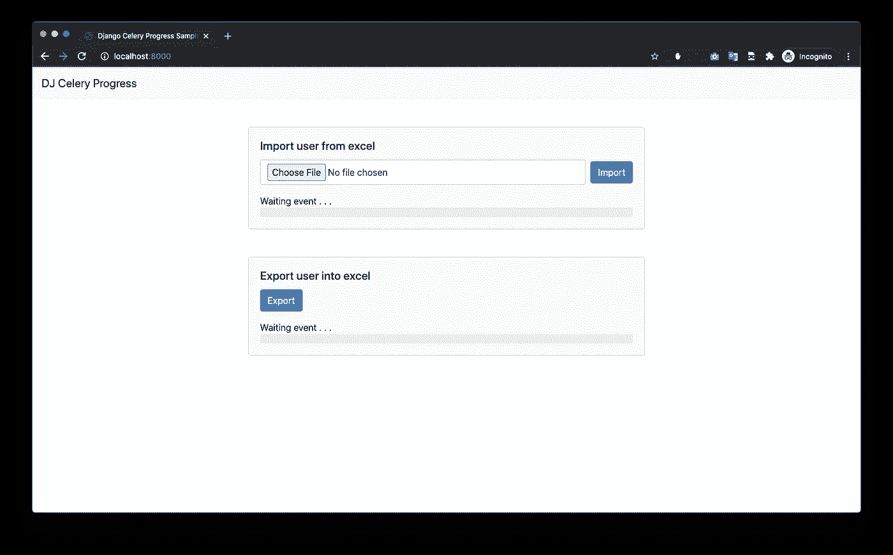
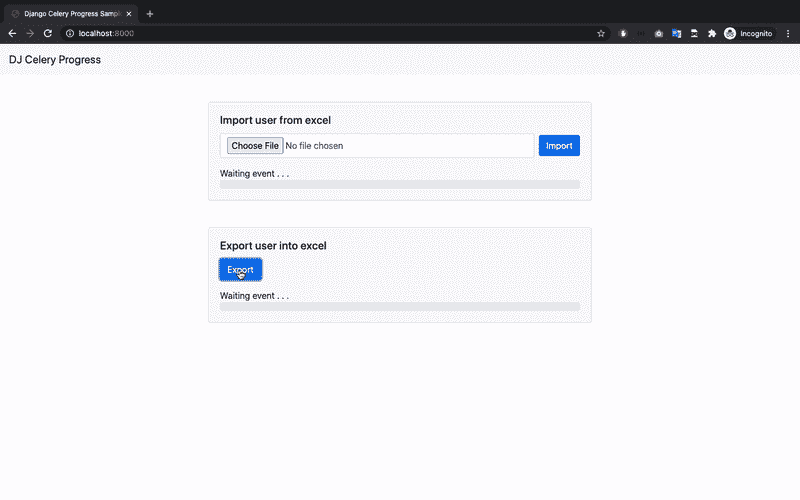

# 使用 Django + Celery + Pandas + ❤️和进度条构建您自己的导出和导入数据到 Excel

> 原文：<https://blog.devgenius.io/building-your-own-export-and-import-data-into-excel-using-django-celery-pandas-%EF%B8%8F-with-784fd688e328?source=collection_archive---------0----------------------->

## 编程，PYTHON，DJANGO

## 使用 celery 任务队列跟踪进程的进度


来源:[https://buildwithdjango . com/static/blog/progress-bars/async-task-architecture . png](https://buildwithdjango.com/static/blog/progress-bars/async-task-architecture.png)

# 背景

几个月前，我一直致力于创建一个导出和导入数据的功能。我正在创建特性，测试，并顺利运行。直到享受了几天的特色，敌人的到来打破了我的舒适。敌人是被**线程阻挡的**。是的，导出和导入功能运行在主线程上，并阻塞另一个运行在其上的进程。我已经搜索，堆栈溢出，并在互联网上寻找解决方案。来自我的工程主管的一个关键词，但是很有价值。使用 [**芹菜**](https://docs.celeryproject.org/) 在另一个线程中运行进程。啊哈，我觉得找到了好的解决办法，我的大脑试图假设和想象芹菜是多么强大。我试图找到如何将我的应用程序与芹菜集成的示例，尝试谷歌搜索并再次堆栈溢出。在这篇文章发表之前，我还没有找到有完整解决方案的文章。

根据我的经验，我试图做一些完整的文章来帮助其他想建立类似功能的人。

# 先决条件

我的公司使用 Django Web Framework 作为我们构建 Web 应用程序和 RESTful API 的主要框架来构建应用程序。

完整的先决条件如下所示:

## [**姜戈**](https://www.djangoproject.com/)

Django 是我见过的能更快构建应用程序的最佳框架之一。这个框架基于 Python，提供了丰富的特性和模块，帮助我们构建、测试、保护和部署我们的应用程序。你可以在 Django 官方网站找到关于 Django 的详细描述。

## [芹菜](https://docs.celeryproject.org/)

Celery 是一个强大的 python 库，可以帮助我们提高应用程序的性能。根据芹菜官方文档网站，芹菜是。。。

> Celery 是一个简单、灵活、可靠的分布式系统，用于处理大量的消息，同时提供维护这样一个系统所需的工具。

## [熊猫](https://pandas.pydata.org/)

Pandas 是数据科学家用来处理大型数据集的最常用的 python 库之一。Pandas 具有丰富的功能，允许我们从多种文档格式加载数据，如 Microsoft Excel 2007、Microsoft Excel 2010、CSV、纯文本和另一种未列出的格式。在[官方文件](https://pandas.pydata.org/)中找到熊猫的完整描述。

## [Openpyxl](https://openpyxl.readthedocs.io/)

Openpyxl 是 python 库之一，它允许我们修改 Excel 文件。我选择 openpyxl 的主要原因是这个库能够修改现有的 Excel 文档，以便逐行插入，插入特定的行和列，并且易于对单元格进行样式化。我喜欢在我的应用程序中使用这个库。

## [芹菜-进展](https://github.com/czue/celery-progress)

为你的 Django/Celery 应用程序提供无依赖进度条。超级简单的设置。大量定制可用。

完整的应用需求可以在找到[。](https://github.com/ebysofyan/django-celery-progress-sample/blob/master/requirements.txt)

> 空谈是廉价的，给我看看代码

# 代码

为了开始编写代码，我假设您对 Django 有基本的了解，并且了解如何配置 Django 项目。

喝了咖啡，继续看书。。。

## **1。创建项目和安装需求**

创建 Django 项目并将该文件作为您最喜欢的目录结构。如果您的项目已经创建，请安装上面列出的要求或在这里找到完整的要求。
运行以下命令

```
pip install requirements.txt
```

## 2.配置应用程序设置

安装完所有的需求之后，通过将库的`app_name`注册到`INSTALLED_APPS`部分特定位置的`settings.py`中来配置您的应用程序设置。

```
....INSTALLED_APPS = [
     "...."
     "celery_progress",
     "django_extensions",
     "corsheaders",
     "core",
]
```

## 3.配置芹菜集成

Celery 需要一个消息代理后端来处理消息排队、存储数据和缓存数据。有许多消息代理后端已经被大公司使用和维护，如 Redis，RabbitMQ，亚马逊 SQS，Zookeeper 等。在这篇文章发表之前，celery 支持提到的消息代理。详情可以查看[芹菜经纪人文档](https://docs.celeryproject.org/en/stable/getting-started/brokers/)。

在本文中，我使用 Redis 作为消息代理后端，因为它易于安装、配置，并得到大公司如 Twitter、Github、StackOverflow、Pinterest 等的验证。

您可以看到下面的芹菜样本配置

## 4.创建网页以执行导出和导入

本文不是关于如何使用 Django 创建网页的教程。我假设你能够使用 Django 创建自己的网页。如果你不知道如何设计你的网页，我可以提供下面的例子。不复杂，但足以运行该功能。



## 5.创建您的芹菜任务

我们有两个主要特性需要在另一个线程上运行。为什么？

**导出数据:**假设您的数据库中有一千行数据，您想将其追加到 excel 文件中。处理它可能需要 1 分钟。供您参考，Django 运行在单线程上，如果您在同一个线程上运行一个长时间运行的进程，它会很拥挤。

**导入数据:**你需要从 excel 文件中导入一千行数据？相信我，你需要在另一个进程上运行它。

好，让我们创建第一个芹菜任务。任务只是一个普通的类和/或函数，你经常通过键入`class`或`def` 来标识它们:D. Celery 有两种方法来定义任务，第一种是使用函数，另一种是使用类。如果你有一个小任务，我建议你使用函数，并与类不同的情况。让我们看看下面的例子。

## 6.运行 Django 和 Celery 服务器

两个应用程序都需要运行任一服务器。Django 服务器运行 web 应用程序，celery 服务器监听来自注册任务的消息事件请求。

```
# Command to run Django server
python manage.py runserver 0.0.0.0:8000 #or another available port# Command to run celery server
celery -A dj_celery_progress_sample worker --loglevel=DEBUG
```

## 7.运行芹菜任务

芹菜类和函数库有相似的方式调用和运行任务。常规的类和函数调用与芹菜任务调用的不同之处在于，如果你运行芹菜任务类或函数，你需要调用`delay`关键字。

```
# function base task
count_thousand_number.delay()# class base task
ImportUserFromExcelTask().delay("path/to/excel/file.xlsx")
```

## 8.使用 celery-progress 跟踪您的导入或导出进度

在这个示例中，我使用`celery-progress`库来创建进度计数器，并将进度集成到网页中。要使用这个库，从这个库中导入`ProgressRecorder`类并调用`set_progress`函数来计算进度。

```
progress_recorder = ProgressRecorder(*self*)
for index in range(0, 1000):
    progress_recorder.set_progress(
        index + 1, 
        *total*=total_record, 
        *description*="Inserting record into row"
    )
```

关于本库的完整用法，可以在文档中找到。

[](https://github.com/czue/celery-progress) [## czue/芹菜-进展

### 为您的 Django/Celery 应用程序提供可配置的无依赖进度条。-czue/芹菜-进展

github.com](https://github.com/czue/celery-progress) 

## 9.在网页中显示进度

无论何时你想要整合第八步中提到的进展，你都需要在你的网页中添加一些`javascript`代码。您可以使用上面文档中提供的样式，或者您可以创建自己的自定义样式进度来显示您的导入或导出进度。如果你喜欢将自定义进度集成到你的自定义进度条中，你可以在这里找到示例。

## 10.是的，我们达到了最终的结果👏🏼

在我们一步一步地描述这篇文章之后，我们到达结果的结尾。结果如下图所示。



# 闭幕

感谢您的关注，您可以在我的 Github 上找到完整的源代码，如果它有错误，请创建一个问题，欢迎您的请求来使它变得更好。不要犹豫提出你的问题。。。谢谢你

[](https://github.com/ebysofyan/django-celery-progress-sample) [## ebysofyan/django-芹菜-进度-样本

### 👻一个存储库，使用 Django + Celery + Pandas 和一个…

github.com](https://github.com/ebysofyan/django-celery-progress-sample) 

# 参考

*   [https://docs . celery project . org/en/stable/getting-started/brokers/](https://docs.celeryproject.org/en/stable/getting-started/brokers/)
*   [https://redis.io/topics/whos-using-redis](https://redis.io/topics/whos-using-redis)