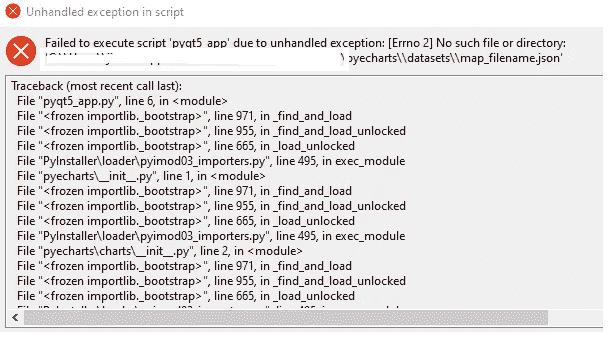

# 构建自己的 Python 数据可视化桌面应用程序

> 原文：<https://blog.devgenius.io/building-your-own-python-data-visualization-desktop-app-f82dd1f9b2ed?source=collection_archive---------1----------------------->

## 使用 PyQt5、Pyecharts 和 echarts 构建可视化应用程序


在 [Unsplash](https://unsplash.com?utm_source=medium&utm_medium=referral) 上由 [Austin Distel](https://unsplash.com/@austindistel?utm_source=medium&utm_medium=referral) 拍摄的照片

ECharts 是百度的一款开源数据可视化工具，缩写自企业级图表，商业级数据图表。这是一个非常吸引人的、用户友好的、广泛使用的数据可视化工具。

【https://echarts.apache.org/en/index.html 官方文件:

我就不赘述了，因为网上有很多关于 ECharts 的信息。本文主要讲的是如何用 10 分钟的时间，结合 PyQt5 和 Echarts，构建自己的数据可视化桌面 App。

**表格内容:**

[PyQt5 用于数据可视化](#400a)
[实现](#a3ee)
∘[pyqt 5 和 Pyecharts 的组合(不在 Pyinstaller 打包时工作)](#2a74)
∘ [获取股票数据](#e250)
∘ [创建 AppMainWindow](#7f8c)
∘ [完整代码片段:](#7485)
∘[pyqt 5 和 echarts 的组合(在 Pyinstaller 打包时工作)【T29](#1cba)

# 用于数据可视化的 PyQt5

在开始编码之前，我们先来谈谈 PyQt5 的数据可视化。有许多数据可视化工具可以与 PyQt5 集成，如 QtChart、PyQtGraph、Plotly，当然包括 Pyecharts 和 echarts 等等。

就我个人而言，我最近才开发了一些可视化工具，比如 Plotly、Boken、Matplotlib、Seaborn、Pyecharts、echarts 等等。我发现 Pyecharts 和 echarts 是最吸引人的，也是最实用的，但是用的人比较少。

**【可选】如果想了解更多可视化工具之间的区别，请看我之前的**[](https://edwardlow0620.medium.com/the-battle-among-4-python-data-visualization-tools-f4e90ab157ac)****。****

**此外，当使用 pyinstaller 打包 PyQt5 时，所有这些库(不包括 QtChart)都面临同样的问题。所以，最后，Pyecharts 和 echarts 是我做这个演示的选择。**

**为什么我一直把 Pyecharts 和 echarts 分开说？因为您可以在 PyQt5 程序中单独使用 Pyecharts 或 echarts 进行数据可视化，但有一点不同。虽然 Pyecharts 和 echarts 的核心思想非常相似，但是在 pyqt 5 应用程序中有一个显著的变化。**

**下面我提供 Pyecharts 和 echarts 实现代码，希望对大家有所帮助。**

# **履行**

## **PyQt5 和 Pyecharts 的组合(当 Pyinstaller 打包时不起作用)**

**如果您的环境中还没有安装相关的包，不要忘记安装。**

```
pip install PyQt5
pip install PyQtWebEngine
pip install pyecharts
pip install pandas_datareader
pip install pandas
```

****导入模块:****

```
import sys
from PyQt5.QtWidgets import *
from PyQt5.QtCore import *
from PyQt5.QtWebEngineWidgets import QWebEngineView

from pyecharts.charts import Line
from pyecharts import options as opts

from datetime import datetime
from datetime import timedelta
import pandas_datareader as data_reader
import pandas as pd
import os
```

**在这个阶段，我将为这个应用程序的实现导入必要的模块。**

## ****获取股票数据****

```
def get_stock_data(stocktickers, days):

    start = (datetime.now() - timedelta(days=days)).strftime('%Y-%m-%d')
    end = (datetime.now()).strftime('%Y-%m-%d')
    stock = []
    for stockticker in stocktickers:
        data = data_reader.DataReader(stockticker, 'yahoo', start, end)
        data['stock_ticker'] = stockticker
        stock.append(data)

    return pd.concat(stock)
```

**使用 pandas_reader 定义一个从 Yahoo Finance 中提取数据的函数。如果你读过我以前的帖子，这个函数在最小改动中被重用了几次。如果你是数据科学领域的新生，可以看看这篇[帖子](https://medium.datadriveninvestor.com/stock-market-analysis-with-python-plotly-dash-and-powerbi-48975c48fe73)。**

## **创建 AppMainWindow**

```
class MainWindow(QMainWindow):

    def __init__(self, *args, **kwargs):
        super().__init__(*args, **kwargs)
        self.setWindowTitle('Stock Market App with Pyecharts')
        self.showMaximized()

        self.view = QWebEngineView()
        self.setCentralWidget(self.view)

        self.create_line_chart()
```

**在这一节中，我们使用 OOP 继承思想定义了这个类。**

****代码解释:****

```
#Initialize the QMainWindow Object
super().__init__(*args, **kwargs)#Set the app title
self.setWindowTitle('Stock Market App with Pyecharts')#Set Maximum Screen
self.showMaximized()# Create QWebEngineView Widget, for embedded the chart from html
self.view = QWebEngineView()
self.setCentralWidget(self.view)
self.create_line_chart()
```

****使用 Pyecharts 创建折线图****

```
def create_line_chart(self):
    data = get_stock_data(['GOOG'], 14)
    stockDate = data.index.tolist()
    open = data['Open'].tolist()
    close = data['Close'].tolist()

    line = (
        Line()
            .add_xaxis(xaxis_data=stockDate)
            .add_yaxis(series_name="Open", y_axis=open, symbol="circle", is_symbol_show=True,is_smooth=True,is_selected=True)
            .add_yaxis(series_name="Close", y_axis=close, symbol="circle", is_symbol_show=True,is_smooth=True,is_selected=True)
            .set_series_opts(label_opts=opts.LabelOpts(is_show=False))
            .set_global_opts(title_opts=opts.TitleOpts(title="Stock Market Info"))
    )

    html_file = (os.getcwd() + "\\stockchart.html")
    line.render(path=html_file)
    self.view.load(QUrl.fromLocalFile(html_file))
```

****代码解释:****

```
# Get the Stock Data, and convert to ArrayList from Dataframe, the reason, PyEcharts only allow for Array Inputdata = get_stock_data(['GOOG'], 14)
stockDate = data.index.tolist()
open = data['Open'].tolist()
close = data['Close'].tolist()# Creating the line chart and passing the data
line = (
        Line()
            .add_xaxis(xaxis_data=**stockDate**)
            .add_yaxis(series_name="Open", y_axis=**open**, symbol="circle", is_symbol_show=True,is_smooth=True,is_selected=True)
            .add_yaxis(series_name="Close", y_axis=**close**, symbol="circle", is_symbol_show=True,is_smooth=True,is_selected=True)
            .set_series_opts(label_opts=opts.LabelOpts(is_show=False))
            .set_global_opts(title_opts=opts.TitleOpts(title="Stock Market Info"))
    )#Render the line chart and save as html file
html_file = (os.getcwd() + "\\stockchart.html")
line.render(path=html_file)# Insert into the PyEcharts Window
self.view.load(QUrl.fromLocalFile(html_file))
```

****爽！！！10 分钟打造我们自己的桌面应用。让我们看看输出。****

****

**由作者编码(版权归作者所有)**

**我们的第一个 DIY 可视化工具已经准备好了。但是正如副标题所说，这个与 Pyinstaller 打包不兼容。让我们证明这一点。**

```
pip install pyinstaller
```

**如果您的环境中没有安装 pyinstaller，请安装它。**

****Pyinstaller 生成 Exe 文件****

****

**由作者编码(版权归作者所有)**

```
pyinstaller pyqt5_app.py --onefile --noconsoleFormat: pyinstaller <app_file> <Optional>--onefile ## Bundle all file into a single file
--noconsole ## Generate without command prompt console
```

****

**由作者编码(版权归作者所有)**

**一旦你看到这几行，你的应用程序就成功生成了。**

****

**由作者编码(版权归作者所有)**

**转到您找到的文件目录，检查 dist 文件夹并运行 <your_app_file>.exe。</your_app_file>**

****

**由作者编码(版权归作者所有)**

**不幸的是，如果这个异常窗口出现，它意味着您的应用程序没有成功执行。要解决这个问题，请看我将在下一节提到的第二个解决方案。**

## **完整的代码片段:**

**由作者编码(版权归作者所有)**

## **PyQt5 和 Echarts 的组合(在 Pyinstaller 打包时工作)**

**代码几乎一样，只是与 create_line_chart 函数略有不同。**

```
def create_line_chart(self):

        data = get_stock_data(['GOOG'], 14)

        date = ['Measure'] + [x.strftime('%Y-%m-%d') for x in data.index.tolist()]
        open = ['Open'] + data['Open'].tolist()
        close = ['Close'] +  data['Close'].tolist()
        source_data = [date, open, close]

        the_html_content ='''
<!DOCTYPE html>
<html style="height: 50%; width:50%">
    <head>
        <meta charset="utf-8">
    </head>
    <body style="height: 100%; margin: 0">
        <div id="container" style="height: 100%"></div>

        <script type="text/javascript" src="https://cdn.jsdelivr.net/npm/echarts@5/dist/echarts.min.js"></script>

        <script type="text/javascript">
var dom = document.getElementById("container");
var myChart = echarts.init(dom);
var app = {};

var option;

setTimeout(function () {

    option = {
        legend: {},
        tooltip: {
            trigger: 'axis',
            showContent: false
        },
        dataset: {
            source: '''+ '{}'.format(source_data) +'''
        },
        xAxis: {type: 'category'},
        yAxis: {gridIndex: 0},
        series: [
            {type: 'line', smooth: true, seriesLayoutBy: 'row', emphasis: {focus: 'series'}},
            {type: 'line', smooth: true, seriesLayoutBy: 'row', emphasis: {focus: 'series'}},
            {type: 'line', smooth: true, seriesLayoutBy: 'row', emphasis: {focus: 'series'}},
            {type: 'line', smooth: true, seriesLayoutBy: 'row', emphasis: {focus: 'series'}},

        ]
    };
    myChart.setOption(option);
});

if (option && typeof option === 'object') {
    myChart.setOption(option);
}

        </script>
    </body>
</html>
        '''

        self.view.setHtml(the_html_content)
```

**显然，我们将 Python 代码与 Javascript 和 HTML 结合使用。折线图由 e chart 使用 Javascript 呈现。**

****代码解释(重要部分):****

```
#Note the structure of the data **(Nested Array)** is different as PyEchartsdate = ['Measure'] + [x.strftime('%Y-%m-%d') for x in data.index.tolist()]
open = ['Open'] + data['Open'].tolist()
close = ['Close'] +  data['Close'].tolist()
source_data = [date, open, close]#Include the **echarts.min.js** file
<script type="text/javascript" src="https://cdn.jsdelivr.net/npm/echarts@5/dist/echarts.min.js"></script>#Pass data that need to render into the chart
dataset: {
            source: '''+ '{}'.format(source_data) +'''
},#Different from Pyechart, skip one step for render HTML FILE, direct set to the PyQt5
self.view.setHtml(the_html_content)
```

****输出:****

****

**由作者编码(版权归作者所有)**

****太神奇了！！！3 分钟修改代码并呈现相同的输出。****

**还有一步，让我们用 Pyinstaller 进行测试。**

```
pyinstaller pyqt5_echart.py --onefile --noconsole
```

****

**由作者编码(版权归作者所有)**

****

**由作者编码(版权归作者所有)**

****

**由作者编码(版权归作者所有)**

****妙极了！！！！它正在成功地工作。****

****完整代码片段:****

**由作者编码(版权归作者所有)**

# **结论**

**总之，如果您需要 pyinstaller 打包，您应该混合使用 pyqt5 和 Echarts。**

**Echarts chart HTML 模板可从官方网站的示例中获得和下载。**

**最基本的字符串操作是 HTML 文本编辑和参数传递。这里我不打算讲太多细节。基本操作有点笨拙，但不难。**

# **参考**

1.  **[https://echarts.apache.org/examples/en/index.html](https://echarts.apache.org/examples/en/index.html)**
2.  **[https://pyecharts.org/#/](https://pyecharts.org/#/)**