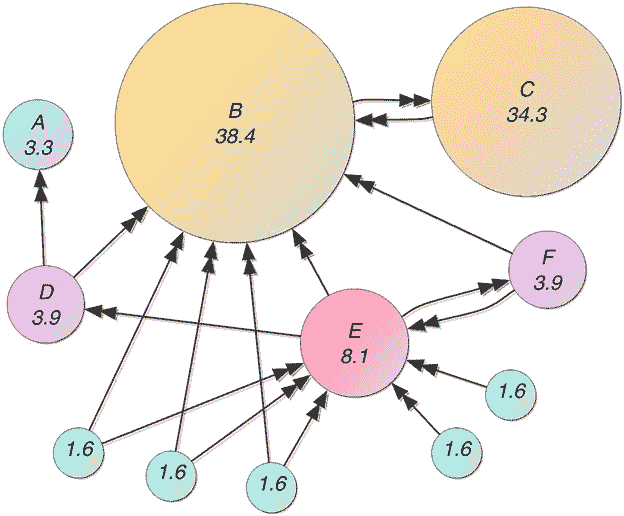

# 从头开始构建自己的搜索引擎

> 原文：<https://blog.devgenius.io/building-your-own-search-engine-from-scratch-e542a1068c44?source=collection_archive---------0----------------------->

## 现代搜索的基础是什么？简单的概念。

你每天在网上搜索多少次？5, 20, 50?如果谷歌是你选择的搜索引擎，你可以在这里查看你的搜索历史。

尽管搜索深深地隐藏在我们的日常活动和与世界的互动中，但很少有人了解它是如何工作的。在这篇文章中，我致力于阐明搜索的基础。这是从实现一个搜索引擎，基于[最初的谷歌实现。](https://research.google/pubs/pub334/)


照片由[本杰明达达](https://unsplash.com/@dadaben_?utm_source=medium&utm_medium=referral)在 [Unsplash](https://unsplash.com?utm_source=medium&utm_medium=referral) 上拍摄

首先，我们来看一个预备步骤:**了解 web 服务器**。什么是*客户端-服务器* *基础设施*？您的电脑如何连接到网站？

你将会看到当一个搜索引擎连接到你的电脑、网站或其他任何东西时会发生什么。

然后，我们将浏览搜索引擎的三个基本部分:爬虫、索引器和 PageRank 算法。这些都会让你对构成互联网的*蜘蛛网的连接有更深刻的理解。*

最后，我们将看看这些组件是如何组合起来产生我们的最终奖品:搜索引擎！准备好开始了吗？我们走吧！

# 第 0 部分:Web 服务器

强大的网络服务器！每当您在浏览器中搜索 URL 时，您的计算机都会联系 web 服务器。您的浏览器充当客户端，发送请求，类似于业务客户端。服务器是接受所有这些请求的销售代表，并行处理它们。

请求是文本。服务器知道如何读取它们，因为它希望它们具有特定的结构(现在最常见的协议/结构是 [HTTP/1.1](https://datatracker.ietf.org/doc/html/rfc2616) )。

示例请求:

```
GET /hello HTTP/1.1
User-Agent: Mozilla/4.0 (compatible; MSIE5.01; Windows NT)
Host: [www.sample-why-david-y.com](http://www.sample-why-david-y.com)
Accept-Language: en-us
Accept-Encoding: gzip, deflate
Connection: Keep-Alive
Cookie: user=why-david-y
```

请求可以有参数，由它的 cookies 列表给出。它可能有一个包含更多信息的主体。响应遵循类似的格式，允许服务器返回参数和主体供客户端读取。随着互联网变得越来越互动，所有生成内容的艰苦工作都在服务器上完成。

如果您想对 web 服务器或客户机进行编程，有许多库可供您完成大部分解析和底层工作。请记住，客户端请求和服务器响应只是一种组织文本的方式。这意味着我们都在说一种共同的语言！

# 第 1 部分:爬行器

如果你正在构建一个搜索引擎，爬虫是你花费大量时间的地方。爬虫浏览开放的互联网，从预定义的种子列表开始(例如 Wikipedia.com、NYT.com、NYT.com)。它将读取每一页，保存它，并将新链接添加到它的 URL 边界，这是它要抓取的链接队列


照片由[凯文悲伤](https://unsplash.com/@grievek1610begur?utm_source=medium&utm_medium=referral)在 [Unsplash](https://unsplash.com?utm_source=medium&utm_medium=referral)

许多域名也有一个 **robots.txt 文件**，比如 google.com/robots.txt.这个页面规定了爬虫必须遵守的规则，以避免违反任何法律或被视为垃圾邮件制造者。例如，某些子域不能被抓取，每次抓取之间可能有一个最短时间。

为什么这么多时间花在这里？互联网非常松散，是无政府主义者的梦想。当然，我们可能有一些达成一致的规范，但是**直到你写了一个爬虫**你才会意识到它们被破坏了多少。

例如，假设你的爬虫读取 HTML 页面，因为它们是有结构的。例如，作者仍然可以将非链接放在链接标签中，破坏程序中的一些隐含逻辑。可能会有电子邮件(test@test.com)、句子和其他文本被您的验证遗漏。

你可能在爬一个每次看起来都不一样但实际上生成动态内容的页面，比如包括当前时间？如果页面 A 重定向到 B，B 重定向到 C，C 重定向到 A 怎么办？如果一个日历有无数个未来年份或日子的链接呢？

这些是爬行数百万页面时可能出现的许多情况中的一些**，并且**每个边缘情况都需要被覆盖或可恢复**。**

# **第 2 部分:索引**

**一旦你将抓取的内容保存在数据库中，接下来就是索引了！当用户搜索一个术语时，他们希望快速得到准确的结果。这就是索引如此重要的地方。您决定哪些指标对您最重要，然后从抓取的文档中提取它们。以下是一些常见的:**

*   ****前向索引**:这是一个数据结构，按顺序保存一个文档列表及其相关单词。例如:**

```
document1, <word1, word2, word3>
document2, <word2, word3>
```

*   ****倒排索引**:这是一个保存单词列表的数据结构，文档中包含这个单词。例如:**

```
word1, <document2, document3, document4>
word2, <document1, document2>
```

*   ****词频(TF)** :这是为每个文档中的每个唯一单词存储的度量。它通常计算为该单词出现的次数除以文档中的单词数，得到一个介于 0 和 1 之间的值。一些单词可能被赋予更大的权重(例如特殊标签)，并且 TF 可能被标准化，以防止极端值。**
*   ****逆文档频率(IDF)** :这是为每个唯一单词存储的度量。它通常计算为包含该单词的文档数除以文档总数。考虑到它需要文档的数量，通常在爬行之后或在查询时计算。它可以被标准化以防止极端值。**

****有了这四个值，你可以设计一个索引器来返回准确的结果。**随着当前数据库的优化，结果也将**相当快**。*使用 MongoDB，我们的项目使用这些在大约 2 秒内返回结果，甚至对于更长的查询。仅用这四个指标，您就可以做得更多——例如，允许精确匹配查询。***

**这些是早期搜索引擎使用的基本指标。现在，搜索引擎使用这些以及更多的工具来进一步微调他们的搜索结果。**

**我们如何将这些结合起来产生结果？我们将在集成部分讨论这一点。**

# **第 3 部分:PageRank**

**PageRank 是一种算法，用于确定互联网上某个页面的**权威性。假设有人在搜索“地球日”我们需要看看一个页面有多可信。如果我们不这样做，我们的搜索引擎会把它们发送到一个随机的博客页面，上面反复写着“地球日”，而不是维基百科或 EarthDay.org 页面。**随着搜索引擎优化和营销人员试图增加页面流量的盛行，我们如何确保用户获得高质量的结果？******

**PageRank 查看页面之间的链接，将它们视为一个图*(一组节点和顶点)*。每个顶点是它所指向的方向上的两个节点之间的连接*(源 URL 到目的 URL)***

**比如说 Google.com，在每次迭代中，算法都会查看所有指向一个页面的 URL。根据这些网页还指向多少其他网址，它会给谷歌一定比例的推荐人的网页排名。几次迭代后，PageRank 值相对稳定，算法终止。**

****

**来源:[https://en . Wikipedia . org/wiki/page rank #/media/File:page ranks-example . jpg](https://en.wikipedia.org/wiki/PageRank#/media/File:PageRanks-Example.jpg)**

**还使用了其他技巧，如[随机冲浪者](https://en.wikipedia.org/wiki/Random_surfing_model)，它假设用户在某个百分比的时间里感到无聊并点击进入一个新页面。这些技巧旨在避免 PageRank 的死角。例如，由于没有出站链接，接收器是可以吸收所有 PageRank 的页面。**

# **把所有的放在一起**

***你现在已经拥有了搜索引擎的主要部分。***

**当用户搜索一个短语时，您可以查找哪些文档中包含每个查询词。您的数据库返回匹配所有术语的文档。**

**对于每个文档，您可以获取每个查询词的 TFIDF (TF * IDF ),并将它们加在一起。然后，将总和与该页面的页面排名*(例如，将它们相乘)*。这与其说是一门科学，不如说是一门艺术，所以留下时间来看看什么是有效的，并在过程中进行微调。**

**现在，只要客户端向您的服务器的 URL 发出请求，您的引擎就可以返回排序后的结果。正如在第 0 部分中所讨论的，所有这些工作都是在服务器中完成的。**客户端发出请求，服务器以预期的格式将结果返回给客户端。****

**从这里，您可以:**

*   **向数据库添加新的索引指标，以创建更高质量的结果**
*   **优化您的查询以加快查询速度**
*   **在您的引擎中构建新功能**

*****恭喜你，你现在可以构建自己的搜索引擎了！*****

****

**马库斯·温克勒在 [Unsplash](https://unsplash.com?utm_source=medium&utm_medium=referral) 上拍摄的照片**