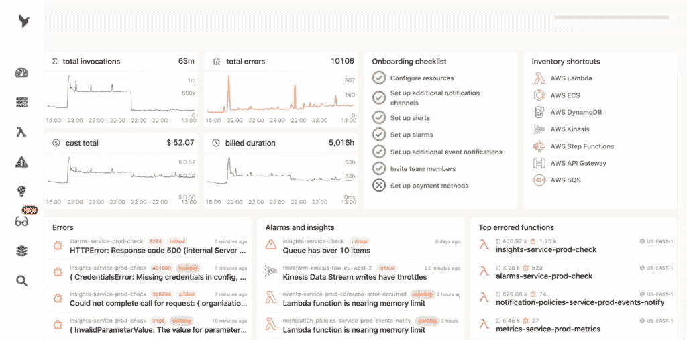
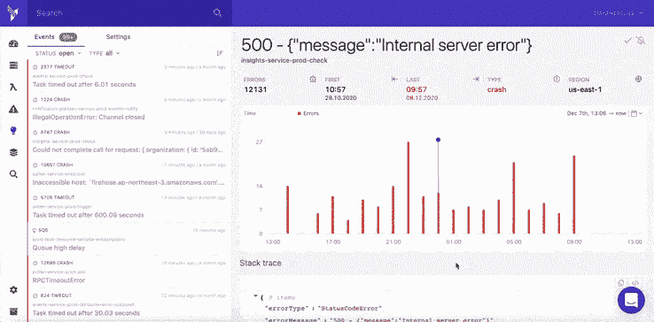

# 具有故障和威胁检测功能的防弹无服务器基础架构

> 原文：<https://blog.devgenius.io/bullet-proofing-serverless-infrastructures-with-failure-and-threat-detection-e3145648c9bf?source=collection_archive---------5----------------------->

当[构建基于云的系统](https://dashbird.io/blog/building-battle-tested-well-architected-serverless-apps-lessons/)和无服务器系统时，尤其是**保持领先**至关重要。您的基础架构将离您数英里远，而不是像构建前端时那样握在手中的设备。这就是为什么**将监控解决方案**添加到您的堆栈中，提供预配置的无服务器故障检测，应该是**的首要决定之一**。

在决定监控解决方案时，最好检查一下它是否提供了足够的报警功能。说到无服务器，从新事件到修复的大部分时间都浪费在了查找问题上，而不是实际的故障排除上。这意味着**监控解决方案可以缩小等式**的最大块。

无服务器就是将非差异化工作外包给托管服务。如果你不是做认证软件销售的，**不要做认证软件**；从以此赚钱的人那里购买；有可能他们有一个或多个团队在研究这个解决方案，并且它会立刻胜过你的。

# 内部 AWS 监控很难掌握

如前所述，这里的挑战是你不能深入了解这些服务。你使用 SQS、DynamoDB 或 API Gateway，但是你不能直接监控这些服务运行的服务器，**更不用说 SSH 到它们里面调试它们了**。AWS 有自己的日志和跟踪服务。所以你需要提取数据并在那里设置警报。

AWS 提供的监控服务的问题是，它们不容易使用，因为它们是通用的解决方案。CloudWatch 不只是记录 Lambda 或 SQS 数据；它记录所有 AWS 服务数据。这使得为你的所有服务设置正确的提醒有点复杂。一个不断增加新功能、更新和重构的无服务器系统**需要你不断修改这些设置**。

此外，AWS 监控解决方案在记录什么数据时并不特别节俭。在一个无服务器系统中，你的事务通常跨越多个服务(T21 ),都会产生大量的日志行。梳理这么多数据需要时间，反过来也需要金钱。而且通常情况下， [AWS 控制台对于无服务器团队来说是不够的](https://dashbird.io/blog/aws-console-serverless-debugging/)，尤其是在扩展的时候。

# 大鸟能帮上什么忙

Dashbird 专门为**无服务器故障检测和调试**而构建，它收集 AWS 服务写入的所有日志——不需要任何工具。它将它们分为不同的类别，如**配置错误、超时、内存不足事件**等。Dashbird 收集你所有的日志，以一种**简单易懂的方式呈现给你。**这些事件也[发布在事件库](https://dashbird.io/event-library/)中，并附有原因和修复的快速解释。如果您曾经查看过 Cloudwatch 日志中的一个 Lambda 调用，您就会知道找到正确的行是一件很麻烦的事情。

> 阅读更多关于[dash bird 如何创新无服务器监控](https://dashbird.io/blog/innovating-serverless-monitoring/)的信息。

# 了解托管服务

必须正确配置通用日志记录解决方案。它们带来了更大的灵活性，但是做好一切准备的成本可能会很高。成本不仅仅意味着许可成本；有优秀的开源解决方案。成本意味着**进行所有这些配置所花费的时间**。这也意味着**您可能会错过一些错误**，直到您最终微调完所有配置。

Dashbird 还减轻了为您配置重要警报的痛苦。这不仅仅意味着 UI 比 AWS 提供的更容易理解；这意味着 Dashbird 从一开始就带有**现成的预配置警报**。Dashbird 了解 AWS 服务；**这不仅仅是一个通用的监控解决方案**你钉在你的 Lambda 函数上。这些警报包括 **Dashbird 的专有技术**和关于如何**改善您系统的健康和性能的建议**，这些警报是多年来通过监控数千个在生产中运行的无服务器系统而收集和构建的。

为特定的无服务器 AWS 服务量身定制的监控解决方案与生产系统的专业知识相结合，使得 Dashbird **比其他监控系统**更加全面。这也意味着 Dashbird 需要**更少的手动配置**作为通用解决方案，必须手动适应不同的服务。

Dashbird 不仅为您提供简单的无服务器故障检测，还会在它们即将出现故障时提醒您。这样，你甚至可以在事故发生之前就开始着手解决问题。

# 与您选择的工具集成

在提醒开发人员时使用适当的渠道和格式是事情的另一面。与开发人员日常使用的服务集成对于警报也很重要。当然，有时发送一封电子邮件就足够了，但 Dashbird 也提供 [Slack、电子邮件、AWS SNS 和 webhook 集成](https://dashbird.io/docs/quickstart/notification-channels/)。

通过这种方式，警报将会发现开发人员当前活跃的位置，他们可以立即做出响应，而不仅仅是在问题出现两个小时后查看电子邮件。

> 你不想为了收到一封来自客户的电子邮件而支付监控费用，因为客户只是因为没有注意到警报而告诉你有问题。

集成还允许您**自动响应特定问题**。作为你的架构的创造者，你最清楚当你的流量达到峰值时该做什么。也许，您需要调配更多容量，但也许您只需要告诉您的客户，他们的配额已达到当月限额，现在他们将受到限制。

# 结论

为您的无服务器架构选择监控解决方案时，最重要的是关注它们的**警报功能**。在过去的几年里，功能即服务解决方案，如 AWS Lambda，被作为构建无服务器系统的核心方面出售。像 S3、DynamoDB、Cognito、Aurora 和 SQS 这样的托管服务可以帮助您**减少将新功能频繁推向市场所需的时间和人员**。

但是这些**托管服务不是没有成本的**。一方面，您不必再维护您的服务器；但是另一方面，您不能 SSH 到这些服务并安装任何您想要的监控客户端。

托管服务也是监控提供商的机会。如果它们可以将您用来构建系统的基础设施分解成一些具体的、众所周知的服务，那么监控提供的帮助也可以减少抽象。您不必考虑您的系统可能会出现故障的所有可能方式，相反，**您可以依靠像 [Dashbird](https://dashbird.io/features/) 这样的监控提供商**的专业知识来发现问题，而不必经历通常与无服务器故障检测和监控相关的痛苦学习经历。

延伸阅读:

[监控无服务器应用的终极指南](https://dashbird.io/blog/ultimate-guide-monitoring-serverless-applications/)

[故障检测和报警的基础知识](https://dashbird.io/knowledge-base/monitoring/failure-detection-and-alerting/)

[基于日志的 AWS Lambda 监控](https://dashbird.io/blog/log-based-monitoring-for-aws-lambda/)

[如何在 Lambda 调试上节省数百小时](https://medium.com/dev-genius/how-to-save-hundreds-of-hours-on-lambda-debugging-13edf5b2535)