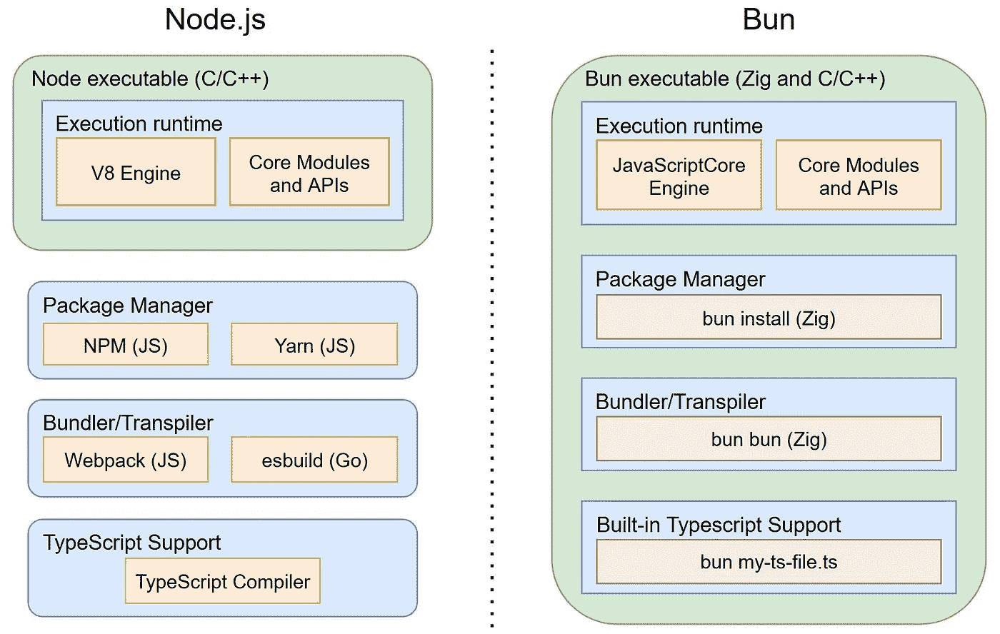

# Bun 的优缺点和主要使用场景

> 原文：<https://blog.devgenius.io/bun-pros-and-cons-and-main-usage-scenarios-2e8402a91e5f?source=collection_archive---------7----------------------->

# 什么是 Bun，为什么它很快

Bun 是一个年轻而雄心勃勃的项目，假装要取代传统的 Node.js。它不仅想取代执行环境，还想取代主要工具:包管理器、bundler 和 transpiler。当你听到这个的时候，你可能会想到 Deno。嗯，这是真的，但是 Bun 有一些致命的特性值得研究:比 Node.js 有巨大的性能优势，特别是在启动时，核心模块实现底层的低级系统调用，以及工具。

Bun 作者用:1)使用 [JavaScriptCore](https://en.wikipedia.org/wiki/WebKit#JavaScriptCore) 引擎 2)执行环境程序和所有用高性能 Zig 语言编写的主要工具(是的，我以前也没听说过)3)所有从零开始编写的核心 Node.js 模块和 API。

为了减少故事的篇幅，我不会在这里提供任何关于 Bun 或其内部的一般性描述。如果你想知道更多关于面包特性的细节，请参考它的[自述](https://github.com/oven-sh/bun)，或者发布的[这个](https://betterprogramming.pub/bun-new-kid-in-the-javascript-town-a0c6d77c7bb8)和[。这个故事侧重于分析它的优缺点(截至 2022 年 8 月)，并试图想象 Bun killer 功能的几个主要用例特别方便。](https://levelup.gitconnected.com/is-bun-js-the-node-js-killer-ffeb0f89196a)

# 利弊

我在谷歌上搜索了所有关于 Bun 的试验、分析和研究文章和出版物。在这里，我简要总结了这些发现，并结合了我自己对面包优缺点的看法。请参阅参考资料部分的学分和链接。

## +巨大的前景

这不仅仅是我的观点，而是几乎每篇与面包相关的文章都表达的观点。人们肯定很兴奋，认为它是整个服务器端 JS 开发的下一个大步骤的一个很好的候选。Bun 可能还有助于减少 Node.js 与其更快的竞争对手(主要是 Go)相比的性能差异。

## + TypeScript 开箱即用

你只要运行“bun my-cool-file.ts”就可以了。不需要 transpiling 或任何其他中间步骤，就像我们用 Deno 一样。Bun 还对 TS(类似于 C/C++)提供了宏支持，这对于大型项目和 mono-repos 可能非常方便。

## +不仅是运行时，还有 Node.js 工具替换

Bun 附带内置的 bundler、transpiler 和 package manager。它们是用 Zig 写的，运行速度非常快。如果您对标准 webpack 或 npm 的性能不满意，无需安装 yarn 或 esbuild。

Bun 包管理器似乎产生与 NPM 相同的文件夹结构，并遵循相同的 package.json 文件格式(尽管不同的锁文件)。如果你成功地用 Bun 为一个大型 Node.js 项目安装的 node_modules 文件夹替换了 NPM 创建的 node _ modules 文件夹，请写下评论，并测试是否有任何问题。

顺便说一下，伟大的工具首先为开发 Bun 作为构建和打包工具开辟了一个空间，而生产代码继续在 good old Node.js 上运行。这种方法可能有助于加快 Bun 在 web 开发人员社区中的采用。

## +巨大的性能提升

我不确定 JavaScriptCore 在一般场景和用例中是否明显快于 V8，但 Bun 启动时间确实很长。这在服务频繁启动/停止的环境中特别有用。例如像 AWS Lambdas 或 Azure Function 这样的无服务器代码执行器，或者严重偏向于基于事件的架构的云系统(像连接到 SNS 作为服务总线的 Lambda 事件处理器)。

Bun 速度的另一个亮点是系统调用和 I/O 操作。Bun 作者说，所有底层 Node.js APIs 都是从零开始编写的，并把性能放在第一位。我相信快速 Zig 语言也是有帮助的。

只是好奇:Bun 利用 Linux [零拷贝](https://en.wikipedia.org/wiki/Zero-copy)套接字系统调用来使网络 I/O 更快吗？[零拷贝](https://developpaper.com/what-is-the-so-called-zero-copy-technology-in-kafka/)是一个很棒的性能特点，也是卡夫卡这么快的原因之一。Go 已经有了一个[定制包](https://github.com/newtools/zsocket)来支持它，所以我认为它在 JS 世界里也可能有用。然而，我不是内部系统调用的专家，所以在这里不能确定。如果你知道任何细节，请在评论中告诉我。

## -未准备好生产

Bun 正在积极开发中，肯定还远远没有准备好投入生产。它仍然有大量的本机 Node.js 模块和 API 需要支持。Express 和 React.js 的主要场景工作正常，但是 MongoDB 客户端或 [Fastify 立即失败](https://github.com/oven-sh/bun/issues/313)，因为 http、tty 和 tts 等核心模块出现了一些问题。其他重要的工作人员，如缩小工具和 TS 泛型仍然在 Bun 的待办事项列表中。

## -项目范围非常大

这意味着 Bun 开发者面临更严峻的挑战，需要付出更多的努力来解决这些问题。因此，目前还不清楚将 Bun 提高到生产水平需要多少时间。此外，虽然是开源的，但项目代码库的绝大部分是由[一个作者](https://github.com/Jarred-Sumner)编写的，所以我们总是有在完成项目之前失去兴趣的危险。

## -缺乏信息

Github Readme 页面是目前唯一全面的文档来源。如果要搜索任何高级信息，需要加入 Discord chat。像马丁·福勒的 Thoughtworks [技术雷达](https://www.thoughtworks.com/radar)这样的权威数据来源还没有提到 Bun。

# Bun 最有前途的用例

任何新工具首先被应用于其杀手级特性最突出的场景。根据我目前的理解，我认为 Bun 的 3 个主要应用特别方便:

1.  **为兰姆达斯省钱。**所有主要平台的云功能均按执行时间计费。Bun 的高速度使它们跑得更快，因此降低了成本。此外，它的闪电启动时间另外 1)减少了冷启动的执行时间 2)可能有助于减少 Lambdas [供应并发](https://docs.aws.amazon.com/lambda/latest/dg/provisioned-concurrency.html)计数，从而进一步削减我们的云托管费用。
2.  **加速云中基于事件的架构。想象一个系统，它主要基于由 AWS 托管的组件引发的事件，通过 SNS 交付并在 Lambdas 中处理。在事件类型数量巨大的情况下，它们中的大多数通常很少运行，因此遭受冷启动问题。快速的处理程序启动时间可以显著提高整体系统的响应能力，并减少系统中请求花费的总时间。**
3.  **Devops 和 CI/CD 管道**经常涉及频繁的包操作、源代码传输、文件捆绑等。本质上他们做了 Bun 内置工具特别擅长的所有操作。因此，我们可以大大加快 CI/CD 的速度。如果我们将集成测试作为单独的 Node.js (bun)流程运行，我们还可以节省一些执行时间。然而，考虑到集成测试相当长的运行时间，这几乎没有什么意义。

# 需要进一步检查的东西

我在 Bun 上的下一个努力将是在真实世界的使用场景中对它的 Lambdas 运行时速度改进进行性能测试。人工合成测试适用于技术圣战文章，但不适用于真实生产项目的框架评估。所以我计划用一些现实的 REST API 测试用例、DB 调用和 Lambdas 冷启动和预配置并发场景来衡量它。肯定会写一个中等的故事:)

另一个值得做的有趣测试是比较 yarn 和 Bun 包管理器对于有很多依赖项的大型项目的速度。

*感谢阅读！真的很想在评论里听听大家的发髻心得和看法。*

# 参考文献和致谢

1.  [快速发髻介绍](https://betterprogramming.pub/bun-new-kid-in-the-javascript-town-a0c6d77c7bb8)，虽然有点恭维，浅见。
2.  [很棒的文章](https://www.lunasec.io/docs/blog/bun-first-look/)，里面有很多关于 Node.js 及其生态系统历史的有趣想法，以及关于 Bun 在其中潜在地位的合理想法。强烈推荐阅读。
3.  通过 Node.js 对 Bun 进行彻底的[性能测试](https://medium.com/gitconnected/is-bun-js-the-node-js-killer-ffeb0f89196a)，并与 Bun 官网的结果进行对比。
4.  另一篇[好文章](https://betterprogramming.pub/bun-new-kid-in-the-javascript-town-a0c6d77c7bb8)关于小圆面包的想法和一些玩法。
5.  [当前 Bun 发展的重点](https://github.com/oven-sh/bun/issues/798)及其作者对开源社区援助的询问。