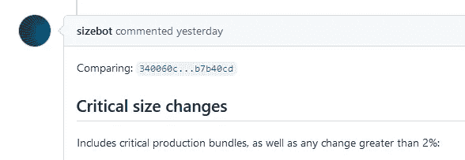
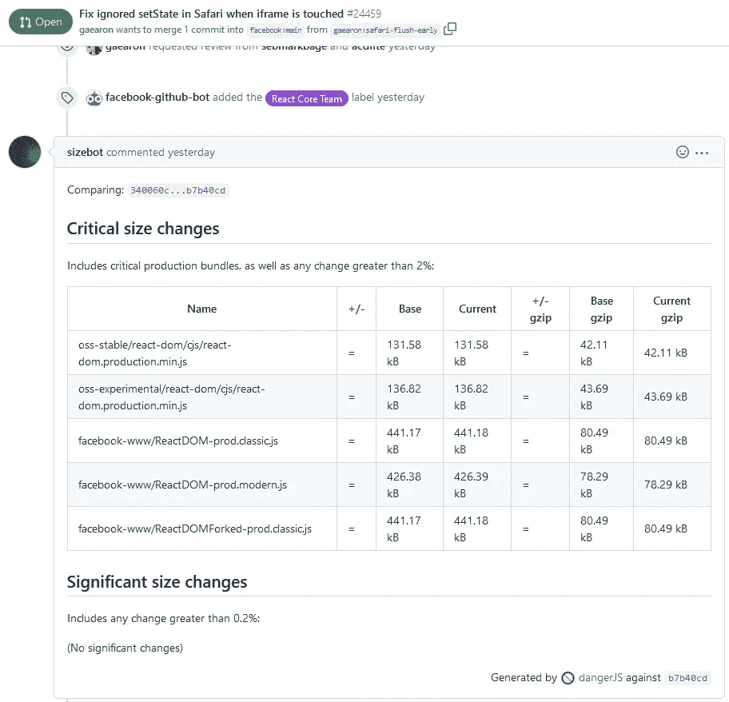
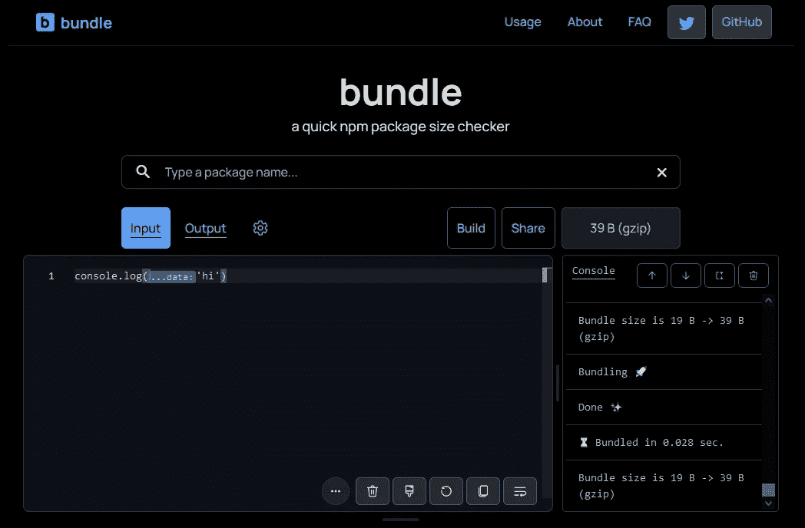

# 捆绑大小 JavaScript 和 Webpack

> 原文：<https://blog.devgenius.io/bundle-size-javascript-and-webpack-8861ddd54620?source=collection_archive---------4----------------------->

如果你曾经做过前端或后端 web 开发人员，你应该听说过包的大小。

sizebot —关于关键包大小更改的注释

# 包的大小有多重要？

假设为脸书工作的开发人员都很优秀。如果他们使用工具来测量束尺寸，这一定很重要。为了验证他们是否关心包的大小，我们可以访问他们的 GitHub 库。

下图显示了 ReactJS 首席开发人员 Dan Abramov 的一个 pull 请求。

dan abramov 在 github 上对 reactjs 库的 pull 请求。Sizebot 评论了捆绑包大小的更改。

Size-bot 对捆绑包大小的更改发表了评论。

在图中，我们可以看到 size-bot 对包大小变化的评论。因为脸书使用一个工具来获得任何主要的包大小变化的通知，所以结论是它可能是重要的。

# 我为什么提到 Webpack？

Webpack 是一个主要与 ReactJS 一起用于开发客户端应用程序的工具。快速刷新插件展示了一个 Webpack 的例子。Create-React-App 在引擎盖下使用 Webpack。我使用 Webpack 是因为在 ReactJS 文档和其他资料中经常提到它。

我想说它已经被很好地采纳并成为主流。

另一方面，Rollup 用于构建 ReactJS 库，Webpack 不是唯一的选择。

为正确的工作选择正确的工具。

# 捆绑大小指的是什么？

你下载过电影吗？它大约有 1GB 大，你必须等半个小时才能下载完吗？

想象一下，如果你的互联网速度非常慢，你试图打开一个网页。那个网速慢的是 0.1 mb/s。

*注意，* ***mb/s*** *和****Mbps****不一样。从****Mbps****中得到****MB/s****你将 Mbps 除以 8，结果是****MB/s****。*

*80 Mbps 的网速是 10 mb/s，你* ***总*** *应该想知道 mb/s，知道 mb/s 就很容易估算出 1Gb 下载有多快。*

在 **0.1 mb/s** 的网速下，我们访问一个网页需要下载**一个 **0.4 Mb** 的 JavaScript 包**。用户必须等待 4 秒钟来下载代码，然后让浏览器解析 HTML、CSS 和 JavaScript。

等待在屏幕上看到东西的时间会让用户离开。你有没有因为几秒钟没有显示任何内容而离开页面的经历？我敢打赌你有，因为我有。

# JavaScript 捆绑包是什么？

bundle 是代码的别称，因为在我们的代码通过 Webpack 之后，我们可以说它被打包了。

当你去商店买新年礼物时，他们可能会问你几个问题。您的订单将根据您的回答进行定制。

JavaScript 包也是如此。Webpack 将完成这项工作，并打包我们的代码运行所需的一切。

# JavaScript 包的大小是多少？

我会说大概是字符数。如果你在谷歌上搜索“javascript bundle size calculator”并找到一个，这一点可以得到验证。

或者，你可以去[bundle.js.org](https://bundle.js.org/?text=%22console.log%28%27hi%27%29%22)然后按下 build。JavaScript 打印函数是捆绑在一起的，您可以看到输出的大小。

显示 console.log 包大小的 bundle.js.org

简单地说，JavaScript 包的大小意味着字符的数量。字符是简化的变量名、分号、函数名等。一切可以而且应该缩小的都将被缩小。

# 结论

有了关于我们的代码发生了什么的所有背景信息，可以肯定地说，包的大小取决于字符的数量。

字符的数量取决于 Webpack 在输出中提取的内容。

得出这样一个简单的结论需要很多信息:)