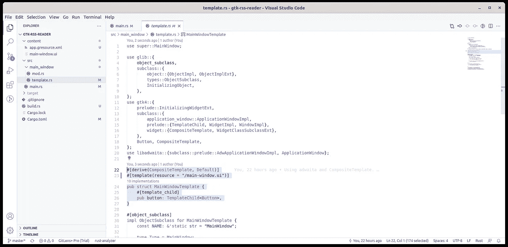

# 在 Rust 中将模板捆绑到 GTK4 UI 的资源中

> 原文：<https://blog.devgenius.io/bundling-templates-into-resources-in-rust-for-the-gtk4-ui-eb387a7918bf?source=collection_archive---------6----------------------->


[哈维·卡夫雷拉](https://unsplash.com/@xavi_cabrera?utm_source=medium&utm_medium=referral)在 [Unsplash](https://unsplash.com?utm_source=medium&utm_medium=referral) 拍摄的照片

我们[开始](/initial-setup-for-a-gtk4-app-with-libadwaita-in-rust-using-vscode-b6f8c127a75e)开发一个简单的 GTK4 应用，现在[我们已经](/using-template-files-in-rust-for-a-gtk4-libadwaita-ui-8322694cbc3c)在`main-window.ui` XML 文件中清晰地描述了我们的 UI。但是我们上次提到了我们的应用程序面临的一个问题:模板文件需要存在于我们在代码中请求它的位置。当然这是不正常的，也不是使用模板文件的方式。同样，这篇文章的代码可以在 github 上找到，但是我总是建议你跟随这篇文章，尝试自己写代码。

## 项目中的新文件


更新的项目结构和主要内容

GTK 允许我们将模板捆绑在一个资源文件中，但是这个资源文件必须手动构建。Rust 通过向我们的应用程序添加一个`build.rs`文件来接收构建指令:

```
use libadwaita::gio::compile_resources;fn main() {
    compile_resources(
        "content",
        "content/app.gresource.xml",
        "gtk-rss-reader.gresource",
    );
}
```

使用 GTK 提供的`compile_resources`功能，我们可以获取一个资源定义文件(在我们的例子中是`app.gresource.xml`)，编译它并捆绑到我们的应用程序可执行文件中，命名为`gtk-rss-reader.gresource`。磁盘上不会有任何`gtk-rss-reader.gresource`文件，它会被嵌入到最终的可执行文件中。

为了让`build.rs`使用`compile_resources`，我们需要将`libadwaita`添加到 Cargo.toml 中的`build-dependencies`部分:

```
[package]
name = "gtk-rss-reader"
version = "0.1.0"
edition = "2021"[dependencies]
libadwaita = "*"
gtk4 = "*"
glib = "*"[build-dependencies]
libadwaita = "*"
```

让我们看看资源定义文件，`app.gresource.xml`:

```
<?xml version="1.0" encoding="UTF-8" ?>
<gresources>
    <gresource>
        <file compressed="true">main-window.ui</file>
    </gresource>
</gresources>
```

XML 包含关于要包含什么文件、它们在哪里以及在编译步骤中如何处理它们的指令。我们还可以在这里包括图像、翻译和我们的应用程序可能需要的其他资源。`compressed='true'`编译选项意味着文件将被压缩。文件名`main-window.ui`是 GTK 将如何识别我们的资源，稍后我们将在`template.rs`中看到。`gresource`元素可能有一个`prefix`属性，以进一步细化资源的标识符:

```
<?xml version="1.0" encoding="UTF-8" ?>
<gresources>
    <gresource prefix="app">
        <file compressed="true">main-window.ui</file>
    </gresource>
</gresources>
```

在上述情况下，资源将被标识为`app/main-window.ui`。没有它就只是`/main-window.ui`。

接下来，我们需要在我们的应用程序中注册资源。在`main.rs`中，对整个代码这样做一次:

```
pub fn main() {
    resources_register_include!("gtk-rss-reader.gresource")
        .expect("Failed to register resources."); let application = Application::builder()
        .application_id("com.example.gtk-rss-reader")
        .build(); application.connect_activate(build_ui);
    application.run();
}
```

唯一的变化在第一行，`resources_register_include!`。我们调用这个 GTK 宏，它获取构建并嵌入到应用程序可执行文件中的资源，标识为`gtk-rss-reader.gresource`，并为 GTK 应用程序注册它们。在这一行执行之后，所有定义的资源都将在应用程序中可用。`.expect`部分是一个异常处理器，它将在屏幕上显示`Failed to register resources`消息并退出。

## 更新主窗口模板



更新的模板参考

一切都准备好了，我们只需要再做一个改变:在`template.rs`中正确地调用我们的资源:

```
#[derive(CompositeTemplate, Default)]
#[template(resource = "/main-window.ui")]
pub struct MainWindowTemplate {
    #[template_child]
    pub button: TemplateChild<Button>,
}
```

我们现在说`#template(resource`引用一个已编译并注册的资源，而不是引用文件系统中的一个文件。名称是`main-window.ui`，但是它是从资源树的根引用的，所以它变成了`/main-window.ui`。

让我们构建并运行:

```
#cargo build
#cargo run
```

这是我们熟悉的空窗口:


我们的 GTK 应用程序的空窗口

请注意，如果资源构建或标识符或任何东西有任何错误，您将得到一个没有标题栏或按钮的空窗口。它基本上将是一个未初始化的`libadwaita`窗口。

## vs code rust-分析仪故障


运行生成脚本 VSCode 设置

还有一件事。Rust 的 VSCode `rust-analyzer`扩展不会执行解决方案中的所有`build.rs`文件，以优化其性能。这将导致您的`main.rs`显示一个错误，而您在构建应用程序时不会发现这个错误。要摆脱它，前往 VSCode 设置并搜索运行构建脚本。过滤后将显示两项内容:运行构建脚本(默认情况下应该检查)和对构建脚本使用 Rustc Wrapper(也应该检查)。取消选中第二个选项，在 VSCode 中`main.rs`应该看起来没有错误。

目前就这些。非常感谢你遵循这个教程，我希望你能学到一些新的东西。[下一次](/using-the-libadwaita-leaflet-widget-for-a-responsive-gtk4-ui-in-rust-73bbc2f4025)我们将为我们的应用程序创建框架 UI。欢迎在评论中提问，下次再见！