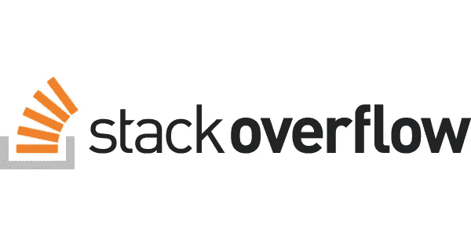

# 关于科技巨头的突发神话

> 原文：<https://blog.devgenius.io/bursting-myths-about-tech-giants-5de86b6cd41f?source=collection_archive---------2----------------------->

[https://www.linkedin.com/in/pranay-deep/](https://www.linkedin.com/in/pranay-deep/)

我遇到过许多关于为科技公司工作的神话、炒作和错误信息，特别是像微软、苹果、脸书、亚马逊和谷歌这样的科技巨头。

因此，基于我与学生和许多年轻工程师的互动，我总结了 10 个关于科技公司的常见问题和神话。

## 1.我是一名前端/后端工程师，但我可以在公司的招聘门户上看到软件开发工程角色。

照片由[妮可·沃尔夫](https://unsplash.com/@joeel56?utm_source=medium&utm_medium=referral)在 [Unsplash](https://unsplash.com?utm_source=medium&utm_medium=referral) 拍摄

*前端工程师的具体工作角色很少，但大多数情况下，你会发现一个 SDE/SE 角色。软件开发工程师的期望是交付与你对某项技术或编程语言的知识无关的结果。是的，你期望成为一个优秀的问题解决者。*

## 2.这都是关于谷歌搜索和在 stackoverflow 上寻找答案。

[https://stackoverflow.com/users/5412684/pranay-deep](https://stackoverflow.com/users/5412684/pranay-deep)

*对任何* ***服务型*** *公司来说都是如此，但对* ***科技巨头*** *来说就不是这样了。*

技术/产品公司创造技术，世界上的其他公司通过这些技术来解决他们的业务需求。微软——Azure，亚马逊——AWS，谷歌——Android，脸书——react native…

## 3.办公时间以及我需要在办公室呆多长时间？

[布拉德·奈瑟利](https://unsplash.com/@bradneathery?utm_source=medium&utm_medium=referral)在 [Unsplash](https://unsplash.com?utm_source=medium&utm_medium=referral) 上拍照

***服务公司****——他们遵循朝九晚五或打卡规则，基于此你将获得报酬。如果你在 30 分钟内没有登录你的系统，他们可能会把你一天的工资减半。服务公司更喜欢它，因为他们根据“工作时间”向客户收费。*

***科技公司****——没有办公室计时的概念。如果你想在家工作，你只需要通知你的团队。这里的想法是完成分配给你的任务，不管你是否在“办公时间”完成它。*

## 4.着装要求怎么样，我听说我可以在每周五穿商务休闲装？

在科技公司，我们每天都穿着舒适的休闲装，你会发现大多数开发人员都穿着运动裤。

抱歉，我不知道什么是“商务休闲装”。

## 5.你们多久和客户交流一次？

Sebastian Herrmann 在 [Unsplash](https://unsplash.com?utm_source=medium&utm_medium=referral) 上拍摄的照片

*根据我的经验，我还没有听说过有哪个开发人员与某些客户有过互动。有一个独立的工作角色负责大部分客户交互，例如****TPM****—技术项目经理或****PM****—产品经理。这些互动主要基于市场趋势和分析。*

我不认为任何谷歌地图开发者会在开始任何功能设计之前联系你，毕竟你是他们的客户。

然而，如果你是一家 ***服务型*** *公司的顾问，那么是的，你将与你的客户互动。*

## 6.我是个极客，我的代码说得比我好。我应该提高我的软技能吗？

由[奥斯汀·迪斯特尔](https://unsplash.com/@austindistel?utm_source=medium&utm_medium=referral)在 [Unsplash](https://unsplash.com?utm_source=medium&utm_medium=referral) 上拍摄的照片

*你是一名优秀的开发人员，这很好，但如果你不能在设计会议上与其他人分享你的想法和过程，那么你将无法在软件开发人员的职业生涯中成长。*

每家科技公司都要花费数天时间来撰写和敲定技术设计文档，而非实际实施。所以，是的，你也应该在你的软技能上下功夫。

## 7.作为 CTC 的新人，我的工资是多少？

由 [Viacheslav Bublyk](https://unsplash.com/@s1winner?utm_source=medium&utm_medium=referral) 在 [Unsplash](https://unsplash.com?utm_source=medium&utm_medium=referral) 上拍摄的照片

*请再读一遍，上面写着“包装”和“CTC——公司成本”,它在很大程度上受未来 4 年库存单位的影响。这些主要分为你:*

> *基本工资+加入奖金+第一年股票+优先奖金+津贴=你的年度 CTC(对任何一个新人来说都不到 100 万印度卢比)*

## 8.我是一个很有竞争力的程序员，我将开发算法？

*嗯，我会在另一篇文章中讨论这个问题。你不会创造任何算法，但是的，你可能会得到一些很酷的系统设计问题的工作。*

## 9.一家服务型公司的人力资源部说，按照行业标准，我可以获得 30%的加薪。如果我赚了(2 x 年的经验)，那么我就在正确的道路上。

照片由[科学高清](https://unsplash.com/@scienceinhd?utm_source=medium&utm_medium=referral)在 [Unsplash](https://unsplash.com?utm_source=medium&utm_medium=referral) 上拍摄

哇，我不知道他们是从哪里创造出这样一个公式的。

*之前我回答了关于 1Cr CTC 的误解。*

意味着一个新人在印度挣不了那么多钱，并不意味着一个有经验的工程师也做不了。

如果你只有 3-4 年的工作经验，对数据结构和算法稍加研究就能帮助你接近 50 亿英镑。优步，谷歌，亚马逊，微软等。

## 10.我在任何跨国公司都学不够，我会去创业。

由 [Austin Distel](https://unsplash.com/@austindistel?utm_source=medium&utm_medium=referral) 在 [Unsplash](https://unsplash.com?utm_source=medium&utm_medium=referral) 拍摄的照片

如果你认为服务型公司是跨国公司，那么是的，请最好加入任何初创公司。

但是如果你指的是科技公司，我会说长期呆在里面。我为什么要说这个？因为在科技公司，你会从经验丰富的工程师那里学到很多东西，而不是初创公司。你将会学到一些软件开发的最佳实践，这是我发现一个初创公司所缺少的。

*补充一下，有一些非常好的初创公司在工程最佳实践方面做得很好，比如优步、Grab、Gojek、Swiggy……*