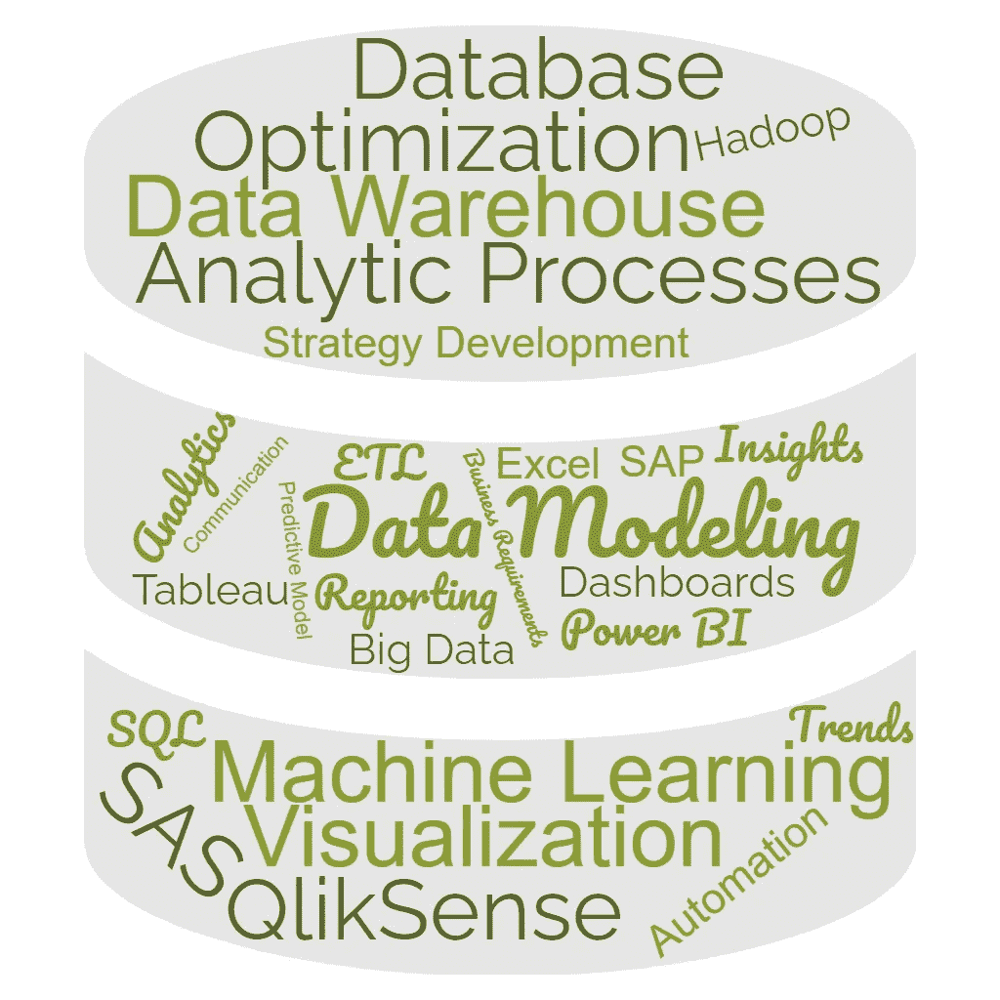
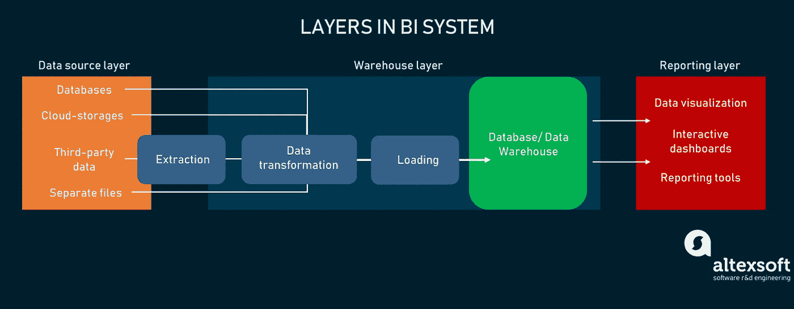
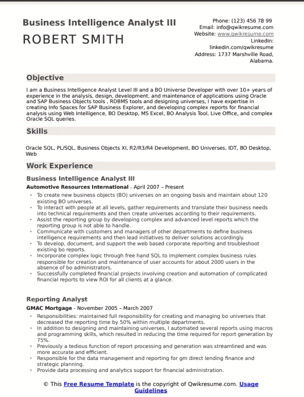
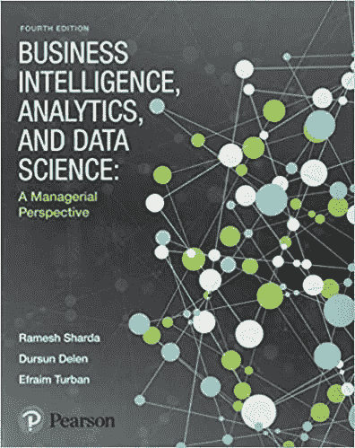
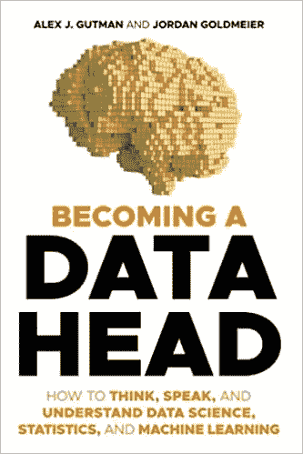
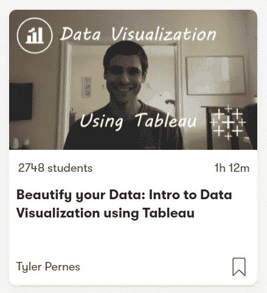
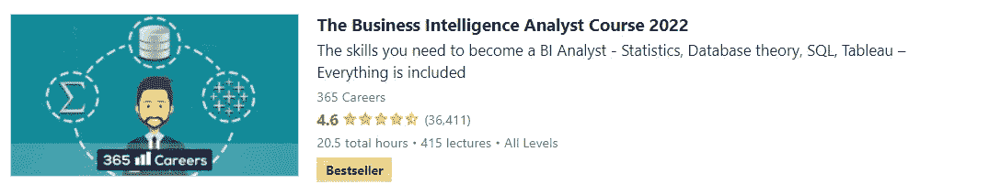

# 商业智能(BI)分析师职业道路

> 原文：<https://blog.devgenius.io/business-intelligence-bi-analyst-career-path-464272d3a2ea?source=collection_archive---------3----------------------->

## 我将带您了解成为商业智能(BI)分析师所需的所有知识

# 谁是 BI 分析师？

商业智能(BI)分析师将数据转化为推动商业价值的见解。通过使用数据分析、数据可视化和数据建模技巧和技术，BI 分析师可以确定有助于其他部门、经理和高管做出业务决策的趋势，以实现组织流程的现代化和改进。

BI 分析师通常会发现收入损失的领域，并确定可以在哪些方面进行改进，以节省公司资金或增加利润。这是通过使用 [BI 软件和工具](https://www.cio.com/article/3322749/top-business-intelligence-bi-tools.html)挖掘复杂数据，将数据与竞争对手和行业趋势进行比较，并创建可视化效果，将发现传达给组织中的其他人来实现的。

# 你可以在招聘网站上使用一些关键词来找到相关的工作

*   商务智能分析师
*   BI 开发人员
*   ETL 开发人员
*   数据挖掘专家
*   数据可视化专家
*   数据建模专家
*   知识管理开发人员
*   报告专家
*   数据库/数据仓库专家
*   SAP 商业智能专家
*   Power BI 开发人员
*   Tableau 开发人员

# 公司对 BI 分析师的常见任务和期望

*   开发商业智能和数据收集策略。
*   测试、实施和记录 BI 系统。
*   监督数据到数据仓库的部署。
*   将业务需求转化为技术规格。
*   执行数据分析以识别和理解异常。
*   保持商业智能工具和公司数据库的更新。
*   分析竞争对手及其对商业智能的使用。
*   监控分析和指标结果。
*   向公司的高层管理人员传达调查结果。
*   从现有数据库运行复杂的报告。
*   分析大数据，发现趋势和模式。
*   建立与内部和外部利益相关者共享数据的程序。
*   使用数据可视化技术呈现信息。
*   建立预测模型和机器学习算法。

# 成为商务智能分析师所需的技能

## 基础

*   数据库/数据仓库
*   数据建模
*   数据可视化工具
*   数据库管理和报告
*   批判性思维和解决问题
*   通讯技能
*   强大的统计和报告技能
*   管理和情景规划技能

## 先进的

*   数据挖掘技术
*   商业智能
*   数据分析
*   商情分析
*   企业管理
*   分析过程，如企业、SWOT 和 PESTEL 分析

## 推荐技能

*   Tableau/PowerBI
*   Hadoop
*   结构化查询语言
*   Python/C#
*   Microsoft Office 和 Excel
*   微观战略
*   Oracle BI
*   潘塔霍
*   QlikSense
*   SAP 商业智能
*   SAP Crystal 报告
*   SAS 商业智能
*   SAS 可视化分析
*   西森斯
*   Zoho 分析

# 推荐认证

*   [商业智能认证专家(CBIP)](https://tdwi.org/cbip)
*   [微软认证:Power BI 数据分析师助理](https://docs.microsoft.com/en-us/learn/certifications/power-bi-data-analyst-associate/)
*   [Qlik Sense 商业分析师认证](https://www.qlik.com/us/services/training/certifications-and-qualifications)
*   [SAP 认证应用助理](https://training.sap.com/certification/c_bobip_42-sap-certified-application-associate---sap-businessobjects-business-intelligence-platform-42-g/)
*   [Tableau 认证](https://www.tableau.com/learn/certification)

# BI 分析师简历示例

BI 分析师简历示例

# 推荐书籍

## # 1—商业智能、分析和数据科学:管理视角

> 理解商业智能系统的管理方法。为了帮助未来的管理者使用和理解分析，*商业智能*为学生提供了坚实的商业智能基础，并通过实践加以巩固。

## # 2—DAX 权威指南:面向 Microsoft Power BI、SQL Server Analysis Services 和 Excel 第二版的商业智能(商业技能)

> 现在扩展和更新了现代最佳实践，这是最完整的微软 DAX 语言商业智能，数据建模和分析指南。微软商务智能专家顾问 Marco Russo 和 Alberto Ferrari 帮助您掌握从表格功能到高级代码和模型优化的一切。当您运行 DAX 表达式时，您将确切地了解发生了什么，并使用这些知识来编写快速、健壮的代码。这一版的重点是您可以用免费的 Power BI Desktop 构建和运行的示例，并帮助您充分利用 Power BI、Excel 或 Analysis Services 中强大的变量语法(VAR)。想要利用 DAX 的所有卓越功能吗？这种不折不扣的“深度潜水”正是你所需要的。

## # 3——成为数据主管:如何思考、说话和理解数据科学、统计学和机器学习

> *成为数据主管*是职场数据科学的完整指南:涵盖从你将与之共事的个性到算法背后的数学知识的所有内容。作者花了数年时间挖掘数据，试图创作一本有趣、平易近人、可读性极强的书。任何人都可以成为数据主管——数据科学、统计学和机器学习的积极参与者。无论你是商务人士、工程师、高管还是有抱负的数据科学家，这本书都适合你。

# 推荐课程

[**#1 —美化您的数据:使用 Tableau 的数据可视化简介(Skillshare)**](https://www.skillshare.com/classes/Beautify-your-Data-Intro-to-Data-Visualization-using-Tableau/1547035247?via=search-layout-grid)

> 在这个清晰的实践课程中，学习如何与 Tableau 专家 Tyler Pernes 一起将您的数据转换为有洞察力的漂亮仪表板。本课程结束时，您将运用所学的概念从头开始构建仪表板。你甚至可以在网上发布你的作品，让潜在的雇主或客户看到你的伟大作品！

[**#2 —** 具备 SQL、ETL 和数据仓库专业化的 BI 基础(Coursera)](https://www.coursera.org/specializations/bi-foundations-sql-etl-data-warehouse)

> 在本课程中，您将学习以下主题:编写 SQL 查询以使用关系数据库、使用星型和雪花型模式设计数据仓库、加载和验证临时区域中的数据、构建多维数据集、汇总和物化视图/表、执行常用的 Linux 命令、使用 Cognos Analytics 等 BI 工具使用交互式报告和仪表板分析仓库中的数据

[**#3 —商业智能分析师课程 2022 (Udemy)**](https://www.udemy.com/course/the-business-intelligence-analyst-course-2018/)

商业智能分析师课程由几个模块组成，如数据和数据科学简介、统计和 Excel、数据库理论、SQL、Tableau 和 SQL + Tableau。这是获得成为商业智能分析师所需技能的绝佳课程。

# 其他有用的资源

[🤖W3Schools 的 SQL 教程](https://www.w3schools.com/sql/)

[🦄电源 BI 文档](https://docs.microsoft.com/en-us/power-bi/)

[🐉表格文件](https://help.tableau.com/current/pro/desktop/en-us/gettingstarted_overview.htm)

如果 *你喜欢这个内容并且觉得很慷慨，请考虑捐赠我的 ETH 钱包来支持我:*

***0x 1779 c 21 f 79d 3 f1 e 63960990818 b5 BF 03 e 89 CBF Fe***

如果 *以后有兴趣看我的类似帖子，请考虑与我的* [***推荐链接***](https://ehsan-yazdanparast.medium.com/membership) *一起加入 medium。如果你注册使用我的链接，我会赚一小笔佣金，你可以无限制地访问所有媒体作者的内容。这样你就在平台上支持我和你其他喜欢的作家了。谢了。*

 [## 技术招聘人员开发人员职业道路

### 我将带你了解成为一名技术招聘人员所需要知道的一切。

medium.com](https://medium.com/geekculture/technical-recruiter-career-path-6f2c1fb43869)  [## 数据科学家职业道路

### 我将带您了解成为数据科学家所需的所有知识。

medium.com](https://medium.com/geekculture/data-scientist-career-path-d49fb0f266a9)