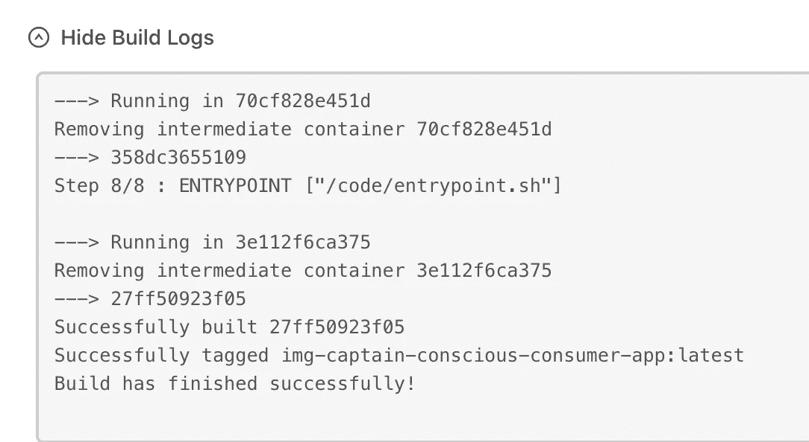

# 但是什么是容器编排呢？

> 原文：<https://blog.devgenius.io/but-what-is-container-orchestration-b81dfde784f3?source=collection_archive---------3----------------------->


像任何伟大的管弦乐队一样，伟大的软件架构通常依赖于多个独立的部分和谐地走到一起。文斯·维拉斯在 [Unsplash](https://unsplash.com/s/photos/orchestra?utm_source=unsplash&utm_medium=referral&utm_content=creditCopyText) 上的照片

# 容器编排——分布式计算的入场券

像任何伟大的管弦乐队一样，伟大的软件架构通常依赖于将多个部分和谐地组合在一起。就像指挥的指挥棒引导管弦乐队中的音乐家一样，一个利用**分布式计算**的系统将让它的每个部分共享它们将如何通信的期望，并共享运行我们的应用程序的工作。

**容器编排**简单地说就是如何协调应用程序的不同部分——在本博客的上下文中，即 Docker 容器——作为一个分布式系统和谐地协同工作。如果操作得当，它可以为最终用户提供*惊人的*性能。

当我第一次开始学习容器编排时，这比在波士顿新冠肺炎封锁期间试图找到哈利波特系列音乐会的门票还要难——但是不要害怕！比听起来容易，我保证。

## **Docker 编写的问题**


Docker Compose 是一个在 Docker 上运行多容器应用程序的工具。图片来源: [Docker 编写 GitHub 库](https://github.com/docker/compose)

许多使用 Docker 的软件开发人员都知道，在他们的本地环境中，Docker Compose 是运行多容器应用程序的一种很好的方式——唯一的问题是它*只*在本地工作(目前)。那么，你将如何把你的惊人的产品从本地机器的幕后拿出来，展示在你的目标用户面前呢？

## 学习目标

我最近在部署 [Conscious Consumer](https://consciousconsumer.herokuapp.com) 时遇到了这个问题，这是我用 Django 后端和 PostgreSQL 数据库构建的一个 web 应用程序。我将在这篇博文中分享我最终使用的方法，最后我打算向你展示:

1.  如何在 CapRover 上配置部署的 Django 设置
2.  如何**编写一个 Shell 脚本**来帮助设置您的容器环境
3.  如何**为你的项目连接 CapRover** 上的多个应用

在博客的最后，我希望向您展示一个例子，来说明我之前谈到分布式计算时的意思！

**先决条件:**在这篇博客中，我假设你已经知道*Docker 是如何为单容器应用程序工作的，*并且你对 Django 有很深的理解。但是如果你还不明白——没问题！我推荐阅读 Docker 网站上的[解释，先了解更多信息，然后你就可以回来继续阅读了。Django web 框架上的资源将在底部链接，因为这是一个更广泛的主题。](https://www.docker.com/resources/what-container)

# 如何在 CapRover 上部署 Django-PostgreSQL 应用程序(示例)

**先决条件**:

1.  从诸如 [Namecheap](https://www.namecheap.com/) 或[Name.com](https://www.name.com/)之类的服务购买网站域名。
2.  我们将使用虚拟专用服务器(VPS)来托管我们的网站，因为这比担心维护我们自己的物理服务器更实际。在这个例子中，我将使用 [DigitalOcean](https://www.digitalocean.com/) ，因为他们特别提供了 CapRover 实例。
3.  使用本[教程](https://caprover.com/)在 CapRover 上设置您的个人 PaaS。

## 台阶

**步骤 1:为 CapRover 创建一个单独的 Django 设置文件**


确保放置在数据库设置中的值与我们将输入到 CapRover PostgreSQL 实例中的值相匹配(将在本教程中出现)！

作为一个很好的经验法则，我喜欢在我的 Django 项目中有单独的设置文件，这样可以更容易地将特定设置在给定环境中应该具有的值分开。在左边，你可以看到当在 VSCode 中查看时，有意识的消费者的文件结构看起来像什么。

在特定于 CapRover 的设置模块中，最重要的是数据库设置。我们很快会回到这个话题，但只要说你的价值观是什么就够了。env 很重要，因为它们需要与您稍后在 CapRover 上创建的 PostgreSQL 数据库中输入的值相匹配！

**第二步:将 Django 项目归档**


Django 项目的文档

在下一步中，我向存储库添加了一个 Dockerfile，与 requirements.txt 和 manage.py 在同一个目录中(虽然您不必这样做，但在将您的文件复制到容器映像中时，记住这一点很重要)。

如注释所示，Dockerfile 然后继续安装需求，将 Django 文件复制到容器映像中。**容器映像**仅仅是一个花哨的 tarball，它包含了在其他环境中支持您的应用程序所需的一切——在本例中，是 CapRover！

注意，如果您遵循这里的方法，那么您**必须**在您的存储库中有一个. env 文件。尽管这个文件没有出现在 GitHub 存储库中，但是它*非常重要—* ，因为这是您的容器为了设置以下数据库环境变量的值而要查看的文件，如上面步骤中的设置文件所示:

*   POSTGRES_DB
*   POSTGRES_USER
*   POSTGRES_PASSWORD
*   POSTGRES_HOST

**步骤 3:为 Docker 容器创建一个 entrypoint.sh 脚本**


这个文件基本上告诉 Docker 容器一构建好就运行一堆命令。

在下一步中，继续创建一个 entrypoint.sh 脚本。这个文件基本上告诉 Docker 容器一构建好就运行一堆命令。

在这里，我使用这个脚本基本上设置了 Django 服务器。它将 DJANGO_SETTINGS_MODULE 设置为使用我们在步骤 1 中的 CapRover 设置来运行数据库迁移(在接下来的步骤中，我们需要确保该命令执行时数据库已经在运行)。然后，它收集所有的静态文件。如果应用程序有任何数据迁移或装置，我们也可以在这里这样做——但是由于 web 应用程序没有任何持久数据，我只是添加了运行 Django server 的命令！

注意，您并不真的需要这个文件——从技术上讲，您可以使用 RUN 命令在 docker 文件中完成所有这些工作。然而，使用这种方法，您将避免向 Docker 映像添加额外的层(毕竟 1 行代码= 1 层)，这实际上提高了性能！

**步骤 4:创建队长定义文件**


这个小小的 JSON 就是您准备在 CapRover 上部署的全部内容。

如果你能走到这一步——太好了！我们的 Dockerfile 已经完成了运行这个 Django 项目所需的标准化环境的大部分工作。

这意味着仅用 4 行 JSON 代码，captain-definition 文件就给了我们现在部署在 CapRover 上所需的全部内容！

**第五步:在 CapRover 上创建 PostgreSQL 应用**

如前所述，我们准备在 CapRover 上部署 Django 项目——除了如果我们想让它实际工作，我们需要首先在我们的帐户上创建一个 PostgreSQL 实例！

幸运的是，使用 CapRover 提供的 PostgreSQL 模板可以很容易地做到这一点。请观看这段 1 分钟的视频教程，了解如何:

您需要添加到 PostgreSQL 实例的特定环境变量如下所示:

```
CAPROVER=True
CR_SECRET_KEY=YOUR_KEY
CR_HOSTS=demo-django.YOUR_CAPROVER_DOMAIN,CUSTOM_DOMAIN
CR_DB_NAME=XXX
CR_DB_USER=XXX
CR_DB_PASSWORD=XXX
CR_DB_HOST=srv-captain--demo-db
CR_DB_PORT=5432
```

当设置这些变量时，TL；DR 基本上是为了确保这里的值和 Django 项目中的 CapRover 设置模块上的值一致:

*   确保 CR_SECRET_KEY 等于您的 Django SECRET_KEY
*   并且在 CR_HOSTS 中包含您的网站域名
*   CR_DB_NAME、CR_DB_USER 和 CR_DB_PASSWORD 都应该与您在创建 PostgreSQL 实例时设置的值相同(这又应该等于您在 Django DATABASES 设置中拥有的等价键的值)。
*   CapRover 和数据库中的 CR _ DB _ HOST from 必须相等。

**第六步:在 CapRover 上创建 Django 应用**


如果你想使用 web dashboard，你可以进入 CapRover 的应用程序标签，使用页面顶部的“创建新应用程序”表单。

快到了！现在你需要在你的 CapRover 帐户上为 Django 应用程序创建一个新的应用程序。如果你想使用 web dashboard，你可以进入 CapRover 的应用程序标签，使用页面顶部的“创建新应用程序”表单。不要选中“有持久数据”框，因为它不适用于 web 应用程序(因为我们的数据库已经为我们保存了持久数据)。

或者，你可以通过终端来完成所有这些——不过我还是推荐 CapRover 的仪表板，因为你无论如何都需要使用它，以便在我们制作的网站上启用 HTTPS。


“启用 HTTPS”按钮可以在你点击一个 CapRover 应用程序后看到的页面上找到。

**步骤 7:部署您的 Django 项目！**

如果您正在使用上面提到的 web dashboard 方法，您将需要上传 Django 项目的 Tarfile 到您在 CapRover 上的应用程序。

要在基于 Unix 的机器(即运行 macOS 或 Linux 内核的机器)上创建 tar 文件，我们可以通过终端使用“tar”命令。该命令的语法如下:

```
tar -czf {{target.tar}} {{path/to/directory being zipped}}
```

对于本例，我们只需导航到保存队长定义文件的目录，输入如下内容(显然，您可以随意命名正在创建的 tarfile):

```
tar -cvf conscious.tar ./
```

我们现在可以将这个文件上传到我们的 CapRover 应用程序的“Deployment”选项卡中。


我们现在可以将这个文件上传到我们的 CapRover 应用程序的“Deployment”选项卡中。

您所需要做的就是拖动 Tarfile(用。tar 扩展名)放到本页的适当部分。


您所需要做的就是拖动 Tarfile(用。tar 扩展名)放到本页的适当部分。

如果一切正常，您的构建日志将类似于以下内容！



在卡普洛人上建立日志

应用程序的日志消息将类似于下面这样(注意，这个输出与我们放在 entrypoint.sh 中的命令相匹配)！


CapRover 上的应用程序日志

**哒哒**！您现在可以在提供的 URL 地址上看到您的应用程序。

# 复习时间！


我们在 CapRover 上编排的 Docker 容器的架构

你可能会问，“嘿，这很酷，但是我怎么知道发生了什么？”

很棒的问题！让我们使用左边的图表作为工具来回顾一些大的概念:

1.  在这个堆栈的最底层，我们有**VPS**——这是托管我们站点的物理机器。
2.  在软件方面，我们基本上为应用程序的两个不同部分创建了两个 Docker 容器，也称为**服务**——Django，它为我们的服务器编程并提供 MVC 模式，以及 PostgreSQL，它为我们提供一个关系数据库。
3.  通过**配置端口号并为两个容器提供一致的环境变量**，我们给了它们关于如何相互“通信”的共同期望。web 应用程序知道如何通过 HTTP 向数据库发送请求，作为响应，PostgreSQL 可以发回适当的数据——因此，我们的 **container orchestra 是一个分布式系统！两个容器都运行自己的网络或数据库服务器，如果其中一个崩溃了，也不一定会导致整个网络瘫痪。**

# 进一步阅读

后退一步，欣赏你的大脑，因为容器编排、分布式系统和 DevOps 通常是很大的话题！当你准备好继续前进时，这里有一些资源可以满足你的好奇心:

1.  [GitHub 知识库](https://github.com/UPstartDeveloper/conscious-consumer#run-the-project-locally)面向[有意识的消费者](https://consciousconsumer.herokuapp.com)——我在这篇博客中提到的项目
2.  [Marcos Kamner 的 GitLab 存储库](https://gitlab.com/kamneros/caprover-django/-/tree/master) —在 CapRover 上部署 Django 和 PostgreSQL 的示例项目
3.  [quick start:Compose and Django](https://docs.docker.com/compose/django/)——初学者友好的教程，介绍如何使用 Docker Compose 在本地编排 Django 和 PostgreSQL 容器(这是一个很好的跳板，因为它与生产中发生的事情有许多相似之处)！
4.  [完整的 Webapp 教程](https://caprover.com/docs/complete-webapp-tutorial.html)文档——这一页将有助于填补 CapRover 上这篇文章的任何空白，例如，队长定义文件、连接不同的服务等。
5.  使用 Tar 命令，内核开始对话
6.  [如何在 Windows 上创建和打开 Tar 文件](https://dailydoseoftech.com/how-to-open-and-create-tar-files-on-windows/)，每日一剂科技
7.  [如何创建你自己的廉价 Heroku-Clone 并在上面设置 Django 和 Postgres](https://blog.alfred.software/2020/02/12/how-to-create-your-own-heroku-clone-and-setup-django-and-postgres/#Creating_a_Django_project,_with_a_Postgres_DB_on_our_new_server)，博客。Alfred . Software——另一个博客，它将带你完成一个与上面类似的项目