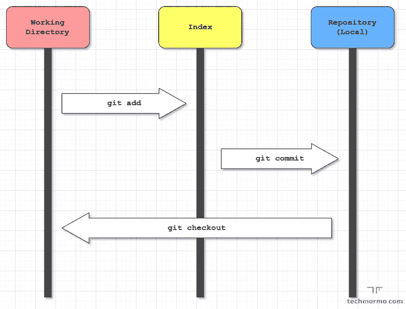
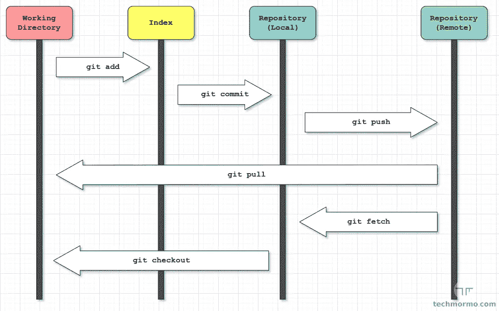
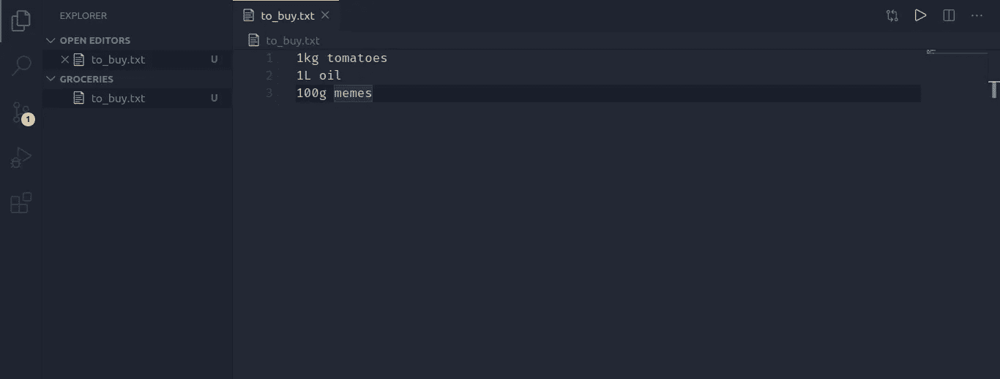
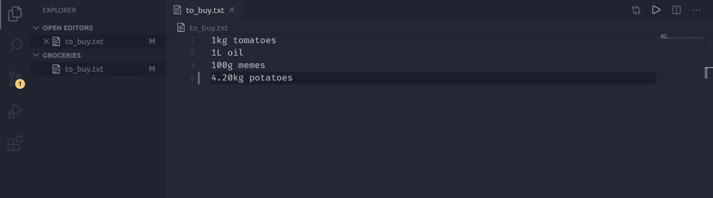
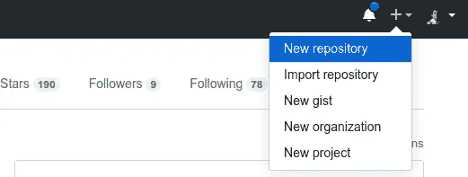
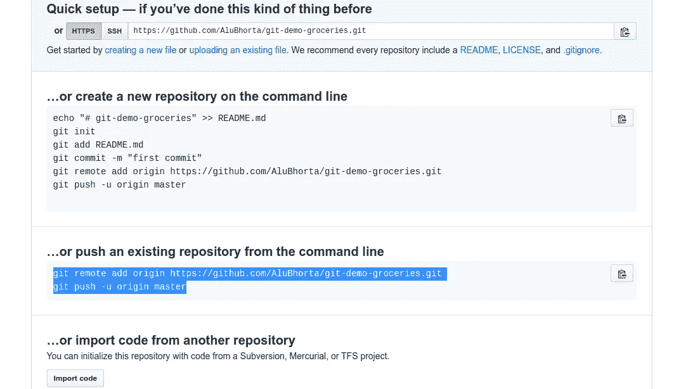

# 但是 Git 和 Github 到底是什么？

> 原文：<https://blog.devgenius.io/but-what-the-heck-are-git-and-github-463b9df0e6e5?source=collection_archive---------22----------------------->


照片由来自 Pexels 的 Ilargian Faus 拍摄

# Git 版本控制初学者指南

> 你是否一直想知道 git 是什么，为什么大家都在用它？或者，也许你使用过 git，但是不能完全理解它实际上在做什么，对吗？
> 
> 如果是的话，那么请仔细阅读，我会告诉你它到底是什么，为什么开发者离不开它，以及它如何让你的生活变得更加轻松！
> 
> 如果没有，那么也请继续阅读，因为我需要更多的读者。:P

# 介绍

无论您是软件工程师、计算机科学(CS)学生，还是对 IT 感兴趣的人，您都应该熟悉 git。

学习一项新技术可能会令人生畏，尤其是如果它涉及到邪恶的、上帝禁止的终端(又名。命令行)。


Git 可能很难学，因为它是开发人员/CS 学生接触的第一批工具之一。我理解这一点，因为我最初也很难使用 git。

但是当我意识到它的目的是什么以及如何做到这一点时，事情就变得简单多了。我会试着用一种我希望别人在我刚开始的时候向我解释的方式来解释。

我们将从自顶向下的角度来看 git，因为这样更容易理解，并且使用的术语更少。

你们中的一些人可能熟悉 Github Desktop，这是一个桌面 GUI 应用程序，用作 git 客户端。但是我强烈建议你坚持使用终端，因为:

*   它给你更多的控制
*   它并不限制你只能将 Github 作为一个 git 托管提供商
*   这让你觉得自己像个黑客


值得注意的是，有许多程序和工具只能通过终端获得。习惯它有一些明显的好处，即使一开始感觉很可怕。

但是为什么 git 如此重要呢？为什么几乎每一个软件相关的岗位都有这个要求？该死的，饭桶到底是什么？！

冷静点。拿上你的芒果汁和奥丁的终端听我解释。

# 问题

在我们研究 git 之前，我们应该理解它解决了什么问题。

# 1.更改可能会破坏正常工作的应用程序

想象你正在制作一个 web 应用程序。您已经在这上面工作了很长时间，安装了必要的依赖项并编写了必要的代码。它工作正常。

然后你决定添加一个新的很酷的特性。更新代码后，你的应用程序不再工作。你试图修复它，并做出改变，希望至少你能回到以前的工作状态。

但遗憾的是，它似乎没有恢复工作。

除了躲在角落里哭，你现在还能做什么？


# 2.在团队项目中工作

假设你正在进行一个团队项目。您和您的团队成员在不同的地点工作。如果两个或更多的人在同一版本上编辑同一个文件，你最终会遇到冲突。你们怎么能实时处理同一个源代码呢？

很严重的问题，对吧？

# 解决方案

假设你比哭猫聪明。每当您对代码进行更改时，您都会创建该版本的副本。比如像:`my-app-v1`、`my-app-v2`、`my-app-v3`、…、`my-app-vN`。

事实上你正在做的是手动的`Version Control`。

> **版本控制**指的是对文件随时间变化的管理，以便以后可以引用某个特定的版本。

这是可行的，但是，

*   手动维护版本是一件令人头疼的事情
*   文件存储效率不高，因为许多未更改的文件会被复制

幸运的是，在我们之前已经有聪明的人解决了这个问题。我们有`Version Control System`来救援了！

> 一个**版本控制系统(VCS)** 是一个帮助记录文件随时间变化的程序。

VCS 让我们能够有效地跟踪文件的变化。它通过在特定时间点拍摄文件状态的快照来做到这一点，这些快照可以在以后需要时引用。

自 90 年代以来，风险资本有多种形式，

*   那些只在一台机器上运行的，
*   客户端-服务器架构的应用程序(CVS、SVN 等)。),
*   到我们今天的分布式系统(Git、Mercurial 等)。).

这就把我们带到了 git。

> Git 是一个免费的开源分布式 VCS，最初由 Linus Torvalds 于 2005 年开发。

如果你不熟悉的话，Linus Torvalds 也是 Linux 内核的创造者。计算机科学的传奇之一。


Git 是当今 VCS 软件开发的事实标准。那么，让我们`git`开始吧…

# Git 术语

为了存储版本历史，git 使用了`repositories`。就我们的意图和目的而言:

> git 存储库只是 Git 用来维护项目版本历史的一个文件夹。

存储库文件夹也称为`git directory`，用于存储 git 执行其工作所需的对象(如文件内容)、引用和其他元数据。默认情况下，它是一个位于项目根文件夹中的`.git`文件夹。

那么，我们如何衡量变化呢？在 git 中，变化的单位是一个`commit`。

> 一个**提交**记录对存储库中的文件和文件夹所做的更改。

我喜欢把提交看作是项目当前状态的快照或记录。值得注意的是，提交的变更来自`index`，而不是`working directory`。

那些是什么鬼东西？很高兴你问了。

> **工作目录**由您可以直接编辑和操作的文件和文件夹组成。

当您切换到其他(旧的或新的)提交时，工作目录中的文件和文件夹通常会被 git 删除和替换。

> **索引**是提交的准备区域。

也就是说，它充当工作目录和存储库之间的中间人。当您想要保存对一些文件的一些更改时，在提交到存储库之前，首先将它们添加到索引中。

为了跟踪提交，git 使用了`branches`。

> 一个**分支**只是一个指向提交的(可移动)指针。

默认情况下，git 会创建一个名为`master`的分支。每当您从主分支提交**时，指针自动向前移动到新的提交。**

在本教程中，我们不会过多地讨论分支。但是形象地说，一个分支代表一系列的提交，分支的尖端指向一个提交。

唷！那是许多行话。现在最精彩的部分来了…

# Git 的高级视图

这里有一个图表，它真的帮助我可视化 git。



箭头中的文本是从 A 点到 b 点的相应命令。在 git 中，有许多不同的方法可以实现相同的结果，但是我们将重点关注标准实践。

我们稍后将深入研究这些命令。

# 而 Github 呢？

那么`Github`在哪里发挥作用呢？

到目前为止，讨论的存储库仅限于您的计算机。

*   如果你的电脑突然和你的存储一起崩溃了怎么办？您立即失去了对文件系统的访问，并且您宝贵的项目也丢失了。
*   如果您想从另一台计算机访问您的项目，该怎么办？
*   如果更多的人想为你的项目做贡献呢？

所有这些(以及更多)问题都可以解决——只要有办法通过互联网共享存储库…

**Github 已进入聊天**

> "我是一个该死的 git 托管提供商."— **Github**

像你可能熟悉的其他一些** hub*一样，Github 是一个巨大的 git 库集合，由无数运行在连接到互联网的数据中心(又名。《云》)。

你可以通过一个账户在 Github 中创建新的库，然后`push`从你的`local repository`变为`remote repository`，同样`pull`也向另一个方向变化。

这是带有远程回购的 git 图。



如果你注意到，该声明说“一个”git 托管提供商，这意味着有更多的选择。两个更受欢迎的提供商是 Gitlab 和 Bitbucket，它们各有利弊。但是现在我们将继续关注 Github。

# 动手——Git

该是我们动手的时候了。打开强大的终端，让我们开始吧…

# 装置

首先我们需要在我们的操作系统中安装 git。

对于 **Windows** ，从[这里](https://git-scm.com/download/win)下载并安装包。

对于 **Mac** ，运行:

```
brew install git
```

对于 **Ubuntu、Mint** 和其他 **Debian 发行版**，运行:

```
add-apt-repository ppa:git-core/ppa
apt-get update
apt-get install git
```

对于其他 Linux 发行版，进一步的说明[在这里](https://git-scm.com/download/linux)。

# 配置

安装后，我们将设置全局用户名和电子邮件，git 用它来记录谁提交了什么。

相应地添加您的用户名和电子邮件:

```
git config --global user.name "your username"
git config --global user.email "your.email@example.com"
```

# 一个简单的 Git 练习

好了，我们都准备好了。我们的项目将会非常简单——一个简单的购物清单。

那么我们如何获得一个知识库呢？我们有两个选择:

*   要么我们创造一个新的
*   或者我们克隆一个现有的

因为这是一个新项目，我们将创建一个新项目。但是首先让我们为我们的项目做一个文件夹。

```
mkdir groceries
cd groceries
```

如果您不熟悉这些命令，

*   `mkdir groceries`:新建一个目录(即文件夹)，命名为“杂货”
*   `cd groceries`:将终端带到杂货目录，即更改目录

创建文件夹并在该文件夹中导航终端后，运行以下命令来初始化存储库:

```
git init
```

打开你最喜欢的编辑器。我将使用我可信赖的 VS 代码，你可以从[这里](https://code.visualstudio.com/download)下载。

```
code .
```

新建一个名为`to_buy.txt`的文本文件，添加两三个条目并保存。这是我的:



现在检查回购的状态:

```
git status
```

它应该显示所做的更改(文本文件)以及您在主分支中。

让我们将未跟踪的文件添加到索引中，如下所示:

```
git add to_buy.txt
```

现在提交，选项`-m`允许您添加描述提交的消息:

```
git commit -m "add initial groceries"
```

干得好！

现在如果你运行`git status`，你会看到它说“工作树干净”，意思是在工作目录中没有未提交的变更。

要检查您刚刚提交的内容，请运行:

```
git log
```

“commit”后面的长字符串是唯一标识您的提交的提交 id。它是由一个哈希函数生成的，但是你现在不用担心它了。

注意，`HEAD`指向 master，表示您仍然在 master 分支上。

> **HEAD** 是对你切换到的最后一个提交的引用。

让我们向文件中添加一个新项目:



添加对索引的更改并提交。提示:您可以使用`git add .`将所有更改(对任何文件)添加到索引中

```
git add .
git commit -m "add potatoes"
```

现在，您可以查看使用以下命令进行的两次提交:

```
git log
```

注意主分支已经自动移动，正如我们已经讨论过的。

假设出于某种原因，我们想回到最初的提交。复制第一个提交 id，并运行`checkout`。

```
git checkout your_commit_id
```

提示:id 的前 5 个字符也足够了。在我的例子中，id 是`606a3e3c25022f8a89a2f895c4d8465292363446`，所以我可以运行`git checkout 606a3`。

恭喜你！你现在可以回到过去。

不尽然，但至少你可以回去满足/恢复/修复文件的旧状态。

你会注意到它说你处于`detached HEAD`状态。这基本上意味着没有分支指向这个提交(作为主节点，唯一的分支指向最后一个提交)。

您现在可以在这里查看和编辑文件，并创建一个新的`branch`，它的提交与您上次提交的不同。

在继续之前，让我们回到 master 指向的最新提交。

```
git checkout master
```

# 将 Github 加入其中

首先创建一个 [Github](https://github.com/) 账户，如果你还没有的话。

登录后点击右上方的加号按钮，点击`New repository`。



命名您的存储库。我给我的取名`git-demo-groceries`。现在滚动到底部，点击`Create repository`。

太好了！你现在有一个回购。不要被屏幕上的所有命令关掉。

点击“快速设置”下的“HTTPS”按钮。然后向下滚动，找到“或从命令行推送现有存储库”一节。复制下面的两个命令并运行它们。

我的看起来像这样:



所以我可以跑:

```
git remote add origin https://github.com/AluBhorta/git-demo-groceries.git
git push -u origin master
```

让我们来理解这两个命令。

*   第一个添加了一个名为`origin`的新的`remote`存储库。
*   第二个将您的更改(提交)推送到`origin`的`master`分支。

在被询问时提供您的 Github 用户名和密码，这样他们就知道是您了。

成功完成推送后，如果您刷新新的 Github 存储库页面，瞧！你的杂货现在在 Github 上。

还和我在一起吗？太好了！我们快完成了。

让我们从 Github 中添加一个新文件，并将更改提取到本地 repo 中。

进入你的 Github 库，点击右下角的“添加一个 README”按钮。这将自动生成一个`README.md`文件供您编辑。

通常存储库在根目录下保存一个`README.md`文件，它提供了一个概览(或安装说明等)。)关于知识库。

在标题下添加您想要的任何内容。我会加上“我每周的食品杂货”。

然后滚动到底部，点击`Commit new file`。这将自动创建一个名为“Create README.md”的提交消息，您可以覆盖它。

创建自述文件后，返回到您的终端并运行:

```
git pull
```

如果一切顺利，现在您的本地 repo 中已经有了 README.md 文件。不错！您现在可以运行`git log`来查看所有提交，包括添加了 README.md 文件的最新提交。

我们的会议终于结束了！如果你需要参考，这是我们练习中我的远程回购的[链接](https://github.com/AluBhorta/git-demo-groceries/tree/master)。

# 结论

如果你已经跟着做了相应的练习，*祝贺你！*你现在知道 git 了。


当然，关于 git 还有很多东西需要学习，不是一个教程就能讲述的。但是这些是标准 git 工作流的基础。

如果你想深入学习 git，你可以查看一下官方 git 文档或者斯科特·沙孔的书。

但是最好的学习方法当然是自己动手。所以，出去好好表现吧！

*原载于*[*https://techmormo.com*](https://techmormo.com)*。*