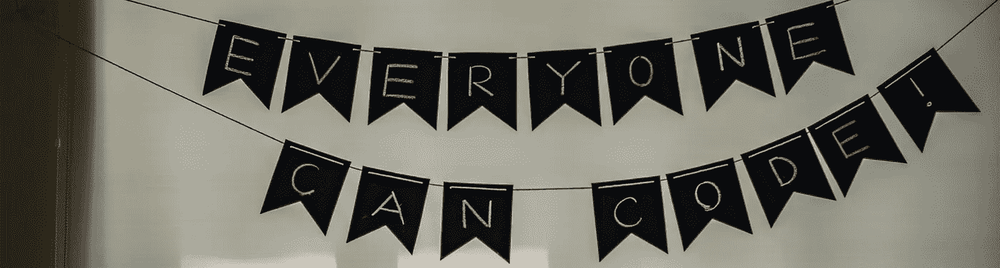
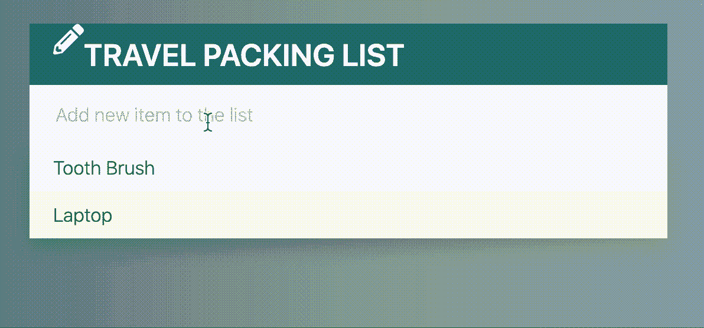
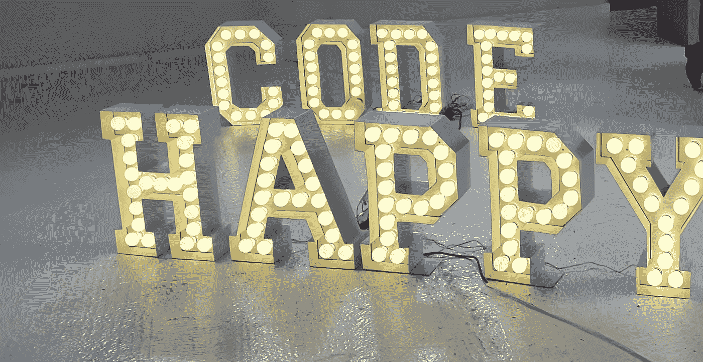

# 顺便问一下，互联网是如何工作的？

> 原文：<https://blog.devgenius.io/by-the-way-how-does-the-internet-work-c1beaa4f4757?source=collection_archive---------23----------------------->

# **我的编码之旅是如何开始的**

2019 年 4 月我决定从头开始学编码。我不知道这个想法会把我带到哪里，我现在也不知道。但是，在过去的一年里，我学到了一些很棒的东西，这就是我今天要告诉你的。

我不会写一篇深度科技博客。这只是我在探索编码世界时获得的经验、恐惧和知识——作为一名编码初学者，作为一名技术领域的女性，让我们看看我还会成为什么。

# **单凭一个想法是无法实现的。**

所以，一开始有一个小小的想法。但仅此还不算多。一个想法会变成一个直接的愿望，最终它会变成一个行动，让这个想法变成现实。就我而言，在我有强烈的愿望去实现这个想法之前，这个想法已经存在很久了。我的第一步行动是在 Udemy 上买了一个简单的在线课程，在网上某个地方的一篇博文里提到过(抱歉，我已经记不清网址了)。这个课程是来自 Colt Steel e 的[“网络开发者训练营”。我买它是因为它很便宜，而且它有很多很棒的推荐。此时，我不知道这一步会如何改变我与编码的关系，以及它能让我做什么。](https://www.udemy.com/course/the-web-developer-bootcamp/)

但是我非常尊重开设这门课程，因为它涵盖了如此多的主题。除了 HTML、CSS 和 Javascript 的基础知识之外，它还包含了处理 Node.js、npm 和其他一些东西的综合章节。整个课程包括 47 个小时😳视频教学——不包括我花在寻找代码中的错误(大部分只是一个错误的标点符号)和继续试错概念上的时间。很好，我以前不知道这个。🙈

# 一旦开始就没有结束

2019 年 4 月一个下雨的周末，我开始了课程，很好奇会发生什么。然后我就再也停不下来了。一个接一个的主题吸引了我的全部注意力，看到你只用几个简单的代码就能做什么真的很酷。

例如一个用于待办事项列表的迷你应用程序(可能是最受欢迎的初学者编码项目😄但还是好玩)。

仅仅六个月后，我已经在 2019 年 11 月参加了我的第一次黑客马拉松，由 [women++组织](https://medium.com/u/cab256feaedf?source=post_page-----c1beaa4f4757--------------------------------)。你也可以在这里通过[媒介](https://medium.com/womenplusplus/impressions-of-my-first-hackathon-6a0258708ecc)阅读我这次冒险的经历。

