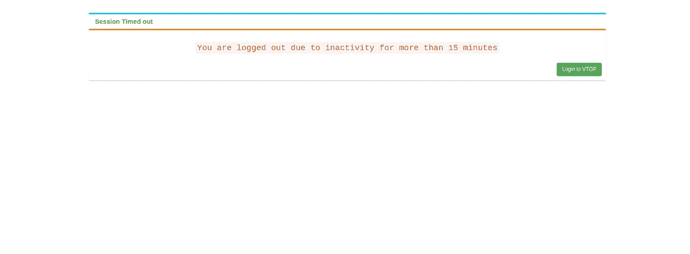

# 绕过 webview 第 1 部分中的“由于不活动，您已被注销”

> 原文：<https://blog.devgenius.io/bypass-you-have-been-logged-out-due-to-inactivity-in-webview-part-1-4c3c93bc2d3a?source=collection_archive---------22----------------------->

很多网站(主要是大学网站)在一段时间不活动后会自动注销，这是很常见的。我们可以使用共享首选项来克服这个问题。

会话注销

# 桌面和 Mac

桌面和 mac 版本的谷歌 chrome 都有扩展和插件，这将帮助我们保持登录。

# 移动设备

在 App webviews 中，我们可以不借助任何外部工具来解决这个问题。

# 如何让它发挥作用？

我们可以编写一个代码来创建后台服务，它将在后台每隔' *x'* 分钟刷新一次 webview。

**资源创建后台服务**

安卓工作室:[点击这里](https://developer.android.com/training/run-background-service/create-service)

对于颤振:[点击这里](https://flutter.dev/docs/development/packages-and-plugins/background-processes)

对于苹果设备:[点击这里](https://developer.apple.com/documentation/uikit/app_and_environment/scenes/preparing_your_ui_to_run_in_the_background/updating_your_app_with_background_app_refresh)