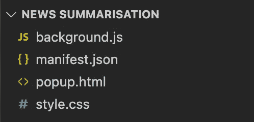
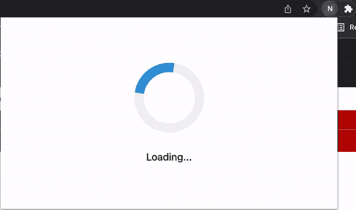
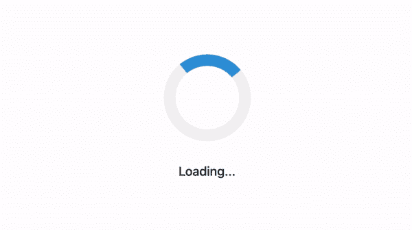

# 绕过嘈杂的新闻:编写一个文本摘要谷歌浏览器扩展

> 原文：<https://blog.devgenius.io/bypassing-noisy-news-writing-a-text-summarisation-google-chrome-extension-57074777bf18?source=collection_archive---------5----------------------->

帕特里克·托马索拍摄的照片

如果你和我一样，你可能会发现自己越来越沮丧，当你看到一个有趣的新闻标题，点击它，但很快意识到这篇文章充满了膨胀和冗余信息。不仅如此，你还可以享受在广告、文章推荐、有时甚至是非常令人愉快的自动播放视频的丛林中导航的乐趣(谁会认为这是个好主意呢？).能够概括文章的要点，而不必担心随之而来的日常麻烦，这不是很好吗？嗯，你很幸运！

在这篇文章中，我将介绍如何使用文本摘要模型对一篇新闻文章进行简要概述，并打包成一个简单易用的 Google Chrome 扩展。特别是，我们将对 BBC 新闻文章进行文本摘要。

我们将首先研究如何设置一个简单的 Google Chrome 扩展。设置好 Chrome 扩展后，我们将研究如何使用它从网页中提取文本，然后通过使用他们的 API，利用来自[拥抱脸](https://huggingface.co/)的模型来执行文本摘要。最后，我将通过展示一些 BBC 新闻摘要的例子来演示扩展的用法。

**概述**

*   设置 Google Chrome 扩展
*   从文章中提取文本
*   模型—文本摘要
*   将所有这些放在一起…
*   结果
*   结论

# **设置谷歌浏览器扩展**

为了保持美观和简单，Google Chrome 扩展将包含一个正常运行的插件所需的最低限度。第一步是为扩展创建一个文件夹，其中包含四个简单但非常重要的文件。

## **manifest.json**

一个 JSON 文件，概述了定义扩展的信息。例如扩展的名称、扩展的权限、运行哪些脚本以及何时运行。

这里要关注的三个重要字段是“`browser_action`”、“`permissions`”和“`content_scripts`”。

[browser_action](https://developer.chrome.com/docs/extensions/reference/browserAction/) 字段允许我们在单击扩展时从 Google Chrome 工具栏中加入一个弹出框。这就是我们将要注入显示摘要文本的 HTML 文件的地方。

[权限](https://developer.chrome.com/docs/extensions/mv3/declare_permissions/)字段允许我们授予对我们可能需要的信息的特定访问权限。例如，我们需要从当前活动的选项卡中提取文本。这是通过访问活动选项卡的 URL 属性来完成的，这需要“active tab”权限。

[content_scripts](https://developer.chrome.com/docs/extensions/mv3/content_scripts/) 字段指定将在扩展上下文中运行的文件。在这种情况下，我们希望运行一个 JavaScript 文件来进行文本摘要，并使用 CSS 文件对其进行样式化。我们还规定，这些脚本应该只在我们位于与以下网址匹配的网页上时运行:"https://www.bbc.co.uk/news/*"。

## **popup.html**

一旦对一段文本进行了总结，我们就希望将它显示给用户——这发生在这里。还记得`manifest.json`中我们指定了`default_popup`的`browser_action`字段吗？这是一个 HTML 文件，当我们单击扩展时，它将被注入到弹出框中。

这方面的代码片段将非常简单，因为我们只想定义占位符，以便能够显示文章的标题和文本摘要。此外，我认为在我们不得不等待来自文本摘要模型的响应的时候加入一个“加载器”动画会很好。

## **style.css**

为了使扩展看起来*有点*可接受，它需要一点样式。为了简单起见，加载器使用了`[css-pkg](https://css-pkg.github.io/style.css/) style.css`和一些额外的填充和动画。

## 背景**。js**

这是编写扩展背后的任何逻辑的地方。这包括文本提取、文本摘要和更新 HTML 中的占位符字段。现在，我们将把 JavaScript 文件留空，稍后再返回。

## **目前看起来怎么样？**

为了看到我们到目前为止的进展，扩展需要加载到 Chrome 中。点击浏览器窗口右上角的三点图标，进入**更多工具>扩展。**到达后，按**打开**按钮，选择您的分机所在的目录。

一旦扩展成功加载到 Chrome，您可以通过单击浏览器右上角的拼图图标来使用它。到目前为止，扩展应该是这样的…一个无限旋转的加载屏幕-很好！

扩展的加载屏幕。

酷毙了。所以现在我们有了一个简单的 Chrome 扩展。尽管一个无限旋转的轮子如此迷人，但它并不十分有用。所以让我们把它变得有用吧！

# **从文章中提取文本**

我们想做文本摘要…但首先，我们需要一些实际的文本来执行文本摘要！让我们开始吧。

让我们讨论一下我们将如何运行文本提取和摘要逻辑。每当我们在 BBC 新闻文章上打开我们的扩展时，我们希望我们的扩展执行一些逻辑来处理文本提取和文本摘要。由于我们已经将 manifest.json 中的字段`background.js`添加到了`content_scripts`中，每当我们打开扩展时，这个文件都会执行，因此我们应该在这里放置任何逻辑。

首先，我们希望能够访问活动选项卡页面上的文本——允许我们提取文本以便进行总结。使用`chrome.tabs.query`可以快速获得活动选项卡的引用。如果我们指定了`active: true`和`currentWindow: true`，传递给回调函数的`tabs`对象将是一个只有一个元素的数组——对活动选项卡的引用。

您还记得之前我们授予扩展“activeTab”权限吗？这使我们能够检索关于活动选项卡的信息，比如它的 URL，我们可以使用它从扩展向活动选项卡的 URL 发送请求，以从文章中检索底层 HTML。

一旦我们向 URL 发送了一个请求，我们就可以通过使用浏览器中的 Inspect 工具来识别需要从 DOM 中提取什么信息。对于 BBC 新闻文章，标题文本存储在 id 为`main-heading`的 HTML 元素中，文章的完整文本存储在 id 为`main-content`的元素中。

唷，太多了，是吧？谢天谢地，这并不等于大量代码。下面你可以看到处理所有这些逻辑的代码片段。最后，我们有一个名为`tabInformation`的标识符，它引用了一个包含两个属性的对象:`textToSummarise`和`textTitle`。

# 模型—文本摘要

现在让我们进入这篇文章有趣的部分。我们现在希望能够提取文章文本并对其进行总结。我们会编写和训练我们自己的超级一流的深度学习文本摘要模型吗？绝对不行！虽然我完全鼓励你理解我们将要使用的模型的基本工作原理，但是如果每次你想用这些模型做任何有用的事情时，你都要重新发明轮子，那将会浪费很多时间。相反，在我们的朋友[拥抱脸](https://huggingface.co/)的一点帮助下，我们能够通过一个 API 非常快速和容易地使用这些模型。

拥抱脸提供了大量已经训练好的机器学习模型，可以用于推理。在我们的例子中，我们希望使用文本摘要模型。如果我们前往拥抱脸，浏览他们的模型部分，并通过任务“摘要”进行过滤，有大量的模型已经被训练来进行文本摘要。

没有单一的正确型号可供使用，因为每个型号都有优点和缺点，而且新型号会定期创新并添加到产品系列中。对于这个例子，我将使用 [BART](https://huggingface.co/facebook/bart-large-cnn) 模型，该模型经过了英语语言的预先培训，并在 [CNN 每日邮报](https://huggingface.co/datasets/cnn_dailymail)上由脸书(`bart-large-cnn`)进行了微调。这似乎是一个明智的选择，因为 BART 在针对文本生成进行微调时特别有效，而且这个特定的变体已经过微调，专门用于总结 CNN 每日邮报的文章，这与总结 BBC 新闻文章没有太大的不同。

为了能够使用一个模型对拥抱脸进行推理，您必须注册并检索一个 API 令牌。一旦你完成了，发送一个请求并从模型中获取一个响应就非常简单了。

下面是显示函数`runModel`的代码片段，它接收一个文本字符串，然后发送出去，由选择的模型进行总结。

# **将所有这些放在一起…**

现在，我们有了一个可以从 BBC 新闻文章中提取文本的函数和一个可以对给定的文本字符串执行模型推理的函数，现在是时候将这些片段放在一起并对新闻文章执行文本摘要了！

回想一下，我们希望在每次打开 BBC 新闻文章的扩展时执行文本摘要。这意味着我们需要在文本被提取并存储在`chrome.tabs.query`回调的`tabInformation`对象中之后执行模型推断。

在模型返回总结的文章文本后，我们希望更新扩展的 HTML 中的占位符字段，关闭加载元素，瞧！我们现在有一个简单的 BBC 新闻文章文本总结谷歌浏览器扩展！

# **结果**

对我们的扩展进行测试，我们可以看到它工作得非常好！下面是一篇关于[的文章的摘要，关于鸟类的歌曲是如何登上澳大利亚排行榜榜首的。整洁！](https://www.bbc.co.uk/news/world-australia-59676772)

这里还有几个由模型生成的文本摘要的例子。

[**圣诞节如何避免小玩意受挫**](https://www.bbc.co.uk/news/technology-59699296)

> 科技玩具通常需要在圣诞节前做一点准备。电池、砖块和电缆应该在大日子之前充电。新游戏机可能还不能开箱即用。像流媒体盒和智能插头这样的智能家居技术可能需要更新软件。

[**会做圣诞大餐的机器人厨师**](https://www.bbc.co.uk/news/business-59651334)

> Moley 机器人厨房可以烹饪 5000 多种不同的食谱。它可以打开烤箱和炉灶，拿起和放下炖锅和铲子，搅拌，搅拌和翻转。该系统在玻璃屏幕后运行，因此机械臂不会撞到人。但是对于任何一个希望急着下单的家常菜来说，最低价格是 15 万。

[**艾在牛津工会辩论中为自己辩白**](https://www.bbc.co.uk/news/technology-59687236)

> 艾在牛津大学辩论中为自己辩护。该实验旨在引发关于技术伦理的讨论。威震天 LLB 变压器是由计算机芯片公司 Nvidia 的应用深度研究团队开发的。它获得了大量数据的访问权——包括整个维基百科，2016 年至 2019 年的 6300 万篇英语新闻文章。

# **结论**

你不再需要费力地穿过广告的丛林，或者处理那些经常出现在现代新闻报道中的噪音！希望这篇文章能帮助你理解如何为文本摘要编写自己的 Google Chrome 扩展。

虽然我们在这个例子中使用了 BBC 新闻，但是一般的过程和逻辑对于其他新闻文章(或者一般的网站)是相同的，允许你在其他设置中执行文本摘要。此外，正如我前面提到的，没有一个单一的正确的模型可以使用，所以请随意使用不同类型的文本摘要模型，看看它们之间的结果对于您的用例有什么不同。

完整的代码可以在 GitHub 上找到，网址是[https://GitHub . com/Usefulmaths/BBC-News-Article-summarization-Google-Chrome-Extension](https://github.com/Usefulmaths/BBC-News-Article-Summarisation-Google-Chrome-Extension)

领英:【https://www.linkedin.com/in/liam-eloie/ 