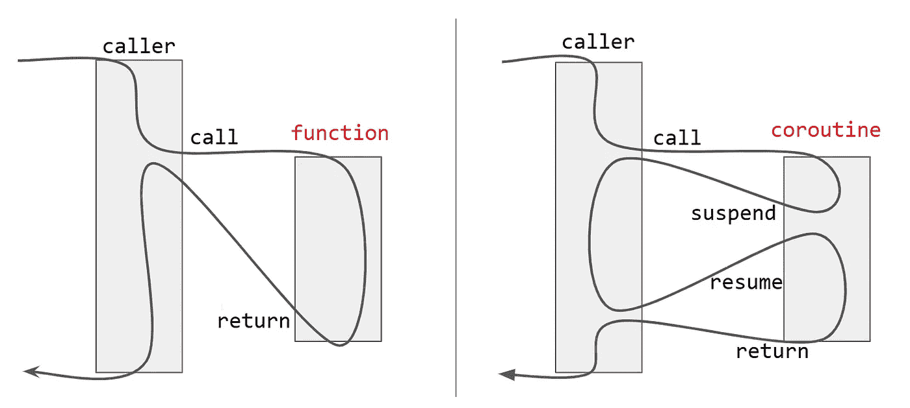
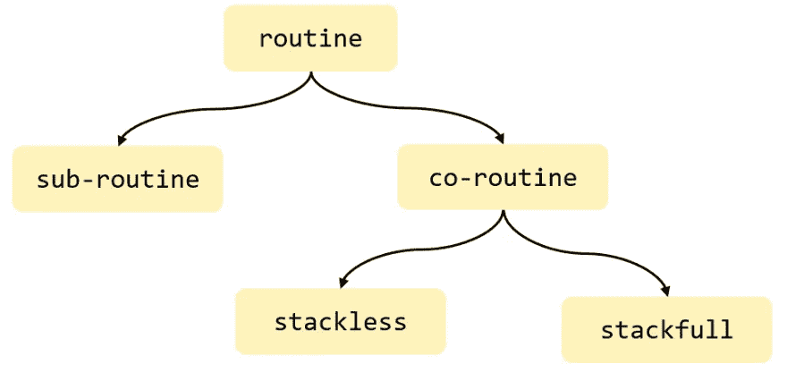

# C++20 协同程序:编译器的观点

> 原文：<https://blog.devgenius.io/c-20-coroutine-compilers-point-of-view-dc1da4f8f8e0?source=collection_archive---------4----------------------->



除了[模块](https://en.cppreference.com/w/cpp/language/modules)、[范围](https://en.cppreference.com/w/cpp/ranges)、&、[概念](https://en.cppreference.com/w/cpp/concepts)之外，协程是 C++20 标准引入的主要特性之一。你看我打开它有多开心。我已经在我的上一篇文章中设定了这个主题的基线，在那篇文章中，我们看到了执行的暂停-恢复是如何工作的！通过这篇文章“C++20 协程:幕后”,我们将看到编译器如何创造神奇的&标准库帮助它的基本基础设施，使 C++20 协程更加复杂(然而更复杂)&可伸缩/可定制。

> */！\:本文原载于* [*我的博客*](http://www.vishalchovatiya.com/cpp20-coroutine-under-the-hood/) *。*

在任何时候，你都觉得有一些术语不为你所知。请继续往下读。我为它增加了一个特殊的章节。

# 一般来说协程是什么？



*   更多信息请参考我之前的文章【C 语言中的 协程。

# 什么是 C++20 协程？

*   一种功能

1.  包含关键字`co_await`、`co_yield` 和/或`co_return`。
2.  使用指定承诺的返回类型。

*   从更高的抽象层次来看，C++20 协同例程包括:

**承诺**

*   定义总体协程行为。
*   充当调用者之间的沟通者&称为协程。

**获奖者**

*   控制暂停和恢复行为。

**协程手柄**

*   控制执行行为。

# 为什么您甚至需要协程？

*   我已经在我之前的文章[C 语言协程](http://www.vishalchovatiya.com/coroutine-in-c-language/)中提到了这一点。
*   然而，如果你仍然想理解用例对协程的需求，那么请参考[现代 C++迭代器设计模式](http://www.vishalchovatiya.com/iterator-design-pattern-in-modern-cpp/)。
*   或者你可以直接看到本文[使用协程](http://www.vishalchovatiya.com/cpp20-coroutine-under-the-hood/#Generating_Integer_Sequence_Using_C20_Coroutine)生成整数序列一节。

# 用实例理解 C++20 协同程序

*   理论够了。我们来谈谈代码。

# 挂起协程

*   下面是一个蹩脚的 C++20 协程的最小的例子。但是对于步伐缓慢且代码不那么混乱的初学者来说，这是一个非常好的起点。

```
#include <coroutine>
#include <iostream>struct HelloWorldCoro {
    struct promise_type { // compiler looks for `promise_type`
        HelloWorldCoro get_return_object() { return this; }    
        std::suspend_always initial_suspend() { return {}; }        
        std::suspend_always final_suspend() { return {}; }
    }; HelloWorldCoro(promise_type* p) : m_handle(std::coroutine_handle<promise_type>::from_promise(*p)) {}
    ~HelloWorldCoro() { m_handle.destroy(); } std::coroutine_handle<promise_type>      m_handle;
};HelloWorldCoro print_hello_world() {
    std::cout << "Hello ";
    co_await std::suspend_always{};
    std::cout << "World!" << std::endl;
}int main() {
    HelloWorldCoro mycoro = print_hello_world(); mycoro.m_handle.resume();
    mycoro.m_handle(); // Equal to mycoro.m_handle.resume();
    return EXIT_SUCCESS;
}
// g++-10 -std=c++20 -fcoroutines -fno-exceptions -o myapp Main.cpp
```

*   协程可以通过`std::coroutine_handle`的恢复成员函数或者通过调用`std::coroutine_handle`对象的函数调用操作符来恢复。
*   正如我前面提到的，C++20 协同程序包括:

**承诺即** [**承诺 _ 类型**](https://en.cppreference.com/w/cpp/coroutine/coroutine_traits)

*   包含特殊方法的类型，如 get_return_object()、initial_suspend()、final_suspend()等。编译器在协程转换中使用的。因此，它控制整个协程行为。

**Awaiter 即**[**STD::suspend _ alwait**](https://en.cppreference.com/w/cpp/coroutine/suspend_always)

*   总是挂起协程的空类。
*   您可以在这里看到这种类型[的 GCC 实现。](https://github.com/gcc-mirror/gcc/blob/master/libstdc%2B%2B-v3/include/std/coroutine#L313)

**协程句柄即** [**std::协程 _ 句柄**](https://en.cppreference.com/w/cpp/coroutine/coroutine_handle)

*   用于恢复、销毁或检查协程生命周期的协程处理程序。
*   编译器将上述`print_hello_world`协程转换为:

```
HelloWorldCoro print_hello_world() {
    __HelloWorldCoro_ctx* __context = new __HelloWorldCoro_ctx{};
    auto __return = __context->_promise.get_return_object();
    co_await __context->_promise.initial_suspend(); std::cout << "Hello ";
    co_await std::suspend_always{ };
    std::cout << "World!" << std::endl;__final_suspend_label:
    co_await __context->_promise.final_suspend();
    delete __context;
    return __return;
}
```

*   如您所见，编译器首先创建上下文(即协同程序状态)对象。大概是这样的:

```
struct __HelloWorldCoro_ctx {
    HelloWorldCoro::promise_type _promise;
    // storage for argument passed to coroutine
    // storage for local variables
    // storage for representation of the current suspension point
};// Standard doesn't define such type, rather compilers choose the type that suits its implementation.
```

*   如图所示，在这个上下文对象的帮助下，它借助 promise 的方法`get_return_object()`创建了名为`__return`的`HelloWorldCoro`对象。
*   最后，对`co_await`语句的一个更高层次的转换，协程应该是这样的:

```
HelloWorldCoro print_hello_world() {
    __HelloWorldCoro_ctx* __context = new __HelloWorldCoro_ctx{};
    auto __return = __context->_promise.get_return_object();
    {
        auto&& awaiter = std::suspend_always{};
        if (!awaiter.await_ready()) {
            awaiter.await_suspend(std::coroutine_handle<> p); 
            // compiler added suspend/resume hook
        }
        awaiter.await_resume();
    } std::cout << "Hello ";
    {
        auto&& awaiter = std::suspend_always{};
        if (!awaiter.await_ready()) {
            awaiter.await_suspend(std::coroutine_handle<> p); 
            // compiler added suspend/resume hook
        }
        awaiter.await_resume();
    }
    std::cout << "World!" << std::endl;__final_suspend_label:
    {
        auto&& awaiter = std::suspend_always{};
        if (!awaiter.await_ready()) {
            awaiter.await_suspend(std::coroutine_handle<> p); 
            // compiler added suspend/resume hook
        }
        awaiter.await_resume();
    }
    return __return;
}
```

*   你可以看到我们的`HelloWorldCoro::promise_type::initial_suspend()` \ & `HelloWorldCoro::promise_type::final_suspend()`返回`std::suspend_always`。
*   Whose，方法`std::suspend_always::await_ready()`反过来总是返回`false`。
*   所以我们的协程每次遇到`co_await`都会暂停。

# 从协程中返回值

```
#include <coroutine>
#include <iostream>
#include <cassert>struct HelloWorldCoro {
    struct promise_type {
        int m_value; HelloWorldCoro get_return_object() { return this; }
        std::suspend_always initial_suspend() { return {}; }
        std::suspend_always final_suspend() { return {}; } void return_value(int val) { m_value = val; }
    }; HelloWorldCoro(promise_type* p) : m_handle(std::coroutine_handle<promise_type>::from_promise(*p)) {}
    ~HelloWorldCoro() { m_handle.destroy(); } std::coroutine_handle<promise_type>      m_handle;
};HelloWorldCoro print_hello_world() {
    std::cout << "Hello ";
    co_await std::suspend_always{ };
    std::cout << "World!" << std::endl; co_return -1;
} int main() {
    HelloWorldCoro mycoro = print_hello_world(); mycoro.m_handle.resume();
    mycoro.m_handle.resume();
    assert(mycoro.m_handle.promise().m_value == -1);
    return EXIT_SUCCESS;
}
```

*   要从协程返回值，您需要向 promise 类型提供`return_value()`方法。换句话说，编译器希望名为`return_value`的方法带有适当的参数。
*   并且，如果您不将其提供给 promise type，系统将提示您以下错误:

```
Main.cpp:27:5: error: no member named ‘return_value’ in ‘std::__n4861::__coroutine_traits_impl<HelloWorldCoro, void>::promise_type’ {aka ‘HelloWorldCoro::promise_type’}
    27 |     co_return -1;
       |     ^~~~~~~~~
```

*   这个`return_value()`方法然后被编译器用来转换`co_return`语句，如下所示:

```
HelloWorldCoro print_hello_world() {
    __HelloWorldCoro_ctx* __context = new __HelloWorldCoro_ctx{};
    auto __return = __context->_promise.get_return_object();
    co_await __context->_promise.initial_suspend(); std::cout << "Hello ";
    co_await std::suspend_always{ };
    std::cout << "World!" << std::endl; __context->_promise.return_value(-1);
    goto __final_suspend_label;__final_suspend_label:
    co_await __context->_promise.final_suspend();
    delete __context;
    return __return;
}
```

*   您可能已经注意到，`co_return`转换是普通的，编译器只是将返回值传递给 promise 对象&跳转到最后的 suspend 标签。
*   我就不再展开`co_await`语句了。否则代码会变得很乱。但是，现在，你可以猜猜那里会有什么。

# 从协程中产生一个值

```
#include <coroutine>
#include <iostream>
#include <cassert>struct HelloWorldCoro {
    struct promise_type {
        int m_val; HelloWorldCoro get_return_object() { return this; } 
        std::suspend_always initial_suspend() { return {}; } 
        std::suspend_always final_suspend() { return {}; }        std::suspend_always yield_value(int val) {
            m_val = val; 
            return {};
        }
    }; HelloWorldCoro(promise_type* p) : m_handle(std::coroutine_handle<promise_type>::from_promise(*p)) {}
    ~HelloWorldCoro() { m_handle.destroy(); } std::coroutine_handle<promise_type>      m_handle;
};HelloWorldCoro print_hello_world() {
    std::cout << "Hello ";
    co_yield 1;
    std::cout << "World!" << std::endl;
}int main() {
    HelloWorldCoro mycoro = print_hello_world(); mycoro.m_handle.resume();
    assert(mycoro.m_handle.promise().m_val == 1);
    mycoro.m_handle.resume();
    return EXIT_SUCCESS;
}
```

*   正如我们在从协程返回值时所做的那样，要从协程中产生任何东西，您需要向返回适当类型的 promise_type 提供 yield_value()方法。
*   编译器再次将协程转换为:

```
HelloWorldCoro print_hello_world() {
    __HelloWorldCoro_ctx* __context = new __HelloWorldCoro_ctx{};
    auto __return = __context->_promise.get_return_object();
    co_await __context->_promise.initial_suspend(); std::cout << "Hello ";
    co_await __context->_promise.yield_value(1);
    std::cout << "World!" << std::endl;__final_suspend_label:
    co_await __context->_promise.final_suspend();
    delete __context;
    return __return;
}
```

*   可以看到`co_yield`语句转换成了`co_await`考虑承诺的方法(即`yield_value()`)调用作为表达式。这将返回`std::suspend_always`,因此我们的协程将被挂起，然后产生一个值。

# 用 C++20 协同程序生成整数序列

*   那么，我们已经理解了协程的编译器转换，让我们用协程做一些有意义的事情。

```
#include <coroutine>
#include <iostream>
#include <cassert>struct Generator {
    struct promise_type {
        int m_val; Generator get_return_object() { return this; }
        std::suspend_never initial_suspend() { return {}; }
        std::suspend_always final_suspend() { return {}; } std::suspend_always yield_value(int val) {
            m_val = val; 
            return {};
        }
    }; /* ---------------------------- Iterator Implementation ----------------------------- */
    struct iterator {
        bool operator!=(const iterator& rhs) { return not m_h_ptr->done(); }
        iterator& operator++() { 
            m_h_ptr->resume(); 
            return *this; 
        }
        int operator*() { return m_h_ptr->promise().m_val; } std::coroutine_handle<promise_type> *m_h_ptr;
    }; iterator begin() { return iterator{&m_handle}; }
    iterator end() { return iterator{nullptr}; }
    /* ---------------------------------------------------------------------------------- */ Generator(promise_type* p) : m_handle(std::coroutine_handle<promise_type>::from_promise(*p)) {}
    ~Generator() { m_handle.destroy(); } std::coroutine_handle<promise_type>      m_handle;
}; Generator range(uint32_t start, uint32_t end) {
    while(start != end)
        co_yield start++;
}int main() {
    for (auto &&no : range(0, 10)) {  // Isn't this look like Python !
        std::cout<< no <<std::endl;
    }
    return EXIT_SUCCESS;
}
```

*   上述代码的`range()`函数将根据需要在每次迭代中生成整数。而不是生成&返回预计算序列。
*   对于其余的代码，我建议您耐心地花些时间。在它周围玩耍。
*   而且，如果你在想为什么我们需要在`Generator`中实现`iterator`，那么请学习一下[如何在 C++中使用基于范围的](https://cppinsights.io/lnk?code=I2luY2x1ZGUgPGNzdGRpbz4KCmludCBtYWluKCkKewogICAgY29uc3QgY2hhciBhcnJbXXsyLDQsNiw4LDEwfTsKCiAgICBmb3IoY29uc3QgY2hhciYgYyA6IGFycikKICAgIHsKICAgICAgcHJpbnRmKCJjPSVjXG4iLCBjKTsKICAgIH0KfQ==&std=cpp17&rev=1.0) `[for](https://cppinsights.io/lnk?code=I2luY2x1ZGUgPGNzdGRpbz4KCmludCBtYWluKCkKewogICAgY29uc3QgY2hhciBhcnJbXXsyLDQsNiw4LDEwfTsKCiAgICBmb3IoY29uc3QgY2hhciYgYyA6IGFycikKICAgIHsKICAgICAgcHJpbnRmKCJjPSVjXG4iLCBjKTsKICAgIH0KfQ==&std=cpp17&rev=1.0)` [循环！](https://cppinsights.io/lnk?code=I2luY2x1ZGUgPGNzdGRpbz4KCmludCBtYWluKCkKewogICAgY29uc3QgY2hhciBhcnJbXXsyLDQsNiw4LDEwfTsKCiAgICBmb3IoY29uc3QgY2hhciYgYyA6IGFycikKICAgIHsKICAgICAgcHJpbnRmKCJjPSVjXG4iLCBjKTsKICAgIH0KfQ==&std=cpp17&rev=1.0)。

# C++20 协程术语

*   这一部分应该放在文章的开头。然而，我相信，在你理解协程如何在幕后工作之前，你将无法将 C++20 协程术语上的点连接起来(或者不会理解数据类型命名约定)。
*   至此，您已经能够编写 C++协程了&您可以忽略这一部分。但是你将很难与其他 C++开发人员交流。如果你这样做。

# 值得称赞的

*   支持`co_await`操作符的类型称为可适应类型。
*   C++20 引入了一个新的一元运算符`co_await`，它可以应用于表达式。例如:

```
struct dummy { // Awaitable
    std::suspend_always operator co_await(){ return {}; }
};HelloWorldCoro print_hello_world() {
    std::cout << "Hello ";
    co_await dummy{}; 
    std::cout << "World!" << std::endl;
}
```

# 获奖人

```
struct my_awaiter {
    bool await_ready() { return false; } 
    void await_suspend(std::coroutine_handle<>) {} 
    void await_resume() {}
};HelloWorldCoro print_hello_world() {
    std::cout << "Hello ";
    co_await my_awaiter{};
    std::cout << "World!" << std::endl;
}
```

*   一个 Awaiter 类型是一个实现三个特殊方法的类型，这三个方法作为一个`co_await`表达式的一部分被调用:`await_ready()`、`await_suspend()`和`await_resume()`。例如，标准库定义了琐碎的 awaiters，即[STD::suspend _ always](https://github.com/gcc-mirror/gcc/blob/master/libstdc%2B%2B-v3/include/std/coroutine#L313)&[STD::suspend _ never](https://github.com/gcc-mirror/gcc/blob/master/libstdc%2B%2B-v3/include/std/coroutine#L322)。
*   请注意，一个类型既可以是可接受类型，也可以是接受类型。

# `co_await`

*   `co_await`是一个一元运算符，它挂起协程并将控制权返回给调用者。它的操作数是一个表达式，其类型必须定义运算符`co_await`，或者是一个变量。

```
struct dummy { }; // Awaitablestruct HelloWorldCoro {
    struct promise_type {
        // . . .
        auto await_transform(const dummy&) {
            return std::suspend_always{};
        }
    };
    // . . .
};HelloWorldCoro print_hello_world() {
    std::cout << "Hello ";
    co_await dummy{}; 
    std::cout << "World!" << std::endl;
}
```

# 承诺

*   一种严格命名为`*promise_type*`的类型。
*   promise 对象用在协程内部。协程通过这个对象提交它的结果或异常。
*   承诺类型由编译器使用 [std::coroutine_traits](https://en.cppreference.com/w/cpp/coroutine/coroutine_traits) 从协程的返回类型中确定。

# 协程句柄

*   用于恢复协程执行或销毁协程框架的协程句柄。它还使用`std::coroutine_handle::done()`方法指示协程的状态。

# 协同状态

*   协程状态(称为上下文对象)是编译器生成的、堆分配的(除非分配被优化掉)对象，它包含
*   承诺对象。
*   参数(全部按值复制)。
*   局部变量。
*   表示当前的暂停点，这样 resume 就知道在哪里继续，destroy 就知道范围内有哪些局部变量。

# 协程如何被执行！

*   啊…！真正的魔术时间到了！
*   现在，我们看到了编译器如何用协程关键字`co_await`、`co_yield`、&、`co_return`施展魔法。让我们了解它是如何执行的。
*   但是，在我们前进之前，让我澄清几点:
*   C++标准不关心实现，而是只统计行为。因此协程的实现完全依赖于编译器和库作者。要了解这一点，您可以检查`std::coroutine_handle::resume()`的[库实现](https://github.com/gcc-mirror/gcc/blob/master/libstdc%2B%2B-v3/include/std/coroutine#L126)，它使用了 GCC 编译器提供的 [__builtin_coro_resume](https://raw.githubusercontent.com/mirrors/gcc/master/gcc/builtins.def) 。证明库&编译器是紧耦合的。
*   话虽如此，但在我的职业生涯中，我没有写过任何 C++库或编译器。虽然我已经为专有架构编写/移植了核心 C 库。因此，无论您在本节中看到什么，都只是为了直观地了解如何实现协程。根据我的研究和直觉。
*   我认为有两种方法可以做到这一点:

# 假设 1

*   例如，如果您将协程定义为:

```
HelloWorldCoro print_hello_world(int a) {
    int b = 10;
    co_await std::suspend_always{};
    a = 10;
    int c = 10;
    co_await std::suspend_always{};
    co_return a + b + c;
}
```

*   然后，操作可分为 3 个不同的部分，由 2 个悬挂点(即`co_await <expr>`)分隔，如下所示

1.  `int b = 10;`
2.  `a = 10; int c = 10;`
3.  `co_return a + b + c;`

*   考虑到这些暂停点，编译器基本上
*   将您的协程重写为有点像函数的形式。
*   并创建所有局部变量的副本作为协程状态对象的数据成员。
*   您可以假设协程状态对象布局为:

```
struct print_hello_world { print_hello_world(int a_) : a{a}{} // Coroutine state object with coroutine arguments void _s1(){ // Before suspension point 1 operations
        int b = 10; sp = 1; // switching call back based on suspension point
    }    void _s2(){ // Operations b/w suspension point 1 & 2 
        a = 10;
        int c = 10; sp = 2;
    }    void _s3(){ // Operations after suspension point 2 
        promise.return_value(a + b + c);  // After execution, coro_done = true; coro_done = true;
    }    int a, b, c; // Local variables promise_type& promise; void (*s_cb)[] = {_s1, _s2, _s3}; // suspension point callbacks 
    int sp{0}; // current suspension point(sp)
    bool coro_done{false};
};
```

*   现在，当您调用协程时，您基本上是在创建一个协程状态对象，其参数与协程相似。

```
auto mycoro = print_hello_world(5);// transform intoprint_hello_world    mycoro(5);
```

*   您可能已经猜到，由于将协程重写为微小的函数，我们不再需要挂起机制。和恢复可以实现为:

```
void std::coroutine_handle::resume() { 
    if(not print_hello_world::coro_done)
        print_hello_world::s_cb[sp]();
}
```

*   因此，当您调用 resume 时，您基本上是从一个协程状态对象中调用特定于暂停点的小函数(技术上来说是它的方法)。这意味着创建两个堆栈帧，即`std::coroutine_handle::resume()` & `print_hello_world::_sX()`，其中`X`代表悬挂点编号。因此不需要单独的堆栈&使用与调用者相同的堆栈。这就是为什么 C++20 协同程序比无堆栈协同程序快。
*   我同意上面的例子是不可编译的，不包括边缘情况&不考虑定制的(即一个 waiter 对象)协程行为。但是，凭借我们刚刚建立的直觉，您可以轻松地创建协程的心理模型&参见编译器视角。
*   为了测试您的直觉能力，想象一下**如何在 for 循环中为包含** `**co_await**` **表达式的协程创建微小的函数？**

# 假设 2

*   另一种实现暂停-恢复的常用方法是借助[上下文切换 API](http://www.vishalchovatiya.com/coroutine-in-c-language/)。比如在`co_wait <expr>`语句的扩展中，我已经提到了下面的注释“*编译器增加了挂起/恢复钩子*”。

```
{
    auto&& awaiter = std::suspend_always{};
    if (!awaiter.await_ready()) {
        awaiter.await_suspend(std::coroutine_handle<> p); 
        // compiler added suspend/resume hook
    }
    awaiter.await_resume();
}
```

*   这是你的编译器用[上下文切换 API](http://www.vishalchovatiya.com/coroutine-in-c-language/)向你的代码添加秘密调料的地方。如果你已经通读了我之前的帖子[C 语言的协程](http://www.vishalchovatiya.com/coroutine-in-c-language/)，我想剩下的就很容易想象了。

# 协程相关关键字的编译器转换

```
co_return x;// transforms into__promise.return_value(x);
goto __final_suspend_label;co_await y;// transforms intoauto&& __awaitable = y;
if (__awaitable.await_ready()) {
    __awaitable.await_suspend();
    // ...suspend/resume point...
}
__awaitable.await_resume();co_yield z;// transforms intoco_await __promise.yield_value(z);
```

# 常见问题临别赠言

*   不仅仅是这样，还有很多事情我们还没有探索，比如异常处理、协程调用协程等等。
*   我观察到 C++20 协程的一个不寻常之处是，即使你没有从协程返回任何东西，你也必须指定返回类型。在我看来，这个协程看起来不寻常&反直觉。

**无栈满协程是什么意思？**

—堆栈完整协程需要一个单独的堆栈来执行。
—无堆栈协同程序使用与调用者相同的堆栈。

**线程间的区别&协程？**

—协程是关于你的*编程模型*，线程是关于你的*执行模型*。
—协同例程仍然可以在没有调度器开销的情况下进行并发处理，它只是管理上下文切换本身。
—另一个好处是更低的内存使用量。在线程模型中，每个线程都需要分配自己的堆栈，因此内存使用量会随着线程数量的增加而线性增长。

**“协程就像轻量级线程”是什么意思？**

—首先，协程和线程是不同的实体。因为协程可以是无栈的&不需要操作系统的干预，所以与线程相比，它占用的内存更少，执行速度更快。对于 C++，如果你使用[假设 1](http://www.vishalchovatiya.com/cpp20-coroutine-under-the-hood/#Hypothesis_1) ，它甚至会更快。

C++协程怎么会是无栈的？

—这个已经在[假设 1](http://www.vishalchovatiya.com/cpp20-coroutine-under-the-hood/#Hypothesis_1) 中回答了。还是再来一次。
—编译器将这个动态分配的协程帧的句柄“返回”给协程的调用者。
—当调用者调用`std::coroutine_handle::resume()`方法时，将创建`std::coroutine_handle::resume()`的堆栈帧，该堆栈帧恢复协程，同时在动态分配的协程帧上处理所有协程数据。这就是 C++中协程无堆栈的方式。因为它只在当前堆栈中执行。而不是单独的协程堆栈。