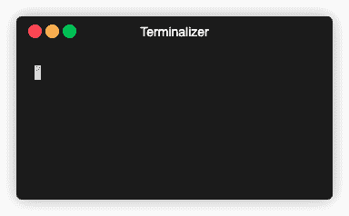

# 圣诞树

> 原文：<https://blog.devgenius.io/c-christmas-tree-2d47299f20c2?source=collection_archive---------8----------------------->


照片由 [Rodion Kutsaev](https://unsplash.com/@frostroomhead?utm_source=medium&utm_medium=referral) 在 [Unsplash](https://unsplash.com?utm_source=medium&utm_medium=referral) 上拍摄

现在是圣诞节🎄还有什么比用 C 语言*编程一棵圣诞树并让灯光渐亮渐暗更好的呢？。或者只是说说树。我们热爱树木😄。这是我们要做的:*



预期产出

> 一篇文章最初发布在[字节跳动网站](https://www.bytegarage.co/post/c-christmas-tree)！**查看**其他文章和开发技巧

我们不会从零开始，但是我们会看到完整代码中一些有趣的部分，你可以在这里找到。我们将特别关注以下主题:

1.  ANSI 转义序列
2.  指极星
3.  c 语言(显然是❤️)

## 我们开始吧！

# 设置环境

[下载项目](https://github.com/bytegarage/c-christmas-tree)，在你喜欢的编辑器中打开根文件夹。我们喜欢[*vs code*](https://code.visualstudio.com)*，因为它是可配置的、可扩展的，并且有很多扩展可以满足每种语言和开发者的需要。
您应该只看到所有信号源所在的`src`。从终端根目录下创建一个新文件夹`bin`:*

```
*mkdir bin*
```

*确保您的终端支持 ANSI 转义序列。我们在集成于 VSCode 的终端上使用 [Oh My Zsh](https://ohmyz.sh/#install) 或者 [iTerm2](https://iterm2.com) 如果你使用 macOS 系统。快速测试运行最终项目，并检查输出是否像上面的 GIF 中的那样。*

# *探索项目*

*最重要的文件是`christmas.c`和`console_color.c`*

*`christmas.c`持有`main()`和程序的高层逻辑。它还加载了包含圣诞树形状和灯位置的`txt`文件。要定义形状，请使用任何字符、空格和换行符，要定义光线，请使用' $ '字符。一个例子给了打击*

*`console_color.c`包含将 ANSI 代码写入`stdout`(终端输出)的函数*

# *这段代码是如何工作的？*

*让我们深入研究一下`christmas.c`文件的`main()`功能。
首先我们创建两个数组 *str* 和 *line* :*

*   *`str`存储从`load_happiness()`函数读取的`tree.txt`文件的原始解析输入。*
*   *从`str`数组派生的`line`，用一个随机的**负数**代替字符“$”。该变量属于`char`类型，通常被编译器指定为`signed char`(即范围为`[-127,+127]`)，考虑到定义为 [ASCII 表](https://www.asciitable.com)的每个元素的 1 字节整数值，该变量被认为是用于**。ASCII 表中没有对负数进行编码，在我们的例子中，每个负数都将由`plot()`函数进行处理，以改变我们的挂件的颜色。***

*你可以注意到，在下面计算`line`的代码中，我们没有使用`line`变量本身，而是使用了一个指向它的指针。的确写`char *pc = str;`就像写`char *pc = &str[0].`*

*那就是指针算术美女✨*

*作为一个`char`指针，每次我们增加它，我们前进一个字符，**，就像数组**中的一个索引增量，但是更简洁！*

## *去吧！像设计师一样编码！*

*我们正在接近更图形化的部分。
除了 *while* 循环在每个周期结束时休眠 *100ms* ，**之外，我们将关注以下函数** : `clrscr()`，`plot()`，`gotoxy()`，因为它们使用 *ANSI 转义码来控制终端，也称为(CSI —控制序列引入器)。*我认为解释它们的最快方法是说:*

> *并不是每一次打印都在命令行上输出一些文本*

*事实上**某些字符序列被解释为指令**，允许改变文本颜色，移动光标或清除控制台屏幕和其他有趣的东西。**有些甚至是参数化的！！**🔝你可以在这里找到可用的*CSI*列表*

*自己试试吧！！打开一个终端，运行一些产生输出的命令，如`ls`，最后，运行以下命令:*

```
*echo "\033[1J"*
```

*控制台上的所有输出都消失了。这个简单的例子与函数`clrscr()`完全相同。*来看看`console_color.c`中`clrscr()`功能实现下面的*简单介绍一下* 

*其中`__puts(s)`是`fputs(s,stdout)`的别名*

```
*#define __puts(*s*) fputs(s, stdout)*
```

*那个**穿上** `**stdout**`(实际打印)一串`s`。考虑中的字符串是常量`CLEAR_SCREEN`,定义为*

```
*#define CLEAR_SCREEN "\033[1J"*
```

****嘿！我们之前在终端上运行的确切序列！****

## *坚持住！我们快到了*

*`plot()`和`gotoxy()`功能*与`clrscr()`没有太大区别*，除了它们使用的转义序列不固定，而是**参数化**。*

*在项目中查找`gotoxy()`的出现，我们发现作为主 while 循环中调用的第一条指令，每周期调用一次，并且总是将光标放在位置`(1,1)` ( `gotoxy(1,1)`即*终端屏幕左上角*)。*老何*是*

```
*#define GOTO_ROW_COL "\033[%d;%dH"*
```

*我们使用`fprintf`函数在`stdout`上放置一个格式化的字符串，其中两个整数`%d`作为参数传递*

*使用`line`参数调用`plot(line)`函数(即使名称可能会引起误解，但这不是我们输入的一行，而是包含随机数的变量，以代替`tree.txt`输入文件中的‘$’字符)。这里是圣诞奇迹发生的地方，所以我们会更近距离地看到它:*

1.  *它以与上面相同的逻辑循环字符串中的每个字符*
2.  ***对于每个字符，我们检查值
    —** ，如果大于 0，将控制台字符颜色设置为绿色`set_color(color_rgb)`，并将字符原样放入`stdout`。它会被印上绿色的' *'
    — **这里是最神奇的部分！**如果小于等于 0*2 . 2 . 1
    。*将控制台颜色设置为字符值的函数(`set_color_rgb(color,0,0)`其中`color = -(*p * 2)`)。
    *2.2.2 中我们将谈到色彩值。*在`stdout`上打印“*”字符代替数字
    2.2。 *3。* **逐渐减少指针值**直到最小值，之后返回上限值并再次开始减少*
3.  *用`fflush(stdout)`清除`stdout`*

## *最后是颜色值的解释*

*上面的点 2 基于指针值做出决定，代码建议我们需要*在我们有负指针值的地方放置字符“*”*。我们的输出全是' * '，我们的`tree.txt`输入也全是' * '，除了灯应该在哪里。这意味着决策部分的`else`部分与`line`变量创建期间生成的随机数相关。实际上' * '对应于 [ASCII 表](https://www.asciitable.com)中的整数 42，我们让它保持原样。相反，当我们遇到' $ '字符时，我们会生成一个范围为`[-1,-100]`的随机数。上面的“魔法发生的地方”中，在点 *2.2.1* 将颜色定义为*

```
*unsigned char color = -(*p * 2)*
```

*要将该值标准化以传入使用另一个 *CSI* 从 RGB 术语设置颜色的函数`set_color_rgb()`:*

```
*#define RGB_FOREGRAUND_PATTERN "\033[38;2;%d;%d;%dm"*
```

*反转`*p`的符号就足以达到预期的效果。乘数因子`2`是**唯一的**来扩展范围，以更好地看到使用更多`[0,255]` RGB 范围的淡入淡出效果。注意，我们可以做这个乘法，因为** **我们已经将** `**color**` **定义为具有范围`[0,255]`的** `**unsigned char,**`。如果我们将`color`定义为简单的`char`，我们将有一个介于`[-127,127]`和`* 2`乘法之间的范围，因为默认情况下`char`是带符号的，我们可能会溢出。*

*如果你检查`set_color_rgb()`函数，有一些按位运算符处理 RGB 颜色分量，但这些不是现在的重点。我只是想强调一下，只是为了解释为什么我们把每个“光字符”的值变成大于 0 的值`≤ 255`(**RGB 编码中的每个通道都是** `**8 bit ~> [0,255]**`)*

## *给你的代码增加时间*

*我们演练的最后一部分是通过在代码中添加时间来给出的。`christmas.c`中`main()`功能中 *while* 循环的最后一条指令是在`console.c`中定义的`sleepms(100)`。它只休眠了*100 毫秒*，否则，我们将看不到灯光的效果，因为程序几乎会立即终止。有了这个睡眠时间，我们可以在*100 毫秒*内看到每个小球的颜色。*

*感谢阅读，圣诞快乐！🎅*

**

*文章灵感来自 ***redmax*** 代码托管在 [GitHub](https://github.com/bytegarage/c-christmas-tree) 上*