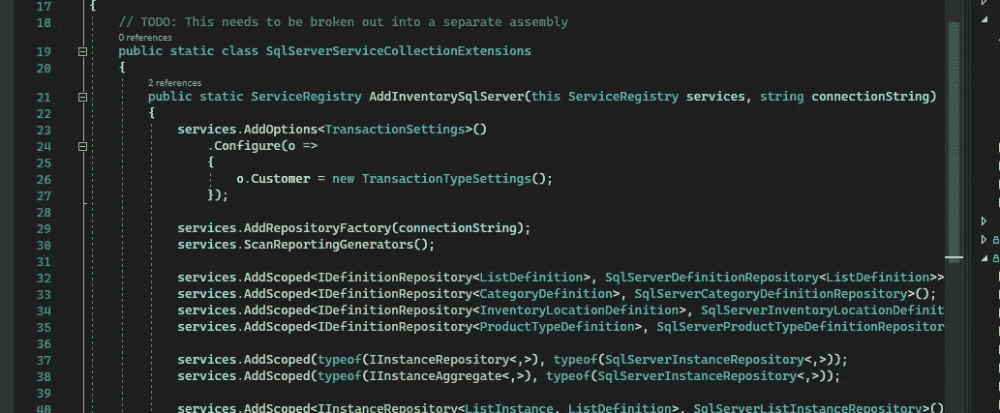

# C#提示:SQL Executor 服务

> 原文：<https://blog.devgenius.io/c-problem-sql-executor-service-deb459132a50?source=collection_archive---------4----------------------->

我不自称是周围最好的开发人员，但有时我会享受这些“啊哈”时刻，即使只是为了我自己。

样品依赖性注入

# 系列目录

**第 1 部分:SQL 执行器服务**
[第 2 部分:依赖注入](https://medium.com/dev-genius/c-tip-sql-executor-service-dependency-injection-4455efb453b0)
[第 3 部分:扩展功能](https://justin-coulston.medium.com/c-tip-sql-executor-service-extending-functionality-edad1c554f)

# 问题

我写了很多和 SQL Server 交互的软件。当然，我们可以走原始的 ADO.NET 路线，但是谁还想做那么多的工作呢？是的，实体框架(EF)有它的位置，但是正确地使用你期望的性能需要对内部工作有更深的了解。所以这些年来我一直倾向于使用 [Dapper](https://github.com/DapperLib/Dapper) ，这是一种奇妙的小微虫。

我的问题来自不得不将基本选项注入服务类(如`string connectionString`)以及不得不围绕创建连接、事务并确保它们被关闭编写样板代码。

> 在这些低年级的班级里，我不喜欢利用。NET Core 的选项模式，因为它创建了一个强大的依赖性。如果我有很强的依赖性，我宁愿是我自己的代码。

例如，假设我有一个查询服务:

当然，还有实现本身:

我一遍又一遍地努力写这个…这很耗时，当有将近 100 个类和方法使用这种类型的样板文件时，它确实开始变得乏味了…

> 我们也不要忘记，我们已经限制了我们执行跨存储库事务的能力，这可能是可取的。

# 解决方案 1:简单的代码重用

最简单的解决方案是从重用一些代码和创建一些助手方法开始。一种自然的方法是将下面的帮助器添加到每个类中，或者将方法添加到一些公共区域进行共享(可以是静态类、扩展或基类)。

但这对我来说还是感觉不对。我想要更多的灵活性…

# 解决方案 2: SQL Executor 服务

不如，我创建一个单独的服务来为我做这件事？然后，我可以控制服务的生命周期，何时提交或拒绝使用事务。这种灵活性对我来说听起来不错！

让我们来看看 SQL Executor 服务:

命名可能会更好一点，但我现在保持不变。

这使我们能够将一个服务注入到所有设置了不同特性的存储库中。例如，下面是一个简单的非事务性实现:

在这种情况下，不会为每个调用创建事务，而是将 null 传递给函数。这在与 Dapper 一起工作时效果很好。但是，任何其他用户可能需要先检查交易。

接下来，添加事务版本很简单:

现在我已经有了一些可以使用的实现(选择您喜欢使用的)，我们需要使用它。

没什么复杂或神奇的。很简单。并且节省了一大堆代码。

# 结论

我喜欢这种方法的一点是，我们可以在任何地方轻松地注入这个`ISqlExecutor`。我们可以重用它，忽略与创建连接和事务相关的一切。这大大减少了我的存储库中的代码量，使我能够专注于 Transact-SQL 优化。

希望您发现这个小技巧对您自己的代码有用！这并不意味着有创意或疯狂。我发现许多和我一起工作的开发人员(包括我自己)会一遍又一遍地做同样的事情，而忘记了我们可以创建小的抽象来提高代码的效率。

下次见！

# 额外收获:跨存储库事务

差点忘了这最后一个实现。下面可以提供一种跨存储库事务管理的方法。这在更复杂的 web API 调用中特别有用，在这种情况下，您需要多个存储库在一个业务服务中作为一个存储库工作。

不过，要做到这一点，您必须能够在您的 DI 容器中适当地注入这个服务`Scoped`。如果处理不当，这可能会非常棘手。所以我将不得不把实现讨论留到下一天。但是如果有兴趣，请告诉我！

# 相关故事

[C#提示:SQL 执行器服务—依赖注入](https://justin-coulston.medium.com/c-tip-sql-executor-service-dependency-injection-4455efb453b0)
[高级 C# — SQL Server 批量上传](/advanced-c-sql-server-bulk-upload-57ad6be6e6a1)
[高级 C# —常用 SQL 表结构](/advanced-c-common-sql-table-structures-bb7f7149b887)