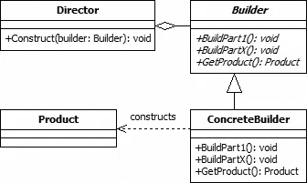

# C#问题:可选的构建器模式

> 原文：<https://blog.devgenius.io/c-problem-the-builder-pattern-af45eca342d7?source=collection_archive---------10----------------------->

*和几种接近它的方法*

由[布雷特·乔丹](https://unsplash.com/@brett_jordan?utm_source=medium&utm_medium=referral)在 [Unsplash](https://unsplash.com?utm_source=medium&utm_medium=referral) 上拍摄的照片

这篇文章可能包含附属链接，当你点击链接时，我可能会赚取一小笔佣金，而不会对你产生额外的费用。作为亚马逊的会员，我从合格的购买中获得收入。

在[设计模式:可重用面向对象软件的元素](https://amzn.to/3HuvpUZ)中，我们都听说过四人组的构建模式。该模式用于创建复杂对象，其组成部分必须以相同顺序或使用特定算法创建([参考](http://www.blackwasp.co.uk/gofpatterns.aspx))。这被认为是一种创造性的模式。

构建器模式的传统方法是使用抽象类(或接口)来构建一些复杂的对象。反过来，创建了一个具体的实现，它可以以不同的方式执行构建。

[构建器设计模式(blackwasp.co.uk)](http://www.blackwasp.co.uk/Builder.aspx)

这种方法适用于很多场景。然而，我质疑的是，这些动作应该放在哪里:**在接口本身上，还是可以放在其他地方？**

本文的目标是根据构建器的输出提供利用构建器模式的不同方法。通常希望尽可能使用最小的接口，因为较大的接口需要更多的工作来重新实现(这是改天的话题)。

# 为什么我们需要构建器模式

如果你在。NET Core，那么你可能一直在使用 builder 模式。例如，考虑以下情况:

## IServiceCollection

[位于主 dot net/runtime(github.com)的 runtime/iservicecollection . cs](https://github.com/dotnet/runtime/blob/main/src/libraries/Microsoft.Extensions.DependencyInjection.Abstractions/src/IServiceCollection.cs)

使用

## IConfigurationBuilder

[运行时/IConfigurationBuilder.cs 在主点网/运行时(github.com)](https://github.com/dotnet/runtime/blob/main/src/libraries/Microsoft.Extensions.Configuration.Abstractions/src/IConfigurationBuilder.cs)

使用

这两个例子都展示了构建复杂对象的方法。

首先，我们为应用程序构建依赖注入。我们正在“构建”它们，以减轻手动创建这些依赖项的需要。这里的方法是利用带有扩展方法的容器服务来构建对象( [C#简单接口:容器](/c-simple-interfaces-containers-f2980e76b2bd))。

第二，我们正在构建配置层次结构。我们采用多个复杂的配置源，并创建一个简单的`IConfiguration`对象供应用程序使用，避免了我们自己手动搜索每个源的过程。这里的方法更传统，这里显式调用了一个`Build`方法。

乍一看，`IServiceCollection`似乎不是一个建筑商。老实说，这个系列本身并不是。然而，在某种意义上，它在上面的代码中是如何被使用的是一个构建器模式(但不是在四人帮所讨论的严格定义中)。

构建我们的对象和系统的每种方法都是有效的，但是我们使用哪种方法取决于我们的输出。

让我们来讨论一下这两种方法。

# 传统方法(最常见)

让我们用一个对构建者来说可能更独特的例子。假设我们正在构建一个应用程序的原型，然而，我们试图节省一些时间来设计一个数据库和实现一堆 SQL 存储库。因此，我们决定创建快速而肮脏的内存库([内存库:被遗忘的设计工具](/in-memory-repositories-a-forgotten-design-tool-1613151b8491))。创建这些存储库的时间在前期要便宜得多，因此在原型开发期间是有意义的。

然而，当我们在本地调试时，很快就会遇到问题…

每次我们停止应用程序时，数据都会被清除。

解决这个问题的一个方法是创建一些初始化器，当我们在开发时，这些初始化器将在启动时初始化我们的内存“数据库”。这样，我们就有了可以测试的数据。

让我们定义几个我们将使用的接口。我们将省略这些实现，因为它们在这里无关紧要。

产品存储库

类别知识库

库存仓库

这些已经够直接了。我们省略了剩余的 CRUD 操作，因为我们在这个例子中不需要它们。

现在，我们想从一个初始化器中建立我们的内存数据库。首先，我们确实应该创建一个可以在初始化器中使用的构建器。

在这个特殊的例子中，我们正在做一件有趣的事情。我们正在输出构建好的对象。你可能想知道为什么。这里的想法是，在我们准备好之前，我们不想持久存储这些数据(调用`BuildAsync`)，但是我们在构建时需要标识符。这造成了一个难题。

我们是否立即将所有内容添加到数据库中并存储标识符？或者我们在构建器中跟踪对象及其依赖关系吗？还是我们手动处理？

一般来说，没有正确的答案。然而，就我而言，有几件事我们是知道的。

1.  我们使用的是内存数据库，但是我们可能希望在某个时候为 SQL Server 重用这个构建器。
2.  我们假设实体会发生变异，标识符会在插入时设置(就像 EF 一样)。这是一个我们用代码做的没有记录的契约，所有的实现都必须遵守它(最好有一些测试来确保这一点)。
3.  这是为了现在的开发目的，所以我们想使它变得简单，并限制初始化我们的数据所花费的时间。我们需要限制我们为此所做的工作量，否则我们可能会浪费宝贵的开发周期。

由于这些原因，我选择输出在多个阶段使用的对象。

现在让我们定义一个简单的初始化器接口。

这里没什么复杂的。我们将简单地在我们的`Program.cs`中做以下事情来确保我们运行初始化，

下一部分是构建器本身的实现，

您会注意到构建步骤将所有东西都推到提供的存储库中。请记住，我们假设这些回购坚持契约，并在每个实体上设置标识符。

之后，我们清空列表。一会儿你就会明白为什么了。

最后要做的事情是创造我们的`DevelopmentTestingInitializer`。这就是我们要使用构建器的地方。

正如您在这里看到的，我多次调用构建器上的`BuildAsync`。这是为了节省每次创建构建器的时间。在这种情况下，它并不昂贵，因此我们可以安全地创建它 3 次。这更多的是为了举例。

在每次构建之后，我们假设`Id`已经被填充了。这允许我们将项目传递到流程的下一个阶段。但是，在该方法的最后一部分，我们忽略了输出。我们不需要库存记录，所以我们丢弃了它们。

> 现在应该注意的是，这只是一个严格的例子。这里有许多错误，但我这样做是为了简洁。例如，我们真的不应该以这种方式将构建器注入到类中。相反，它应该是某种类型的构建器工厂，或者可能是我们完全忘记了构建器接口，而只是直接在初始化器类中建立具体的构建器类。这个例子的目的是展示如何构建一个复杂的系统，我相信我已经提供了。

## 示例摘要

在本例中，我们采用了更传统的方法。当我们必须构建复杂的主题时，这种方法是最常见的。这不是一个我们构建单一类型的单一容器的例子。相反，它需要多个步骤，按顺序排列，最后是一个构建步骤。

当我们知道主题的复杂性超出一个简单的列表时，我们应该使用这种方法。然而，如果我们可以利用列表法(下一节)，我们应该尽一切努力这样做。

# 容器方法(不太常见)

按照本文的定义，容器只是一个项目列表或集合。根据容器的复杂程度，我们可能需要也可能不需要一组构建器方法。

记住，`IServiceCollection`是一个简单的容器。但是在。NET 核心生态系统为依赖注入的使用构建了这个集合。这种方法的强大之处在于接口和容器实现的简单性，同时提供了在不改变接口的情况下进行无限扩展的能力。

只要有可能，我们应该尝试使用这种方法，因为契约很简单，而且我们的构建器的可扩展性几乎是无限的。

让我们用一个我以前在文章中没有展示过的例子。

我想建立一个动态数据字段集，可以在自定义工作流系统中使用。我们可能关心许多不同的数据字段:

1.  **评论**:允许用户允许评论的输入
2.  **日期和时间**:允许用户插入日期、时间或日期/时间的输入
3.  **文本**:允许用户插入纯文本的输入
4.  Uri :允许用户插入链接的输入，这些链接是经过验证的
5.  **枚举选择**:允许用户从枚举列表中选择的输入

> 我不会在示例中使用所有这些。只是提供一个理解问题的列表。

这些字段中的每一个都将通知一个基于`IDataFieldDefinition`集合动态生成的 UI。我们不会讨论这些单个字段类型的实现，因为这超出了本文的范围，但是我将展示这个接口来提供一个基本的理解。

现在，我们需要继续创建我们的容器，它将保存要呈现到屏幕上的数据字段的有序列表。

我们如何着手使用这个集合是一个细节问题。同样，这超出了本文的范围，但是我不想让您完全蒙在鼓里。所以，现在，我将留给你这个珍闻。

一旦我们建立了一个集合，我们将创建我们的渲染上下文，并根据我们设置的任何算法来渲染集合。我们可以创造一个`JsonPageRenderer`或者`RazorPageRenderer`或者`CommandLineRenderer`。理论上它可以是任何东西。你只需要用你的魅力。

现在我们有了最终结果，我们需要构建一些项目。我们可以这样做，

但是你不觉得这有点麻烦吗？从技术上来说，我们正在建立集合，但男人不觉得冗长。

让我们创建一些扩展方法来帮助我们。

然后，要使用这些扩展，我们可以做以下事情，

现在这更直观了。而且更容易读懂。我想我更喜欢这种方式，而不是最后一种处理容器构建场景的方式。

## 示例摘要

这种方法最适合容器。虽然您可以在传统方法上使用扩展，老实说，这是值得鼓励的，但并不常见。然而，不要忽视使用构建器模式可以构建什么。我们对容器使用这种方法的原因是，它使开发人员的工作变得更加容易。这需要一些前期工作，但最终，我觉得这是值得的。

# 结论和签署

构建器模式是我们共同历史的重要组成部分。作为开发人员，我们已经经历了 30 多年。然而，如果使用得当，它仍然会带来很多价值。如果你正在具体地使用一个构建器，那么我们可能不会太关心接口设计或扩展方法。否则，我强烈建议在这种情况下使用扩展。

扩展方法对于直接使用混凝土生成器没有意义。然而，抽象构建器或集合上的扩展方法具有巨大的优势。例如，如果您为一个集合或构建器接口构建 10 个不同的实现，这些扩展方法将自动地与它们一起工作。这是我喜欢扩展方法的主要原因。

有些人可能会说这不是真正的 OOP，但是你知道吗，我不确定我是否在乎。它节省了时间，提高了我的效率，并允许我轻松地扩展功能。每当我们为一个构建器组装一个接口时，我们应该致力于保持方法和属性的数量最少，这样我们就可以得到扩展方法的全部影响。

我保证，你不会失望的。

正确使用构建器模式，选择正确的方法，你就不会出错。但是任何东西都要适度使用。过度使用和使用不足一样会伤害代码库。

如果你喜欢这篇文章，请在 medium 上关注我。它鼓励我继续写作！

权力越大越好*单身*责任*原则*！