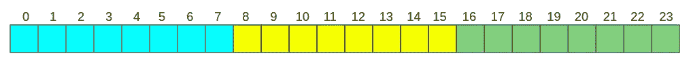
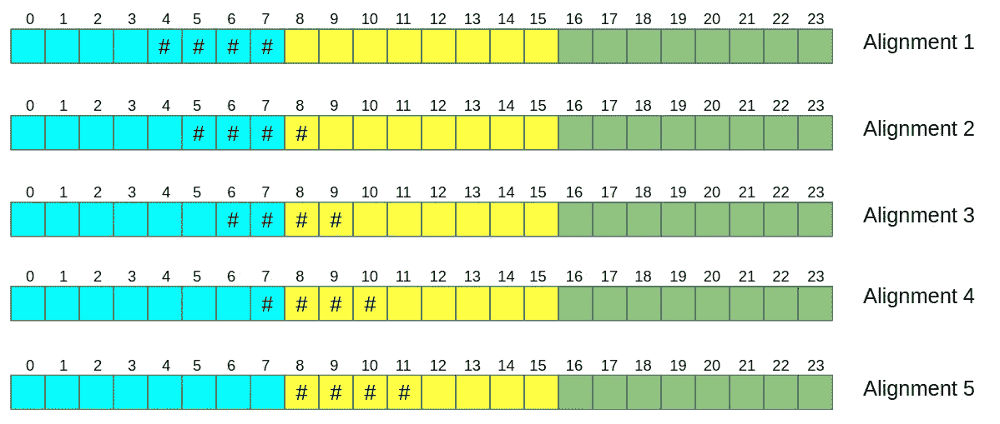
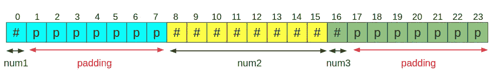
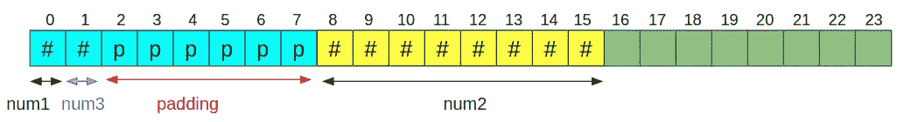

# c 编程技巧 01:内存高效的结构设计

> 原文：<https://blog.devgenius.io/c-programming-hacks-01-memory-efficient-struct-design-8e7252c2b986?source=collection_archive---------2----------------------->

## 在 C 语言中声明结构时应该避免的一个常见错误


由[丹尼尔·里卡洛斯](https://unsplash.com/@ricaros?utm_source=medium&utm_medium=referral)在 [Unsplash](https://unsplash.com?utm_source=medium&utm_medium=referral) 上拍摄的照片

我们经常在 C 中声明和使用结构(或 structs ),主要是因为它在处理数据方面提供了灵活性。[*Kernighan 的 C 编程语言& Ritchie*](http://www2.cs.uregina.ca/~hilder/cs833/Other%20Reference%20Materials/The%20C%20Programming%20Language.pdf) 将结构定义为:

> 结构是一个或多个变量的集合，这些变量可能是不同类型的，为了处理方便，它们被组合在一个名字下

在本文中，我们的重点不是如何定义、声明和初始化结构。如果您已经熟悉了结构，并且有兴趣学习如何以高效的方式使用它们，那么您已经找到了合适的文章。让我们开始讨论吧！！

考虑下面的结构。

```
**struct** Node1 {
    uint8_t num1;
    uint64_t num2;
    uint8_t num3;
} node1;
```

你期望节点 1 的大小是多少？10 字节(1 + 8 + 1)，小学数学！！！可惜这个**错了**。

```
printf("Size of node1: %zu \n", **sizeof**(node1));
```

这个 printf 语句显示实际大小是 24 字节(在 64 位系统中)。等一下！！！这怎么可能？？要理解这一点，我们首先应该了解内存对齐和填充是如何工作的。

# **对齐和填充**

处理器在一条指令中获取和处理的数据量称为“字长”。简单地说，处理器将一次读取一个单词。在 32 位系统中，字长为 32 位(4 字节)，类似地，在 64 位系统中，字长为 64 位(8 字节)。我们将在 64 位系统的基础上进行余下的讨论。



图 1: 24 字节内存

让我们看一下图 1。每个方块代表 1 个字节的内存。为简单起见，内存地址命名为 0–23。由于我们处理的是 64 位系统，处理器将一起读取内存位置 0–7(蓝色段)，一起读取 8–15(黄色段)，一起读取 16–23(绿色段)。假设，如果我们像这样声明一个整数:

```
int var;
```

一般来说，`int`数据类型需要 32 位或 4 个字节。您可以为`var`分配 0 到 23 之间的内存。一些可能性如下。



这里一个明显但重要的观察结果是，对齐 2、3 和 4 迫使处理器在两个周期内提取我们的`var`(处理器应该在一个周期内提取蓝色段，在下一个周期内提取黄色段)，而对齐 1 和 5 只需要一个周期(对齐 1 只需要蓝色段，对齐 5 只需要黄色段)。因此，很明显，对齐 1 和 5 提高了效率。等等！！这和我们的问题有什么关系？

原来系统不是随机分配内存，而是有数据对齐要求。C 语言中的变量以这样一种方式分配内存，即它们从一个是其大小倍数的内存地址开始。例如，1 字节长的`char`可以从任何地方开始，2 字节长的`short`应该从 2 的倍数的存储器地址开始，4 字节长的`int`应该从 4 的倍数的存储器地址开始，等等。如果考虑对齐 1 和 5，分配的内存从 4 和 8 开始，它们是 4 的倍数。

接下来，我们必须了解什么是填充，为什么需要它以及它是如何工作的。现在我们知道内存分配有一个对齐要求。为了确保这种对齐要求，系统使用填充。填充只是插入空字节(有时让它们为空)。如果我们回到我们的`struct Node1`例子，



这就是实际内存分配的样子。更清楚地说，如果我们看一下我们的`struct`声明，实际发生的是，

```
**struct** Node1 {
    uint8_t num1;
    **char** padding[7];     //padding
    uint64_t num2;
    uint8_t num3;
    **char** padding[7];     //padding
}
```

这就是它消耗 24 字节内存而不是 10 字节内存的原因。

但是，我们可以解决这个问题，将消耗的内存从 24 字节减少到 16 字节。



```
**struct** Node1 {
    uint8_t num1;
    uint8_t num3;
    **char** padding[6];
    uint64_t num2;
}
```

在这个例子中，我们只节省了一个字节，与这个时代的典型机器的可用内存量(通常包含千兆字节的内存)相比，这是微不足道的。但是，当结构有大量变量和/或创建大量结构变量时，可以节省大量内存。此外，并非所有系统都有千兆字节的内存。尤其是使用嵌入式系统的人，不得不用很少的内存来管理。我将在另一篇文章中讨论这种应用。

希望这篇文章有帮助！！！