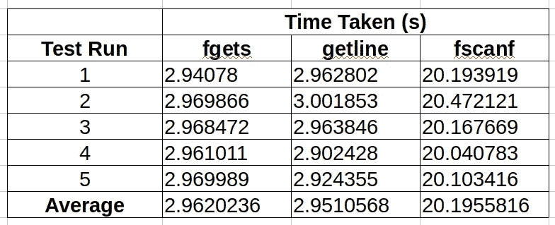
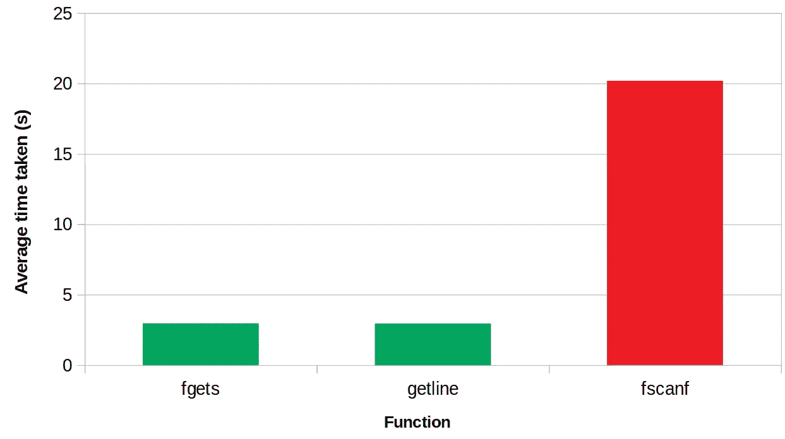

# c 编程技巧 2:高效地逐行读取文件

> 原文：<https://blog.devgenius.io/c-programming-hacks-2-efficiently-reading-a-file-line-by-line-407ab2bd96cc?source=collection_archive---------14----------------------->

## getline()、fgets()和 fscanf()之间有趣的比较

伊利亚·巴甫洛夫在 [Unsplash](https://unsplash.com?utm_source=medium&utm_medium=referral) 上的照片

读取文件，尤其是逐行读取，是我们作为程序员经常做的事情。我从事一个有趣的项目已经有一段时间了，它有两个重要的方面:

*   它涉及到**大量的文件 I/O 和逐行处理**
*   主要目标是**最大化性能**

我们大多数人都会同意，C 通常比大多数其他编程语言(如 java、python 等)更好。)说到性能(至少我是这么觉得的:-)。因此，我决定用 c 语言开发这个程序。然而，要逐行读取文件，有多种选择。因为我的程序涉及大量的文件 I/O，所以选择正确的函数来最小化时间消耗是至关重要的。这篇文章是关于那些实验和获得的结果。

# getline() vs fgets() vs fscanf()

可能还有其他几个函数提供相同的功能，但最常用的是 getline()、fgets()和 fscanf()。为了进行性能分析，我使用了一个 6.9 Gb 的文本文件，它包含 40，579，836 行，每行大约 300 个字符。

以下是我使用的代码集。[ *每个功能都可以独立执行*

## 结果呢

结果清楚地表明，fgets()和 getline()具有相似的性能，在时间消耗上的差异可以忽略不计。另一方面，fscanf()几乎比其他的要慢 7 倍。

## 结论是…

如果您希望逐行读取文件，并且性能是您主要关心的问题，请选择 fgets()或 getline()。

更重要的是，当有多种选择可用时，养成自己进行这种实验的习惯，找出更适合你需求的一种。盲目地使用 google 搜索中的代码可能会显著降低性能(在我的例子中，选择 fscanf()会使文件 I/O 的运行时间增加 7 倍)。