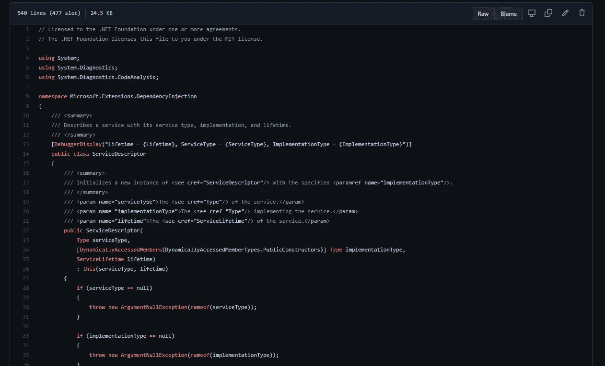

# C#简单接口:容器

> 原文：<https://blog.devgenius.io/c-simple-interfaces-containers-f2980e76b2bd?source=collection_archive---------2----------------------->

*你可以用很少的资源做很多事情*

【github.com/dotnet/runtime 

在上一篇文章 [C#简单接口:服务](https://justin-coulston.medium.com/c-simple-interfaces-service-d9d1921912e4)中，我谈到了可以通过使用扩展方法来简化和扩展的服务接口。同样，本文将讨论另一种简单风格的接口，由于其简单性，它提供了巨大的可伸缩性:*容器接口*。

# 容器接口

容器接口是数据的持有者。然后，一些服务或流程以某种方式利用这些“数据”。在很多方面，容器接口是构建器模式的简单近似，没有复杂方法结构的巨大混乱。

重申我上一篇[文章](https://justin-coulston.medium.com/c-simple-interfaces-service-d9d1921912e4)，

> 因为一个接口就是一个契约，所以尽可能保持契约的最小化有助于获得最大的收益。如果界面拥有您可能需要的所有必要功能，这一点尤其正确。

基本上，我们希望最小化界面的表面积。这将通过使新的实现变得易于实现(我们希望如此)来使扩展其功能变得更加容易。让我们看一个例子。

# IServiceCollection 接口

如果你熟悉。NET Core，您可能会遇到`IServiceCollection`接口。这是微软 IoC 容器模型中依赖注入的中心焦点。让我们看看接口定义。

[github.com/dotnet/runtime](https://github.com/dotnet/runtime/blob/main/src/libraries/Microsoft.Extensions.DependencyInjection.Abstractions/src/IServiceCollection.cs)

所以，让我一行一行地向你介绍这段代码。

**Line 11 = >这是一个服务描述符列表**

是啊。就是这样。的核心功能提供的所有功能。NET，简直就是一个`ServiceDescriptor`的列表。接口被继承的事实很可能是为了方便。

> 注意:当然，要做到这一点，必须创建一个接受这个值集合的底层服务。但是从开发人员的角度来看，这并没有否定使用它的简单性。

为什么会这样？这是可行的，因为`ServiceDescriptor`类是一个模型，它简单地在一个 DTO 风格的对象中保存了生命周期、契约和实现的描述。这是一个精简版的`ServiceDescriptor`类。

[github.com/dotnet/runtime](https://github.com/dotnet/runtime/blob/main/src/libraries/Microsoft.Extensions.DependencyInjection.Abstractions/src/ServiceDescriptor.cs)

这个类只需要一个`Lifetime`属性和一个`ServiceType`属性。除此之外，其他一切都是可选的。为了确保对象的状态总是被维护，这个类的实例是不可变的，并且利用非常特定的构造函数来允许不同的允许状态。这在这类应用中至关重要，因为拥有一个`ImplementationType`和一个`ImplementationInstance`没有任何意义。

现在的问题是，这如何让我们的生活变得更容易？从一个开发者的角度来看，我不认为它本身就是这样。相反，我们应该引入一些语法糖来减轻我们的痛苦。让我们使用扩展方法！

让我们首先为基本的 DI 容器生命周期创建一组扩展，如`ServiceLifetime`枚举所支持的。

我在没有适当的空检查的情况下实现了这些，但是在其他方面实现是相同的。我还忽略了一些重载。如果您认为合适，您可以随时添加这些内容(或者您知道…使用实际的实现)。

如果你做过任何程度的。NET 核心依赖注入，你会注意到这只是冰山一角。运行时的下一个示例代码用于配置选项。

[github.com/dotnet/runtime](https://github.com/dotnet/runtime/blob/main/src/libraries/Microsoft.Extensions.Options/src/OptionsServiceCollectionExtensions.cs)

您可以看到，我们可以继续扩展这个简单的接口来创建复杂的依赖注入框架，只需向列表中添加一个模型类。这种方法的美妙之处在于它的简单。更好的是，如果我们决定实现自己版本的`IServiceCollection`或`IServiceProvider`(内置的 IoC 容器)，我们仍然可以重用所有的应用程序代码。一个很好的例子是 Lamar DI 系统，他们称他们的容器为 T3，而不是 T2。

> 当然，利用不同的容器通常意味着我们想要利用一些额外的功能或语法优势，所以代码很可能会改变。但是我们不会丢失所提供的扩展。

# 另一个简短的例子

我们以前都看过《T4》。网芯。但是如果我们想在自己的系统中做一些事情呢？也许有些不同。

让我们使用类似的策略，但将其用于 ASP.NET 核心行动工作流系统。

## 工作流活动

第一步是我们想要在工作流上执行一些操作，所以我们将定义上面的接口。我们有一个`IPage`接口来定义工作流运行结束时的结果。一个`IActivity`可以选择改变上下文对象`IActivityContext`，允许我们根据需要改变结果。

最后，我们有一个活动描述符的集合`IActivityCollection`，类似于`IServiceCollection`，其中可以提供一个`Type`或者一个`IActivity`的实例。

## 页面描述符

接下来，我们需要用一个`PageDescriptor`类定义页面本身。这个类需要`PageType`和`OnNext`活动集合。或者，您可以包括取消操作。在这种情况下，我们将基于工作流的当前状态来确定当用户激活“下一步”命令(即“确定”、“保存”、“导出”)或“取消”命令(即“取消”、“返回”)时会发生什么。这必须在激活工作流的控制器动作上定义。但是这意味着页面本身不需要直接知道下一个阶段，因为这是在运行时确定的。

我们假设添加到集合中的第一页是起始页。那么之后的所有页面都是可能的目标。

## 构建页面

让我们从定义一些创建活动的扩展开始。

接下来，让我们为页面定义创建一组基本的扩展。

你可能注意到了一个我还没有定义的类，叫做`ActivityCollection`。让我们假设这是`IActivityCollection`接口的内部实现。然而，实现对于这里的讨论来说有些无关紧要。

## 试试吧！

现在我们有了一些扩展，让我们添加一些“未实现的”扩展来展示一个例子。我们还将包括一些我们可能有的“页面”。从这里开始，你必须发挥你的想象力！

最后，让我们展示一个在工厂方法中使用新扩展的例子。

您可以在这里看到，我们可以从一组简单的接口创建一个相当复杂的工作流。特别是，大部分工作是由两个容器接口执行的。这就是恰当的界面设计的力量和它所带来的简单性。

# 总结并签署

在本文中，我展示了一个由。NET 核心团队和一个工作流示例。两者在构建系统时都使用了类似的技术，即容器接口。

不过，我承认这种技术可能会限制你的设计。我们可能会在语法上失败。如果我们想为我们的系统创建“完美”的语法，我们必须围绕简单性工作。这将增加实现和扩展的复杂性。然而，如果适当地封装，消费开发人员将不会知道其中的区别。

如果你有任何想法或建议，请在下面评论。请务必**在 medium 上关注我**，因为我会一直发布新的话题！

下次见！