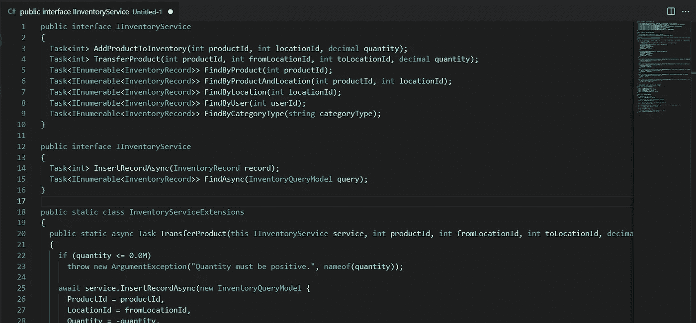

# C#简单接口:服务

> 原文：<https://blog.devgenius.io/c-simple-interfaces-service-d9d1921912e4?source=collection_archive---------4----------------------->

软件在很多方面都是一种艺术形式。有 100 种方法可以解决完全相同的问题，每种方法都有自己的优缺点。然而，随着时间的推移，你学会了不同的方法来简化你的生活，同时当未来发生变化时，打开你的选择。在我看来，在为应用程序构建架构时，简单接口是一个重要的概念。

# 服务接口

我在这篇文章中特别谈到了服务接口。一种接口，其唯一目的是执行某项任务或一组任务。相比之下，有保存信息的数据接口(想想`IServiceCollection`)。我们下次再讨论这个问题。

因为一个接口就是一个契约，所以尽可能保持契约的最小化有助于获得最大的收益。如果界面拥有您可能需要的所有必要功能，这一点尤其正确。然而，我发现开发人员倾向于首先关注业务规则，并以非常字面的方式围绕这些规则设计这些接口。这本身并没有什么错，但是随着时间的推移，接口扩展得越多(功能的增加)，您就可能把自己堵在角落里。

这是我过去见过的一个库存服务接口的例子。

同样，这是自然创造。但是我们都知道，当您开始实现这个服务时，您会发现自己在每个方法中添加了许多重复的逻辑和检查。当然，您可以创建私有函数来减轻这种痛苦，但是我们可以重新设计这个接口来提供更好的内聚性，而不会失去方法签名本身的友好性。

让我们修改界面，使其看起来更像下面这样。

> 现在，我想在这里为任何新的开发人员做一个记录。即使您不更改`public interface IInventoryService { ... }`代码本身，更改`InventoryRecord`或`InventoryQueryModel`也会有效地更改代码中已有的契约。尽管在基于类的参数模型中添加参数更容易，但这与直接改变参数是一样的(从契约的角度来看)。修改合同的任何部分都要小心。

现在使用这个新服务实际上更难了，在我看来，至少是直接的。但是我们已经将方法的数量从 7 个减少到 2 个。我们怎样才能找回原始契约的好的方法签名呢？

这就是 C#中扩展的美妙之处。

> 扩展有效地允许您向现有类型“添加”方法，而无需创建新的派生类型或修改原始类型。

下面是一组扩展，它们恢复了原始接口的优点。

对我来说，这要好得多。然而，乍看之下，这个值似乎很小。在某些方面，这段代码可能在实现本身中，这并不重要。

当你开始使用这个契约的多个实现时，真正的价值就来了。例如，我喜欢首先构建服务的内存版本，以计算出逻辑，并将这些实例用于单元测试目的。当我解决了所有的逻辑问题后，我会将这些前提条件、后条件和查询适当地转换为 SQL 语句。

您可能还需要在单个代码库中处理多个连接器类型(即 SQL Server 和 MySql)。同样，这些扩展防止了为每个实现添加一堆样板的需要。

但我们可以说，您并不关心有多个核心实现，甚至内存版本。如果开始出现一些性能问题，您可能会决定在何时开始缓存通用查询。可以创建一个缓存实现来装饰核心服务类。

即使在这种情况下，除了我们定义的 2 个方法之外，我们也不必实现其他 5 个方法。

有了绑定到接口的扩展，而不是任何单个实现，我们就能够将这些方法用于将来创建的装饰器或实现的任何组合，从而最大限度地减少代码随时间的变化。

# 结论

扩展方法是你的朋友。虽然，并不是所有的东西都可以或者应该是扩展方法，但它们确实可以为各种交叉关注点和实现细节节省时间。这些“助手”有效地扩展了您编写干净代码的能力，而不会破坏您的原始合约。这使得开发干净的软件变得容易和直观。

应该注意的是，扩展方法的一个主要缺点是利用服务的能力。如果特定的方法需要一些未公开的内部注入服务，您将无法利用这种技术。可以通过将字段范围设置为`internal`来强制执行，但之后我们开始创建代码气味。如果你发现你有重要的逻辑不能从核心接口方法中处理，可能最好是简单地把它放在契约开始。

代码长和 Prosper！