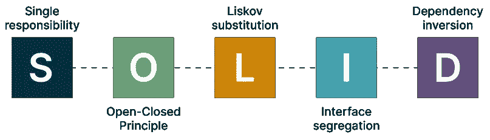
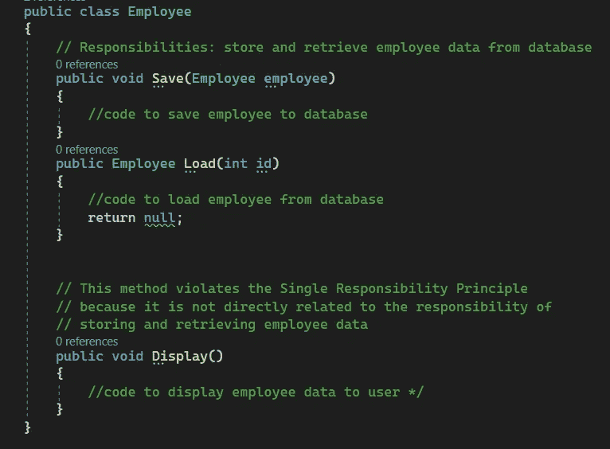
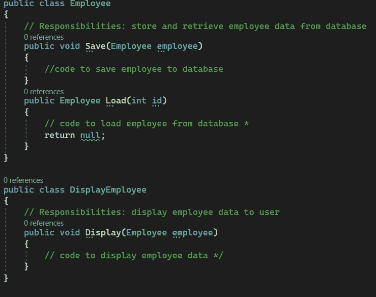
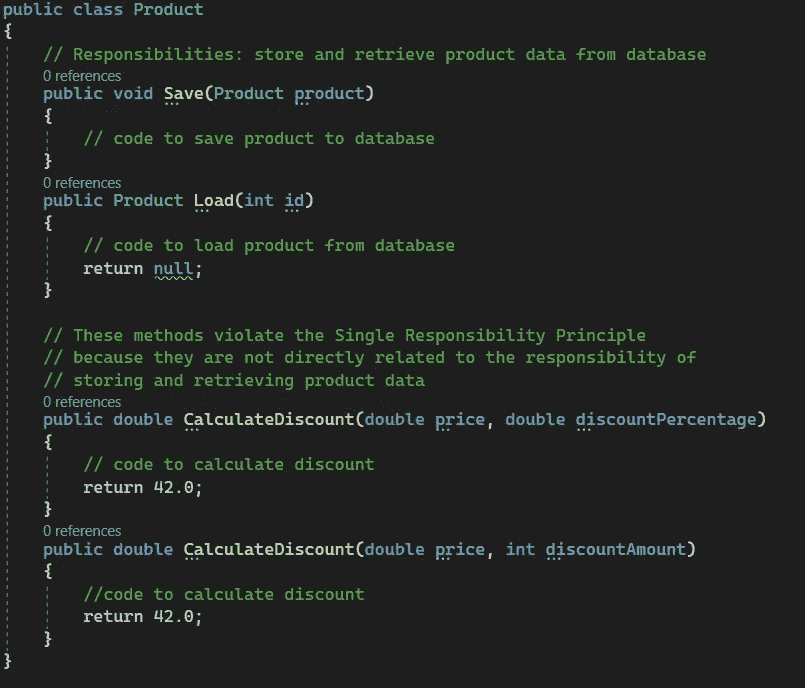
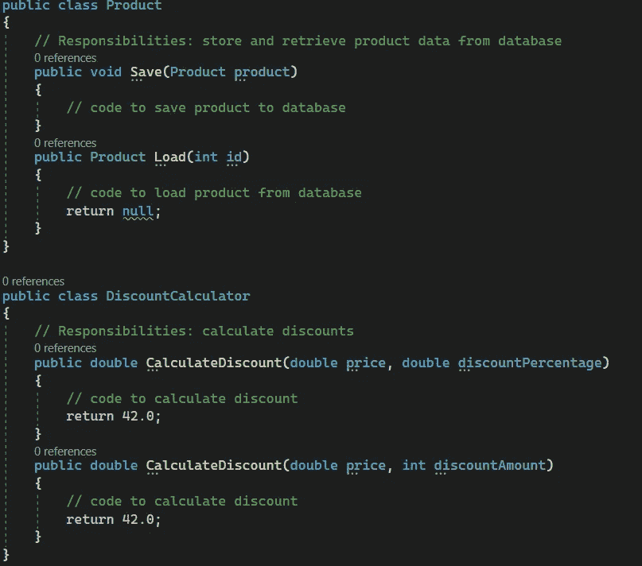

# C# —简单解释的单一责任

> 原文：<https://blog.devgenius.io/c-single-responsibility-easily-explained-e3fabbf0d877?source=collection_archive---------2----------------------->

我确信，作为软件开发人员或对这个话题感兴趣的人，你已经听说过 5 个坚实的原则。但是即使你很有经验，你确定你仍然知道这些原则到底是什么吗？你确定你会像应该的那样关注代码的编写吗？

[https://blog . knol dus . com/why-we-need-solid-principles-and-its-types/](https://blog.knoldus.com/why-we-need-solid-principles-and-its-types/)

*   5 个坚实的原则
*   解释 SRP
*   例子
*   结论

# 5 个坚实的原则

对于开发软件的人来说，最困难的任务之一可能是弄清楚现有代码做什么。阅读意大利面条式的代码会浪费大量的时间，并且会耗费你大量的精力和金钱。但是，如果通过查看类和方法的结构和名称就可以很容易地理解代码，那该怎么办呢？如果你需要读或写的每一个代码都有相似的结构，并且非常容易理解，即使你没有经验，那会怎么样？所以确保你的代码不会以意大利面条式的代码结束的最好的解决方案是继续使用**的 5 个坚实的原则。**

本文是五篇关于稳健原则的文章中的第一篇，论述了**单一责任原则。**但是单一责任是什么意思呢？每个程序员迟早都会遇到这样的问题:一个方法太大了，不容易理解。

# 解释单一责任原则

单一责任原则(SRP)是一种软件设计原则，它规定每个模块或类都应该对软件提供的功能的单一部分负责，并且这种责任应该完全由类来封装。它的所有服务都应严格符合这一职责。

在 C#中，SRP 可以通过创建具有单一的、明确定义的目的并且只有一个更改理由的类来实现。这有助于降低代码的复杂性，使其更容易理解和维护。

在 C#中应用 SRP 的一种方法是确保每个类都有一个单一的、定义明确的职责。例如，负责从数据库中检索数据的类不应该同时负责向用户显示数据。相反，这些职责应该分成两个不同的类，数据检索类负责检索数据，显示类负责显示数据。

在 C#中应用 SRP 的另一种方法是确保每个类都有一组严格定义的服务。这意味着一个类应该只拥有完成其定义的职责所必需的方法和属性。拥有大量不必要的方法和属性会使类更难理解和维护。

简而言之，单一责任原则是一种软件设计原则，它规定每个模块或类应该对软件提供的功能的单一部分负责，并且责任应该完全由类来封装。遵循这一原则，开发人员可以创建更易于理解和维护的类，并有助于降低代码的复杂性。

# 例子

## 示例 1

考虑一个负责从数据库中存储和检索雇员数据的类`Employee`。如果这个类还包含一个向用户显示雇员数据的方法，那么它就违反了单一责任原则，因为这超出了它定义的存储和检索数据的责任范围。相反，这个功能应该被分离到一个单独的类中，比如一个`DisplayEmployee`类。

为了遵循单一责任原则，`Display`方法应该从`Employee`类中移除，并放在一个单独的`DisplayEmployee`类中:

## 示例 2

考虑一个负责从数据库中存储和检索产品数据的类`Product`。如果这个类还包含计算折扣的方法，那么它就违反了单一责任原则，因为这超出了它定义的存储和检索数据的责任范围。相反，这个功能应该被分离到一个单独的类中，比如一个`DiscountCalculator`类。

为了遵循单一责任原则，折扣计算方法应从`Product`类中移除，并放入单独的`DiscountCalculator`类中:

# 结论

使用 SRP 使您编码:

*   **可重复使用**
*   **可以理解**
*   **可重构**
*   **可测试**

简单地说，使用 SRP 只会带来好处，任何专业开发软件的人都应该遵守。

非常感谢你的阅读，如果你喜欢这篇文章，请跟我来。

# 请查看我的其他文章:

*   [LINQ——如何避免 C#中的嵌套循环](https://medium.com/codex/linq-how-to-avoid-nested-loops-in-c-ed4ae19886e4)
*   [。Net C# —干净的架构&依赖-反转-原则](https://medium.com/dev-genius/net-c-clean-architecture-dependency-inversion-principle-7ea64f586c58)
*   [编程范例—简介](https://medium.com/dev-genius/programming-paradigms-a-very-short-brief-5324908640bd)
*   [C# —面向对象编程](https://medium.com/codex/c-object-oriented-programming-oop-2d92a5cd336f)
*   [OCP——真正重要的是什么](https://medium.com/@sebastianstreng96/ocp-what-really-matters-610159d600dc)
*   [提高程序员积极性的八大技巧](https://medium.com/@sebastianstreng96/top-8-tips-to-improve-your-motivation-as-programmer-be63b2baaf7e)
*   [对网络的简要了解](https://medium.com/codex/a-brief-insight-into-networks-2171f1e9aea1)
*   [发送&接收——7 层 OSI 模型](https://medium.com/codex/send-receive-the-7-layer-osi-model-e475829b999)
*   [七层网络协议浅显易懂](https://medium.com/@sebastianstreng96/7-layer-network-protocols-easily-explained-e11e3e09f34d)