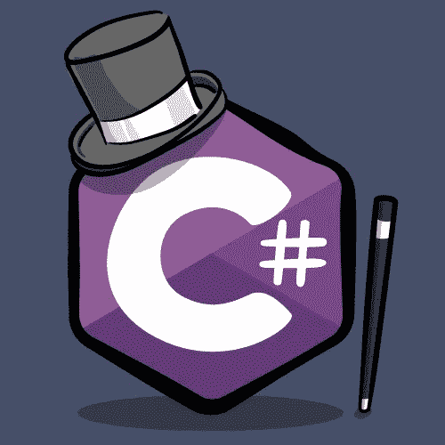

# C# —样式指南备忘单

> 原文：<https://blog.devgenius.io/c-style-guide-cheat-sheet-bd5c8abd557c?source=collection_archive---------0----------------------->

编写漂亮、易懂的代码与编写产品代码一样重要。互联网上有许多不同的指南和指南。

我试着把它们全部看完，然后整理出一张小抄。我只包括了那些影响代码风格的规则，并涵盖了大部分要点。

希望你觉得这很有用！

# 布局

*   每行最多一条语句。
*   每条语句最多一次赋值。
*   缩进 4 个空格，无制表符。
*   列限制:120。
*   打开大括号前换行。
*   右括号和`else`之间的换行。
*   `if` / `for` / `while`后的空格等等。和逗号后。
*   左括号后或右括号前没有空格。
*   运算符和所有其他运算符的每个操作数之间的一个空格。
*   在方法定义和属性定义之间至少添加一个空行。

# 评论

*   将注释放在单独的一行，不要放在代码行的末尾。
*   在注释分隔符(//)和注释文本之间插入一个空格。

# 命名

**做:**

*   类、方法、枚举、公共字段、公共属性、名称空间的名字:`PascalCase`。
*   局部变量名称，参数:`camelCase`。
*   私有、受保护、内部和受保护内部字段和属性的名称:`_camelCase`。
*   命名约定不受 const、static、readonly 等修饰符的影响。
*   接口名称以`I`开头，如`IInterface`。
*   文件名和目录名为`PascalCase`，如`MyFile.cs`。
*   选择容易阅读的标识符名称，例如，名为`HorizontalAlignment`的属性比`AlignmentHorizontal`更容易阅读。
*   比起简洁，更喜欢可读性，例如属性名`CanScrollHorizontally`比`ScrollableX`(对 X 轴的模糊引用)更好。
*   使用语义有趣的名称，而不是特定于语言的关键字作为类型名称，例如`GetLength`比`GetInt`更好。

**请勿:**

*   使用下划线、连字符或任何其他非字母数字字符。
*   使用匈牙利符号。
*   使用与广泛使用的编程语言的关键字相冲突的标识符。
*   使用缩写或缩写作为标识符名称的一部分。
*   使用任何未被广泛接受的缩写，即使它们被广泛接受，也只在必要时使用。

**论据:**

*   如果参数是一个文字常量，并且在多个函数调用中使用了同一个常量，并且默认它们是相同的，那么使用一个命名的常量来使约束显式化，并保证它成立。
*   用命名变量替换大型或复杂的嵌套表达式。
*   考虑使用[命名参数](https://docs.microsoft.com/en-us/dotnet/csharp/programming-guide/classes-and-structs/named-and-optional-arguments)来阐明调用点的参数含义。

# `var`关键字

*   如果使用`var`有助于提高可读性，可以避免使用嘈杂、明显或不重要的类型名。
*   当类型明显时——例如`var apple = new Apple();`，或`var request = Factory.Create<HttpRequest>();`
*   对于只直接传递给其他方法的瞬态变量，例如`var item = GetItem(); ProcessItem(item);`

# 裁判出界

*   使用`out`返回不属于输入的数据。
*   将`out`参数放在方法定义中所有其他参数之后。
*   `ref`很少使用，当有必要改变输入时。
*   不要使用`ref`作为传递结构的优化。
*   不要使用`ref`将一个可修改的容器传递给一个方法。`ref`仅当提供的容器需要用完全不同的容器实例替换时才需要。
*   不要使用`ref`或`out`修饰符重载成员。

# 使用元组作为返回类型

*   一般来说，比起`Tuple<>`，更喜欢命名的类类型，特别是当返回复杂类型时。

# 结构的默认值/null 返回

*   首选返回一个“成功”布尔值和一个结构`out`值。

# 属性

*   使用后缀“attribute”命名自定义属性类
*   属性应该出现在与它们相关联的字段、属性或方法的上一行，用换行符与成员隔开。
*   多个属性应该用换行符隔开。这允许更容易地添加和删除属性，并确保每个属性都易于搜索。

# 结构和类:

*   几乎总是使用一个类。
*   当该类型可以像其他值类型一样被处理时，请考虑使用 struct，例如，如果该类型的实例很小并且通常是短暂的，或者通常嵌入在其他对象中。

# 类成员排序

**按以下顺序对类成员进行分组:**

*   嵌套类、枚举、委托和事件。
*   静态、常量和只读字段。
*   字段和属性。
*   构造函数和终结器。
*   方法。

**在每组中，各要素应按以下顺序排列:**

*   公共的。
*   内部。
*   受保护的内部。
*   受到保护。
*   私人的。

# 属性样式

*   对于单行只读属性，尽可能使用表达式体属性(`=>`)。
*   对于其他一切，使用旧的`{ get; set; }`语法。

# 常数

*   可以使用`const`的变量和字段应该总是使用`const`。
*   如果`const`是不可能的，`readonly`可以是一个合适的替代品。

# 例外

*   不要返回错误代码。
*   对于实现该模式的方法，使用前缀“Try”和布尔返回类型。

# 字符串插值 vs `String.Format()` vs `String.Concat` vs `operator+`

*   一般来说，使用最容易阅读的内容，尤其是日志和断言消息。
*   请注意，链式`operator+`连接会比较慢，并且会导致大量内存流失。
*   如果性能是一个问题，那么对于多个字符串的连接，`StringBuilder`会更快。

# LINQ

*   一般来说，更喜欢单行的 LINQ 调用和命令式代码，而不是长链的 LINQ。混合命令式代码和沉重的 LINQ 通常很难读懂。
*   比起 SQL 风格的 LINQ 关键字，更喜欢成员扩展方法——例如，比起`myList where x`，更喜欢`myList.Where(x)`。

# 数组与列表

*   一般来说，对于公共变量、属性和返回类型，最好使用`List<>`而不是数组。
*   首选`List<>`当容器的尺寸可以改变时。
*   当容器的大小是固定的并且在构造时是已知的时，最好使用数组。
*   多维数组的首选数组。

# IEnumerable vs IList vs IReadOnlyList

*   对于输入，尽可能使用最严格的集合类型，例如`IReadOnlyCollection` / `IReadOnlyList` / `IEnumerable`作为方法的输入，而输入应该是不可变的。
*   对于输出，如果将返回容器的所有权转移给所有者，优先选择`IList`而不是`IEnumerable`。如果不转让所有权，则选择最具限制性的选项。

您可以在下面找到更多规则和指南:

1.  微软的 C#编码惯例—[https://docs . Microsoft . com/en-us/dot net/cs harp/programming-guide/inside-a-program/Coding-Conventions](https://docs.microsoft.com/en-us/dotnet/csharp/programming-guide/inside-a-program/coding-conventions)
2.  。微软的. Net 设计指南—[https://docs . Microsoft . com/en-us/dot net/standard/Design-Guidelines/](https://docs.microsoft.com/en-us/dotnet/standard/design-guidelines/)
3.  来自谷歌的 C#风格指南—【https://google.github.io/styleguide/csharp-style.html 

写出更漂亮的代码，感谢阅读！