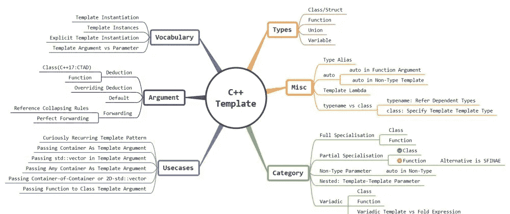

# 到目前为止的 C++模板故事(C++11 到 C++20)

> 原文：<https://blog.devgenius.io/c-template-story-so-far-c-11-to-c-20-6c59a6944a71?source=collection_archive---------21----------------------->



我知道，我已经有一段时间没有在博客上发表对新手友好的东西了。主要原因是我的大多数读者要么是有经验的开发人员，要么是有 C 背景的人，对 C++有一定的了解。但是用 C++编程时，你需要完全不同的思维方式，因为 C & C++属于不同的编程范式。我总是努力向他们展示用 C++做事情的更好的方法。无论如何，我发现这个主题很长，相当复杂(至少对我来说是这样)，对新手友好，对有经验的人有激励作用(如果添加了[现代 C++](http://www.vishalchovatiya.com/21-new-features-of-modern-cpp-to-use-in-your-project/) 术语，规则&特性)，即 C++模板。

> */！\:原载@*[](http://www.vishalchovatiya.com/c-template-a-quick-uptodate-look)**。**

*我将从一个简单的类/函数模板开始，随着我们的进展，将增加复杂性。还涵盖了高级主题，如[可变模板](http://www.vishalchovatiya.com/variadic-template-cpp-implementing-unsophisticated-tuple/)、嵌套模板、CRTP、模板与折叠表达式等。但是，是的！我们不会深入探讨，否则这将成为一本书，而不是一篇文章。*

****注:*** *我会推荐你在任何你觉得困惑的地方使用*[*cppinsights*](https://cppinsights.io/)*在线工具。它帮助你看到模板实例，模板参数演绎等。基本上，它帮助你从编译器的角度看代码。**

# *您可能面临的术语/行话/习语*

*   ***模板实例化**:针对模板参数的特定组合，从模板化的类/结构/联合/函数中生成具体的类/结构/联合/函数的过程。比如你用`vector<int>` & `vector<char>`，编译时会创建两个不同的具体类。这个创建具体类的过程被称为模板实例化。*
*   ***模板实例**:模板实例化的结果是模板实例，即具体的类。*
*   ***显式模板实例化**:通常在对象声明时进行模板实例化。但是，您也可以强制编译器实例化具有特定类型的类/结构/联合/函数，甚至无需创建对象。它可能出现在程序中模板定义之后的任何地方，并且用于给定的参数列表。将在本文后面看到这一点。*
*   ***模板实参 vs 模板形参**:在表达式`template<typename *T*> void print(*T a*){ };`中，调用`print(5);`时`T`是形参&，类型为`int`的`5`是模板实参。这对于一些 pip 来说是微不足道的事情。但不适合非英语母语者或初学者。所以，这种模糊性必须明确。*

# *C++模板类型*

# *类别模板*

```
*template <typename T1, typename T2>
class pair {
public:
    T1  first;
    T2  second;
};pair<int, char> p1;
pair<float, float> p2;*
```

*   *类模板的基本思想是模板参数，即`T1` & `T2`在编译时被一个适当的推导类型所替代。结果是同一个类可以被多种类型重用。*
*   *并且当声明该类的对象时，用户必须指定他们想要使用的类型。*

# *功能模板*

```
*template <typename T>
T min(T a, T b) {
    return a < b ? a : b;
}min<int>(4, 5);              // Case 1 
min<float>(4.1f, 5.1f);      // Case 2*
```

*   *在上述两种情况下，模板实参用来替换参数的类型即`T`。*
*   *模板函数的一个附加属性(与 C++17 之前的类模板不同)是，编译器可以根据传递给函数的参数来推断模板参数。所以，在函数名后传递`<int>` & `<float>`是多余的。*

# *联合模板*

*   *是啊！联合也可以被模板化。事实上，标准库提供了一些实用程序，如`[std::optional](https://en.cppreference.com/w/cpp/utility/optional)`、`[std::variant](https://en.cppreference.com/w/cpp/utility/variant)`等。它直接或间接使用模板化联合。*

```
*template <typename T>
union test {
    uint8_t     ch[sizeof(T)];
    T           variable;
};*
```

*   *正如你在上面看到的， ***模板化的联合对于将一个类型同时表示为一个字节数组*** 也特别有用。*

# *可变模板*

*   *是啊！这可能有点索克。但是， ***你也可以从 C++14*** 开始对变量进行模板化。*

```
*template <class T>
constexpr T pi = T(3.1415926535897932385L); // variable templatecout << pi<float> << endl; // 3.14159
cout << pi<int> << endl;   // 3*
```

*   *现在，你可能想知道模板化变量的意义。但是，请考虑以下示例:*

```
*template <uint32_t val>
constexpr auto fib = fib<val - 1> + fib<val - 2>;template <>
constexpr auto fib<0> = 0;template <>
constexpr auto fib<1> = 1;cout << fib<10> << endl;    // 55*
```

*   *以上代码在编译时给出了第 10 个斐波那契项，甚至没有创建类或函数。*

# *C++模板参数*

# *覆盖模板参数推导*

```
*template <typename T>
T min(T a, T b) {
    cout << typeid(T).name() << endl; // T will be deduce as `int`
    return a < b ? a : b;
}min<int>(5.5f, 6.6f);     // Implicit conversion happens here*
```

# *默认模板参数*

```
*template <class T, size_t N = 10>
struct array {
    T arr[N];
};array<int> arr;*
```

*   *就像函数参数一样，模板参数也可以有它们的默认值。*
*   *所有带有默认值的模板参数都必须在模板参数列表的末尾声明。*

# *模板参数演绎*

## *函数模板参数推导*

*   *根据[标准](https://en.cppreference.com/w/cpp/language/template_argument_deduction)中的规则，通过将函数参数的类型与函数参数进行比较来完成函数模板参数推导。这使得函数模板比其他情况下更加有用。例如，给定如下函数模板:*

```
*template <typename RanIt> 
void sort(RanIt first, RanIt last){
    // . . .
}*
```

*   *您可以并且应该对一个`std::vector<int>`进行排序，而不需要明确指定`RanIt`是`std::vector<int>::iterator`。当编译器看到`sort(v.begin(), v.end());`时，它知道`v.begin()`和`v.end()`的类型是什么，所以它可以确定`RanIt`应该是什么。*

## *分类模板参数推导(CTAD)*

*   *在 C++17 之前，模板类不能像模板函数那样在初始化时应用类型演绎。例如*

```
*//...
pair p4{1, 'A'};               // Not OK until C++17: Can't deduce type in initialization 
//...*
```

*   *但是 ***从 C++17 开始，编译器就可以在 class/struct 初始化中推导出类型*** &要做到这一点，class/struct 必须有一个合适的构造函数。但这个限制在 C++20 中也放宽了。所以从技术上来说 ***来自 C++20，你可以用*** [***聚合初始化***](https://en.cppreference.com/w/cpp/language/aggregate_initialization) ***&构造对象，而不用显式指定类型*** 。*
*   *直到 C++17，该标准提供了一些`std::make_`实用函数来应对如下情况。*

***通过函数模板推断模板参数***

*   *你可能见过很多像`std::make_pair()`、`std::make_unique()`、`std::make_share()`等函数。这通常可以非物理地实现为:*

```
*template <typename T1, typename T2>
pair<T1, T2> make_pair(T1&& t1, T2&& t2) {
    return {forward<T1>(t1), forward<T2>(t2)};
}*
```

*   *但是你有没有想过为什么标准库中会有这些辅助函数？这有什么用？*

```
*pair<int, char> p1{1, 'A'};          // Rather using thisauto p2 = make_pair(1, 2);           // Use this instead
auto p3 = make_pair<float>(1, 2.4f); // Or specify types explicitly*
```

*   *您可以利用从函数模板推断模板参数的特性来构造对象，而不是显式地指定参数。在上面的例子中，模板参数推导是由效用函数`make_pair`完成的。因此，我们创建了 pair 对象，而没有显式指定类型。*
*   *正如前面从 C++17 中讨论的，你甚至可以不用显式指定类型来构造对象，所以`std::vector v{1,2,3,4};`是完全有效的语句。*

# *模板参数转发*

## *C++模板引用折叠规则*

*   *除了在模板参数中接受类型&值。您可以启用模板来接受左值和右值引用。为此，您需要遵守引用折叠规则，如下所示:*

1.  *`T& &`变成了`T&`*
2.  *`T& &&`变成了`T&`*
3.  *`T&& &`变成了`T&`*
4.  *`T&& &&`变成了`T&&`*

```
*template <typename T>
void f(T &&t);*
```

*   *在上面的例子中，`t`的真实类型取决于上下文。例如:*

```
*int x = 0;f(0); // deduces as rvalue reference i.e. f(int&&)
f(x); // deduces as lvalue reference i.e. f(int&)*
```

*   *在`f(0);`的情况下，`0`是`int`类型的右值，因此`T = int&&`，因此`f(int&& &&t)`变成`f(int&& t)`。*
*   *在`f(x);`的情况下，`x`是`int`类型的左值，因此`T = int&`，从而`f(int& &&t)`变成`f(int& t)`。*

## *完美转发|转发参考|通用参考*

*   *为了将`t`完美地转发到另一个功能，必须将`std::forward`用作:*

```
*template <typename T>
void func1(T &&t) {
    func2(std::forward<T>(t));  // Forward appropriate lvalue or rvalue reference to another function
}*
```

*   *转发引用也可以与可变模板一起使用:*

```
*template <typename... Args>
void func1(Args&&... args) {
    func2(std::forward<Args>(args)...);
}*
```

## *为什么我们首先需要转发参考？*

*   *这个问题的答案在于[移动语义](http://www.vishalchovatiya.com/move-constructor-assignment-operator-with-shared-ptr/)。不过，这个问题的简短回答是“根据值类别类型执行复制/移动”。*

# *C++模板类别*

# *完全模板专门化*

*   *模板具有为模板类/结构/联合/函数/方法的特定实例化定义实现的功能。*

## *函数模板专门化*

```
*template <typename T>
T sqrt(T t) { /* Some generic implementation */ }template<>
int sqrt<int>(int i) { /* Highly optimized integer implementation */ }*
```

*   *在上面的例子中，编写`sqrt(4.0)`的用户将获得通用实现，而`sqrt(4)`将获得专用实现。*

## *类模板专门化*

```
*template <typename T>       // Common case
struct Vector {
    void print() {}
};template <>                 // Special case
struct Vector<bool> {
    void print_bool() {}
};Vector<int> v1;
v1.print_bool();    // Not OK: Chose common case Vector<T>
v1.print()          // OKVector<bool> v2;    // OK : Chose special case Vector<bool>*
```

# *部分模板特化*

## *分部类模板专门化*

*   *与完全模板特殊化相反，你也可以部分特殊化模板，并修改现有模板的一些参数。部分模板专门化仅可用于模板类/结构/联合:*

```
*template <typename T1, typename T2>     // Common case
struct Pair {
    T1 first;
    T2 second; void print_first() {}
};template <typename T>    // Partial specialization on first argument as int
struct Pair<int, T> {
    void print() {}
};// Use case 1 ----------------------------------------------------------
Pair<char, float> p1;    // Chose common case
p1.print_first();        // OK
// p1.print();           // Not OK: p1 is common case & it doesn't have print() method// Use case 2 ----------------------------------------------------------
Pair<int, float> p2;     // Chose special case
p2.print();              // OK
// p2.print_first();     // Not OK: p2 is special case & it does not have print_first()// Use case 3 ----------------------------------------------------------
// Pair<int> p3;         // Not OK: Number of argument should be same as Primary template*
```

## *部分函数模板专门化*

*   ****不能部分专门化方法/函数*** 。函数模板只能是完全专门化的*

```
*template <typename T, typename U>
void foo(T t, U u) {
    cout << "Common case" << endl;
}// OK.
template <>
void foo<int, int>(int a1, int a2) {
    cout << "Fully specialized case" << endl;
}// Compilation error: partial function specialization is not allowed.
template <typename U>
void foo<string, U>(string t, U u) {
    cout << "Partial specialized case" << endl;
}foo(1, 2.1); // Common case
foo(1, 2);   // Fully specialized case*
```

***替代部分功能模板专门化***

*   *正如我前面提到的，函数模板的部分专门化是不允许的。您可以使用 [SFINAE](http://www.vishalchovatiya.com/7-advance-cpp-concepts-idiom-examples-you-should-know/) 和`std::enable_if`进行如下操作:*

```
*template <typename T, typename std::enable_if_t<!std::is_pointer<T>::value> * = nullptr>
void func(T val) {  
    cout << "Value" << endl; 
}template <typename T, typename std::enable_if_t<std::is_pointer<T>::value> * = nullptr>
void func(T val) {  // NOTE: function signature is NOT-MODIFIED
    cout << "Pointer" << endl; 
}int a = 0;
func(a);
func(&a);*
```

# *非类型模板参数*

*   *顾名思义，除了类型，还可以将模板参数声明为常量表达式，如地址、[引用](http://www.vishalchovatiya.com/lvalue-rvalue-and-their-references-with-example-in-cpp/)、积分、 [std::nullptr_t](http://www.vishalchovatiya.com/what-exactly-nullptr-is-in-cpp/) 、枚举等。*
*   *像所有其他模板参数一样，非类型模板参数可以显式指定、默认或通过模板参数推导隐式派生。*
*   *非类型模板的 ***更具体的用例是将一个普通数组传递给一个函数，而不显式指定它的大小*** 。一个更相关的例子是`std::begin` & `std::end`标准库中数组文字的专门化:*

```
*template <  class T, 
            size_t size>     // Non Type Template
T* begin(T (&arr)[size]) {   // Array size deduced implicitly
    return arr;
}int arr[] = {1,2,3,4};
begin(arr);                  // Do not have to pass size explicitly*
```

*   *非类型模板参数是实现模板递归的方法之一&启用[模板元编程](https://en.wikipedia.org/wiki/Template_metaprogramming)。*

# *嵌套模板:模板模板参数*

*   *有时我们必须将模板类型传递给另一个模板类型。在这种情况下，您不仅要考虑主模板类型，还要考虑嵌套模板类型。非常简单的模板-模板参数例子是:*

```
*template<   
            template <typename> class C, 
            typename T
        >
void print_container(C<T> &c) {
    // . . .
}template <typename T>
class My_Type {
    // . . .
};My_Type<int> t;
print_container(t);*
```

# *可变模板*

*   *定义接受可变数量和类型的参数的类/结构/联合/函数通常很有用。*
*   *如果你已经使用过 C，你会知道`printf`函数可以接受任意数量的参数。这些功能完全通过宏或[省略号运算符](https://stackoverflow.com/questions/3792761/what-is-ellipsis-operator-in-c)实现。正因为如此，它有几个缺点，如[类型安全](http://www.vishalchovatiya.com/cpp-type-casting-with-example-for-c-developers/)，不能接受引用作为参数，等等。*

## *可变类模板*

## *实现简单的元组类(> =C++14)*

*   *因为 C++11 标准库引入了`[std::tuple](http://www.vishalchovatiya.com/variadic-template-cpp-implementing-unsophisticated-tuple/)`类，该类在编译时使用 variadic 模板接受可变数据成员。为了理解它的工作原理，我们将建立自己的 ADT，就像`[std::tuple](http://www.vishalchovatiya.com/variadic-template-cpp-implementing-unsophisticated-tuple/)`一样*
*   *可变模板通常从通用(空)定义开始，这也是后面专门化中递归终止的基础:*

```
*template <typename... T>
struct Tuple { };*
```

*   *这已经允许我们定义一个空结构，即`Tuple<> object;`，尽管这还不是很有用。接下来是递归案例专门化:*

```
*template<
            typename T, 
            typename... Rest
        >
struct Tuple<T, Rest...> {
    T               first;
    Tuple<Rest...>  rest; Tuple(const T& f, const Rest& ... r)
        : first(f)
        , rest(r...) {
    }
};Tuple<bool> t1(false);                      // Case 1
Tuple<int, char, string> t2(1, 'a', "ABC"); // Case 2*
```

## *可变类模板是如何工作的？*

*为了理解可变类模板，考虑上面的用例 2，即`Tuple<int, char, string> t2(1, 'a', "ABC");`*

*   *声明首先匹配专门化，产生一个具有`int first;`和`Tuple<char, string> rest;`数据成员的结构。*
*   *rest 定义再次与专门化相匹配，产生一个具有`char first;`和`Tuple<string> rest;`数据成员的结构。*
*   *rest 定义再次匹配这个专门化，创建自己的`string first;`和`Tuple<> rest;`成员。*
*   *最后，这最后一个 rest 与基本用例定义相匹配，产生一个空结构。*

*您可以这样想象:*

```
*Tuple<int, char, string>
-> int first
-> Tuple<char, string> rest
    -> char first
    -> Tuple<string> rest
        -> string first
        -> Tuple<> rest
            -> (empty)*
```

*如果你对 variadic temple 更感兴趣，我已经写了一篇关于[variatic Template c++:实现简单元组](http://www.vishalchovatiya.com/variadic-template-cpp-implementing-unsophisticated-tuple/)的文章。*

## *可变函数模板*

*   *正如我们前面看到的，可变模板从空定义开始，即递归的基本情况。*

```
*void print() {}*
```

*   *然后是递归案例专门化:*

```
*template<   
            typename First, 
            typename... Rest                    // Template parameter pack
        >     
void print(First first, Rest... rest) {         // Function parameter pack
    cout << first << endl;
    print(rest...);                             // Parameter pack expansion
}*
```

*   *这就足以让我们使用变量数目和变量类型的打印函数了。例如:*

```
*print(500, 'a', "ABC");*
```

*   *您可以进一步优化打印功能与转发参考，`if constexpr()` & `sizeof()`操作符为:*

```
*template<   
            typename First, 
            typename... Rest
        >     
void print(First&& first, Rest&&... rest) {         
    if constexpr(sizeof...(rest) > 0) {             // Size of parameter pack
        cout << first << endl;
        print(std::forward<Rest>(rest)...);         // Forwarding reference
    }
    else {
        cout << first << endl;
    }
}*
```

## *可变函数模板是如何工作的？*

*   *正如你所看到的，我们用三个参数调用了 print，即`print(500, 'a', "ABC");`*
*   *在编译时编译器实例化 3 个不同的打印函数如下:*

1.  *`void print(int first, char __rest1, const char* __rest2)`*
2.  *`void print(char first, const char* __rest1)`*
3.  *`void print(const char* first)`*

*   *将调用第一次打印(即接受 3 个参数)，打印第一个参数& line `print(rest…);`用第二次打印扩展(即接受 2 个参数)。这将继续下去，直到参数计数达到零。*
*   *这意味着每次调用 print 时，参数的数量都会减少一个&其余的参数将由 print 的后续实例来处理。*
*   *因此，编译后 print 实例的数量等于参数的数量加上 print 的基本情况实例。因此， ***可变模板也导致了更多的代码膨胀*** 。*
*   *如果你把上面的例子放到 [cppinsights](https://cppinsights.io/) 中，你会得到更好的结果。并尝试理解所有的模板实例。*

## *折叠表达式与可变模板*

*   *正如我们看到的，从 C++11 开始，变量模板是对 C++模板的一个很好的补充。但是它有一些麻烦，比如你需要基本用例&递归模板实现，等等。*
*   *所以，用 ***C++17 标准引入了一个新特性，命名为*** 。您可以将它与参数包一起使用，如下所示:*

```
*template <typename... Args>
void print(Args &&... args) {
    (void(cout << std::forward<Args>(args) << endl), ...);
}*
```

*   *看，不需要神秘的样板。这个解决方案看起来不是更整洁吗？*
*   *总共有 3 种折叠方式:一元折叠、二元折叠和逗号折叠。这里我们已经完成了对逗号的左折叠。你可以在这里阅读更多关于折叠表达式[。](https://www.codingame.com/playgrounds/2205/7-features-of-c17-that-will-simplify-your-code/fold-expressions)*

# *混杂的*

# *C++模板“typename”与“class”*

*   *`typename`和`class`在大多数情况下是可以互换的。*
*   *一般惯例是`typename`用于具体类型(即，不依赖于进一步的模板参数),而`class`用于依赖类型。*
*   *但是有些情况下`typename`或者`class`必须是确定的。例如*

## *引用依赖类型*

```
*template<typename container>
class Example {
    using t1 = typename container::value_type; // value_type depends on template argument of container
    using t2 = std::vector<int>::value_type;   // value_type is concrete type, so doesn't require typename
};*
```

*   *在引用依赖于模板参数的嵌套类型时，`typename`是必需的。*

## *要指定模板模板类型*

```
*template<
            template <typename, typename> class C, // `class` is must prior to C++17
            typename T, 
            typename Allocator
        >
void print_container(C<T, Allocator> container) {
    for (const T& v : container)
        cout << v << endl;
}vector<int> v;
print_container(v);*
```

*   *这在 C++17 中被纠正了，所以现在你也可以使用`typename`了。*

# *C++11:模板类型别名*

```
*template<typename T> 
using pointer = T*;pointer<int> p = new int;   // Equivalent to: int* p = new int; template <typename T>
using v = vector<T>;v<int> dynamic_arr;         // Equivalent to: vector<int> dynamic_arr;*
```

*   *`typedef`也能正常工作，但不会鼓励你使用。因为它不是现代 C++的一部分。*

# *C++14/17:模板和自动关键字*

*   ****从 C++14 开始，可以在函数实参*** 中使用 `***auto***` ***。这是一种模板简写，如下所示:****

```
*void print(auto &c) { /*. . .*/ }// Equivalent totemplate <typename T>
void print(T &c) { /*. . .*/ }*
```

*   *虽然从 C++11 开始支持函数 return-type 中的`***auto***` ***。但是，你必须提到尾随返回类型。这是在 C++14 &中纠正的，现在返回类型是由编译器自动推导出来的。****
*   ****来自 C++17，你也可以在非类型模板***`***auto***`***(我会在本文后面的部分涉及到这个)参数。****

# *C++20:模板 Lambda 表达式*

*   *从声明参数为`auto`的 C++14 开始，支持[通用 lambda 表达式](http://www.vishalchovatiya.com/learn-lambda-function-in-cpp-with-example/)。但是没有办法改变这个模板参数并使用真正的模板参数。例如:*

```
*template <typename T>
void f(std::vector<T>&    vec) {
    //. . .
}*
```

*   *如何为上述函数编写 lambda，该函数采用类型`T`的`std::vector`？这是 C++17 之前的限制，但在 C++20 中， ***可以将 lambda*** 模板化为:*

```
*auto f = []<typename T>(std::vector<T>&  vec) {
    // . . .
};std::vector<int> v;
f(v);*
```

# *显式模板实例化*

*   *显式实例化从模板中创建并声明具体的类/结构/联合/函数/变量，但还没有使用它。*
*   *通常，您只需在头文件中实现模板。您不能将模板方法的实现/定义放在实现文件中(即 cpp 或。抄送)。如果这对你来说似乎是新的，那么考虑下面的极简主义例子:*

***value.hpp***

```
*#pragma oncetemplate <typename T>
class value {
    T val;
public:
    T get_value();
};*
```

***value.cpp***

```
*#include "value.hpp"template <typename T>
T value<T>::get_value() { 
    return val; 
}*
```

***main.cpp***

```
*#include "value.hpp"int main() {
    value<int> v1{9};
    cout << v1.get_value() << endl;
    return 0;
}*
```

*   *如果你编译上面的代码，你会得到下面的错误:*

```
*/tmp/main-4b4bef.o: In function `main':
main.cpp:(.text+0x1e): undefined reference to `value<int>::get_value()'
clang: error: linker command failed with exit code 1 (use -v to see invocation)
compiler exit status 1*
```

*   *如果进行显式初始化，即在`value.cpp`的末尾添加`template class value<int>;`行。然后编译成功。*
*   *“模板类”命令使编译器显式地实例化模板类。在上面的例子中，编译器会在`value.cpp`中去掉`value<int>`。*
*   *还有其他的解决方案。检查这个[堆栈溢出链接](https://stackoverflow.com/questions/495021/why-can-templates-only-be-implemented-in-the-header-file)。*

# *C++模板示例用例*

# *奇怪的重复模板模式*

*   *[CRTP](http://www.vishalchovatiya.com/7-advance-cpp-concepts-idiom-examples-you-should-know/#CRTP) 广泛用于静态多态或代码重用，无需承担[虚拟调度机制](http://www.vishalchovatiya.com/part-3-all-about-virtual-keyword-in-c-how-virtual-destructor-works/)的成本。考虑以下代码:*

```
*template <typename specific_animal>
struct animal {
    void who() { implementation().who(); }private:
    specific_animal &implementation() { return *static_cast<specific_animal *>(this); }
};struct dog : animal<dog> {
    void who() { cout << "dog" << endl; }
};struct cat : animal<cat> {
    void who() { cout << "cat" << endl; }
}; template <typename specific_animal>
void who_am_i(animal<specific_animal> *animal) {
    animal->who();
} who_am_i(new dog); // Prints `dog`
who_am_i(new cat); // Prints `cat`*
```

*   *我们没有使用[虚拟关键字](http://www.vishalchovatiya.com/part-1-all-about-virtual-keyword-in-cpp-how-virtual-function-works-internally/) &仍然实现了多态性的功能(更确切地说是静态多态性)。*
*   *我已经写了一篇单独的文章，介绍了奇怪重复出现的模板模式的实例(CRTP)[TODO]。*

# *将“std”容器作为 C++模板参数传递*

*   *如果你想接受什么，然后再想办法解决，你可以这样写:*

```
*template <typename C>
void print_container(const C &container) {
    for (const auto &v : container)
        cout << v << endl;
}*
```

*   *如果你传递标准容器之外的东西，这种简单的方法可能会失败，因为其他类型可能没有`begin` & `end`迭代器。*

# *将 std::vector 传递给 C++模板函数*

## *捕获容器值类型的简单方法*

*   *但是假设，你想传递容器&也想使用容器的存储类型。您可以:*

```
*template<
            typename C, 
            typename T = typename C::value_type
        >
void print_container(const C &container) {
    for (const T &v : container)
        cout << v << endl;
}*
```

*   *我们可以为我们的函数提供第二个类型参数，这个函数使用 [SFINAE](http://www.vishalchovatiya.com/7-advance-cpp-concepts-idiom-examples-you-should-know/) 来验证这个东西实际上是一个容器。*
*   *所有标准容器都有一个名为`value_type`的成员类型，它是容器内部事物的类型。我们寻找这种类型，如果不存在这种类型，那么 [SFINAE](http://www.vishalchovatiya.com/7-advance-cpp-concepts-idiom-examples-you-should-know/) 就会出现，过载就不再考虑了。*

## *显式捕获容器的值类型*

*   *但是如果你传递的 vector 类没有`value_type`成员呢？*
*   *`std::vector`的定义是:*

```
*template<
            class T,
            class Allocator = std::allocator<T>
        > 
class vector;*
```

*   *您可以显式地捕获`std::vector`容器的两个模板参数，如下所示:*

```
*template<
            template <typename, typename> class C, 
            typename T, 
            typename Allocator
        >
void print_container(C<T, Allocator> container) {
    for (const T& v : container)
        cout << v << endl;
}*
```

*   *如果要将容器传递给类/结构/联合，上述模板模式将是相同的。*

# *将任何容器传递给 C++模板函数*

*   *你看看你是否传递任何其他容器到上面的解决方案。没用的。所以为了使它通用，我们可以使用[可变模板](http://www.vishalchovatiya.com/variadic-template-cpp-implementing-unsophisticated-tuple/):*

```
*template<
            template <typename...> class C, 
            typename... Args
        >
void print_container(C<Args...> container) {
    for (const auto &v : container)
        cout << v << endl;
}vector<int>     v{1, 2, 3, 4}; // takes total 2 template type argument
print_container(v); set<int>        s{1, 2, 3, 4}; // takes total 3 template type argument
print_container(s);*
```

# *将容器中的容器/2D 标准::向量作为 C++模板参数传递*

*   *这是嵌套模板的情况，即模板-模板参数。并且有以下解决方案:*

## *显式复杂解决方案*

```
*template<
            template <typename, typename> class C1,
            template <typename, typename> class C2,
            typename Alloc_C1, typename Alloc_C2,
            typename T
        >
void print_container(const C1<C2<T, Alloc_C2>, Alloc_C1> &container) {
    for (const C2<T, Alloc_C2> &container_in : container)
        for (const T &v : container_in)
            cout << v << endl;
}*
```

*   *我知道这是丑陋的，但似乎更明确。*

## *解决方案干净利落*

```
*template<   
            typename T1,
            typename T2 = typename T1::value_type,
            typename T3 = typename T2::value_type
        >
void print_container(const T1 &container) {
    for (const T2 &e : container)
        for (const T3 &x : e)
            cout << x << endl;
}*
```

*   *如前所述包括 [SFINAE](http://www.vishalchovatiya.com/7-advance-cpp-concepts-idiom-examples-you-should-know) 。*

## *通用解决方案:使用可变模板*

```
*template<
            template <typename...> class C, 
            typename... Args
        >
void print_container(C<Args...> container) {
    for (const auto &container_2nd : container)
        for (const auto &v : container_2nd)
            cout << v << endl;
}*
```

*   *这是我们使用可变模板的标准解决方案，适用于单个容器或任意数量的嵌套容器。*

# *将函数传递给类模板参数*

*   *将类/结构/联合作为模板参数传递给另一个类/结构/联合是常见的事情。但是将函数作为模板参数传递给类/结构/联合有点罕见。但是的确有可能。考虑使用[可变类模板](http://www.vishalchovatiya.com/variadic-template-cpp-implementing-unsophisticated-tuple/)的[函数装饰器](http://www.vishalchovatiya.com/decorator-design-pattern-in-modern-cpp/)。*

```
*// Need partial specialization for this to work
template <typename T>
struct Logger;// Return type and argument list
template <typename R, typename... Args>
struct Logger<R(Args...)> {
    function<R(Args...)>    m_func;
    string                  m_name;
    Logger(function<R(Args...)> f, const string &n) : m_func{f}, m_name{n} { } R operator()(Args... args) {
        cout << "Entering " << m_name << endl;
        R result = m_func(args...);
        cout << "Exiting " << m_name << endl;
        return result;
    }
};template <typename R, typename... Args>
auto make_logger(R (*func)(Args...), const string &name) {
    return Logger<R(Args...)>(function<R(Args...)>(func), name);
}double add(double a, double b) { return a + b; }int main() {
    auto logged_add = make_logger(add, "Add");
    auto result = logged_add(2, 3);
    return EXIT_SUCCESS;
}*
```

*   *乍一看，上面的例子可能有点复杂。但是如果你对[变异职业神殿](http://www.vishalchovatiya.com/variadic-template-cpp-implementing-unsophisticated-tuple/)有清晰的理解，那么你不会花超过 30 秒的时间来理解这里发生的事情。*

# *结论*

*我希望我已经涵盖了 C++模板的大部分主题。是的，这是一篇很长很激烈的文章。但是我敢打赌，如果你真的很好地掌握了 C++模板，它真的会给你一个优势。也打开了 C++子世界的一扇门，即模板元编程。*

*[有什么建议，查询或者想说](http://www.vishalchovatiya.com/contact-2/) `[Hi](http://www.vishalchovatiya.com/contact-2/)` [？减轻压力，只需点击一下鼠标。](http://www.vishalchovatiya.com/contact-2/) 🖱️*