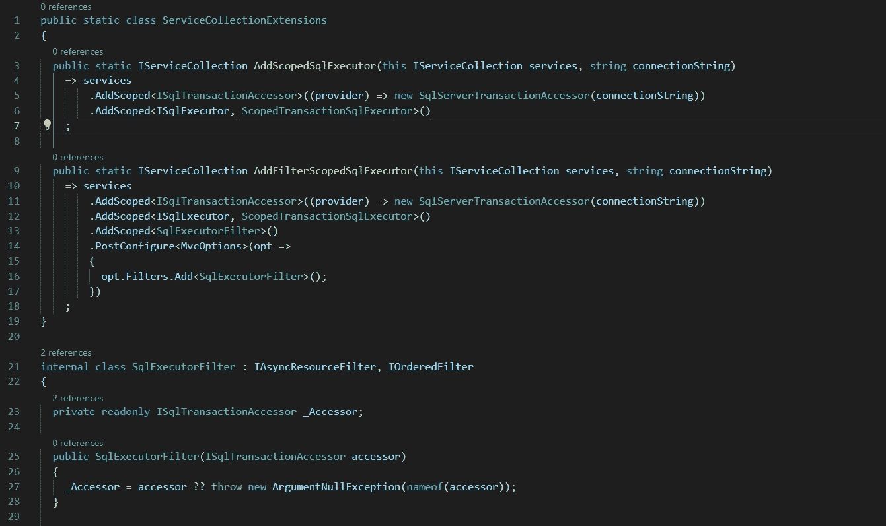
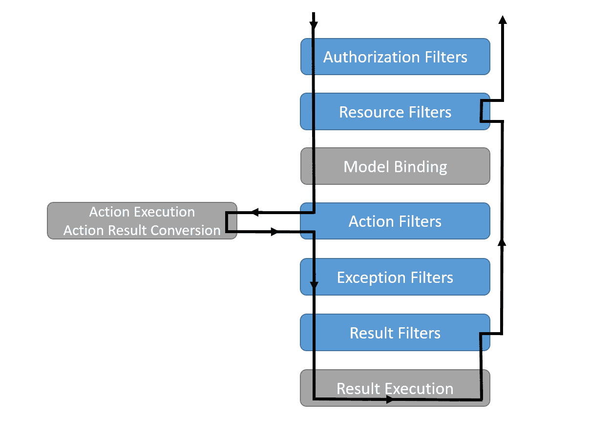

# C#问题:SQL Executor 服务—依赖注入

> 原文：<https://blog.devgenius.io/c-tip-sql-executor-service-dependency-injection-4455efb453b0?source=collection_archive---------9----------------------->

*如何让它跨存储库方法工作*

示例代码

# 系列目录

[第 1 部分:SQL 执行器服务](/c-problem-sql-executor-service-deb459132a50)
**第 2 部分:依赖注入**
[第 3 部分:扩展功能](https://justin-coulston.medium.com/c-tip-sql-executor-service-extending-functionality-edad1c554f)

# 前一篇文章

在上一篇文章 [C#提示:SQL Executor 服务](/c-problem-sql-executor-service-deb459132a50)中，我定义了一个 SQL 脚本执行模式，它为我们运行查询和命令的方式提供了一些灵活性。它允许我们注入服务，自动创建连接和事务，并简化 SQL 相关的服务。在文章的最后，我提供了一个额外的实现，允许您在多个存储库方法调用中使用同一个事务。

然而，我没有介绍的是如何在？NET 核心依赖注入系统。本文将介绍如何在 ASP.NET 核心项目中以实用的方式使用它。我们将展示两种方法。

我们开始吧！

# 文章摘要

快速回顾一下，让我们再次看看上一篇文章中的界面，

ISqlExecutor.cs

我们提供了一个简单的机制，可以跨使用 SQL 的存储库和服务注入。我们希望以类似于下面例子的方式使用它，

示例用法

我们使用执行程序，而不是每次都创建一个`SqlConnection`。如果需要运行多个 SQL 命令，这也将允许我们共享一个事务。

# 事务存取器服务

在我们可以使用执行器之前，我们必须创建另一个服务。该服务将控制 SQL 事务本身。

ISqlTransactionAccessor.cs

这个“访问器”用于为其他服务创建和访问事务。我们限定接口`internal`的范围是有原因的。我们一会儿再讨论这个问题。

现在，对于访问器的主要实现，

sqlservertransactionaccessor . cs

实现的访问器将把一个`connectionString`作为它的输入，并使用它来创建和打开一个`SqlConnection`。然后它将创建`SqlTransaction`并在本地分配它。如果已经创建了一个事务，将会抛出一个异常。

同样，这项服务仅限于`internal`。我们真的想确保我们控制如何使用这个类，因为它没有从设计的角度使用“最佳实践”。

> 注意:在这个例子中，我们不一定需要有`ISqlTransactionAccessor`接口。然而，我总是创建一个接口，万一我为了调试的目的想要修饰实现。例如，我可能想要一个在创建事务时插入日志条目的`LoggedSqlTransactionAccessor`。

# 基于访问的 SQL 执行器

接下来，我们真的需要一个不同的 SQL 执行器来使用我们的访问器，

scopedtransactionsqlexecutor . cs

如您所见，我们只是使用访问器来提取事务和连接，并将其发送到每个命令中。没有比这更复杂的了。

但是在这里，我们再次将类设置为`internal`。

# 使用资源过滤器

现在我们有了自己的服务，我们真的需要开始使用它。我们将利用一个与 MVC 过滤器管道一起工作的资源过滤器来创建事务并在之后提交它。看看下面这张图，

[ASP.NET 核心中的过滤器](https://docs.microsoft.com/en-us/aspnet/core/mvc/controllers/filters?view=aspnetcore-6.0#filter-types)

我们选择使用资源过滤器，因为它发生在管道的早期。它在进出的路上被调用。这确实给这种方法带来了一点限制，

> 在授权过滤器中或者在标准 MVC 过滤器管道之外使用`ISqlExecutor`将会失败。

让我们展示过滤器的实现，

SqlExecutorFilter.cs

该滤波器与`ISqlExecutor`一样接收`ISqlTransactionAccessor`。然而，不同之处在于访问器的`Create()`方法被调用。该过滤器将启动事务，并确保事务被正确提交。

您会注意到，我检查了响应状态代码，以确保它小于 400。在典型系统中，400 及以上的代码被视为错误。所以，我们不承诺。这个逻辑可以根据您的需要简单或复杂。

> **注意**:这个方法不调用 Rollback。如果在处理事务时没有调用`Commit()`或`CommitAsync()`,则自动回滚。然而，如果你对这个魔术感到不舒服，请实现。

同样，这个类被设置为`internal`。

## 使用依赖注入应用过滤器

这些接口和实现都被设置为`internal`。

为什么？

首先，我们应该把这种代码放在某个地方的库中。最好不要直接放在你的 web 项目里。这是可重用的代码。还不如把它放在你能重复利用的地方。

其次，当我们试图使用这个 SQL Executor 时，我们需要做一些非常具体的事情。要求不熟悉您的代码的开发人员正确地实现它是自找麻烦。会犯错误。

因此，除了开发人员需要添加到他们的`Startup.cs`文件中的扩展名之外，我们将所有内容都定义为`internal`，

ServiceCollectionExtensions.cs

你会注意到，一切都是有范围的。我们希望为进入我们系统的每个请求创建一个单独的事务。这确保了在请求的整个生命周期中捕获所有的存储库服务。

这个方法本身就是`public`。这里定义了我们所有必要的内部依赖关系。在方法的最后，我们配置了`MvcOptions`来包含所有动作的过滤器。

> 如果需要的话，您可以将它扩展一点，以确保 Razor 页面和视图也包含在内。我把这个留给你做练习。

最后，要使用这个扩展，将它添加到您的服务中，就像这样，

Startup.cs

在这一点上，您所需要的是一个连接字符串来传递到方法中，并且您可以在系统中的每个动作中访问`ISqlExecutor`。它会表现得像老派的`[TransactionScope](https://docs.microsoft.com/en-us/dotnet/api/system.transactions.transactionscope?view=net-6.0)`班级。然而，在这种情况下，您确实有更多的访问和控制，同时避免了[环境上下文反模式](https://freecontent.manning.com/the-ambient-context-anti-pattern/)。

## 中间件备选方案

如果你觉得处处都需要用`ISqlExecutor`，那么还有一个替代方案:**中间件**。

我们可以使用中间件来完成我们在资源过滤器中所做的事情。然而，这是有代价的。它将为发送到该中间件的所有系统请求创建一个事务。因此，中间件的放置非常关键。如果在管道中太早，您将为静态文件、swagger 或其他任何东西创建它。太晚了，你可能会错过一个需要`ISqlExecutor`的服务。解决这个问题可能会变得复杂，超出了本文的范围。但是我将向您介绍中间件方法的基础。

> **注意**:我们可以通过实现一个更复杂的 SQL Executor 来直接在资源过滤器和 DI 中解决这个问题，如果事务为空，它将动态地创建一个事务。这增加了一点复杂性，但应该很容易实现。只是一定要增加一些测试。

让我们创建中间件类，

SqlExecutorMiddleware.cs

这几乎是资源过滤器实现的精确副本。如你所见是`internal`。

接下来，我们需要扩展来利用这些内部类，

ServiceCollectionExtensions.cs

这里的主要区别是我们不再有过滤器，现在我们在应用程序构建器上有了一个`UseMiddleware`调用。

它的用法如下所示:

Startup.cs

这个实现与上一个(使用资源过滤器)的唯一主要区别是`UseSqlExecutor()`扩展调用的位置。

# 结论和签署

在本文中，我们将`ISqlExecutor`添加到我们的依赖注入系统中，允许我们在一个事务中进行多次调用。只要调用在单个操作中，事务就会按预期工作，

人为的例子

这些调用中的每一个都将在同一个事务中结束。这将帮助您在调用后端时保持系统的一致性。

希望这有助于你充分发挥`ISqlExecutor`的潜力！

> 请注意，该代码还没有准备好投入生产。这是帮助展示主要技术的代码的精简版本。然而，异常处理、日志记录和其他关注是必要的。

下次见！

## 相关故事

[C#提示:SQL 执行器服务](/c-problem-sql-executor-service-deb459132a50)
[高级 C# — SQL Server 批量上传](/advanced-c-sql-server-bulk-upload-57ad6be6e6a1)
[高级 C# —常用 SQL 表结构](/advanced-c-common-sql-table-structures-bb7f7149b887)