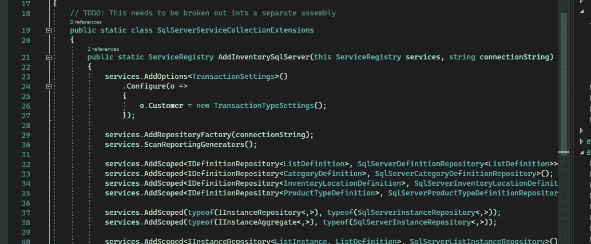

# C#提示:SQL Executor 服务—扩展功能

> 原文：<https://blog.devgenius.io/c-tip-sql-executor-service-extending-functionality-edad1c554f?source=collection_archive---------12----------------------->

*如何在不改变原有类的情况下增加功能*



样品依赖性注入

# 系列目录

[第 1 部分:SQL 执行器服务](/c-problem-sql-executor-service-deb459132a50)
[第 2 部分:依赖注入](https://medium.com/dev-genius/c-tip-sql-executor-service-dependency-injection-4455efb453b0)
**第 3 部分:扩展功能**

在第 1 部分中，我描述了一个可以用来执行 SQL 命令的简单接口。它最明显的用途是从代码中删除一些样板文件，避免大量的`using`语句、打开连接等。但这只是其效用的冰山一角。

在第 2 部分中，我通过依赖注入来注入服务，并添加了一个允许共享事务的作用域版本。当您希望单个 ASP.NET 请求中的所有 SQL 语句在出错时回滚时，尤其是跨存储库时，这证明是有用的。

在第 3 部分中，我将介绍使用这种设计为不同用例扩展功能的一般方法。

# 介绍

像这样的界面的美在于它的简单。大约一周前，有人对这个特定的界面做了如下评论:

> 我不知道这种方法有什么好处。所以我们有了 Dapper 的包装？它只是 IDbConnection 的一个扩展。

另一个评论是，

> 我认为这里没有什么特别的价值，只是一种避免写样板文件的方法。只需注入服务+看起来很酷:)

这些评论完全没有错。事实上，我很感激它们的诞生。对我来说，这意味着我没有真正传达创建这个界面可以实现的全部内容，以及它如何在未来节省您的精力。

记得第一次看到类似这个的界面。我的第一反应是，“哇…我怎么没想到呢？”实际上，我对自己没有早点简化生活感到沮丧。我的意思是，我写 SQL 已经很多年了，我总是厌倦样板文件，但是我能做什么呢？然后我沿着这些线看到了一些东西，一个灯泡熄灭了。

公平地说，这可能是一个更通用的接口。它可能应该看起来更像这样，

这里我使用接口`IDbConnection`和`IDbTransaction`来代替。但老实说，在当时，这真的没有给我增加任何价值。我没有写公共图书馆。

无论如何，我在这个界面中看到的是样板文件的移除和轻松切换 SQL 实现的能力(如`ScopedTransactionSqlExecutor`或`NonTransactionSqlServerExecutor`)。但这并不是它所能提供的价值和节约的全部。

先说装修，搭个实例。

# 扩展功能

我是装饰者模式的超级粉丝。我喜欢它，因为您可以通过使用主类周围的包装器来动态改变类的行为。这在跨领域问题突出的情况下尤其有用。

在 SQL 案例中，如果我们开始遇到性能问题，该怎么办？我们如何从代码的角度来衡量查询的性能？

对于装饰，我们只需创建一个包装类，

我们将另一个`ISqlExecutor`注入这个类(修饰类)和一个记录器，它将执行度量的编写。从那里，每个方法将启动一个秒表，运行该方法，并记录结果。

这个界面的一个缺点是无法看到正在运行的 SQL 语句。如果不重新创建界面驱动设计的 Dapper T7，我们就无法轻松拦截这些查询。我们必须创建一个自定义的`IDbConnection`和`IDbTransaction`，并使用它们来代理调用。然后我们可以获得最后一次调用的细节和此时的参数。但是这种复杂性现在真的没有必要。相反，我们简单地包括堆栈跟踪。这将允许我们定位代码，它应该通知正在执行的 SQL。

> 如果有人想看到这个拦截器的实现，请在评论中告诉我:)

一旦创建了类，我们只需将它注入到 DI 容器中。我们可以通过使用 NuGet 包让我们的生活变得更简单，

最后，用在`Program.cs`中，

仅此而已。性能指标现在将被记录到您的日志文件中。我将由您来决定是否进行配置。

# 其他使用案例

## 异常处理

我遇到的另一个常见用例是异常处理。尽管我并不特别同意在存储库或服务类中捕捉异常，但除非有非常好的理由，否则对于一些开发人员来说这是一个用例。

这里有一个我们可以使用的可能实现，

我们做了一些类似于性能度量的事情，并且包装了一个我们想要捕捉异常的执行器。

然后我们可以添加一个扩展方法，

这些小实现的好处在于，我们可以在我们的系统中构建它们。我们不局限于一个。我们可以让许多不同的元素相互缠绕，构建一个更复杂的系统。让我们展示一下这个在`Program.cs`中可能会是什么样子，

这个设置基本上创建了以下内容，

```
new HandleExceptionsSqlExecutor(
   new LogPerformanceSqlExecutor(
      new ScopedTransactionSqlExecutor(...)
   )
)
```

根据顺序，我们可以先处理异常，然后记录性能。如果你愿意的话，你可以在外面再加一个表演用的，然后拥有两个。

关键是，我们在更高的水平上工作。我们不需要写原始代码。相反，我们将我们的类组合在一起形成功能，就好像它是一种更高级的语言。

## 租户选择

如果您有一个更复杂的场景，比如一个多租户应用程序，其中每个数据库包含不同租户的数据，该怎么办？这个界面的美妙之处在于，我们可以创建另一个可以隐式切换租户连接的实现。

这就像它真正需要的那样简单。`ITenantOptions`是一个有作用域的服务，它将确定哪个租户通过`Authorization`头或其他 HTTP 头生成请求。然后，它会查找选项，并将它们注入到执行程序中。

我们需要创建一个`ISqlExecutorFactory`,但是创建起来很简单，

现在，在我们的存储库中，我们不必弄清楚如何注入适当的连接字符串(假设您的`ISqlExecutor`也被注入了作用域)。这将由一个为我们解决问题的服务来处理。对我来说，这使得思考特定的存储库代码变得更加容易。我不需要担心我是否找对了房客。相反，让我在这里做一个假设，只做我能做的最好的 SQL 代码，而不去考虑细节。

# 结论和签署

我写这篇文章只是为了回应这些评论，因为我觉得没有充分解释所有的好处。如果 Dapper 是一个更加基于界面的设计，这实际上就没有必要了。不幸的是，事实并非如此。因此，我创建了这个接口来为我的代码提供一定程度的灵活性，这是我通常使用传统方法(直接使用`SqlConnection`)无法实现的

如果我们在编写 SQL 时小心谨慎，不使用专有关键字，您也可以使用这种方法来允许按租户连接到不同的数据库引擎，甚至允许更容易地转换到不同的引擎(在从 MySQL 转换到 SQL Server 的情况下)。我只需要这样做一次，但确实节省了很多时间。

这里有很多用例，但我希望这有助于阐明这样的设计可以带来的丰富性。我们可以以多种方式使用它，以多种方式扩展它，并解决真正的跨领域问题。

最后一点，这个界面可能并不完美。可能有比我在这里介绍的方法更好的方法。最后，我希望为您提供一个工具，在您作为开发人员成长的过程中，您可以利用它来创建更有效的编码结构，以便将来更容易地修改。

下次见！