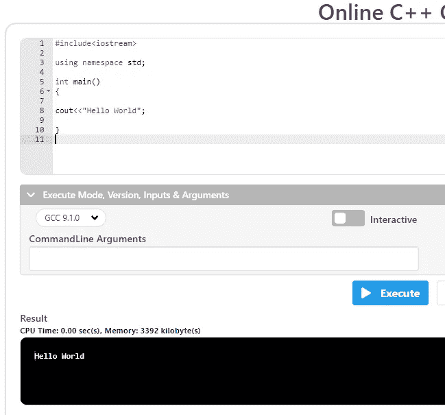
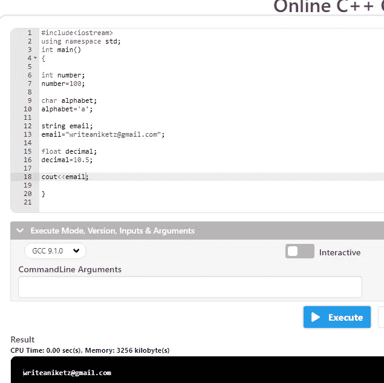

# 完全初学者的 C++教程

> 原文：<https://blog.devgenius.io/c-tutorial-for-complete-beginners-3d090ca8dd5f?source=collection_archive---------3----------------------->

## 学习 C++的教程


[Unsplash](https://unsplash.com?utm_source=medium&utm_medium=referral) 上 [AltumCode](https://unsplash.com/@altumcode?utm_source=medium&utm_medium=referral) 拍摄的照片

对于那些完全是编程初学者的人，我想从编程的简短定义开始— **“编程是与你的 pc 交流的方式”**

编程语言是个人电脑或笔记本电脑能够理解的语言。所以， **C++** 是一种用来为你的电脑创建不同程序的编程语言。跟一个住在**日本**的人交流，基本就像学**日语**一样。

C++是一种通用编程语言，由比雅尼·斯特劳斯特鲁普于 1985 年发明。

进入学习路径假设你是一个完全的初学者，本教程将向你介绍 C++。别担心，我们不会深入编程世界，我们只会了解 C++的基础。

## **本教程由 3 部分组成，即—**

*   句法
*   你先编程
*   变量

我建议你在阅读本文时打开 C++编译器练习编码。别担心，你不需要安装任何东西，你只需要一个浏览器，就是这样。 [**点击这里打开一个在线 C++编译器。**](https://www.jdoodle.com/online-compiler-c++/)

## 句法

如果我们想让我们的电脑理解我们的程序，语法是我们需要遵循的一组预定义的规则。

别担心，就想象你需要打羽毛球。所以你需要一个可以玩耍的场地。在这里，你的场地就像句法一样，你可以正式打羽毛球。

就是这样你只需要记住下面提到的台词，没有其他沉重的规则就可以开始编程了。

```
#include<iostream>using namespace std;int main()
{ }
```

看，就这么简单。现在，每当你需要写代码的时候，你都需要使用上面的语法。它基本上告诉编译器加载一些预定义的文件，以便更快地使用语言。

现在，写完语法后，记住一件事，你只需要在两个花括号之间写代码。不要担心，跟随下一个副题，正式编写你的第一个程序。

## 你的第一个程序

正如我提到的，每当你需要写一个特定的程序时，你只需要写在花括号之间。另外，记得在你写在花括号之间的每一行后面加上一个分号**。**

让我们用 C++输入你的第一个程序。让我们创建一个程序来显示 **Hello World**

在 C++中，我们使用 **cout** 函数来显示一些东西，我们还需要使用**引号**来告诉我们的 pc 这是一个字符串(一系列字母/字符)

只需在你的 [**在线编译器**](https://www.jdoodle.com/online-compiler-c++/) 中键入以下代码，然后按**执行** —

```
#include<iostream>using namespace std;int main()
{cout<<"Hello World";} 
```

按下**执行**按钮运行您的第一个程序。您可以在**结果**部分看到结果。

如果您在结果部分看到任何错误，那么您输入的代码是错误的，所以只需清除所有内容，然后像在编译器中一样输入上面的代码。

**为了更清楚地理解，它应该是这样的—**



编译器截图来自[作者](http://aniketz.medium.com/membership)

## 变量

变量是用于存储数据的命名数据位置。因为，我们知道我们编程是为了让我们的电脑和人类一样能够理解我们的代码。所以我们必须声明我们要在变量中存储什么。

如果我们需要存储一个数字，那么我们必须在变量前使用 **int** 。类似地，对于单个字母表，我们使用**字符**，对于一个句子，我们使用**字符串**。请注意，我们只能在 int 类型变量中存储非十进制数，因此要存储十进制数，我们可以在变量前浮动

**假设我们想要创建一个名为 number 的变量来存储一个特定的数字**

```
#include<iostream>using namespace std;int main()
{int number;
number=100;}
```

**类似地，我们可以使用 char、string 和 float 来存储各自的数据—**

```
#include<iostream>using namespace std;int main()
{int number;
number=100;char alphabet;
alphabet='a';string email;
email="writeaniketz@gmail.com";float decimal;
decimal=10.5;}
```

你可以像我们在第一个程序中所做的那样，通过使用 **cout** 函数来显示你的数据。只需在您的代码中添加下面一行来显示您想要显示的数据，然后按“执行”—

```
cout<<number;
```

结果部分应该显示 100，如果您遇到错误，请不要担心，只要阅读您的代码，看看您是否键入了错误的语法，或者您一定是忘记了语句后面的分号。

您的代码和结果应该看起来像这样—



图片来自[作者](http://aniketz.medium.com/membership)

本教程到此为止。现在，你可以成功地练习用 C++编程了。我希望你能够理解这个 C++的基础教程。坚持编程，坚持练习。祝你编程之旅好运。

[**花 5 美元购买 Medium 会员，阅读 Medium 上的所有文章——点击这里**](https://aniketz.medium.com/membership) **(当你使用这个链接时，我会得到一小部分)**

# 也读—

*   [**3 YouTube 程序员频道**](https://javascript.plainenglish.io/3-youtube-channels-every-programmer-should-follow-66952f1f24e4)
*   [**每个程序员都应该读的 3 本书**](https://javascript.plainenglish.io/3-books-every-programmer-should-read-97ac12422cfb)
*   [**十大编程语言**](https://javascript.plainenglish.io/top-10-programming-languages-of-2021-d2d48c634ae7)
*   [**对 Python 一无所知**](/how-i-went-from-noob-to-expert-in-python-programming-8c4e141a0be1)
*   [**编程的重要性**](https://javascript.plainenglish.io/everyone-should-learn-programming-in-the-same-way-as-reading-and-writing-89fb8ed77eb1)
*   [**数据科学 Vs 软件开发者**](/will-data-science-replace-software-developers-9eee00a6ebd6)

对于任何**“赞助/写作项目”**你可以联系我，电话:——**writeaniketz@gmail.com**